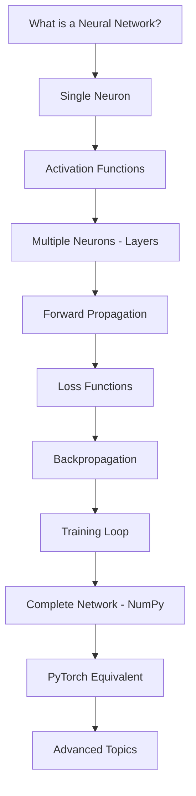

# Neural Networks for Complete Beginners - Tutorial Plan

## 📋 Overview

This document outlines the complete tutorial structure for teaching neural networks to beginners who know Python basics but are new to machine learning and math.

**Target Audience:**
- Comfortable with Python (loops, functions, basic numpy)
- New to machine learning and mathematical concepts
- Need intuitive explanations with analogies
- Learn best through interactive Jupyter notebooks

**Learning Philosophy:**
- Start extremely simple, build complexity gradually
- Use real-world analogies extensively
- Show both NumPy (from scratch) and PyTorch implementations
- Include visualizations at every step
- Provide interactive exercises with solutions

---

## 🎯 Learning Progression



---

## 📚 Part 1: What is a Neural Network?

**File:** `00-neural-networks/fundamentals/01-what-is-neural-network.ipynb`

### Learning Objectives
- Understand what neural networks are at a high level
- Grasp the biological inspiration
- See where neural networks are used today
- Understand the basic components (neurons, layers, weights)

### Content Structure

#### 1. Introduction (Analogy-driven)
**Analogy:** "Your Brain vs Artificial Neural Networks"
- Human brain has ~86 billion neurons
- Each neuron receives signals, processes them, sends output
- Artificial neural networks mimic this with math

**Analogy:** "Neural Network as a Team of Specialists"
- Input layer = receptionist collecting information
- Hidden layers = departments processing information
- Output layer = final decision maker

#### 2. Visual Introduction
- Show simple diagram of a neural network
- Color code: inputs (blue), hidden (green), outputs (red)
- Explain information flows left to right

#### 3. Real-World Applications
- Image recognition (show cat vs dog example)
- Language translation
- Speech recognition
- Game playing (mention AlphaGo)
- Recommendation systems

#### 4. Basic Components Overview
- **Neurons:** The basic units (dots in the diagram)
- **Weights:** Strength of connections (lines)
- **Layers:** Groups of neurons
- **Activation:** Deciding if neuron "fires"

#### 5. The Big Picture
- Neural networks learn from examples
- They adjust weights to improve predictions
- Training = finding the right weights

### Code Examples
```python
# No code yet - just conceptual
# Show a simple diagram using matplotlib
```

### Visualizations Needed
- Hand-drawn style neural network diagram
- Before/after training comparison
- Simple decision boundary visualization

### Common Pitfalls to Address
- "It's just like a brain!" - Clarify it's simplified
- "AI will think like humans" - Explain it's pattern matching
- "They're magic" - Show they're just math operations

---

## 📚 Part 2: Single Neuron - The Building Block

**File:** `00-neural-networks/fundamentals/02-single-neuron.ipynb`

### Learning Objectives
- Understand what a single neuron does mathematically
- Implement a neuron from scratch in NumPy
- Grasp the concept of weights and bias
- See how a neuron makes a simple decision

### Content Structure

#### 1. The Neuron Analogy
**Analogy:** "A Neuron as a Voter"
- Gets multiple inputs (opinions from friends)
- Each input has different importance (trust level = weight)
- Adds them up, plus personal bias
- Makes a decision (output)

**Analogy:** "A Weighted Average Calculator"
- Like calculating your grade with different weights
- Homework: 20%, Midterm: 30%, Final: 50%
- Inputs × weights + bias = output

#### 2. Mathematical Foundation (Gentle)
- Formula: `output = w1*x1 + w2*x2 + ... + bias`
- This is just a weighted sum!
- Visualize as a line in 2D (for 2 inputs)

#### 3. Step-by-Step Implementation

**Step 1:** Single input, single weight
```python
def simple_neuron(input_value, weight, bias):
    """
    The simplest neuron: one input, one weight
    
    Think of it like: 
    - input_value: how much you studied (hours)
    - weight: how much studying matters (effectiveness)
    - bias: your baseline knowledge
    """
    return input_value * weight + bias
```

**Step 2:** Multiple inputs
```python
def neuron(inputs, weights, bias):
    """
    A neuron with multiple inputs
    
    inputs: list of numbers [x1, x2, x3, ...]
    weights: how important each input is [w1, w2, w3, ...]
    bias: baseline adjustment
    """
    output = bias
    for x, w in zip(inputs, weights):
        output += x * w
    return output
```

**Step 3:** Vectorized version
```python
import numpy as np

def neuron_vectorized(inputs, weights, bias):
    """Same as above but using numpy's dot product"""
    return np.dot(inputs, weights) + bias
```

#### 4. Interactive Examples

**Example 1:** Pass/Fail Predictor
- Input 1: Hours studied
- Input 2: Previous test score
- Manually set weights [0.3, 0.7]
- Bias = -50
- Calculate output for different students

**Example 2:** Visualizing Decision Boundary
- 2 inputs (x, y coordinates)
- Show the line the neuron creates
- Points above line = one class, below = another

### Code Examples
- Complete implementations of all neuron versions
- Interactive widget to adjust weights and see changes
- Visualization of decision boundary

### Visualizations Needed
- Neuron diagram with inputs, weights, sum, output
- 2D plot showing decision boundary
- Weight adjustment interactive tool

### Math Explanations
- **Dot Product:** "Like measuring how much two arrows point in same direction"
- **Linear Combination:** "Mixing ingredients with different amounts"
- Explain why it's called "linear" (makes a straight line)

### Common Pitfalls
- "Why do we need bias?" - Show examples where it shifts the line
- "What if all weights are same?" - Demonstrate with example
- "Can one neuron solve any problem?" - Introduce limitations (XOR problem preview)

---

## 📚 Part 3: Activation Functions

**File:** `00-neural-networks/fundamentals/03-activation-functions.ipynb`

### Learning Objectives
- Understand why we need non-linearity
- Learn common activation functions
- Implement each activation from scratch
- Know when to use which activation

### Content Structure

#### 1. Why Activation Functions?

**Problem Setup:** The Linear Limitation
- Show that stacking linear functions = another linear function
- Analogy: "Layers of straight lines still make straight lines"
- Need something to add "curves" to our decisions

**Analogy:** "Activation as a Filter"
- Like a light switch - not just dimmer
- ReLU = "pass positive signals only"
- Sigmoid = "squash everything between 0 and 1"

#### 2. Common Activation Functions

**Step Function (Historical)**
```python
def step_function(x):
    """Original idea: fire or don't fire"""
    return 1 if x >= 0 else 0
```
- Problem: Not differentiable (can't learn from it)

**Sigmoid (Classic)**
```python
def sigmoid(x):
    """Squashes everything to range (0, 1)"""
    return 1 / (1 + np.exp(-x))
```
- **Analogy:** "A smooth light dimmer"
- Use case: Output probabilities
- Drawback: Vanishing gradients (explain gently)

**Tanh (Hyperbolic Tangent)**
```python
def tanh(x):
    """Like sigmoid but centered at 0, range (-1, 1)"""
    return np.tanh(x)
```
- Better than sigmoid for hidden layers
- **Analogy:** "Balanced scale from -1 to 1"

**ReLU (The Modern Standard)**
```python
def relu(x):
    """Keep positive, kill negative"""
    return max(0, x)
```
- **Analogy:** "A one-way valve for water"
- Fast to compute
- Helps with vanishing gradient
- Most commonly used today

**Leaky ReLU**
```python
def leaky_relu(x, alpha=0.01):
    """Like ReLU but lets small negative values through"""
    return max(alpha * x, x)
```
- Fixes "dying ReLU" problem

#### 3. Interactive Visualizations
- Plot each function
- Show derivatives (gentle introduction)
- Interactive comparison tool

#### 4. Applying Activations to Neurons
```python
def neuron_with_activation(inputs, weights, bias, activation='relu'):
    """Complete neuron with activation function"""
    z = np.dot(inputs, weights) + bias  # Linear combination
    if activation == 'relu':
        return relu(z)
    elif activation == 'sigmoid':
        return sigmoid(z)
    # ... etc
```

### Code Examples
- Implementation of all major activation functions
- Side-by-side comparisons
- Apply to our previous neuron examples

### Visualizations Needed
- Line plots of each activation function
- Derivative plots (with simple explanation)
- Interactive slider to see activation on different inputs
- Decision boundary comparison (linear vs with activation)

### Math Explanations
- **Derivative:** "How fast something is changing" (slope of curve)
- **Vanishing Gradient:** "Signal gets weaker in deep networks"
- Why ReLU helps: derivative is either 0 or 1 (simple!)

### Common Pitfalls
- "When to use which?" - Provide decision tree
- "Can I use multiple activations?" - Yes! Different per layer
- "Why not just use step function?" - Show learning issue

---

## 📚 Part 4: Multiple Neurons - Building Layers

**File:** `00-neural-networks/fundamentals/04-neural-network-layer.ipynb`

### Learning Objectives
- Understand what a layer of neurons is
- Implement a layer with multiple neurons
- Use matrix operations for efficiency
- Visualize how layers transform data

### Content Structure

#### 1. From One Neuron to Many

**Analogy:** "Committee of Experts"
- One neuron = one specialist
- Layer = committee with different perspectives
- Each neuron learns different features

**Analogy:** "Factory Assembly Line"
- Each neuron processes inputs differently
- All neurons work in parallel
- Outputs go to next layer

#### 2. Manual Implementation

**Step 1:** Two neurons explicitly
```python
def two_neurons(inputs, weights1, bias1, weights2, bias2):
    """Two separate neurons"""
    output1 = np.dot(inputs, weights1) + bias1
    output2 = np.dot(inputs, weights2) + bias2
    return [output1, output2]
```

**Step 2:** Loop approach
```python
def layer_loop(inputs, weights_list, biases_list):
    """Multiple neurons using loop"""
    outputs = []
    for weights, bias in zip(weights_list, biases_list):
        output = np.dot(inputs, weights) + bias
        outputs.append(output)
    return outputs
```

#### 3. Matrix Math Introduction (Gentle)

**Concept:** "Processing Multiple Things at Once"
- Instead of one neuron at a time, do all together
- Weights become a matrix (table of numbers)
- One operation instead of many

**Visual Explanation:**
```
Inputs: [x1, x2, x3]

Weight Matrix:
    x1   x2   x3
n1 [w11  w12  w13]
n2 [w21  w22  w23]
n3 [w31  w32  w33]

Each row = one neuron's weights
```

#### 4. Vectorized Layer Implementation

```python
class Layer:
    def __init__(self, n_inputs, n_neurons):
        """
        n_inputs: how many numbers coming in
        n_neurons: how many neurons in this layer
        """
        # Random small weights
        self.weights = np.random.randn(n_inputs, n_neurons) * 0.1
        # Biases start at zero
        self.biases = np.zeros(n_neurons)
    
    def forward(self, inputs):
        """
        Process inputs through all neurons at once
        
        inputs: shape (n_inputs,)
        returns: shape (n_neurons,)
        """
        return np.dot(inputs, self.weights) + self.biases
```

#### 5. Layer with Activation

```python
class LayerWithActivation:
    def __init__(self, n_inputs, n_neurons, activation='relu'):
        self.weights = np.random.randn(n_inputs, n_neurons) * 0.1
        self.biases = np.zeros(n_neurons)
        self.activation = activation
    
    def forward(self, inputs):
        # Linear transformation
        z = np.dot(inputs, self.weights) + self.biases
        
        # Apply activation
        if self.activation == 'relu':
            return np.maximum(0, z)
        elif self.activation == 'sigmoid':
            return 1 / (1 + np.exp(-z))
        # ... etc
```

### Code Examples
- Build layers step by step
- Visualize what each neuron in a layer learns
- Show batch processing (multiple inputs at once)

### Visualizations Needed
- Matrix multiplication visualization
- Layer transformation (input space → output space)
- Weight matrix heatmap
- Each neuron's decision boundary in the layer

### Math Explanations
- **Matrix Multiplication:** "Combining tables of numbers"
- **Broadcasting:** "Adding the same number to all outputs"
- Why shape matters: (inputs, n_inputs) × (n_inputs, n_neurons) = (inputs, n_neurons)

### Common Pitfalls
- "Matrix dimensions must match" - explain with diagrams
- "Random initialization" - why we can't use all zeros
- "How many neurons in a layer?" - Provide guidelines

---

## 📚 Part 5: Forward Propagation - Connecting Layers

**File:** `00-neural-networks/fundamentals/05-forward-propagation.ipynb`

### Learning Objectives
- Connect multiple layers into a network
- Understand data flow through the network
- Implement forward propagation
- Visualize intermediate layer outputs

### Content Structure

#### 1. The Network Architecture

**Analogy:** "Assembly Line Processing"
- Input layer: Raw materials arrive
- Hidden layer 1: First processing step
- Hidden layer 2: Refinement step
- Output layer: Final product

**Analogy:** "Layers of Translation"
- Each layer speaks a different "language"
- Transform input gradually into output

#### 2. Simple Two-Layer Network

```python
class SimpleNetwork:
    def __init__(self, input_size, hidden_size, output_size):
        """
        input_size: number of features
        hidden_size: neurons in hidden layer
        output_size: number of classes/outputs
        """
        self.layer1 = LayerWithActivation(input_size, hidden_size, 'relu')
        self.layer2 = LayerWithActivation(hidden_size, output_size, 'sigmoid')
    
    def forward(self, x):
        """Pass data through the network"""
        # First layer
        hidden = self.layer1.forward(x)
        # Second layer
        output = self.layer2.forward(hidden)
        return output
```

#### 3. Deeper Networks

```python
class DeepNetwork:
    def __init__(self, layer_sizes):
        """
        layer_sizes: list [input_size, hidden1, hidden2, ..., output_size]
        Example: [784, 128, 64, 10] for MNIST
        """
        self.layers = []
        for i in range(len(layer_sizes) - 1):
            layer = LayerWithActivation(
                layer_sizes[i], 
                layer_sizes[i+1],
                activation='relu' if i < len(layer_sizes)-2 else 'sigmoid'
            )
            self.layers.append(layer)
    
    def forward(self, x):
        """Sequential forward pass"""
        activation = x
        for layer in self.layers:
            activation = layer.forward(activation)
        return activation
```

#### 4. Batch Processing

**Why Batch Processing?**
- Process multiple examples at once
- More efficient computation
- Better gradient estimates

```python
def forward_batch(self, X):
    """
    X: shape (batch_size, input_size)
    returns: shape (batch_size, output_size)
    """
    activation = X
    for layer in self.layers:
        activation = layer.forward(activation)
    return activation
```

#### 5. Visualization of Intermediate Outputs

Show what happens at each layer:
- Input: Original data
- Layer 1 output: Extracted features
- Layer 2 output: Higher-level features
- Output: Final predictions

### Code Examples
- Build networks of different depths
- Process single examples
- Process batches
- Visualize activations at each layer

### Visualizations Needed
- Network architecture diagram
- Data flow animation
- Activation heatmaps at each layer
- Dimension changes through network

### Math Explanations
- **Composition of Functions:** f(g(x)) - feeding output to next function
- Shape tracking through layers
- Batch dimensions

### Common Pitfalls
- "Shape mismatches" - careful tracking
- "Why different activations?" - explain output layer needs
- "How many layers?" - Provide guidelines

---

## 📚 Part 6: Loss Functions - Measuring Error

**File:** `00-neural-networks/fundamentals/06-loss-functions.ipynb`

### Learning Objectives
- Understand what loss functions measure
- Learn common loss functions
- Implement loss calculations
- Choose appropriate loss for different tasks

### Content Structure

#### 1. What is Loss?

**Analogy:** "Measuring Your Mistakes"
- Like grading a test - how many wrong?
- Loss = how far predictions are from truth
- Lower loss = better predictions

**Analogy:** "GPS Navigation Error"
- Predicted location vs actual location
- Different ways to measure distance
- Want to minimize the error

#### 2. Mean Squared Error (MSE)

**For Regression Tasks**

```python
def mean_squared_error(predictions, targets):
    """
    How far off are we, on average?
    
    predictions: what network predicted
    targets: actual correct values
    """
    # Difference
    errors = predictions - targets
    # Square them (makes all positive, penalizes big errors more)
    squared_errors = errors ** 2
    # Average
    return np.mean(squared_errors)
```

**Why Square?**
- Makes all errors positive
- Penalizes large errors more
- Smooth derivative (good for learning)

#### 3. Binary Cross-Entropy

**For Binary Classification (Yes/No)**

```python
def binary_cross_entropy(predictions, targets):
    """
    How well do we predict probabilities?
    
    predictions: probability between 0 and 1
    targets: actual class (0 or 1)
    """
    # Clip to avoid log(0)
    predictions = np.clip(predictions, 1e-7, 1 - 1e-7)
    
    # Calculate loss
    return -np.mean(
        targets * np.log(predictions) + 
        (1 - targets) * np.log(1 - predictions)
    )
```

**Intuition:**
- Heavily penalizes confident wrong predictions
- If target=1 but predicted=0.01, big loss!

#### 4. Categorical Cross-Entropy

**For Multi-Class Classification**

```python
def categorical_cross_entropy(predictions, targets):
    """
    Multi-class version
    
    predictions: probability for each class [0.1, 0.7, 0.2]
    targets: one-hot encoded [0, 1, 0]
    """
    predictions = np.clip(predictions, 1e-7, 1 - 1e-7)
    return -np.mean(np.sum(targets * np.log(predictions), axis=1))
```

#### 5. Comparing Losses

Interactive visualization:
- Show different predictions
- Calculate each loss
- See which penalizes what

### Code Examples
- Implement all loss functions
- Calculate on sample data
- Visualize loss landscapes

### Visualizations Needed
- Loss curves for different predictions
- Comparison of MSE vs Cross-Entropy
- 3D loss landscape

### Math Explanations
- **Logarithm:** "Measuring exponential relationships"
- **Why log in cross-entropy?** - Information theory connection (brief)
- **Mean:** Just averaging to get one number

### Common Pitfalls
- "MSE for classification?" - Explain why cross-entropy is better
- "When to use which?" - Decision guide
- "Negative loss?" - Can happen with cross-entropy

---

## 📚 Part 7: Backpropagation - Learning from Mistakes

**File:** `00-neural-networks/fundamentals/07-backpropagation.ipynb`

### Learning Objectives
- Understand how neural networks learn
- Grasp the chain rule conceptually
- Implement backpropagation from scratch
- See how gradients flow backwards

### Content Structure

#### 1. The Learning Problem

**Current Situation:**
- Network makes predictions
- We measure error (loss)
- But how do we improve?

**Analogy:** "Adjusting a Recipe"
- Made a cake (prediction)
- Too sweet (high loss)
- Which ingredient to change? How much?
- Backpropagation tells us!

#### 2. The Derivative Concept (Gentle)

**What is a Derivative?**
- "If I change input slightly, how does output change?"
- Slope of a curve
- Direction of steepest ascent/descent

**Visual Example:**
```python
# Simple function
def f(x):
    return x**2

# If x=3, f(x)=9
# Derivative at x=3 is 6
# Meaning: if we increase x by 0.1, f increases by ~0.6
```

#### 3. Chain Rule - The Key Insight

**Analogy:** "Domino Effect"
- Change weight → changes neuron → changes next neuron → changes loss
- Chain rule: multiply the effects

**Simple Example:**
```python
# y = f(g(x))
# How does y change with x?
# dy/dx = (dy/dg) * (dg/dx)

def g(x):
    return 2 * x

def f(g):
    return g**2

# x=3 → g=6 → y=36
# dg/dx = 2
# dy/dg = 2*g = 12
# dy/dx = 12 * 2 = 24
```

#### 4. Backpropagation Step by Step

**Layer-by-layer Derivatives:**

```python
class LayerBackprop:
    def __init__(self, n_inputs, n_neurons):
        self.weights = np.random.randn(n_inputs, n_neurons) * 0.1
        self.biases = np.zeros(n_neurons)
        
        # Store for backprop
        self.inputs = None
        self.z = None  # Before activation
        self.output = None  # After activation
    
    def forward(self, inputs):
        """Forward pass - save values needed for backward"""
        self.inputs = inputs
        self.z = np.dot(inputs, self.weights) + self.biases
        self.output = np.maximum(0, self.z)  # ReLU
        return self.output
    
    def backward(self, grad_output):
        """
        Backward pass
        
        grad_output: gradient of loss w.r.t. this layer's output
        returns: gradient w.r.t. this layer's input
        """
        # Gradient through ReLU activation
        grad_z = grad_output.copy()
        grad_z[self.z <= 0] = 0  # ReLU derivative
        
        # Gradient w.r.t. weights
        self.grad_weights = np.dot(self.inputs.T, grad_z)
        
        # Gradient w.r.t. biases
        self.grad_biases = np.sum(grad_z, axis=0)
        
        # Gradient w.r.t. inputs (for previous layer)
        grad_inputs = np.dot(grad_z, self.weights.T)
        
        return grad_inputs
```

#### 5. Complete Backpropagation

```python
class NetworkWithBackprop:
    def __init__(self, layer_sizes):
        self.layers = [LayerBackprop(layer_sizes[i], layer_sizes[i+1]) 
                      for i in range(len(layer_sizes)-1)]
    
    def forward(self, X):
        activation = X
        for layer in self.layers:
            activation = layer.forward(activation)
        return activation
    
    def backward(self, loss_gradient):
        """Backpropagate the gradient"""
        grad = loss_gradient
        for layer in reversed(self.layers):
            grad = layer.backward(grad)
```

#### 6. Gradient Descent Update

```python
def update_weights(self, learning_rate=0.01):
    """Update all weights using computed gradients"""
    for layer in self.layers:
        layer.weights -= learning_rate * layer.grad_weights
        layer.biases -= learning_rate * layer.grad_biases
```

### Code Examples
- Simple derivative calculations
- Manual backpropagation for 2-layer network
- Visualize gradient flow
- Show weight updates

### Visualizations Needed
- Computation graph with gradients
- Gradient flow animation backwards
- Weight update visualization
- Loss decreasing over updates

### Math Explanations
- **Chain Rule:** Step-by-step with simple examples
- **Partial Derivatives:** "Changing one thing at a time"
- **Gradient:** "Direction of steepest increase"

### Common Pitfalls
- "Vanishing gradients" - gradients become very small
- "Exploding gradients" - gradients become very large
- "Why learning rate matters" - too big or too small

---

## 📚 Part 8: Training Loop - Putting It All Together

**File:** `00-neural-networks/fundamentals/08-training-loop.ipynb`

### Learning Objectives
- Implement complete training process
- Understand epochs, batches, iterations
- Add validation and monitoring
- Implement early stopping

### Content Structure

#### 1. Training Concepts

**Analogy:** "Learning from a Textbook"
- Epoch = reading whole textbook once
- Batch = reading one chapter at a time
- Iteration = each chapter reading session

#### 2. Simple Training Loop

```python
def train_simple(network, X_train, y_train, epochs=10, lr=0.01):
    """Simplest training loop"""
    for epoch in range(epochs):
        # Forward pass
        predictions = network.forward(X_train)
        
        # Compute loss
        loss = mean_squared_error(predictions, y_train)
        
        # Backward pass
        loss_grad = 2 * (predictions - y_train) / len(y_train)
        network.backward(loss_grad)
        
        # Update weights
        network.update_weights(lr)
        
        print(f"Epoch {epoch}, Loss: {loss:.4f}")
```

#### 3. Mini-Batch Training

**Why Mini-Batches?**
- Full batch: slow, but stable
- Single example (SGD): fast, but noisy
- Mini-batch: best of both worlds

```python
def train_mini_batch(network, X_train, y_train, 
                     batch_size=32, epochs=10, lr=0.01):
    """Training with mini-batches"""
    n_samples = len(X_train)
    
    for epoch in range(epochs):
        # Shuffle data
        indices = np.random.permutation(n_samples)
        X_shuffled = X_train[indices]
        y_shuffled = y_train[indices]
        
        # Process in batches
        for i in range(0, n_samples, batch_size):
            X_batch = X_shuffled[i:i+batch_size]
            y_batch = y_shuffled[i:i+batch_size]
            
            # Forward
            predictions = network.forward(X_batch)
            loss = mean_squared_error(predictions, y_batch)
            
            # Backward
            loss_grad = 2 * (predictions - y_batch) / len(y_batch)
            network.backward(loss_grad)
            
            # Update
            network.update_weights(lr)
```

#### 4. Validation and Monitoring

```python
def train_with_validation(network, X_train, y_train, X_val, y_val,
                          batch_size=32, epochs=100, lr=0.01):
    """Training with validation monitoring"""
    
    train_losses = []
    val_losses = []
    
    for epoch in range(epochs):
        # Training phase
        epoch_loss = 0
        n_batches = 0
        
        for X_batch, y_batch in get_batches(X_train, y_train, batch_size):
            predictions = network.forward(X_batch)
            loss = mean_squared_error(predictions, y_batch)
            epoch_loss += loss
            n_batches += 1
            
            # Backprop and update
            loss_grad = 2 * (predictions - y_batch) / len(y_batch)
            network.backward(loss_grad)
            network.update_weights(lr)
        
        # Validation phase (no weight updates!)
        val_predictions = network.forward(X_val)
        val_loss = mean_squared_error(val_predictions, y_val)
        
        train_losses.append(epoch_loss / n_batches)
        val_losses.append(val_loss)
        
        print(f"Epoch {epoch}: Train Loss = {train_losses[-1]:.4f}, "
              f"Val Loss = {val_loss:.4f}")
    
    return train_losses, val_losses
```

#### 5. Early Stopping

```python
class EarlyStopping:
    """Stop training when validation loss stops improving"""
    def __init__(self, patience=5, min_delta=0.001):
        self.patience = patience
        self.min_delta = min_delta
        self.best_loss = float('inf')
        self.counter = 0
        
    def should_stop(self, val_loss):
        if val_loss < self.best_loss - self.min_delta:
            self.best_loss = val_loss
            self.counter = 0
            return False
        else:
            self.counter += 1
            return self.counter >= self.patience
```

#### 6. Complete Training Function

```python
def train_network(network, X_train, y_train, X_val, y_val,
                 batch_size=32, epochs=100, lr=0.01,
                 early_stopping=True):
    """Production-ready training loop"""
    
    stopper = EarlyStopping() if early_stopping else None
    history = {'train_loss': [], 'val_loss': []}
    
    for epoch in range(epochs):
        # Training
        train_loss = train_epoch(network, X_train, y_train, batch_size, lr)
        
        # Validation
        val_loss = validate(network, X_val, y_val)
        
        # Record
        history['train_loss'].append(train_loss)
        history['val_loss'].append(val_loss)
        
        # Early stopping check
        if stopper and stopper.should_stop(val_loss):
            print(f"Early stopping at epoch {epoch}")
            break
        
        # Progress
        if epoch % 10 == 0:
            print(f"Epoch {epoch}: Train={train_loss:.4f}, Val={val_loss:.4f}")
    
    return history
```

### Code Examples
- Train on toy dataset (e.g., XOR problem)
- Visualize training progress
- Show overfitting and how validation catches it
- Demonstrate early stopping

### Visualizations Needed
- Training/validation loss curves
- Learning rate effect
- Batch size comparison
- Overfitting visualization

### Common Pitfalls
- "Overfitting" - great on train, bad on validation
- "Learning rate too high" - loss explodes
- "Learning rate too low" - learns too slowly
- "Batch size matters" - show tradeoffs

---

## 📚 Part 9: Complete Network from Scratch

**File:** `00-neural-networks/fundamentals/09-complete-network-numpy.ipynb`

### Learning Objectives
- Build a complete neural network using only NumPy
- Train it on real dataset (MNIST)
- Achieve reasonable performance
- Understand every line of code

### Content Structure

#### 1. Complete Implementation

Put everything together in clean classes:

```python
class NeuralNetwork:
    """Complete neural network implementation from scratch"""
    
    def __init__(self, layer_sizes, activations):
        """
        layer_sizes: [input_size, hidden1, hidden2, ..., output_size]
        activations: activation for each layer
        """
        self.layers = []
        for i in range(len(layer_sizes) - 1):
            layer = Layer(
                layer_sizes[i], 
                layer_sizes[i+1],
                activation=activations[i]
            )
            self.layers.append(layer)
    
    def forward(self, X):
        """Forward propagation"""
        activation = X
        for layer in self.layers:
            activation = layer.forward(activation)
        return activation
    
    def backward(self, loss_gradient):
        """Backpropagation"""
        grad = loss_gradient
        for layer in reversed(self.layers):
            grad = layer.backward(grad)
    
    def update_weights(self, learning_rate):
        """Gradient descent update"""
        for layer in self.layers:
            layer.weights -= learning_rate * layer.grad_weights
            layer.biases -= learning_rate * layer.grad_biases
    
    def train(self, X_train, y_train, X_val, y_val,
              epochs=50, batch_size=32, learning_rate=0.01):
        """Complete training loop"""
        # Implementation from Part 8
        pass
```

#### 2. MNIST Classification Example

```python
# Load MNIST
from sklearn.datasets import load_digits
X, y = load_digits(return_X_y=True)

# Preprocess
X = X / 16.0  # Normalize
y_onehot = one_hot_encode(y)

# Split
X_train, X_test, y_train, y_test = train_test_split(...)

# Create network
network = NeuralNetwork(
    layer_sizes=[64, 128, 64, 10],
    activations=['relu', 'relu', 'softmax']
)

# Train
history = network.train(
    X_train, y_train,
    X_val, y_val,
    epochs=50,
    batch_size=32,
    learning_rate=0.01
)

# Evaluate
accuracy = evaluate(network, X_test, y_test)
print(f"Test Accuracy: {accuracy:.2%}")
```

#### 3. Visualizing Results

- Training curves
- Confusion matrix
- Misclassified examples
- Learned weights visualization

### Code Examples
- Complete, documented implementation
- MNIST training
- Result visualization
- Hyperparameter tuning

### Visualizations Needed
- Network architecture diagram
- Training progress
- Predictions on test images
- Weight visualizations

### Common Pitfalls
- "Why is accuracy low?" - need more epochs/better architecture
- "Validation accuracy plateauing" - might need regularization
- "Loss is NaN" - learning rate too high or numerical instability

---

## 📚 Part 10: PyTorch Equivalent

**File:** `00-neural-networks/fundamentals/10-pytorch-equivalent.ipynb`

### Learning Objectives
- Translate NumPy implementation to PyTorch
- Understand PyTorch's automatic differentiation
- See how much simpler it is with a framework
- Learn PyTorch best practices

### Content Structure

#### 1. Why PyTorch?

**What We Did Manually:**
- Forward propagation ✓
- Backpropagation (calculated derivatives) ✓
- Weight updates ✓
- Loss functions ✓

**What PyTorch Does Automatically:**
- Automatic differentiation (autograd)
- GPU acceleration
- Optimized operations
- Built-in layers and functions

#### 2. PyTorch Basics

```python
import torch
import torch.nn as nn

# Creating tensors
x = torch.tensor([1.0, 2.0, 3.0])

# Automatic differentiation
x = torch.tensor([2.0], requires_grad=True)
y = x**2
y.backward()
print(x.grad)  # dy/dx = 2x = 4.0
```

#### 3. Building the Same Network

```python
class PyTorchNetwork(nn.Module):
    """Same network as our NumPy version"""
    
    def __init__(self, layer_sizes):
        super().__init__()
        
        # Create layers
        self.layers = nn.ModuleList([
            nn.Linear(layer_sizes[i], layer_sizes[i+1])
            for i in range(len(layer_sizes) - 1)
        ])
        
        # Activation
        self.relu = nn.ReLU()
    
    def forward(self, x):
        """Forward pass - PyTorch handles backward automatically!"""
        for layer in self.layers[:-1]:
            x = self.relu(layer(x))
        x = self.layers[-1](x)  # No activation on output
        return x

# Create network
model = PyTorchNetwork([64, 128, 64, 10])
```

#### 4. Training Loop in PyTorch

```python
# Loss function
criterion = nn.CrossEntropyLoss()

# Optimizer (handles weight updates)
optimizer = torch.optim.Adam(model.parameters(), lr=0.001)

# Training loop
for epoch in range(epochs):
    for X_batch, y_batch in dataloader:
        # Forward
        predictions = model(X_batch)
        loss = criterion(predictions, y_batch)
        
        # Backward
        optimizer.zero_grad()  # Clear old gradients
        loss.backward()        # Automatic backpropagation!
        optimizer.step()       # Update weights
```

#### 5. Side-by-Side Comparison

Show the same task:
- NumPy version (manual)
- PyTorch version (automatic)

Highlight how PyTorch:
- Automatically computes gradients
- Provides optimized implementations
- Handles GPU acceleration
- Simplifies the code

### Code Examples
- Recreate all previous examples in PyTorch
- Show torch.autograd in action
- Train on MNIST
- Compare results with NumPy version

### Visualizations Needed
- Computation graph visualization
- Side-by-side code comparison
- Performance comparison (speed)

### Common Pitfalls
- "requires_grad" - when to use
- "zero_grad()" - why necessary
- "model.eval()" vs "model.train()" - batch norm, dropout
- Moving between CPU and GPU

---

## 📚 Supporting Files

### Utils.py

**File:** `00-neural-networks/fundamentals/utils.py`

Common utilities:
- Data loading functions
- Preprocessing functions
- One-hot encoding
- Train/test split
- Batch generation

```python
def load_mnist():
    """Load and preprocess MNIST"""
    pass

def one_hot_encode(y, num_classes):
    """Convert labels to one-hot"""
    pass

def get_batches(X, y, batch_size):
    """Generate mini-batches"""
    pass

def accuracy(predictions, targets):
    """Calculate accuracy"""
    pass
```

### Viz_utils.py

**File:** `00-neural-networks/fundamentals/viz_utils.py`

Visualization helpers:
- Plot neural network architecture
- Plot training curves
- Plot decision boundaries
- Visualize weights
- Create confusion matrices

```python
def plot_network(layer_sizes):
    """Draw network architecture"""
    pass

def plot_training_history(train_losses, val_losses):
    """Plot training and validation loss"""
    pass

def plot_decision_boundary(network, X, y):
    """Visualize 2D decision boundary"""
    pass

def visualize_weights(weights):
    """Show weight matrices as heatmaps"""
    pass
```

---

## 📚 Exercises and Solutions

### Exercises.ipynb

**File:** `00-neural-networks/fundamentals/exercises.ipynb`

Hands-on exercises:
1. Build a single neuron to classify 2D points
2. Implement sigmoid activation from scratch
3. Create a 2-layer network for XOR problem
4. Train a network on synthetic dataset
5. Tune hyperparameters to improve accuracy
6. Implement momentum optimizer
7. Add L2 regularization
8. Build network for multi-class classification

### Solutions.ipynb

**File:** `00-neural-networks/fundamentals/solutions.ipynb`

Detailed solutions with:
- Complete code
- Explanations
- Visualizations
- Common mistakes to avoid

---

## 🎨 Design Principles

### Code Style
- **Heavy comments:** Explain every non-obvious line
- **Descriptive names:** `hidden_layer_output` not `h`
- **Type hints:** Help understanding
- **Docstrings:** Every function explained
- **Small functions:** Each does one thing

### Explanations
- **Analogies first:** Real-world before math
- **Build gradually:** Each concept builds on previous
- **Multiple perspectives:** Math, code, visual
- **Interactive:** Let learners experiment
- **Error messages:** Helpful, educational

### Visualizations
- **Clean plots:** Not cluttered
- **Annotations:** Label everything
- **Colors:** Consistent meaning
- **Animations:** Show process, not just result
- **Interactive:** Sliders, buttons for exploration

---

## 📊 Success Metrics

After completing the fundamentals section, learners should be able to:

✅ Explain what a neural network is to a non-technical person
✅ Build a simple neural network from scratch in NumPy
✅ Understand and implement backpropagation
✅ Train a network on real data (e.g., MNIST)
✅ Use PyTorch to build and train networks
✅ Debug common training issues
✅ Explain why we need activation functions
✅ Choose appropriate loss functions
✅ Understand overfitting and how to address it
✅ Ready to learn CNNs and RNNs

---

## 🔄 Next Steps: CNN and RNN

After fundamentals, learners progress to:

### CNN Section (Similar Structure)
1. What are CNNs? (Analogies, visual field)
2. Convolution operation (filters, feature maps)
3. Pooling layers
4. Complete CNN architecture
5. Training on image data
6. PyTorch CNN

### RNN Section (Similar Structure)
1. Sequential data (time series, text)
2. Simple RNN cell
3. LSTM and GRU
4. Sequence prediction
5. PyTorch RNN

Each follows the same pedagogical approach:
- Start simple
- Use analogies
- Build from scratch
- Then show framework version
- Lots of visualization
- Interactive exercises

---

## 📝 Implementation Notes

### Prerequisites to Check
Before starting implementation:
- [ ] Jupyter setup working
- [ ] NumPy, matplotlib installed
- [ ] PyTorch installed
- [ ] Dataset access (sklearn.datasets)

### Content Creation Order
1. Write all notebooks sequentially (1-10)
2. Create utils.py alongside
3. Create viz_utils.py as needed
4. Write exercises after main content
5. Test everything together
6. Update README with navigation

### Quality Checklist
For each notebook:
- [ ] Opens with clear learning objectives
- [ ] Uses at least 2 analogies
- [ ] Has interactive visualizations
- [ ] Code is heavily commented
- [ ] Includes "Try it yourself" sections
- [ ] Has "Common mistakes" section
- [ ] Links to next/previous notebooks
- [ ] Tested and runs without errors

---

## 🎯 Final Deliverable

A complete, beginner-friendly neural network tutorial that:
- Teaches from absolute basics to complete implementation
- Uses intuitive explanations and analogies throughout
- Provides hands-on, interactive learning experience
- Bridges from scratch implementation to PyTorch
- Prepares learners for advanced topics (CNN, RNN, Transformers)
- Can be used for self-study or in a classroom setting

**Target Time:** 15-20 hours of learning for a motivated beginner
**Prerequisites:** Python basics, basic high school math
**Outcome:** Solid foundation in neural networks, ready for deep learning