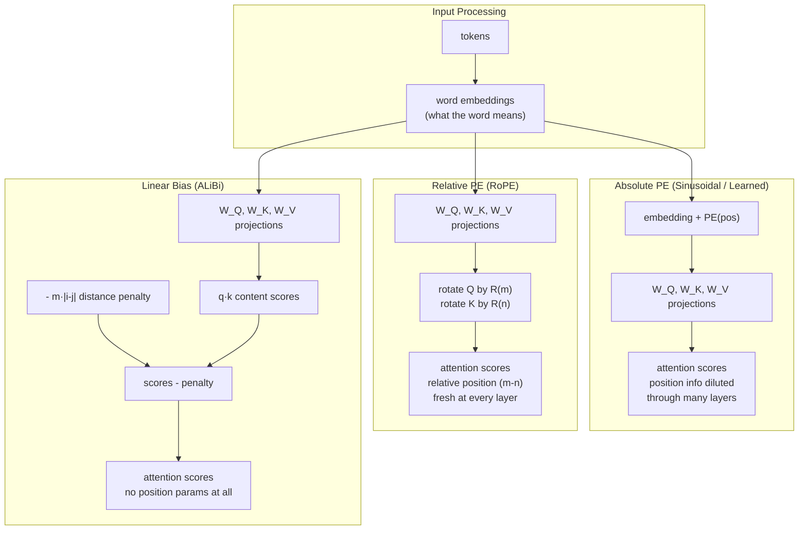

> **What this file covers**
> - 🎯 Why sinusoidal PE uses sin/cos pairs — the rotation matrix derivation
> - 🧮 Full PE formula with worked example at d_model=512 + RoPE rotation mechanics
> - ⚠️ 5 failure modes: extrapolation collapse, frequency collision, PE–embedding interference, position washout, RoPE length degradation
> - 📊 Parameter and compute costs: sinusoidal (0 params) vs learned (max_len × d) vs RoPE (0 params, per-layer cost) vs ALiBi (h params)
> - 💡 Sinusoidal vs Learned vs RoPE vs ALiBi: when each wins and why
> - 🏭 Context length extension in production: NTK-aware scaling, YaRN, why the field converged on RoPE
> - Staff/Principal Q&A with all four hiring levels shown

---

# Positional Encoding — Interview Deep-Dive

This file assumes you have read [positional-encoding.md](./positional-encoding.md) and understand the seat number analogy, the clock analogy for sinusoidal PE, and the basic idea of why transformers need position information. Everything here is for Staff/Principal depth.

---

## 🧮 The Full Formula

### Sinusoidal Positional Encoding

The position of every word is encoded as a vector of the same size as the word embedding. Even-indexed dimensions use sine, odd-indexed dimensions use cosine, each at a different frequency.

```
🧮 Sinusoidal positional encoding:

    PE(pos, 2i)     = sin(pos / 10000^(2i/d_model))
    PE(pos, 2i + 1) = cos(pos / 10000^(2i/d_model))

    Where:
      pos     = position in the sequence (0, 1, 2, ...)
      i       = dimension index (0, 1, 2, ..., d_model/2 - 1)
      d_model = embedding dimension (e.g., 512)
      10000   = base frequency — controls how fast each wave oscillates
```

The key insight: each pair of dimensions (2i, 2i+1) forms a 2D rotation at a specific frequency ω_i = 1/10000^(2i/d_model).

- **Low i** (first dimensions): high frequency → values change rapidly between adjacent positions → encodes fine-grained position differences
- **High i** (last dimensions): low frequency → values change slowly → encodes coarse position (beginning vs middle vs end)

### Worked Example: d_model = 8, pos = 3

The frequencies for each dimension pair:

```
Pair 0 (dims 0,1): ω₀ = 1/10000^(0/8) = 1/1         = 1.0
Pair 1 (dims 2,3): ω₁ = 1/10000^(2/8) = 1/10000^0.25 ≈ 1/10   = 0.1
Pair 2 (dims 4,5): ω₂ = 1/10000^(4/8) = 1/10000^0.5  = 1/100  = 0.01
Pair 3 (dims 6,7): ω₃ = 1/10000^(6/8) = 1/10000^0.75 ≈ 1/1000 = 0.001

PE(3) = [sin(3×1.0),  cos(3×1.0),      ← fast wave, changes a lot per position
         sin(3×0.1),  cos(3×0.1),      ← medium wave
         sin(3×0.01), cos(3×0.01),     ← slow wave
         sin(3×0.001),cos(3×0.001)]    ← very slow wave, barely changes

       ≈ [0.141, -0.990,
          0.296,  0.955,
          0.030,  1.000,
          0.003,  1.000]
```

Compare with PE(4): the first pair (fast wave) changes significantly, while the last pair (slow wave) is nearly identical. This is exactly how a clock works — the second hand moves fast, the hour hand barely moves.

---

## 🔬 The Rotation Property — Why Sin/Cos Pairs?

This is the mathematical reason sinusoidal PE was chosen over other options. It is one of the most common Staff/Principal follow-up questions.

### The Claim

For any fixed offset k, there exists a linear transformation M_k (a 2×2 rotation matrix) such that:

```
[PE(pos+k, 2i), PE(pos+k, 2i+1)] = M_k × [PE(pos, 2i), PE(pos, 2i+1)]
```

The same M_k works for **any** starting position pos. This means the model can learn relative distances using a fixed, position-independent linear operation.

### The Derivation

For dimension pair i with frequency ω_i:

```
PE(pos, 2i)   = sin(pos · ω_i)
PE(pos, 2i+1) = cos(pos · ω_i)
```

Apply the angle addition identities:

```
sin((pos+k) · ω_i) = sin(pos · ω_i) · cos(k · ω_i) + cos(pos · ω_i) · sin(k · ω_i)
cos((pos+k) · ω_i) = cos(pos · ω_i) · cos(k · ω_i) - sin(pos · ω_i) · sin(k · ω_i)
```

In matrix form:

```
🧮 The rotation matrix for offset k at frequency ω_i:

    ┌                        ┐   ┌                  ┐   ┌              ┐
    │ PE(pos+k, 2i)          │   │ cos(kω_i)  sin(kω_i) │   │ PE(pos, 2i)  │
    │                        │ = │                    │ × │              │
    │ PE(pos+k, 2i+1)        │   │ -sin(kω_i) cos(kω_i) │   │ PE(pos, 2i+1)│
    └                        ┘   └                    ┘   └              ┘

    M_k depends ONLY on k (the distance), not on pos (the starting position).
```

**Why this matters:** A transformer can learn to compute "how far apart are these two words?" using a fixed set of weights. It does not need to memorize a separate lookup for every (pos_i, pos_j) pair. The relative distance k uniquely determines the rotation matrix, regardless of where in the sentence the words appear.

**Why cos must accompany sin:** Without cosine, you cannot form the 2D rotation. A single sin value at one frequency does not uniquely determine position (sin is periodic), and you cannot express the angle addition identity. The (sin, cos) pair together form a point on the unit circle, and moving by k positions corresponds to rotating that point by a fixed angle. This is why dimensions come in pairs.

---

## 🧮 RoPE: Rotary Position Embeddings

RoPE (Su et al., 2021) applies the rotation idea directly to Q and K vectors inside the attention computation, rather than adding a position vector to the input embeddings.

### The Core Idea

Instead of: `Q = (x + PE) · W_Q` (add PE to input, then project)

RoPE does: `Q_rotated = R(pos) · (x · W_Q)` (project first, then rotate)

The rotation R(pos) is applied to each (q_{2i}, q_{2i+1}) pair:

```
🧮 RoPE rotation applied to query vector at position m:

    ┌           ┐     ┌                  ┐   ┌        ┐
    │ q'_{2i}   │     │ cos(mθ_i)  -sin(mθ_i) │   │ q_{2i}  │
    │           │  =  │                    │ × │        │
    │ q'_{2i+1} │     │ sin(mθ_i)   cos(mθ_i) │   │ q_{2i+1}│
    └           ┘     └                    ┘   └        ┘

    Where θ_i = 10000^(-2i/d_model)  — same frequency schedule as sinusoidal PE
```

The same rotation is applied to K at its position n.

### Why RoPE Encodes Relative Position

The attention score between position m and position n is:

```
score(m, n) = q'_m · k'_n = (R(m) · q_m)ᵀ · (R(n) · k_n)
            = q_mᵀ · R(m)ᵀ · R(n) · k_n
            = q_mᵀ · R(n - m) · k_n
```

The last step uses the fact that R(m)ᵀ · R(n) = R(n - m) — rotating back by m and forward by n is the same as rotating by (n - m).

**The attention score depends only on the relative distance (n - m), not on the absolute positions.** This is the fundamental property that makes RoPE work.

### RoPE vs Sinusoidal PE: Key Differences


| | Sinusoidal PE | RoPE |
|---|---|---|
| Where position enters | Added to input embeddings (once) | Applied to Q,K at every attention layer |
| Type of position info | Absolute (pos = 5) | Relative (distance = 3) in attention scores |
| Extra parameters | 0 | 0 |
| Position signal in deep layers | Degrades (washed out by transformations) | Fresh at every layer (reapplied) |
| Extrapolation | Theoretically unlimited, empirically weak | Degrades past training length without scaling |

---

## 🧮 ALiBi: Attention with Linear Biases

ALiBi (Press et al., 2022) takes a radically different approach: no position encoding at all. Instead, it adds a linear penalty to attention scores based on distance.

```
🧮 ALiBi attention score:

    score(i, j) = q_i · k_j - m · |i - j|

    Where:
      m = head-specific slope (fixed, not learned)
      |i - j| = distance between positions i and j
```

The slopes m are set geometrically: for h heads, m_i = 2^(-8/h · i) for i = 1, ..., h. This gives each head a different "attention horizon" — some heads see nearby words strongly, others attend more broadly.

**Why it works:** The linear penalty means distant tokens always get lower attention scores. The model can still attend to them if the content-based score (q · k) is high enough to overcome the penalty. Different heads have different penalty strengths, so the model has both local and global attention patterns.

**Key advantage: "train short, test long."** Because ALiBi uses no position encoding that was trained on specific positions, it can handle longer sequences at inference than it saw during training. The linear penalty extends naturally to any distance.

---

## 🗺️ How Position Information Enters the Transformer



---

## ⚠️ Failure Modes

### 1. Extrapolation Collapse (Learned PE)

Learned positional embeddings are a lookup table: one vector per position, up to max_len. At inference, if the sequence exceeds max_len, there is no embedding for position max_len + 1. The model either crashes or produces garbage.

**Why this matters in production:** Models trained with max_len=512 (BERT) or max_len=2048 (early GPT) cannot process longer inputs. You must truncate, which loses information. This limitation drove the move toward relative position methods.

### 2. Frequency Collision in Sinusoidal PE

At very long sequences, low-frequency dimensions produce nearly identical values for distant positions. The sine and cosine waves are so slow that positions 10,000 and 10,001 have almost the same encoding in the slow dimensions.

```
Example: at frequency ω = 0.001 (slow wave):
  sin(10000 × 0.001) = sin(10.000) = -0.544
  sin(10001 × 0.001) = sin(10.001) = -0.544

The slow dimensions cannot distinguish these positions.
```

The fast dimensions still distinguish them, but the information is concentrated in fewer dimensions. For very long sequences, the effective position resolution decreases.

### 3. PE–Embedding Interference (Addition)

When PE is added to word embeddings, the position signal and the semantic signal share the same vector space. If PE magnitudes are large relative to embedding magnitudes, the position signal can dominate and corrupt the word meaning.

**At initialization:** Embeddings are typically initialized from N(0, 0.02), so embedding magnitudes are small. Sinusoidal PE values range from -1 to 1. If d_model is small (e.g., 64), the PE can overwhelm the embeddings.

**Mitigation:** Scale embeddings by √d_model before adding PE (this is what the original Transformer paper does). This ensures both signals have comparable magnitude: embedding magnitude ≈ √d_model × 0.02 ≈ 0.45 for d_model=512, which is in the same range as PE values.

### 4. Position Signal Washout in Deep Networks

Sinusoidal and learned PE are added only at the input. After passing through L transformer layers (each with attention, FFN, LayerNorm, and residual connections), the position signal can be diluted.

**Evidence:** Probing studies (Hewitt & Manning, 2019) show that position information is strongest in the first few layers and degrades in upper layers. This means upper layers rely more on attention patterns than explicit position signals.

**Why RoPE and ALiBi avoid this:** They inject position information at every attention layer, not just at the input. The position signal is always fresh, regardless of depth.

### 5. RoPE Length Degradation

RoPE's rotation frequencies are calibrated for the training context length. At inference with longer sequences, the low-frequency rotations have not been seen during training — the model encounters rotation angles it was never trained on.

**Without mitigation:** Quality degrades rapidly past ~1.5× the training length. Perplexity increases, and the model produces incoherent text for later positions.

**NTK-aware scaling (Reddit user "bloc97", 2023):** Rescale the frequency base: θ'_i = θ_i × α^(d/(d-2i)), where α = target_len/train_len. This stretches the frequency spectrum so that all rotation angles stay within the training distribution.

**YaRN (Peng et al., 2023):** Combines NTK interpolation with an attention scaling factor. The key insight: low-frequency dimensions need more interpolation than high-frequency ones. YaRN applies dimension-dependent scaling, achieving better quality than uniform NTK scaling.

---

## 📊 Complexity Analysis

### Parameter Count

| Method | Parameters | Why |
|--------|-----------|-----|
| Sinusoidal PE | 0 | Computed from a formula, not learned |
| Learned PE | max_len × d_model | One d_model vector per position |
| RoPE | 0 | Rotation angles computed from formula |
| ALiBi | h (number of heads) | One slope per head (typically fixed, not learned) |

For GPT-3 scale (max_len=2048, d_model=12288): learned PE adds 2048 × 12288 ≈ 25M parameters — about 0.01% of the 175B total. The parameter cost is negligible at scale.

### Compute Cost

| Method | Per-layer cost | Notes |
|--------|---------------|-------|
| Sinusoidal PE | O(n × d_model) once at input | Negligible — computed once, added to embeddings |
| Learned PE | O(1) lookup per position | Negligible — index into embedding table |
| RoPE | O(n × d_model) per attention layer per head | Rotation applied to Q and K at every layer. For L layers: O(L × n × d_model). Still much cheaper than attention's O(n² × d_model) |
| ALiBi | O(n²) per layer per head | Computing |i-j| for all pairs. Same asymptotic cost as attention scores — merged into the same kernel in practice |

**Bottom line:** None of these methods are the computational bottleneck. Attention's O(n²) dominates. The choice between them is about quality, extrapolation, and implementation simplicity — not compute.

---

## 💡 Design Trade-offs

| | Sinusoidal | Learned | RoPE | ALiBi |
|---|---|---|---|---|
| Parameters | 0 | max_len × d | 0 | h |
| Position type | Absolute | Absolute | Relative (in attention) | Relative (linear bias) |
| Where applied | Input only | Input only | Every attention layer | Every attention layer |
| Extrapolation | Theoretically yes, weak empirically | No (max_len fixed) | With NTK/YaRN scaling | Yes (train short, test long) |
| Position signal in deep layers | Degrades | Degrades | Fresh every layer | Fresh every layer |
| Implementation | Simple | Simple | Moderate (rotation kernel) | Simple (bias matrix) |
| Quality at training length | Good | Good | Best | Good |
| Quality past training length | Degrades | Impossible | Good with scaling | Best |
| Used by | Original Transformer (2017) | BERT, GPT-2, GPT-3 | LLaMA, Mistral, Gemma, Qwen | BLOOM, MPT |

### Why the field converged on RoPE

1. **Relative position in attention scores** — the model sees distances, not absolute positions, which generalizes better
2. **Fresh position signal at every layer** — no washout in deep networks
3. **Zero extra parameters** — scales to any model size without overhead
4. **Proven context extension** — NTK/YaRN scaling allows 4K→128K extension with minimal quality loss
5. **Empirically dominant** — LLaMA, Mistral, Gemma, Qwen, and most open-weight models from 2023+ use RoPE

### When to choose something else

- **ALiBi** when you need guaranteed length extrapolation without any scaling tricks (e.g., streaming applications where input length is unbounded)
- **Learned PE** when your maximum sequence length is fixed and you want the simplest possible implementation (e.g., BERT-style models for classification)
- **Sinusoidal** only for educational purposes or reproducing the original Transformer

---

## 🏭 Production: Context Length Extension

The most common production challenge with positional encoding is **extending a model to longer contexts than it was trained on**.

### The Problem

A model trained with 4K context produces garbage at position 5K. For RoPE models, the rotation angles at position 5K have never been seen during training.

### NTK-Aware Scaling

Modify the frequency base: instead of θ_i = 10000^(-2i/d_model), use θ'_i = (10000 × α)^(-2i/d_model) where α = target_len/train_len.

This scales all frequencies down, so the same rotation angles appear at longer positions. Effectively, the model "sees" position 8000 as if it were position 4000 in the original frequency space.

**Limitation:** Uniform scaling reduces position resolution at short distances. Two adjacent positions have a smaller rotation angle between them, making them harder to distinguish.

### YaRN (Yet Another RoPE extensioN)

YaRN improves on NTK by applying **non-uniform scaling**: high-frequency dimensions (which encode fine position) are scaled less, low-frequency dimensions (which encode coarse position) are scaled more.

Additionally, YaRN multiplies the attention logits by a temperature factor t = 0.1 × ln(s) + 1, where s is the scale factor. This compensates for the reduced entropy of attention distributions at longer contexts.

**Production results:** LLaMA-2 7B extended from 4K to 128K with YaRN, retaining >95% of original perplexity on the 4K portion while performing well at 128K.

### Practical Guidelines

1. **Start with NTK-aware scaling** — simple to implement, works for 2-4× extension
2. **Use YaRN for >4× extension** — the non-uniform scaling matters more at higher ratios
3. **Always fine-tune** after extension — even 100-1000 steps on long-context data significantly improves quality
4. **Monitor perplexity at multiple lengths** — check both short-range (should stay constant) and long-range (should improve) quality

---

## Staff/Principal Interview Depth

---

**Q1: Why does the original Transformer add PE to embeddings instead of concatenating?**

---
**No Hire**
*Interviewee:* "Adding is simpler and uses less memory than concatenating."
*Interviewer:* The candidate states a surface-level fact without any analysis. "Simpler" isn't a reason — concatenation is also simple. There's no discussion of the dimensionality implications, the interaction between PE and embeddings in attention, or the mathematical properties of addition vs concatenation.
*Criteria — Met:* Knows addition is used / *Missing:* Dimensionality argument, attention interaction, any mathematical reasoning

---
**Weak Hire**
*Interviewee:* "Concatenation would double the embedding dimension from d_model to 2×d_model. This doubles the size of all downstream weight matrices (W_Q, W_K, W_V), quadrupling the parameter count of attention. Addition keeps the dimension at d_model with no parameter increase."
*Interviewer:* Correct and practical — the candidate understands the parameter cost argument. What's missing: is there a deeper reason beyond parameter count? Does addition have mathematical properties that concatenation lacks? And what's the downside of sharing the same vector space?
*Criteria — Met:* Parameter cost argument, dimensionality reasoning / *Missing:* Shared vector space trade-off, mathematical interaction in attention, whether information is lost

---
**Hire**
*Interviewee:* "Three reasons, from practical to mathematical. First, parameter efficiency: concatenation makes d_model → 2d_model, which quadruples attention parameters (4d_model² → 16d_model²). Second, attention interaction: when PE is added to embeddings, the attention score q·k decomposes into four terms: (x_q + PE_q)·W_Q·W_K^T·(x_k + PE_k) = (content-content) + (content-position) + (position-content) + (position-position). The content-position cross-terms are exactly what lets the model learn 'word X at position Y deserves high attention' — this interaction happens automatically with addition. With concatenation, the content and position dimensions are independent in the dot product, so cross-terms require the model to learn them through W_Q and W_K. Third, the downside of addition: PE and embeddings share the same d_model-dimensional space. The model must partition its representational capacity between semantic meaning and position information. In practice, embedding dimensions tend to specialize — some carry more semantic info, others more positional — but this is a constraint, not a feature."
*Interviewer:* Strong. The four-term decomposition of attention scores is the key insight that most candidates miss. The candidate correctly identifies both the advantage (automatic cross-terms) and the disadvantage (shared representational space). What would push to Strong Hire: connecting this to why RoPE avoids the interference problem entirely, and noting that the √d_model scaling in the original paper was specifically to balance PE and embedding magnitudes.
*Criteria — Met:* Parameter cost, four-term attention decomposition, cross-term advantage, shared-space downside / *Missing:* Connection to RoPE avoiding interference, √d_model embedding scaling

---
**Strong Hire**
*Interviewee:* "Addition vs concatenation is a design choice with specific mathematical consequences. Concatenation would increase all downstream dimensions from d_model to 2d_model, quadrupling attention parameters. But the deeper reason addition was chosen relates to how attention scores decompose. The score between positions m and n is: score(m,n) = (x_m + PE_m)^T W_Q W_K^T (x_n + PE_n). Expanding: score = x_m^T W x_n + x_m^T W PE_n + PE_m^T W x_n + PE_m^T W PE_n, where W = W_Q W_K^T. The first term is pure content similarity. The second and third terms are content-position interactions — 'does the content at position n match what position m is looking for positionally?' The fourth term is pure positional bias. These cross-terms arise for free with addition. With concatenation, Q = [x W_Q^x; PE W_Q^p] and the dot product separates: content dimensions only interact with content, position only with position. Cross-terms require off-diagonal blocks in W to be non-zero, which the model can learn but doesn't get for free. The downside: addition forces PE and embeddings to share d_model dimensions. The original paper compensates by scaling embeddings by √d_model before addition, ensuring embedding magnitudes (~√d_model × 0.02 ≈ 0.45 for d_model=512) are comparable to PE magnitudes (bounded by [-1, 1]). This is also exactly the problem RoPE solves — by applying rotation to Q and K after projection, RoPE keeps the position and content representations completely separate: no shared dimensions, no interference. The attention score with RoPE naturally decomposes into a content term (q^T R(m-n) k) that encodes relative position without any addition to the embedding space."
*Interviewer:* Staff-level. The candidate provides the complete attention decomposition with four explicit terms, explains why concatenation loses cross-terms, identifies the √d_model scaling compensation, and connects the entire analysis to RoPE's design motivation. The progression from 'addition gives free cross-terms' to 'but forces shared space' to 'RoPE avoids this entirely' shows architectural thinking across methods — exactly what staff-level candidates do.
*Criteria — Met:* Four-term decomposition with W = W_Q W_K^T, cross-term analysis for concatenation, √d_model scaling reasoning, RoPE connection as design evolution, representational interference analysis

---

**Q2: Derive the rotation property of sinusoidal PE. Why does it matter?**

---
**No Hire**
*Interviewee:* "Sinusoidal PE can represent relative positions because sine and cosine are periodic."
*Interviewer:* Periodicity is not the key property — periodicity actually causes problems (positions repeat every 2π/ω). The candidate cannot state what the rotation property is, let alone derive it.
*Criteria — Met:* Knows sin/cos are involved / *Missing:* Statement of the rotation property, any derivation, why it matters for learning

---
**Weak Hire**
*Interviewee:* "For any fixed distance k, there's a linear transformation that maps PE(pos) to PE(pos+k), regardless of pos. This is because of the trigonometric angle addition formulas. It matters because the model can learn relative distances with fixed weights."
*Interviewer:* Correct high-level description. The candidate knows what the property is and why it matters. What's missing: the actual derivation showing the rotation matrix, and a connection to why cosine must accompany sine.
*Criteria — Met:* Correct statement of property, practical implication / *Missing:* Derivation, rotation matrix, why sin/cos pairs

---
**Hire**
*Interviewee:* "For each dimension pair (2i, 2i+1) at frequency ω_i: PE(pos, 2i) = sin(pos·ω_i), PE(pos, 2i+1) = cos(pos·ω_i). To get PE(pos+k), apply angle addition: sin((pos+k)ω) = sin(pos·ω)cos(k·ω) + cos(pos·ω)sin(k·ω), and cos((pos+k)ω) = cos(pos·ω)cos(k·ω) - sin(pos·ω)sin(k·ω). In matrix form: [sin((pos+k)ω), cos((pos+k)ω)] = [[cos(kω), sin(kω)], [-sin(kω), cos(kω)]] × [sin(pos·ω), cos(pos·ω)]. This is a 2D rotation matrix that depends only on k, not on pos. The model can learn a single set of weights per distance k that works at any position. This is also why sin must be paired with cos — a single sinusoid doesn't have this rotation property. You need both components of the unit circle to perform a rotation."
*Interviewer:* Clean derivation. The candidate shows the angle addition, writes the rotation matrix, and explains why cos is necessary. What would push to Strong Hire: connecting this to RoPE (which uses the same rotation idea but applies it to Q/K), discussing the frequency spectrum design (why 10000 as the base), and noting the limitations (the rotation property doesn't mean the model *automatically* uses relative position — it must still learn to do so).
*Criteria — Met:* Complete derivation, rotation matrix, sin/cos pairing, practical implication / *Missing:* Connection to RoPE, frequency base design, learning caveat

---
**Strong Hire**
*Interviewee:* "The derivation follows from the angle addition identities applied to each dimension pair. For frequency ω_i = 1/10000^(2i/d_model): PE(pos+k) = M_k × PE(pos), where M_k is the 2×2 rotation matrix [[cos(kω_i), sin(kω_i)], [-sin(kω_i), cos(kω_i)]]. The full proof: expand sin((pos+k)ω) and cos((pos+k)ω) using angle addition, collect terms to show the linear dependence on [sin(pos·ω), cos(pos·ω)], and verify the resulting matrix is orthogonal with determinant 1 — confirming it's a rotation. The rotation depends only on k, not pos, so the model can encode 'k positions apart' with position-independent weights. Three deeper points. First, this is the direct precursor to RoPE. RoPE takes the same rotation idea but applies it to Q and K vectors inside attention, so the inner product q_m^T k_n naturally yields a function of (m-n). This is more powerful because relative position enters the attention score directly, not just the representation. Second, the frequency base 10000 determines the resolution/range trade-off. The fastest frequency (i=0) completes a full rotation every 2π ≈ 6.28 positions — fine resolution for short distances. The slowest frequency (i=d_model/2-1) has period 2π × 10000 ≈ 62,832 positions — coarse but covers long sequences. The 10000 was not formally optimized; it was chosen to span the sequence lengths of interest (up to ~10K). Third caveat: the rotation property means relative position *can* be computed linearly, but the model must learn to use this structure. There's no guarantee an untrained model will exploit the rotation. Empirically, attention heads do learn relative-position-sensitive patterns, but not because the PE forces them — because the PE *enables* them."
*Interviewer:* This is the staff-level answer. Complete derivation, orthogonality verification, three deepening points that each show genuine understanding: the RoPE evolution, the frequency base design rationale, and the subtle but critical point that the rotation property is an *enablement*, not a *guarantee*. The last point especially — many candidates overstate the rotation property as if it automatically gives the model relative position awareness.
*Criteria — Met:* Full derivation with orthogonality check, RoPE connection, frequency base analysis, resolution/range trade-off, learning caveat

---

**Q3: Compare RoPE, ALiBi, and sinusoidal PE for a production LLM. When would you choose each?**

---
**No Hire**
*Interviewee:* "RoPE is the best because LLaMA uses it. ALiBi is older. Sinusoidal is the original."
*Interviewer:* The candidate knows which models use which method but has no analysis. "LLaMA uses it" is an argument from authority, not understanding. There's no discussion of trade-offs, failure modes, or when each method is appropriate.
*Criteria — Met:* Correct model-method associations / *Missing:* Any analysis, trade-offs, failure modes, decision criteria

---
**Weak Hire**
*Interviewee:* "RoPE gives relative position information directly in the attention scores. It has zero extra parameters and works well with context extension via NTK scaling. ALiBi adds a linear distance penalty to attention scores — it's simpler and extrapolates naturally. Sinusoidal adds absolute position to input embeddings. For a new production LLM, RoPE is the standard choice."
*Interviewer:* Correct summary of each method. The candidate knows the key properties and gives a reasonable recommendation. What's missing: when would you NOT choose RoPE? What's the specific failure mode of each? What's the production deployment trade-off?
*Criteria — Met:* Mechanism of each method, basic recommendation / *Missing:* Failure modes, specific decision criteria, deployment trade-offs

---
**Hire**
*Interviewee:* "For a production LLM in 2024-2025, the default choice is RoPE — it's used by LLaMA, Mistral, Gemma, and Qwen. Reasons: relative position in every attention layer (no washout in deep networks), zero parameters, proven context extension via NTK/YaRN (4K→128K demonstrated). RoPE's weakness: without scaling, it degrades past training length. You need NTK-aware scaling or YaRN, which adds implementation complexity. Choose ALiBi instead when: (1) you need guaranteed length extrapolation without any scaling tricks — ALiBi's linear penalty extends to any length by design, or (2) you're building a streaming system where input length is truly unbounded. ALiBi's weakness: the linear penalty is a strong inductive bias. It assumes nearby tokens are always more relevant, which hurts tasks where long-range dependencies are critical (summarization, long document QA). Choose sinusoidal PE only for educational implementations or reproducing the original Transformer. In production, its absolute-position-at-input-only approach is strictly worse than RoPE. Learned PE (BERT, GPT-3) is fine when max_len is fixed and you don't need extrapolation."
*Interviewer:* Strong. The candidate gives specific decision criteria for each method, identifies the key weakness of each, and provides a principled recommendation. What would push to Strong Hire: quantitative context extension results, the NTK vs YaRN comparison, and awareness of newer methods like MLA or NoPE.
*Criteria — Met:* Decision criteria for each method, specific failure modes, production recommendation with reasoning / *Missing:* Quantitative extension results, NTK vs YaRN comparison, frontier methods

---
**Strong Hire**
*Interviewee:* "The decision depends on three factors: target context length, extrapolation requirements, and implementation constraints. For a standard production LLM (training context 4K-32K, inference up to 128K): use RoPE. It's the dominant choice since 2023 because it injects relative position at every attention layer (solving the position washout problem of absolute PE), has zero parameters, and has a well-understood extension story. Specifically: NTK-aware scaling gives 2-4× extension with simple frequency rescaling. YaRN gives 4-32× extension by applying non-uniform scaling (high-frequency dimensions keep their resolution, low-frequency dimensions get compressed) plus a temperature correction. LLaMA-2 7B was extended from 4K to 128K with YaRN retaining >95% short-context perplexity. For streaming or unbounded-length applications: use ALiBi. Its linear penalty m·|i-j| extends to any length without modification — 'train short, test long' is the design principle. The weakness: ALiBi's strong locality bias hurts on tasks requiring uniform attention across long ranges. BLOOM (176B) uses ALiBi, and benchmarks show it underperforms RoPE-based models on long-context tasks despite strong extrapolation properties. For fixed-context classification or retrieval tasks: learned PE is perfectly fine. BERT's 512-position learned embeddings work well for its use cases. Sinusoidal PE has no practical production advantage over any of these — it's historically important but superseded. Looking forward: DeepSeek-V2 introduced MLA (Multi-head Latent Attention) which compresses the KV cache via low-rank projection and changes how position information interacts with attention. Some research (Kazemnejad et al., 2023) even shows that with sufficient model capacity, no explicit position encoding ('NoPE') can work — the model learns position from causal masking alone. These are frontier results that may shift the landscape."
*Interviewer:* Staff-level. The candidate structures the answer around decision criteria (not just method descriptions), gives quantitative extension results (YaRN 4K→128K with >95% retention), identifies ALiBi's locality bias weakness with a specific model example (BLOOM), and looks forward to MLA and NoPE research. The progression from practical recommendation to frontier research shows the breadth expected at staff level.
*Criteria — Met:* Three-factor decision framework, quantitative results, NTK vs YaRN comparison, ALiBi locality weakness with evidence, production model examples, frontier methods (MLA, NoPE)

---

**Q4: How would you extend a RoPE-based model trained on 4K context to handle 32K context?**

---
**No Hire**
*Interviewee:* "Just train it on longer sequences."
*Interviewer:* While continued training on longer sequences is part of the solution, the candidate doesn't address the core problem: RoPE's rotation angles at positions beyond 4K have never been seen. Without frequency adjustment, the model encounters out-of-distribution rotations and produces garbage. "Just train it on longer sequences" without modifying RoPE would require enormous compute and still not work well.
*Criteria — Met:* Knows training is involved / *Missing:* RoPE frequency problem, any scaling method, practical approach

---
**Weak Hire**
*Interviewee:* "Apply NTK-aware scaling to modify the frequency base, then fine-tune on long-context data. NTK scaling adjusts the frequencies so that the rotation angles at 32K fall within the range the model saw during 4K training."
*Interviewer:* Correct approach at a high level. The candidate knows the right method and the right reasoning. What's missing: the formula for NTK scaling, why uniform scaling has limitations, and the fine-tuning details (how much data, how many steps).
*Criteria — Met:* NTK scaling concept, correct reasoning / *Missing:* Formula, uniform vs non-uniform scaling, fine-tuning details

---
**Hire**
*Interviewee:* "The core problem: RoPE uses θ_i = 10000^(-2i/d_model). At position 32K, the rotation angle for dimension i is 32000 × θ_i. For high-frequency dimensions (small i), this produces rotation angles the model has never seen during 4K training. Step 1: Apply frequency scaling. The simplest approach is NTK-aware scaling: replace the base 10000 with 10000 × α, where α = 32K/4K = 8. This compresses the frequency spectrum so that rotation angles at 32K match what the model saw at 4K. Step 2: Fine-tune on long-context data. Even 1000-2000 steps on documents longer than 4K significantly improves quality. The model needs to see the new rotation angles in context. Step 3: Evaluate at multiple lengths. Check perplexity at 1K, 4K, 8K, 16K, and 32K. Short-context perplexity should stay constant (or improve slightly); long-context perplexity should decrease. If short-context degrades, the scaling is too aggressive."
*Interviewer:* Solid practical answer. The candidate identifies the out-of-distribution rotation problem, applies NTK scaling correctly, and gives a clear three-step procedure with evaluation criteria. What would push to Strong Hire: YaRN's non-uniform scaling advantage, the attention temperature correction, and awareness of how much fine-tuning data/compute is needed at scale.
*Criteria — Met:* Out-of-distribution diagnosis, NTK formula, fine-tuning step, multi-length evaluation / *Missing:* YaRN non-uniform scaling, temperature correction, compute requirements

---
**Strong Hire**
*Interviewee:* "The problem is that RoPE rotation angles θ_i × pos for pos > 4K are out of the training distribution. The solution has three components, each addressing a different aspect. First, frequency rescaling. NTK-aware: scale the base from 10000 to 10000 × (32K/4K) = 80000. All frequencies shrink by 8×, so position 32K produces the same angles as position 4K did originally. But uniform scaling has a flaw: it reduces position resolution at short distances. Two adjacent positions at any point have rotation angles 8× closer together, making them harder to distinguish. YaRN fixes this with non-uniform scaling: high-frequency dimensions (small i, encoding fine position) are scaled less aggressively, preserving short-range resolution. Low-frequency dimensions (large i, encoding coarse position) are scaled more aggressively, enabling long-range extension. The specific formula partitions dimensions into three bands: unscaled (highest frequencies), linearly interpolated (middle), and fully scaled (lowest frequencies). Second, attention temperature. At longer contexts, the entropy of the attention distribution decreases (more tokens compete for attention weight). YaRN applies a correction factor t = 0.1 × ln(s) + 1, where s = 32K/4K = 8, so t ≈ 1.21. Attention logits are divided by t, slightly flattening the distribution. Third, fine-tuning. Even 100 steps on long-context data is sufficient at 7B scale, though 1000-2000 steps gives better results. The key insight: you don't need a massive long-context corpus. A small amount of fine-tuning teaches the model to use the rescaled frequencies; the core language model weights barely change. At 7B scale, this costs a few GPU-hours. At 70B, it costs a few GPU-days. Production results: LLaMA-2 7B extended from 4K to 128K with YaRN, retaining >95% perplexity at 4K while achieving strong perplexity at 128K. The three-band frequency scaling is what makes this work — uniform NTK alone gives about 85% retention at the same extension ratio."
*Interviewer:* This is exactly the staff-level answer. The candidate diagnoses the OOD problem precisely, explains why uniform NTK scaling has a resolution flaw, gives the YaRN three-band solution, includes the temperature correction (which most candidates miss), provides concrete compute estimates, and cites quantitative results comparing NTK vs YaRN. The distinction between NTK (uniform) and YaRN (non-uniform with temperature) is the key differentiator from a Hire answer.
*Criteria — Met:* OOD rotation diagnosis, NTK formula and limitation, YaRN non-uniform scaling with three bands, temperature correction factor, fine-tuning compute estimates, quantitative comparison (95% vs 85% retention)

---

## Key Takeaways

🎯 1. **Sinusoidal PE uses sin/cos pairs because they form rotation matrices** — PE(pos+k) = R_k × PE(pos), where R_k depends only on distance k, not absolute position
2. **Each dimension pair encodes position at a different frequency** — fast waves for fine position, slow waves for coarse position, like a clock with multiple hands
🎯 3. **RoPE applies rotation to Q and K** so attention scores depend on relative position (m-n) — this is why it dominates modern LLMs
4. **ALiBi uses no position parameters at all** — just a linear distance penalty on attention scores
⚠️ 5. **Learned PE cannot extrapolate** beyond max_len — this drove the move to relative methods
🎯 6. **Position signal from input-only PE washes out** in deep networks — RoPE and ALiBi avoid this by injecting at every layer
7. **NTK-aware scaling extends RoPE context 2-4×** by rescaling the frequency base; YaRN extends 4-32× with non-uniform scaling
8. **The √d_model scaling of embeddings** in the original Transformer was specifically to balance embedding and PE magnitudes
⚠️ 9. **RoPE without scaling degrades past ~1.5× training length** — always apply NTK or YaRN for long-context inference
10. **The field converged on RoPE** because it gives relative position at every layer, zero parameters, and proven context extension

---

**Further Reading**
- [Attention Is All You Need](https://arxiv.org/abs/1706.03762) (Vaswani et al., 2017) — Section 3.5
- [RoFormer: Enhanced Transformer with Rotary Position Embedding](https://arxiv.org/abs/2104.09864) (Su et al., 2021)
- [ALiBi: Train Short, Test Long](https://arxiv.org/abs/2108.12409) (Press et al., 2022)
- [YaRN: Efficient Context Window Extension](https://arxiv.org/abs/2309.00071) (Peng et al., 2023)
- [NTK-Aware Scaled RoPE](https://www.reddit.com/r/LocalLLaMA/comments/14lz7j5/) (bloc97, 2023) — community-driven discovery

---

[← Back to Positional Encoding (Layer 1)](./positional-encoding.md) | [Next: Transformer Block](./transformer-block.md)
