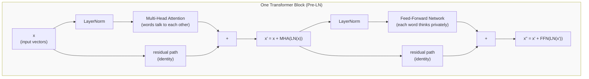

> **What this file covers**
> - 🎯 The complete transformer block formula (Pre-LN variant) and why each piece exists
> - 🧮 Pre-LN vs Post-LN gradient flow analysis with formal O(√L) vs O(log L) bounds
> - ⚠️ 8 failure modes: warmup crashes, gradient explosions, FFN undersizing, fine-tuning forgetting, attention saturation, masking bugs, padding leakage, KV cache blowup
> - 📊 Hyperparameter sensitivity: why d_k=64, d_ff=4×d_model, and depth wins over width
> - 💡 Design trade-offs from the original paper — what was chosen, why, and what has changed since 2017
> - 🏭 Why transformers beat RNNs, encoder vs decoder in production, KV cache at scale
> - Staff/Principal Q&A: 7 questions with all four hiring levels shown

---

# Transformer Block — Interview Deep-Dive

This file assumes you have read [transformer-block.md](./transformer-block.md) and understand the group art project analogy, the four building blocks (attention, FFN, residual connections, layer norm), and the three transformer types (encoder-only, decoder-only, encoder-decoder). Everything here is for Staff/Principal depth.

---

## 🧮 The Complete Transformer Block Equations

### Pre-LN Variant (GPT-2, LLaMA, Mistral — all modern models)

```
🧮 One transformer block (Pre-LN):

    Step 1: Attention sub-layer
    x' = x + MultiHeadAttention(LayerNorm(x))

    Step 2: FFN sub-layer
    x'' = x' + FFN(LayerNorm(x'))

    Where:
      x       = input vectors, shape (n × d_model)
      x', x'' = intermediate and output vectors, same shape
      LayerNorm normalizes BEFORE the sub-layer (Pre-LN)
      The + is the residual connection
```

### Post-LN Variant (Original Transformer, 2017)

```
🧮 One transformer block (Post-LN):

    Step 1: Attention sub-layer
    x' = LayerNorm(x + MultiHeadAttention(x))

    Step 2: FFN sub-layer
    x'' = LayerNorm(x' + FFN(x'))

    Here LayerNorm is applied AFTER the residual addition.
```

### FFN Internal Computation

The standard FFN (original Transformer):

```
FFN(x) = W₂ · ReLU(W₁ · x + b₁) + b₂

Where:
  W₁ has shape (d_model × d_ff)   — expand from 512 to 2048
  W₂ has shape (d_ff × d_model)   — compress back from 2048 to 512
  d_ff = 4 × d_model typically
```

The SwiGLU variant (LLaMA, Mistral, Gemma):

```
FFN_SwiGLU(x) = W_down · (SiLU(W_gate · x) ⊙ (W_up · x))

Where:
  W_gate has shape (d_model × d_ff)
  W_up   has shape (d_model × d_ff)
  W_down has shape (d_ff × d_model)
  ⊙ = element-wise multiplication
  SiLU(x) = x · sigmoid(x)
```

SwiGLU uses **three** matrices instead of two. To keep parameter count similar to the standard 4× FFN, LLaMA sets d_ff ≈ 2.67 × d_model (e.g., d_ff = 11008 for d_model = 4096). The gating mechanism adds expressivity that compensates for the smaller expansion ratio.

---

## 🗺️ Information Flow Through a Transformer Block



🎯 **The residual stream concept:** Think of x as a "stream" that flows through the block. Each sub-layer (attention, FFN) reads from the stream, computes something, and writes its result back by addition. The stream carries all information forward. If a sub-layer produces nothing useful, x passes through unchanged.

---

## 🔬 Pre-LN vs Post-LN: Gradient Flow Analysis

This is the single most important architectural insight for training deep transformers. It explains why the original 6-layer transformer needed careful warmup while modern 96-layer models train stably from step 1.

### Post-LN Gradient Problem

In Post-LN, the output of layer l is:

```
x_l = LayerNorm(x_{l-1} + f_l(x_{l-1}))
```

The gradient of the loss with respect to x_0 must pass through L layer norms. Each LayerNorm normalizes by the standard deviation of its input, which creates a division by a quantity that grows with depth.

At initialization, the residual accumulation causes ||x_l|| ∝ √l (each layer adds a roughly unit-norm contribution). The LayerNorm then divides by this growing norm, creating a gradient scaling of:

```
⚠️ Post-LN gradient variance:

    ||∂L/∂x_0|| ∝ O(1/√L)

    For L=96 layers: gradient at the input is ~10× smaller than at the output.
    Without warmup, the first gradient step is too large relative to this
    small gradient, and training diverges.
```

### Pre-LN Solution

In Pre-LN, the output of layer l is:

```
x_l = x_{l-1} + f_l(LayerNorm(x_{l-1}))
```

The key difference: the residual connection is **outside** the LayerNorm. The gradient along the residual path is the identity:

```
∂x_L/∂x_0 = I + Σ (gradient through sub-layers)
```

The identity term I guarantees a gradient magnitude of at least 1, regardless of depth. The sub-layer gradients add to this baseline but cannot reduce it below 1.

```
✅ Pre-LN gradient variance:

    ||∂L/∂x_0|| = O(1)  (bounded, independent of depth)

    The forward pass norm grows at most O(log L) instead of O(√L).
    Training is stable from step 1. No warmup needed.
```

### Practical Impact

| | Post-LN | Pre-LN |
|---|---|---|
| Gradient at layer 0 | O(1/√L) — shrinks with depth | O(1) — constant |
| Learning rate warmup | Required (4000 steps in original paper) | Not needed |
| Maximum stable depth | ~12 layers without extreme care | 96+ layers routinely |
| Final quality | Slightly better at convergence (when training succeeds) | Slightly worse, but reliably trainable |
| Used by | Original Transformer, BERT | GPT-2, GPT-3, LLaMA, Mistral, Gemma |

💡 **Why Post-LN gives slightly better final quality:** Post-LN normalizes after the residual addition, which constrains the output distribution more tightly. This regularization effect marginally improves generalization — but the training instability at depth more than offsets this advantage. DeepNorm (Microsoft, 2022) attempts to get the best of both: scaled residual connections with Post-LN.

---

## 📊 Hyperparameter Sensitivity

### Why d_k = 64?

When d_k is too small (below ~32), each attention head has insufficient capacity to represent complex query-key relationships. The attention matrix becomes underpowered.

When d_k is very large, the QKᵀ dot products grow in magnitude proportionally to √d_k. The 1/√d_k scaling compensates for this, but numerical precision issues can still arise in float16. More practically, larger d_k means fewer heads for a fixed d_model (since h = d_model / d_k), which reduces the diversity of attention patterns.

d_k = 64 was found empirically to balance head capacity and compute cost. It has been used from GPT-1 through GPT-3 and across LLaMA-1, 2, and 3 with almost no variation — it is remarkably robust across scales.

### Why d_ff = 4 × d_model?

Geva et al. (2021) showed that FFN layers act as **key-value memories**: the first linear layer acts as a key lookup, and the second projects from value space back to d_model. The 4× expansion provides enough key-value capacity for the model to store factual associations during pre-training.

Empirical results:
- Reducing to 2× costs 3-5% on downstream benchmarks (consistent across tasks and budgets)
- Increasing to 8× rarely helps (diminishing returns)
- The curve peaks around 4×

An undersized FFN forces the model to push more computation into the attention weights. This matters for fine-tuning: LoRA targets FFN matrices because they contain factual knowledge; an undersized FFN makes this strategy less effective.

### Depth vs Width Tradeoff

For a fixed parameter budget, deeper networks (more layers, smaller d_model) generalize better. Wider networks (fewer layers, larger d_model) memorize better.

Scaling laws (Kaplan et al. 2020) showed that for a fixed compute budget, the optimal depth/width ratio favors depth, but the curve is shallow enough that within 2× of optimal depth, quality differences are small.

Chinchilla (Hoffmann et al. 2022) refined this: optimal training tokens scale as ~20× parameters. Both laws agree that much larger models are optimal at modern compute scales.

**Practical guidance:** A 7B model at 16 layers loses reasoning capability compared to 32 layers. Going beyond 48 layers at 7B gives diminishing returns and increases KV cache cost. The sweet spot is 28-36 layers with d_model ≈ 4096.

---

## ⚠️ Failure Modes

### 1. Learning Rate Warmup with Post-LN

In Post-LN, gradient variance at the input is O(1/√L). At initialization, the first gradient steps are enormous relative to the model's small gradient magnitude, causing training divergence. The original paper uses linear warmup for 4000 steps (from 0 to peak learning rate), then inverse square root decay. Pre-LN avoids this entirely.

### 2. Gradient Explosion Without Clipping

Even with Pre-LN, rare gradient spikes appear — a single outlier batch can destabilize training. Standard: gradient clipping with max_norm = 1.0 (universal across GPT-2, GPT-3, LLaMA, BERT).

**Diagnostic:** If training loss spikes suddenly after many stable steps and does not recover, an uncaught gradient explosion is the first hypothesis.

### 3. FFN d_ff Ratio Undersizing

Reducing d_ff/d_model from 4× to 2× costs 3-5% on benchmarks. More importantly, an undersized FFN forces the model to push computation into attention weights, making LoRA-style fine-tuning less effective (LoRA targets FFN matrices because they hold factual knowledge). Do not cut d_ff as a cost-saving measure without validating on your target benchmark.

### 4. Catastrophic Forgetting During Fine-Tuning

Very deep pre-trained models (48+ layers) can catastrophically forget general knowledge during aggressive fine-tuning on narrow datasets. Lower layers learn general syntactic and phonological patterns. Upper layers learn task-specific representations. Aggressive fine-tuning updates all layers equally but has insufficient signal to re-learn lower-layer representations.

**Mitigations:**
- Freeze the bottom N layers, fine-tune only upper layers
- Lower learning rate for lower layers (discriminative fine-tuning, ULMFiT style)
- Use LoRA: adds small rank-r perturbation matrices (r=8 to 64) to attention and FFN weight matrices, limiting the magnitude of change

### 5. Attention Score Saturation

If d_k is large, QKᵀ dot products grow proportionally. Softmax applied to very large numbers pushes almost all weight to one token, effectively ignoring all others. The √d_k scaling prevents this, but numerical precision can still cause saturation in float16.

**Production fix:** Masked softmax with careful numerical stabilization (subtract max before exp).

### 6. Causal Masking Bugs

Decoder models must prevent position i from attending to positions > i. A single off-by-one error in the attention mask lets the model "see the answer" during training. The model trains with inflated accuracy but fails catastrophically at inference because it learned to copy future tokens instead of predicting them.

**Verification:** After implementing causal attention, check that the attention weight matrix is lower-triangular after softmax. Any non-zero entry above the diagonal is a bug.

### 7. Padding Token Leakage

Batches are padded to the same length. If padding tokens are not masked before softmax, real tokens can "attend to" padding positions, which are semantically meaningless. This subtly degrades performance in ways that are hard to diagnose because the model still trains and performs reasonably — just worse than it should.

### 8. KV Cache Memory at Inference

Autoregressive generation caches K and V matrices to avoid recomputation. For a model with L layers, d_model dimensions, batch size B, and sequence length S:

```
🧮 KV cache memory:

    KV_cache = 2 × L × d_model × S × B × bytes_per_element

    LLaMA-2 70B (L=80, d_model=8192, float16, B=32, S=4096):
    = 2 × 80 × 8192 × 4096 × 32 × 2 bytes
    ≈ 275 GB

    This is often LARGER than the model weights themselves (~140 GB for 70B in float16).
```

GQA (Grouped Query Attention) reduces this by sharing K,V heads across multiple Q heads. LLaMA-2 70B uses 8 KV heads for 64 Q heads → 8× KV cache reduction → ~34 GB instead of 275 GB.

---

## 💡 Design Trade-offs from "Attention Is All You Need"

The 2017 paper made choices that were reasonable at the time but have since been superseded:

| Choice | 2017 Decision | Modern Standard | Why It Changed |
|--------|--------------|-----------------|----------------|
| Position encoding | Sinusoidal (fixed) | RoPE | Relative position in attention scores; per-layer injection; proven context extension |
| Normalization | Post-LN | Pre-LN | Pre-LN enables stable training at 96+ layers without warmup |
| FFN activation | ReLU | SwiGLU | Gating mechanism adds expressivity; 1-2% quality improvement |
| Attention type | Full dense (O(n²)) | Full dense + Flash Attention | Flash Attention makes O(n²) practical via I/O optimization |
| Head configuration | MHA (h=8, d_k=64) | GQA (shared K,V heads) | 4-8× KV cache reduction at inference with minimal quality loss |
| Architecture | Encoder-decoder | Decoder-only | CLM pretraining produces richer representations at scale; simpler serving |

---

## 🏭 Production Considerations

### Why Transformers Beat RNNs

RNNs process tokens sequentially. To get information from position 1 to position 100, it must pass through 99 intermediate hidden states. At each step, the hidden state is multiplied by a weight matrix W_h. If the spectral radius of W_h is less than 1, the signal vanishes exponentially. If greater than 1, it explodes.

Transformers replace this sequential chain with direct connections. Any position can attend to any other position in one step. The gradient path length is O(1), not O(n).

The cost: attention requires O(n²) memory for all-pairs comparison. RNNs are O(n). For sequences beyond ~4K tokens, this becomes the bottleneck — which is why Flash Attention, sparse attention, state space models (Mamba), and RWKV are active areas.

### Encoder vs Decoder in Production

| | Encoder-Only (BERT) | Decoder-Only (LLaMA/GPT) |
|---|---|---|
| Inference pattern | Single forward pass | Autoregressive (one pass per token) |
| Latency | O(n²) once | O(n²) × output_length |
| Memory at inference | O(n²) attention | O(n²) attention + KV cache |
| Best for | Embeddings, classification, search | Generation, chat, code, reasoning |
| Modern status | Niche (embedding workloads) | Dominant for most tasks |

### KV Cache Sizing for Production

```
Memory per concurrent request:
  = 2 × L × n_kv_heads × d_head × S × dtype_bytes

For LLaMA-3 70B (L=80, n_kv_heads=8, d_head=128, float16):
  At S=4K:   ~1.3 GB per request
  At S=32K:  ~10.5 GB per request
  At S=128K: ~42 GB per request

Serving 32 concurrent requests at 32K context:
  KV cache alone: ~336 GB (on top of ~140 GB model weights)
```

This is why **PagedAttention** (vLLM) manages KV cache like virtual memory — allocating physical "pages" of ~16 tokens and mapping them to logical positions, enabling memory sharing for common prefixes and eliminating fragmentation.

---

## Staff/Principal Interview Depth

---

**Q1: Why does the transformer architecture outperform RNNs for long sequences, and what price do we pay for that improvement?**

---
**No Hire**
*Interviewee:* "Transformers are better because they use attention, which helps the model focus on important words. RNNs are sequential so they're slower."
*Interviewer:* Surface-level narrative. "Focus on important words" is marketing, not mechanism. "Sequential so they're slower" conflates inference speed with the architectural limitation (gradient path length). No math, no failure modes, no trade-offs.
*Criteria — Met:* Surface-level association / *Missing:* Mechanistic explanation of vanishing gradients, path length argument, O(n²) cost, specific failure modes

---
**Weak Hire**
*Interviewee:* "RNNs have vanishing gradients because information has to pass through many steps. Transformers let every token attend directly to every other token, so the gradient path is length 1. But transformers are O(n²) in memory because you compute the full attention matrix."
*Interviewer:* Key ideas right — vanishing gradients and O(n²) trade-off. But stops there. No math, no practical implications, no awareness of modern mitigations.
*Criteria — Met:* Vanishing gradient mechanism, constant path length, O(n²) cost / *Missing:* Formal gradient flow analysis, practical implications at scale, mitigation strategies

---
**Hire**
*Interviewee:* "In an RNN, the gradient of the loss with respect to the hidden state at step t is a product of weight matrices across all steps: ∂L/∂h₁ = ∏_{t=2}^{T} W_h^T × δ_t. If the spectral radius of W_h is less than 1, this product shrinks exponentially — vanishing gradients. Greater than 1, it blows up. Transformers replace this sequential path with direct connections. For position i attending to position j, the gradient flows in one step through the attention weight α_{ij}. The cost is O(n²·d_k) memory for the attention matrix — for a 32K context with d_k=64, that's about 64GB per layer. Flash Attention reduces this to O(n) memory by computing in tiles, never materializing the full n×n matrix."
*Interviewer:* Precise gradient formula, both vanishing and exploding cases, real numbers, Flash Attention correctly characterized. Missing: training vs inference separation, KV cache analysis, state space model alternatives.
*Criteria — Met:* Gradient formula, both cases, path length argument, O(n²) with real numbers, Flash Attention / *Missing:* KV cache analysis, SSM alternatives

---
**Strong Hire**
*Interviewee:* "Let me separate training from inference because the trade-offs differ. Training: RNN vanishing gradients are governed by the product ∏ W_h^T — requires orthogonal initialization or gating (LSTM/GRU) to stay stable. Transformers make all positions directly reachable via attention, so effective gradient path length is O(1). The cost is O(n²·d_k) compute and O(n²) memory for the attention matrix. Flash Attention solves the memory bottleneck by tiling the computation and using online softmax normalization, keeping memory at O(n) with exact arithmetic. Inference: transformers cache K and V for all previous tokens. For a 70B model (80 layers, 64 heads, d_head=128, batch=64, seq=32K), KV cache is ~85GB — often larger than the model weights. GQA shares K,V heads across multiple Q heads, cutting KV cache by 4-8× with minimal quality loss. The serious challenge: for very long sequences, O(n²) FLOPs at training is prohibitive. Sparse attention, state space models (Mamba), and RWKV try to recover O(n) scaling — but none yet match dense attention quality for tasks requiring global context."
*Interviewer:* Staff-level. Separates training vs inference (systems thinking), derives KV cache with real numbers, explains GQA, knows Flash Attention mechanism, situates in current research landscape, and volunteers judgment about SSM quality without being asked.
*Criteria — Met:* Full gradient analysis, training vs inference separation, Flash Attention mechanism, KV cache quantification, GQA, research landscape, original judgment

---

---

**Q2: When would you choose an encoder-only architecture over a decoder-only, and what changes in production?**

---
**No Hire**
*Interviewee:* "Encoder is for understanding, decoder is for generation. BERT is encoder, GPT is decoder."
*Interviewer:* First paragraph of any blog post. No reasoning from first principles about why, what the training objectives mean, or what changes in deployment.
*Criteria — Met:* Basic label matching / *Missing:* Attention mask mechanism, training objective difference, production implications

---
**Weak Hire**
*Interviewee:* "Encoder-only uses bidirectional attention — every token sees every other token. Decoder-only uses causal attention. Encoders are better for understanding (classification, NER). Decoders are natural for generation. In production, encoders are lighter and faster for classification."
*Interviewer:* Good mechanism understanding, correct task fit, nod toward inference. Missing: training objective difference (MLM vs CLM), why decoder-only has displaced encoder-only at scale, production deployment details.
*Criteria — Met:* Bidirectional vs causal mask, task fit, inference mention / *Missing:* Training objective, encoder displacement at scale, deployment details

---
**Hire**
*Interviewee:* "The core difference is attention mask and training objective. Encoders use bidirectional attention with MLM (mask 15% of tokens, predict them). Decoders use causal attention with CLM (predict next token). For embedding/classification at scale (a million documents), encoders are cheaper — single forward pass, O(1) passes. Decoders generate autoregressively — each token needs a forward pass plus KV cache. The current trend: instruction-tuned decoder-only models now outperform encoder-only even on classification. The 'use encoder for understanding' rule is more nuanced than it used to be."
*Interviewer:* Strong. MLM vs CLM objectives correct, production trade-off well-characterized, important caveat about decoder-only displacement. Would push to Strong Hire: gradient analysis, why CLM produces better representations at scale, dynamic batching for decoders.
*Criteria — Met:* Attention mask, training objectives, production comparison, modern trend / *Missing:* Gradient analysis, why CLM wins at scale, deployment specifics

---
**Strong Hire**
*Interviewee:* "The split is attention directionality and training objective. Encoder: bidirectional attention (full n×n matrix), MLM training — each token's representation is conditioned on all others. The representation of 'bank' in 'river bank' already has 'river' baked in. Decoder: causal attention (lower triangular mask), CLM training — must predict each token from only the prefix. Production trade-offs are multi-dimensional. Latency: encoders do one forward pass. Decoders do output_length passes with KV caching. Throughput: encoder batches parallelize fully. Decoder batches are complicated by variable-length outputs — need dynamic batching or continuous batching (vLLM). Memory: encoder needs O(n²) attention at inference. Decoder KV cache grows with sequence length and batch size, often dominating memory. The reason encoder-only is now niche: instruction-tuned decoder-only models achieve better performance on understanding tasks — CLM pretraining on internet-scale text forces the model to develop a comprehensive generative model of language, which is a harder and richer objective than MLM's 15% fill-in-the-blank. Modern stacks use decoder-only for most tasks and reserve encoder-only specifically for embedding-heavy workloads where single-pass throughput dominates."
*Interviewer:* Staff-level. All three production dimensions analyzed, dynamic batching mentioned, CLM-vs-MLM representation quality explained, concrete recommendation with judgment about encoder being niche.
*Criteria — Met:* Full attention analysis, training objective precision, all production dimensions, continuous batching, encoder displacement with reasoning, concrete recommendation

---

---

**Q3: The original transformer uses O(n²) attention. What approaches reduce this, and what are the trade-offs?**

---
**No Hire**
*Interviewee:* "You can use smaller models or limit how many words each word looks at."
*Interviewer:* No technical content. Can't name or reason about any approach.
*Criteria — Met:* None / *Missing:* Flash Attention, sparse attention, linear attention, trade-off analysis

---
**Weak Hire**
*Interviewee:* "Flash Attention is more memory efficient. Sparse attention like Longformer only attends to a window. There are also linear attention methods."
*Interviewer:* Knows the names but can't explain mechanisms or distinguish between I/O optimization vs algorithmic change. Flash Attention doesn't reduce FLOPs — the candidate conflates it with sparse methods.
*Criteria — Met:* Awareness of approaches / *Missing:* Mechanism of each, I/O vs algorithmic distinction, quality trade-offs

---
**Hire**
*Interviewee:* "Two fundamentally different categories. Flash Attention doesn't reduce FLOPs — it reorders computation to minimize HBM reads/writes by tiling into SRAM. Full attention, exact results, no quality loss. Purely a systems optimization. Algorithmic reduction: sparse attention (Longformer, BigBird) restricts to sliding window + global tokens, reducing per-layer cost to O(n·window). Breaks global attention — tasks requiring reasoning across full document degrade. Linear attention reformulates softmax(QKᵀ)V as φ(Q)(φ(K)ᵀV) via kernel approximation, reducing to O(n). The approximation loses softmax's peaked distribution, degrading tasks needing precise attention. In practice: Flash Attention always (it's free). Sparse/linear when sequence length exceeds ~32K."
*Interviewer:* Critical I/O vs algorithmic distinction made. Missing: quantitative analysis, GQA/MLA for inference, production decision framework.
*Criteria — Met:* Flash Attention mechanism, sparse/linear mechanisms, quality trade-offs, I/O vs algorithmic distinction / *Missing:* Quantitative analysis, GQA/MLA, decision framework

---
**Strong Hire**
*Interviewee:* "Three categories by what they reduce. I/O optimization: Flash Attention tiles the computation — loads Q,K tiles into SRAM, computes partial attention with online softmax normalization, writes output. Never materializes the full n×n matrix in HBM. Memory drops from O(n²) to O(n·block_size). 2-4× speedup on A100 with exact arithmetic. Algorithmic FLOPs reduction: sparse attention restricts the attention graph to sliding window + global tokens (O(n·w) FLOPs). Degrades on cross-document reasoning. Linear attention reformulates as φ(Q)(φ(K)ᵀV) for O(n), but loses softmax selectivity — worse at sharp lookups (token copying). KV cache reduction at inference: GQA groups Q heads to share K,V heads — LLaMA-3, Mistral use this. DeepSeek-V2's MLA compresses KV cache further with low-rank projection. Production decision: Flash Attention always (free). GQA for d_model > 2048 (KV cache bottleneck). Sparse attention when n > 32K and memory is hard-constrained. Linear attention for truly O(n) inference — but accept quality penalty."
*Interviewer:* Staff-level. Three categories, Flash Attention at mechanism level (tiling, online softmax), sparse attention failure mode, linear attention quality penalty, GQA/MLA for inference, concrete decision framework with original judgment.
*Criteria — Met:* Flash Attention tiling detail, online normalization, I/O vs algorithmic, sparse/linear failure modes, GQA/MQA/MLA, decision framework with judgment

---

---

**Q4: What are the key differences in backpropagation between encoder-only and decoder-only transformers?**

---
**No Hire**
*Interviewee:* "Encoder models use bidirectional attention and decoder models use causal attention. Gradient flows through both."
*Interviewer:* Knows the attention mask difference but has no idea what it means for gradient flow. "Gradient flows through both" is true of all differentiable models.
*Criteria — Met:* Attention mask difference / *Missing:* How the mask affects gradient flow paths, positional gradient signal asymmetry

---
**Weak Hire**
*Interviewee:* "In encoder-only, gradients flow from any position to any other through attention. In decoder-only, the causal mask means gradients from future positions can't flow to past positions through attention. Earlier positions get less gradient signal."
*Interviewer:* Correct gradient flow asymmetry identified. Missing: quantification, training implications (batch size, loss weighting), what each model learns differently.
*Criteria — Met:* Bidirectional vs causal gradient flow, early position disadvantage / *Missing:* Quantification, training implications, learning differences

---
**Hire**
*Interviewee:* "In BERT (encoder), all n tokens contribute to all predictions — every weight receives gradient from every position simultaneously. In GPT (decoder), position i only contributes to predictions at positions ≥ i. Position 0 contributes to exactly one prediction (its own). Position n-1 contributes to all n predictions. Early positions receive gradient proportional to their index. Decoder models need larger batch sizes to reduce gradient variance at early positions. Some implementations down-weight loss on early tokens. This asymmetry shapes learning: BERT develops rich contextual representations everywhere; GPT must develop a strong generative model from prefix context only."
*Interviewer:* Strong. Quantified asymmetry (position 0 vs n-1), practical training implications, learning characteristic differences. Would push to Strong Hire: formal gradient formula, why CLM can outperform MLM at scale despite weaker gradient signal early.
*Criteria — Met:* Gradient pathway analysis, position 0 vs n-1, training implications, learning characteristics / *Missing:* Formal gradient formula, why CLM wins at scale

---
**Strong Hire**
*Interviewee:* "Precisely: in encoder-only with MLM, every position participates in every masked prediction. ∂loss_j/∂W_K = Σ_i (∂loss_j/∂attention_ij) × x_i^T — all x_i contribute with full attention. In decoder-only with CLM, the causal mask zeros attention_{ij} for i > j, so gradients through those paths are also zero. Position k receives expected gradient magnitude proportional to (n-k)/n. For n=1024, position 0 receives ~1/1024th of position 1023's signal. Practical implications: (1) large batch sizes needed to average over high-index positions; (2) some implementations mask loss on early tokens (train only on last 75% of sequence); (3) decoder models benefit more from long-context training — more positions have strong gradient signal. Counterintuitively, CLM can still outperform MLM at scale: predicting every token from any prefix forces a comprehensive generative model of language, which is a harder objective than MLM's 15% fill-in-the-blank."
*Interviewer:* Staff-level. Formal gradient formula, quantified asymmetry (1/1024), practical strategies, long-context benefit, and the counterintuitive insight about CLM vs MLM at scale.
*Criteria — Met:* Formal gradient formula, quantified asymmetry, training strategies, long-context benefit, CLM-vs-MLM at scale

---

---

**Q5: Describe the KV cache and how it enables efficient autoregressive inference.**

---
**No Hire**
*Interviewee:* "The KV cache stores the key and value matrices from previous tokens so you don't have to recompute them."
*Interviewer:* Knows the basic concept. "Key and value matrices" is imprecise (vectors per token, not matrices). No analysis of memory cost or production bottleneck.
*Criteria — Met:* Basic caching concept / *Missing:* Memory formula, O(n) vs O(n²) distinction, production bottleneck

---
**Weak Hire**
*Interviewee:* "Without KV cache, generating token t requires recomputing attention over all previous tokens — O(n²) total. With the cache, you store K and V as each token is generated. For token t+1, compute only Q for the new token and load cached K,V. Per-token cost drops to O(n). Memory grows linearly."
*Interviewer:* Correct computational benefit. Missing: exact memory formula, real numbers, why this is the production bottleneck, GQA.
*Criteria — Met:* O(n²) to O(n) reduction, linear memory / *Missing:* Memory formula, real numbers, GQA

---
**Hire**
*Interviewee:* "KV cache: store K_t and V_t for every layer after computing token t. Generating token t+1: compute only Q_{t+1}, load K_{0..t} and V_{0..t}, compute attention, append new K_{t+1},V_{t+1}. Per-step cost drops to O(n·d_model). Memory: 2 × L × d_model × S × B × 2 bytes. For LLaMA-2 70B (80 layers, d_model=8192, float16) at 4096 context, batch 10: 2 × 80 × 8192 × 4096 × 10 × 2 ≈ 107GB for KV cache alone, on top of ~140GB model weights. Memory is the production bottleneck. GQA (8 KV heads for 64 Q heads) reduces cache by 8× — from 107GB to ~13GB."
*Interviewer:* Strong. Memory formula, real numbers, identifies bottleneck, GQA solution. Would push to Strong Hire: PagedAttention, continuous batching, memory-bandwidth-bound framing.
*Criteria — Met:* Cache mechanism, memory formula, real numbers, GQA / *Missing:* PagedAttention, continuous batching

---
**Strong Hire**
*Interviewee:* "KV cache converts per-step cost from compute-bound (recompute all K,V) to memory-bandwidth-bound (read cached K,V from HBM). Memory: 2 × L × n_kv_heads × d_head × S × B × dtype_bytes. For LLaMA-3 70B (L=80, n_kv_heads=8, d_head=128, float16) at S=32K, B=32: ~34GB for KV cache. At S=128K: ~274GB — more than model weights. This drives serving infrastructure: vLLM's PagedAttention manages KV cache like virtual memory — allocates physical 'pages' of ~16 tokens, maps to logical positions, enables prefix sharing and eliminates fragmentation. Continuous batching slots new requests in as shorter sequences finish, keeping GPU utilization near 100%. KV cache is the binding constraint for LLM serving — the infrastructure around it (PagedAttention, chunked prefill, speculative decoding) is as important as the model architecture."
*Interviewer:* Staff-level. Memory-bandwidth-bound framing, exact formula with GQA, scale numbers, PagedAttention mechanism, continuous batching, systems perspective.
*Criteria — Met:* Bandwidth-bound framing, exact formula, scale numbers, PagedAttention, continuous batching, infrastructure perspective

---

---

**Q6: Why do modern LLMs use 32-96 layers when the original paper used 6? What changed?**

---
**No Hire**
*Interviewee:* "Modern models are larger and have more parameters. More layers means more capacity."
*Interviewer:* "More capacity" is the observation, not the explanation. No mention of what enabled deep networks (Pre-LN) or what theory guides the choice (scaling laws).
*Criteria — Met:* Association between layers and capacity / *Missing:* Pre-LN stability, scaling laws, compute budgets, depth vs width

---
**Weak Hire**
*Interviewee:* "Three things changed: compute got cheaper, Pre-LN made deep networks stable, and scaling laws showed larger models are more efficient. The original 6-layer model was compute-constrained."
*Interviewer:* Right three factors. Missing: Pre-LN gradient flow mechanism, specific scaling law form, depth vs width analysis.
*Criteria — Met:* Compute, Pre-LN, scaling laws / *Missing:* Gradient flow mechanism, Kaplan's specific law, depth vs width

---
**Hire**
*Interviewee:* "Three changes. First, compute: ~5-6 orders of magnitude more than 2017. Second, Pre-LN: Post-LN becomes unstable past ~12 layers because gradient variance grows with depth. Pre-LN places LayerNorm before each sub-layer, keeping gradient magnitude near 1 at initialization regardless of depth. Third, scaling laws: Kaplan et al. showed quality scales as loss ∝ C^{-0.05}. For fixed compute, optimal model size scales as C^{0.5}. Depth is more parameter-efficient than width for reasoning: 48 layers can form hierarchical representations (word→phrase→sentence→discourse) that 6 layers cannot."
*Interviewer:* Strong. Pre-LN gradient argument, Kaplan's exponent, hierarchical depth argument. Would push to Strong Hire: Chinchilla refinement, formal Pre-LN bound, depth ceiling.
*Criteria — Met:* Compute, Pre-LN gradient argument, Kaplan exponent, depth reasoning / *Missing:* Chinchilla, formal bounds, depth ceiling

---
**Strong Hire**
*Interviewee:* "Three independent changes. Compute: 5-6 orders of magnitude more, with bfloat16 mixed precision and gradient checkpointing making it usable. Stability: Post-LN gradient variance grows O(√L). At L=6, manageable. At L=96, blows up without extreme warmup. Pre-LN (Xiong et al. 2020) provably stabilizes: forward norm grows at most O(log L), gradient variance bounded independently of depth. Scaling laws: Kaplan et al. (2020) showed loss ∝ min(N^{0.076}, D^{0.095}, C^{0.050}). Chinchilla (Hoffmann 2022) refined: optimal tokens ≈ 20× parameters. Both agree much larger models are optimal at modern compute. Depth vs width: Bhattamishra et al. (2020) formalized that depth enables function approximation over sequences requiring O(d) sequential reasoning steps that depth-1 cannot. Practically, 32 layers (LLaMA-2 7B) is the minimum for strong zero-shot reasoning. Width is more easily parallelized (tensor parallelism across d_model), but depth is necessary for compositionality."
*Interviewer:* Staff-level. Formal Pre-LN bounds, both Kaplan and Chinchilla with exponents, Bhattamishra's theoretical result, and practical guidance with tensor parallelism awareness.
*Criteria — Met:* Formal stability argument, both scaling laws, depth theory, production guidance

---

---

**Q7: What is the memory/compute tradeoff of depth vs width? How would you choose for a 7B model?**

---
**No Hire**
*Interviewee:* "Deeper models are better because they learn more complex patterns. Wider models have more parameters per layer."
*Interviewer:* Vague intuition. "Better" without specifying task, serving constraints, or compute budget is not analysis.
*Criteria — Met:* Vague depth intuition / *Missing:* Any quantitative analysis, KV cache trade-off, quality vs deployment

---
**Weak Hire**
*Interviewee:* "Deeper models outperform wider at same parameter count for reasoning. But deeper has more KV cache overhead (scales with layers). Use deeper if quality is priority, shallower if memory is the bottleneck."
*Interviewer:* Correct directional reasoning. Missing: parameter formulas, hardware constraints, empirical data.
*Criteria — Met:* Depth wins on quality, KV cache scales with layers / *Missing:* Formulas, hardware constraints, data

---
**Hire**
*Interviewee:* "Compare two 7B architectures. A (deep): 64 layers, d=2048, d_ff=8192, h=16. B (shallow): 16 layers, d=4096, d_ff=16384, h=32. Both ≈7B params (≈ L × (4d² + 2d·d_ff)). KV cache: A = 64 × 2048 × S = 128K×S. B = 16 × 4096 × S = 64K×S. B uses 2× less cache. Quality: A wins — depth enables hierarchical representations. Models below 28 layers at 7B show degradation on reasoning benchmarks. Recommendation: 32-36 layers, d=4096. LLaMA-2 7B: 32 layers, d=4096, d_ff=11008."
*Interviewer:* Strong. Parameter formula, KV cache comparison, quality threshold (28 layers), LLaMA-2 reference. Would push to Strong Hire: hardware alignment (tensor parallelism, Tensor Core), SwiGLU details, when to deviate.
*Criteria — Met:* Parameter formulas, KV cache, quality argument, LLaMA-2 reference / *Missing:* Hardware alignment, SwiGLU, when to choose shallow

---
**Strong Hire**
*Interviewee:* "Real comparison (LLaMA-2 style): A: 32 layers, d=4096, d_ff=11008 (SwiGLU). B: 16 layers, d=6144, d_ff=16384. Both ≈7B. KV cache: A = 32×4096×S = 128K×S. B = 16×6144×S = 96K×S. B has 25% less cache. Quality: A wins on reasoning — 32 layers enables compositional computation (32 sequential transformations); 16 cannot approximate this for multi-step deduction. Hardware constraints shape the choice: d_model must divide by n_tensor_parallel_gpus (typically 8) and by n_heads. LLaMA-2's d=4096 with 32 heads (d_k=128) divides cleanly. d_ff must be multiple of 64 for Tensor Core utilization. LLaMA-2 uses d_ff=11008 ≈ 2.67×d_model (SwiGLU with three matrices). When to choose shallow-wide: (1) maximum throughput at short sequences (fewer sequential layers); (2) expensive tensor parallelism (fewer sync points); (3) embedding-heavy tasks where d_model expressiveness matters more than depth. Default for 7B: 32 layers, d=4096, GQA n_kv_heads=8, RoPE."
*Interviewer:* Staff-level. Parameter formula worked through, hardware constraints (tensor parallelism, Tensor Core alignment, SwiGLU expansion), KV cache quantified, quality argument with compositional reasoning, and conditions to deviate from default.
*Criteria — Met:* Formulas, hardware alignment, KV cache, quality argument, SwiGLU, when to deviate, production guidance

---

## Key Takeaways

🎯 1. **Pre-LN is why deep transformers work** — gradient magnitude is O(1) regardless of depth, vs O(1/√L) for Post-LN
2. **The transformer block has two sub-layers**: attention (gather info from other words) and FFN (process info privately), each wrapped in residual + LayerNorm
🎯 3. **FFN acts as key-value memory** — the 4× expansion stores factual associations; cutting it to 2× costs 3-5% on benchmarks
4. **Depth wins over width** for reasoning tasks at the same parameter count, but the curve is shallow within 2× of optimal
⚠️ 5. **KV cache, not model weights, is the production memory bottleneck** — for 70B models at long contexts, KV cache exceeds model size
🎯 6. **GQA reduces KV cache by 4-8×** by sharing K,V heads across multiple Q heads — now standard in production models
7. **d_k=64 is remarkably robust** across model scales, from GPT-1 to LLaMA-3
8. **SwiGLU replaced ReLU** in modern FFNs — three matrices with gating instead of two with activation
⚠️ 9. **Causal masking bugs are catastrophic** — the model "sees the answer" during training and fails completely at inference
10. **Decoder-only has displaced encoder-only** for most tasks — CLM pretraining produces richer representations at scale

---

**Further Reading**
- [Attention Is All You Need](https://arxiv.org/abs/1706.03762) (Vaswani et al., 2017)
- [On Layer Normalization in the Transformer Architecture](https://arxiv.org/abs/2002.04745) (Xiong et al., 2020) — formal Pre-LN analysis
- [Transformer Feed-Forward Layers Are Key-Value Memories](https://arxiv.org/abs/2012.14913) (Geva et al., 2021)
- [Scaling Laws for Neural Language Models](https://arxiv.org/abs/2001.08361) (Kaplan et al., 2020)
- [Training Compute-Optimal Large Language Models (Chinchilla)](https://arxiv.org/abs/2203.15556) (Hoffmann et al., 2022)
- [Efficient Memory Management for LLM Serving with PagedAttention](https://arxiv.org/abs/2309.06180) (Kwon et al., 2023)

---

[← Back to Transformer Block (Layer 1)](./transformer-block.md) | [Back to Architecture Overview](./README.md)
