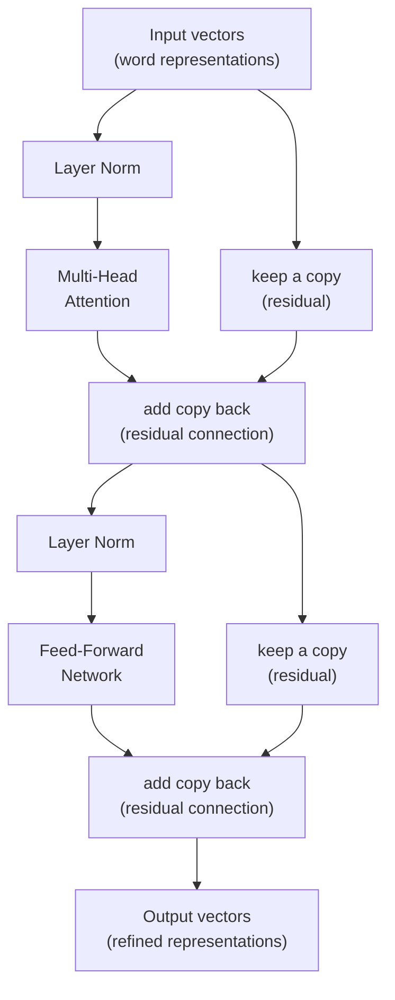
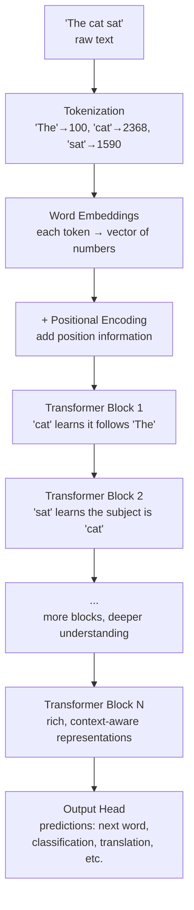

# The Transformer Block

## The Mystery Worth Solving

You already know the three big ideas behind transformers: attention lets words look at each other, multi-head attention runs multiple attention "lenses" in parallel, and positional encoding tells each word where it sits in the sentence.

But if you put just those three pieces together, something goes wrong. Stack more than a few layers and the model **refuses to learn**. Numbers explode or vanish. Training falls apart.

The transformer block is the engineering that holds it all together. It wraps those three ideas in a protective structure — residual connections, layer normalization, and a feed-forward network — that lets you stack 32, 64, or even 96 layers without collapse.

Every model you've heard of — GPT-4, Claude, LLaMA, Gemini — is just this one block, repeated over and over.

---

**Before you start, you need to know:**
- How attention works (Q, K, V, self-attention) — covered in [Attention Mechanisms](./attention-mechanisms.md)
- How multi-head attention runs multiple lenses in parallel — covered in [Multi-Head Attention](./multi-head-attention.md)
- How positional encoding adds word order — covered in [Positional Encoding](./positional-encoding.md)

---

## The Group Art Project Analogy

Imagine your class is working on a group drawing. Each student has their own part of the picture to draw. The project goes through several rounds, and each round has four steps:

```
Round 1 (and every round after):

Step 1: GROUP DISCUSSION
  Everyone shows their current drawing to everyone else.
  Each student decides which other drawings are helpful
  and takes notes on what to borrow.
  → This is ATTENTION

Step 2: PRIVATE THINKING TIME
  Each student goes back to their own desk.
  They look at their notes and improve their drawing
  on their own — no talking allowed.
  → This is the FEED-FORWARD NETWORK (FFN)

Step 3: KEEP A BACKUP
  Before making changes, each student keeps a photocopy
  of their previous version. If this round's changes
  don't help, they still have the old version.
  → This is a RESIDUAL CONNECTION

Step 4: LEVEL THE PLAYING FIELD
  After changes, some students' drawings might be
  huge and bold, others tiny and faint.
  A helper adjusts everyone's drawings to the same
  scale so nobody drowns out the others.
  → This is LAYER NORMALIZATION
```

After many rounds, every student's drawing is rich with information borrowed from the whole group — but still contains their own original contribution (thanks to the backup copies).

**What this analogy gets right:** Each round refines every student's work using two distinct phases — a social phase (attention: gathering information from others) and a private phase (FFN: processing that information independently). The backup copies (residual connections) make sure useful information is never lost. The scaling step (layer norm) prevents any one student's contribution from dominating.

**Where this analogy breaks down:** In a real group project, students have memory across rounds — they remember what happened in round 1 when they're in round 5. In a transformer, each block processes the current vectors without any memory of previous blocks. The "memory" is carried entirely in the vectors themselves as they get refined.

---

## The Four Building Blocks

### 1. Feed-Forward Network (FFN): Private Thinking Time

After words have talked to each other through attention, each word gets its own "thinking time" through a small neural network. This is applied to each word **independently** — no interaction between words.

The FFN takes each word's vector, expands it to a larger space (typically 4 times bigger), applies a non-linear transformation, then compresses it back.

Why is this needed? Attention lets words **gather** information from each other. The FFN lets each word **process** that gathered information on its own. Think of it like:
- Attention = **hearing what everyone said** in the group discussion
- FFN = **going home and thinking about it privately**

The expansion gives the model more "space to think" — like spreading out your notes on a big table before organizing them.

### 2. Residual Connections: The Backup Copy

A residual connection adds the input of a step directly to its output. In the simplest terms: `output = input + what_the_layer_did(input)`.

Why does this matter? Imagine you're following a recipe, but each step slightly changes it. After 50 steps, you've lost the original recipe entirely. A residual connection is like keeping a copy of the recipe at each step. Even if one step doesn't help, the original information survives.

In technical terms, residual connections solve a critical problem: without them, deep networks (30+ layers) simply cannot train. The error signal that flows backward during training gets multiplied by a small number at each layer, and after enough layers it shrinks to nearly zero. Residual connections give the error signal a direct highway to travel backward, bypassing the layers entirely. This is what makes very deep transformers possible.

### 3. Layer Normalization: Leveling the Playing Field

After each step, the numbers in the vectors can drift — some become very large, others very small. Layer normalization adjusts each vector so the numbers have a consistent scale (roughly: average of 0, spread of 1).

Without normalization, training becomes unstable — like trying to balance a stack of blocks that keeps growing taller. The taller it gets, the more likely it is to fall.

### 4. Where to Put Layer Norm: Pre-LN vs Post-LN

The original Transformer paper put layer normalization **after** attention and FFN (Post-LN). Most modern models put it **before** (Pre-LN).

The difference matters for training stability:

- **Post-LN** (original): needs a careful "warmup" period at the start of training where the learning rate slowly increases from zero. Without warmup, training with Post-LN crashes, especially in deep networks.
- **Pre-LN** (GPT-2 and later): the model trains stably from the start, even with many layers. No warmup needed. This is why modern large models (GPT, LLaMA, Mistral) all use Pre-LN.

---

## The Complete Transformer Block

All four building blocks combine into one **transformer block**. This block is the repeating unit — a typical transformer stacks 6 to 96 of them.

Here is what one block looks like (Pre-LN version, used by most modern models):



Each time word vectors pass through a block, they get **refined** — carrying more context and understanding. Early layers tend to capture simple patterns (grammar, nearby words). Later layers capture complex patterns (meaning, relationships, reasoning).

---

## Three Types of Transformers

The original Transformer had both an **encoder** and a **decoder**. Modern models typically use one or the other, depending on the task.

### Encoder-Only: Understanding Text

The **encoder** processes the full input at once. Every word can attend to every other word — forward and backward. This gives it a complete picture of the input.

**Used by:** BERT, RoBERTa, ELECTRA

**Good for:** Understanding and classifying text, finding named entities, answering questions about a passage.

### Decoder-Only: Generating Text

The **decoder** generates text one word at a time. Each word can only attend to words that came **before** it — because future words haven't been generated yet. This is enforced by a **causal mask** that blocks access to future positions.

**Used by:** GPT-2, GPT-3, GPT-4, LLaMA, Claude, Mistral

**Good for:** Generating text, chatbots, code completion, creative writing.

### Encoder-Decoder: Transforming Text

The **encoder-decoder** model processes an input with the encoder, then generates a different output with the decoder. The decoder uses **cross-attention** to look at the encoder's output while generating.

**Used by:** Original Transformer, T5, BART

**Good for:** Translation, summarization, any task that transforms one sequence into another.

### Comparison

| | Encoder-Only | Decoder-Only | Encoder-Decoder |
|---|---|---|---|
| Attention direction | Bidirectional (sees all words) | Causal (left to right only) | Both |
| Best for | Understanding text | Generating text | Transforming text |
| Example models | BERT | GPT, LLaMA, Claude | T5, BART |
| Example tasks | Classification, NER, Q&A | Chat, code completion | Translation, summarization |

---

## How Information Flows Through a Transformer

Let's trace a word through the full pipeline:



Each block refines the representations. Block 1 might capture grammar. Block 5 might capture who did what. Block 20 might capture the overall meaning of the paragraph. By the final block, each word's vector carries a rich summary of its role in the entire input.

---

## Quick Check — can you answer these?

- What are the four building blocks inside a transformer block?
- Why are residual connections important for deep networks?
- What is the difference between encoder-only and decoder-only transformers?

If you can't answer one, go back and re-read that part. That is completely normal.

---

## Victory Lap

You now understand every component of the architecture that powers GPT-4, Claude, Gemini, LLaMA, and every production language model in use today. If you were handed the source code for LLaMA 3, you'd recognize every piece: the attention mechanism, the multi-head setup, the positional encoding, the FFN, the residual connections, and the layer normalization. You've gone from "I've heard of transformers" to "I know how they're built."

---

Ready to go deeper? → [Transformer Block — Interview Deep-Dive](./transformer-block-interview.md)

---

[Previous: Positional Encoding](./positional-encoding.md) | [Back to Architecture Overview](./README.md)
