# Build Your Transformer in 28 Days

> Each day takes 5-15 minutes. You build one piece. By Day 24, your transformer generates text.

```mermaid
graph LR
    subgraph "Phase 1: Attention (Days 1-7)"
        D1["Day 1\nEmbedding"] --> D2["Day 2\nQ/K/V"]
        D2 --> D3["Day 3\nDot Product"]
        D3 --> D4["Day 4\nScaling"]
        D4 --> D5["Day 5\nSoftmax"]
        D5 --> D6["Day 6\nOutput"]
        D6 --> D7["Day 7\n⭐ Milestone"]
    end
    subgraph "Phase 2: Multi-Head (Days 8-12)"
        D7 --> D8["Day 8\nMotivation"]
        D8 --> D9["Day 9\nSplit"]
        D9 --> D10["Day 10\nParallel"]
        D10 --> D11["Day 11\nMerge"]
        D11 --> D12["Day 12\n⭐ Milestone"]
    end
    subgraph "Phase 3: Position (Days 13-17)"
        D12 --> D13["Day 13\nThe Problem"]
        D13 --> D14["Day 14\nWave Patterns"]
        D14 --> D15["Day 15\nAdd Position"]
        D15 --> D16["Day 16\nAlternatives"]
        D16 --> D17["Day 17\n⭐ Milestone"]
    end
    subgraph "Phase 4: Full Model (Days 18-24)"
        D17 --> D18["Day 18\nResidual"]
        D18 --> D19["Day 19\nNorm"]
        D19 --> D20["Day 20\nFFN"]
        D20 --> D21["Day 21\nBlock"]
        D21 --> D22["Day 22\nMask"]
        D22 --> D23["Day 23\nGenerate"]
        D23 --> D24["Day 24\n⭐ Milestone"]
    end
    subgraph "Phase 5: Interview (Days 25-28)"
        D24 --> D25["Day 25\nExplain"]
        D25 --> D26["Day 26\nComplexity"]
        D26 --> D27["Day 27\nArch Choice"]
        D27 --> D28["Day 28\nBreak It"]
    end
```



## How It Works

1. Read the day's markdown file (5-10 min read)
2. Add the code to your `my_transformer/` package
3. Run the test to verify it works
4. Run `python days/check.py <day>` to log your progress and earn XP

## Day List

### Phase 1: Attention (Days 1-7)

| Day | Title | What You Build |
|-----|-------|----------------|
| 1 | [Words to Numbers](./day-01-words-to-numbers.md) | Embedding lookup |
| 2 | [Asking Questions](./day-02-asking-questions.md) | Q/K/V projection |
| 3 | [Who Matches Who](./day-03-who-matches-who.md) | Dot product scores |
| 4 | [Keeping Scores Fair](./day-04-keeping-scores-fair.md) | Score scaling |
| 5 | [Picking Winners](./day-05-picking-winners.md) | Softmax weights |
| 6 | [Mixing the Answer](./day-06-mixing-the-answer.md) | Weighted output |
| **7** | **[Your First Attention](./day-07-milestone-your-first-attention.md)** | **self_attention() function** |

### Phase 2: Multi-Head (Days 8-12)

| Day | Title | What You Build |
|-----|-------|----------------|
| 8 | [Why One Isn't Enough](./day-08-why-one-isnt-enough.md) | (motivation) |
| 9 | [Splitting Into Teams](./day-09-splitting-into-teams.md) | split_heads() |
| 10 | [Parallel Attention](./day-10-parallel-attention.md) | (conceptual) |
| 11 | [The Team Report](./day-11-the-team-report.md) | merge_heads() |
| **12** | **[Multi-Head Attention](./day-12-milestone-multi-head.md)** | **MultiHeadAttention class** |

### Phase 3: Position (Days 13-17)

| Day | Title | What You Build |
|-----|-------|----------------|
| 13 | [The Shuffle Problem](./day-13-the-shuffle-problem.md) | (motivation) |
| 14 | [Wave Patterns](./day-14-wave-patterns.md) | sinusoidal_encoding() |
| 15 | [Adding Position](./day-15-adding-position.md) | add_position() |
| 16 | [Modern Alternatives](./day-16-modern-alternatives.md) | (awareness) |
| **17** | **[Position-Aware Model](./day-17-milestone-position-aware.md)** | **Integration proof** |

### Phase 4: Full Model (Days 18-24)

| Day | Title | What You Build |
|-----|-------|----------------|
| 18 | [Skip Connections](./day-18-skip-connections.md) | residual() |
| 19 | [Keeping Numbers Calm](./day-19-keeping-numbers-calm.md) | layer_norm() |
| 20 | [The Thinking Layer](./day-20-the-thinking-layer.md) | feed_forward() |
| 21 | [Building the Block](./day-21-building-the-block.md) | transformer_block() |
| 22 | [No Peeking](./day-22-no-peeking.md) | causal_mask() |
| 23 | [Learning to Write](./day-23-learning-to-write.md) | generate() |
| **24** | **[Your Transformer Writes!](./day-24-milestone-your-transformer-writes.md)** | **Complete model** |

### Phase 5: Interview Ready (Days 25-28)

| Day | Title | What You Practice |
|-----|-------|------------------|
| 25 | [Explain Attention](./day-25-explain-attention.md) | 60-second explanation |
| 26 | [The Cost of Attention](./day-26-the-cost-of-attention.md) | O(n^2) analysis |
| 27 | [Encoder vs Decoder](./day-27-encoder-vs-decoder.md) | Architecture choice |
| 28 | [Break It to Prove It](./day-28-break-it-to-prove-it.md) | Failure mode analysis |

## Progress Tracking

```bash
python days/check.py status    # see your build diagram and XP
python days/check.py <day>     # mark a day complete
```

## Reference Material

The day files teach one concept each. For the full treatment with math, proofs, and interview Q&A, see:

- [Attention Mechanisms (full)](../architecture/attention-mechanisms.md) + [Interview Guide](../architecture/attention-mechanisms-interview.md)
- [Multi-Head Attention (full)](../architecture/multi-head-attention.md) + [Interview Guide](../architecture/multi-head-attention-interview.md)
- [Positional Encoding (full)](../architecture/positional-encoding.md) + [Interview Guide](../architecture/positional-encoding-interview.md)
- [Transformer Block (full)](../architecture/transformer-block.md) + [Interview Guide](../architecture/transformer-block-interview.md)
