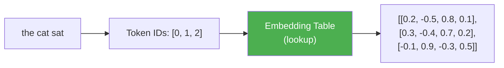
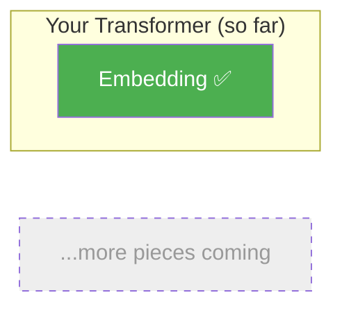

# Day 1: Words to Numbers

> Computers don't understand words. They understand numbers. Today you'll build the bridge between the two.

## What You Need to Know First

**No prior knowledge needed. Start here.**

This is Day 1. Everything begins with this one idea.

---

## The Idea

Think about a big dictionary — not the word-definition kind, but a numbered list. Every word gets a unique ID number:

| Word | ID |
|------|-----|
| the | 0 |
| cat | 1 |
| sat | 2 |
| on | 3 |
| mat | 4 |

But a single ID number isn't enough. The number "1" doesn't tell the computer anything *about* cats. It's just an address.

What we really want is a **list of numbers** that captures *meaning*. Maybe something like:

```
"cat" → [0.2, -0.5, 0.8, 0.1]
"dog" → [0.3, -0.4, 0.7, 0.2]   ← similar to cat!
"mat" → [-0.1, 0.9, -0.3, 0.5]  ← very different from cat
```

Notice: "cat" and "dog" have similar numbers because they're similar words. "mat" is different.

This list of numbers is called an **embedding**. It's like giving every word a GPS coordinate in meaning-space, where similar meanings are close together.



The embedding table is just a big grid of numbers. Each word's ID tells you which row to grab. That's it. It's a lookup.

---

## What This Means for Our Code

We need a function that:
1. Takes a list of word IDs (like `[0, 1, 2]`)
2. Takes an embedding table (a grid of numbers)
3. Returns the rows from the table that match those IDs

It's like looking up phone numbers in a phonebook — you have the names, you want the numbers.

---

## Your Code

Create the file `my_transformer/embedding.py` and add this:

```python
import numpy as np

def embed(token_ids, embedding_table):
    """
    Look up each token's embedding from the table.

    token_ids:       list of integers, e.g. [0, 1, 2]
    embedding_table: numpy array of shape (vocab_size, d_model)

    Returns: numpy array of shape (len(token_ids), d_model)
    """
    return embedding_table[token_ids]
```

Yes, it really is that simple. One line. You're grabbing rows from a table using indices. That's an embedding lookup.

---

## Test It

Run this from the `01-transformers/` directory:

```bash
python -m my_transformer.tests embedding
```

You should see:

```
  PASS: embedding — Shape (3, 4) correct, values match
```

---

## What You Just Built



You built the very first piece of a transformer. Every word that enters the model goes through this step first — it gets converted from a word into a list of numbers that captures its meaning.

ChatGPT, Claude, Gemini — they all start exactly here. The same idea. You just built it.

---

## Check In

```bash
python days/check.py 1
```

## Go Deeper (Optional)

Want to understand how embedding tables are *learned* (not just looked up)? See the [full attention mechanisms guide](../architecture/attention-mechanisms.md).

---

**Tomorrow: Day 2 — Asking Questions.** Every word needs to ask "who else in this sentence is important to me?" You'll build the mechanism that lets words ask that question.
