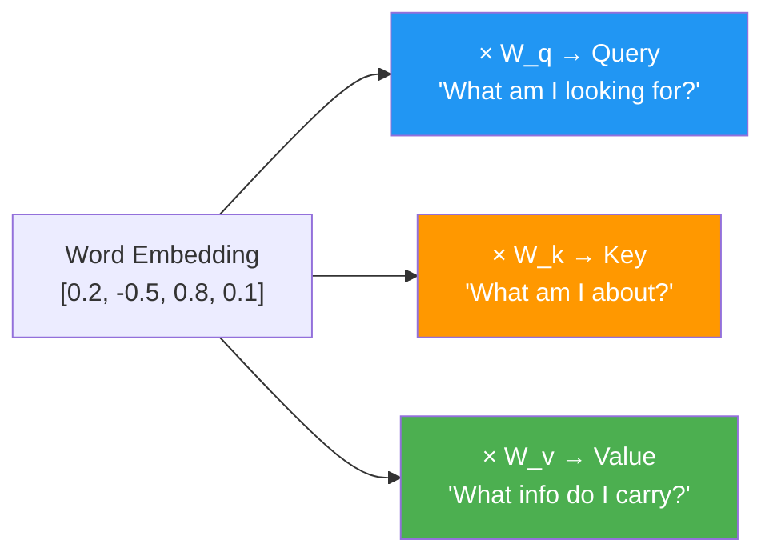
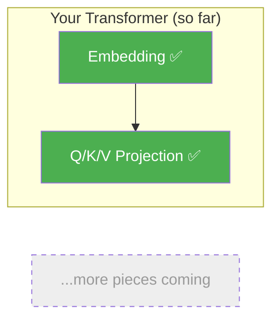

# Day 2: Asking Questions

> Yesterday you turned words into lists of numbers. Today you'll teach each word to ask: "Who else in this sentence matters to me?"

## What You Need to Know First

- You've completed [Day 1: Words to Numbers](./day-01-words-to-numbers.md)

---

## The Idea

Imagine three friends at school working on a group project:

- **The Curious Friend (Query)** — asks questions: "What should I pay attention to?"
- **The Signpost Friend (Key)** — holds up signs about what they know: "I know about animals!"
- **The Knowledge Friend (Value)** — actually has the information to share

Every word in a sentence plays all three roles at the same time. Each word:
1. **Asks** a question about what it needs (Query)
2. **Advertises** what it's about (Key)
3. **Carries** its actual information (Value)

How do we create these three roles from a single embedding? We multiply the embedding by three different weight matrices:



Think of it like this: the same person (word embedding) fills out three different forms. The "Query form" asks what they need. The "Key form" advertises what they offer. The "Value form" has the actual goods.

**Where the analogy breaks down:** In real life, asking and answering are separate acts. In a transformer, Q, K, V are all computed at the same time from the same input.

---

## What This Means for Our Code

We need a function that takes an embedding and three weight matrices (W_q, W_k, W_v), and returns three new matrices (Q, K, V). Each one is just a matrix multiplication.

---

## Your Code

Add this to `my_transformer/attention.py` (create the file if it doesn't exist):

```python
import numpy as np

def make_qkv(x, W_q, W_k, W_v):
    """
    Create Query, Key, and Value matrices from input embeddings.

    x:   numpy array of shape (seq_len, d_model) — word embeddings
    W_q: numpy array of shape (d_model, d_model) — query weights
    W_k: numpy array of shape (d_model, d_model) — key weights
    W_v: numpy array of shape (d_model, d_model) — value weights

    Returns: (Q, K, V) — each of shape (seq_len, d_model)
    """
    Q = x @ W_q
    K = x @ W_k
    V = x @ W_v
    return Q, K, V
```

Three matrix multiplications. That's all Q, K, V projection is. Same input, three different transformations.

---

## Test It

```bash
python -m my_transformer.tests qkv
```

You should see:

```
  PASS: qkv — Q, K, V all have shape (3, 4)
```

---

## What You Just Built



Now every word in your sentence has three representations: what it's looking for (Q), what it offers (K), and what it carries (V). The next step is to use Q and K to figure out which words should pay attention to which.

---

## Check In

```bash
python days/check.py 2
```

## Go Deeper (Optional)

Want the full math behind projections? See the [attention mechanisms guide](../architecture/attention-mechanisms.md#the-core-idea-questions-keys-and-values-q-k-v).

---

**Tomorrow: Day 3 — Who Matches Who.** You'll compare every Query against every Key to build a "relevance score" between all pairs of words. This is where attention gets its name.
