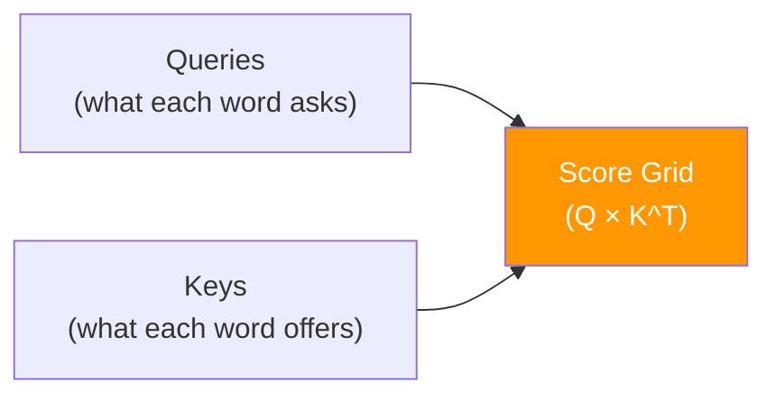
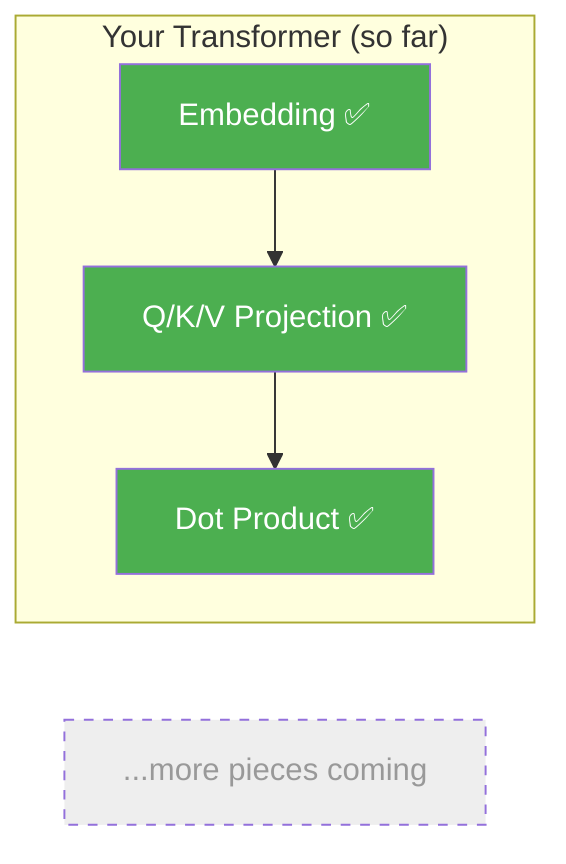

# Day 3: Who Matches Who

> You have Queries and Keys. Today you'll compare them to find out which words are relevant to each other.

## What You Need to Know First

- You've completed [Day 2: Asking Questions](./day-02-asking-questions.md)

---

## The Idea

You're at a party. You're interested in space travel (that's your Query). You look around and see people wearing name tags that say what they like to talk about (those are their Keys):

- "Rockets" — great match!
- "Cooking" — not very relevant
- "Mars colonies" — amazing match!
- "Knitting" — nope

How do you measure "how good is the match"? You compare your interests with each person's tag. In math, there's a simple way to measure how similar two lists of numbers are: the **dot product**.

```
Your Query:  [0.9, 0.1, 0.8]   (you love space)
Key "Rockets": [0.8, 0.2, 0.9]   → dot product = 0.9×0.8 + 0.1×0.2 + 0.8×0.9 = 1.46  HIGH
Key "Cooking": [0.1, 0.9, 0.0]   → dot product = 0.9×0.1 + 0.1×0.9 + 0.8×0.0 = 0.18  LOW
```

The dot product gives a high number when two lists point in the same direction (= similar meaning) and a low number when they don't.

When you do this for every word against every other word, you get a grid of scores:



```
         Key₁  Key₂  Key₃
Query₁ [ 1.46  0.18  1.52 ]   ← Word 1's relevance to each word
Query₂ [ 0.32  0.95  0.41 ]   ← Word 2's relevance to each word
Query₃ [ 1.38  0.22  1.61 ]   ← Word 3's relevance to each word
```

---

## What This Means for Our Code

We need a function that takes Q and K and returns a matrix of scores. The formula is just: `Q @ K^T` (Q multiplied by K transposed).

---

## Your Code

Add this to `my_transformer/attention.py`:

```python
def attention_scores(Q, K):
    """
    Compute raw attention scores: how relevant is each key to each query.

    Q: numpy array of shape (seq_len, d_model)
    K: numpy array of shape (seq_len, d_model)

    Returns: numpy array of shape (seq_len, seq_len)
    """
    return Q @ K.T
```

One line. `K.T` means "K transposed" — it flips rows and columns so the multiplication works out to give us a score between every pair of words.

---

## Test It

```bash
python -m my_transformer.tests dot_product
```

You should see:

```
  PASS: dot_product — Shape (3, 3), values match Q @ K^T
```

---

## What You Just Built



You can now measure how relevant any word is to any other word. The score grid tells you: "Word 1 cares a lot about Word 3, but doesn't care about Word 2."

---

## Check In

```bash
python days/check.py 3
```

## Go Deeper (Optional)

Want to understand why the dot product measures similarity? See the [attention mechanisms guide](../architecture/attention-mechanisms.md).

---

**Tomorrow: Day 4 — Keeping Scores Fair.** There's a sneaky problem with these raw scores — they get too big when embeddings are long. You'll add one small fix that makes everything work.
