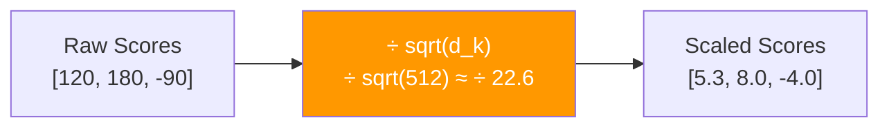
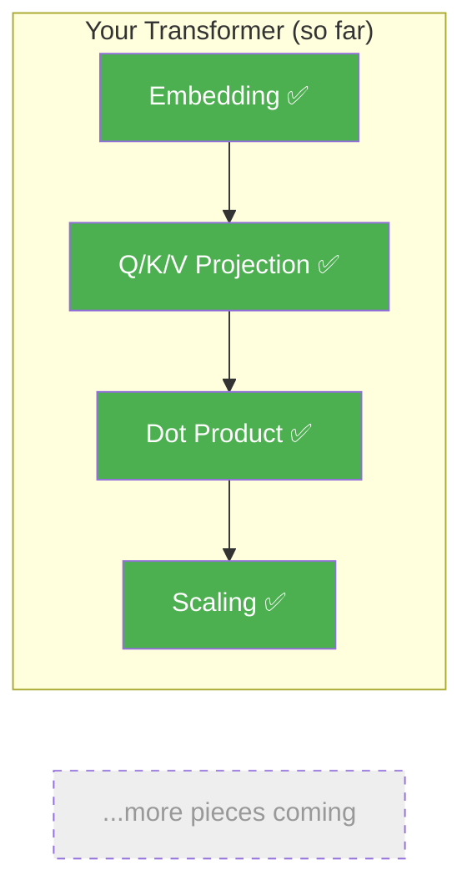

# Day 4: Keeping Scores Fair

> Your attention scores have a hidden problem. Today you'll fix it with one division.

## What You Need to Know First

- You've completed [Day 3: Who Matches Who](./day-03-who-matches-who.md)

---

## The Idea

Imagine you're grading tests. Two classes take the same exam:
- Class A has 4 questions, so scores range from 0 to 4
- Class B has 100 questions, so scores range from 0 to 100

A student who scores "3" in Class A did great (75%). A student who scores "3" in Class B did terribly (3%). The raw numbers are misleading because the *scale* is different.

The same thing happens with our attention scores. When the embedding dimension (d_model) is bigger, the dot product numbers get bigger — not because the match is better, but just because there are more numbers to multiply and add up.

```
Small embeddings (d=4):   scores might be [-1, 2, 3, -2]     ← manageable
Large embeddings (d=512): scores might be [-50, 120, 180, -90] ← way too big!
```

When scores are too big, the next step (softmax) will put nearly ALL the weight on the highest score and ignore everything else. That's bad — we want a blend, not a winner-take-all.

**The fix:** divide every score by the square root of the embedding dimension.



That's it. Divide by one number. This keeps scores in a reasonable range no matter how big the embeddings are.

---

## Your Code

Add this to `my_transformer/attention.py`:

```python
def scale_scores(scores, d_k):
    """
    Scale attention scores by sqrt(d_k) to prevent them from getting too large.

    scores: numpy array of shape (seq_len, seq_len)
    d_k:    integer, dimension of the key vectors

    Returns: numpy array of same shape, scaled down
    """
    return scores / np.sqrt(d_k)
```

---

## Test It

```bash
python -m my_transformer.tests scaling
```

You should see:

```
  PASS: scaling — 8.0 / sqrt(64) = 1.0000
```

---

## What You Just Built



This small fix is actually a big deal. Without it, attention breaks down on real-world models where d_model is 512 or larger. This is why it's called "**Scaled** Dot-Product Attention" — the scaling is right there in the name.

---

## Check In

```bash
python days/check.py 4
```

## Go Deeper (Optional)

Want the mathematical proof for why sqrt(d_k) is the right scaling factor? See the [attention interview guide](../architecture/attention-mechanisms-interview.md).

---

**Tomorrow: Day 5 — Picking Winners.** You have scaled scores, but they're still just raw numbers. You need to turn them into percentages that add up to 100%. Enter softmax.
