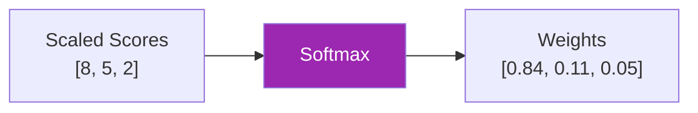
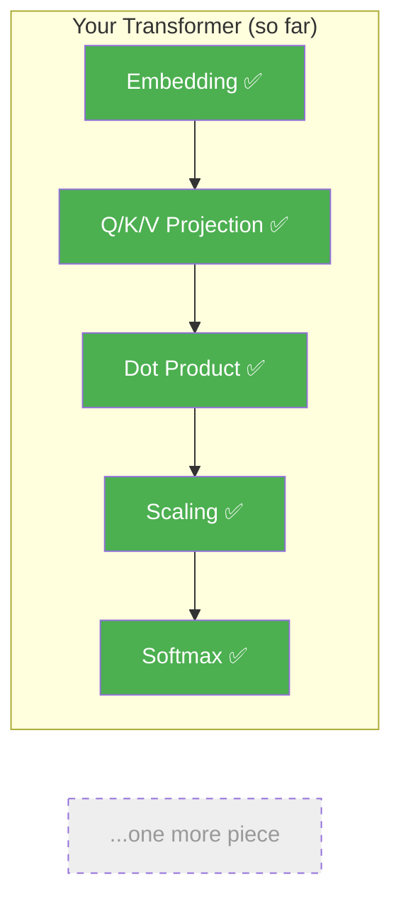

# Day 5: Picking Winners

> Scores are just numbers. Today you'll turn them into percentages that tell each word exactly how much to care about every other word.

## What You Need to Know First

- You've completed [Day 4: Keeping Scores Fair](./day-04-keeping-scores-fair.md)

---

## The Idea

You scored three restaurants:
- Pizza Place: 8 points
- Burger Joint: 5 points
- Sushi Bar: 2 points

You want to divide your evening between them based on their scores. But "8 points" doesn't directly tell you what fraction of your time to spend there.

**Softmax** converts raw scores into percentages that always add up to 1.0 (100%):

```
Scores:  [8, 5, 2]
                ↓ softmax
Weights: [0.84, 0.11, 0.05]   ← adds up to 1.00
```

The higher the score, the bigger the percentage. But even the lowest score (Sushi Bar) gets *some* weight — it's not completely ignored.



How softmax works under the hood:
1. Raise *e* (2.718...) to the power of each score: `[e^8, e^5, e^2]`
2. Add them all up to get the total
3. Divide each by the total

That's it. The exponents make big scores *much* bigger, so the highest score gets the lion's share.

---

## Your Code

Add this to `my_transformer/attention.py`:

```python
def attention_weights(scores):
    """
    Apply softmax to each row of the score matrix.
    Converts raw scores into attention weights (probabilities).

    scores: numpy array of shape (seq_len, seq_len)

    Returns: numpy array of same shape, each row sums to 1.0
    """
    # Subtract max for numerical stability (prevents overflow)
    shifted = scores - scores.max(axis=-1, keepdims=True)
    exp_scores = np.exp(shifted)
    return exp_scores / exp_scores.sum(axis=-1, keepdims=True)
```

The `scores - max` trick prevents the `exp()` from producing numbers too large for the computer to handle. It doesn't change the result — the ratios stay the same.

---

## Test It

```bash
python -m my_transformer.tests softmax
```

You should see:

```
  PASS: softmax — All rows sum to 1.0, all values positive
```

---

## What You Just Built



Now each word has a set of percentages that says exactly how much attention it pays to every other word. "I pay 84% attention to word 3, 11% to word 1, and 5% to word 2."

Almost there. One piece left before the first milestone.

---

## Check In

```bash
python days/check.py 5
```

## Go Deeper (Optional)

Curious about why softmax specifically (and not just dividing by the sum)? See the [attention interview guide](../architecture/attention-mechanisms-interview.md).

---

**Tomorrow: Day 6 — Mixing the Answer.** You have the weights. Now you'll use them to blend the Values into a final output. Then on Day 7 you wire everything together.
