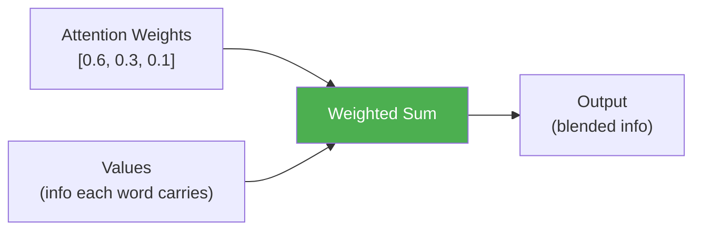
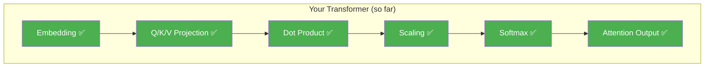

# Day 6: Mixing the Answer

> You have attention weights — percentages saying how much each word cares about each other word. Today you'll use those weights to blend the Values into a final answer.

## What You Need to Know First

- You've completed [Day 5: Picking Winners](./day-05-picking-winners.md)

---

## The Idea

You're making a smoothie. You have three ingredients (Values) and a recipe that says how much of each to use (attention weights):

```
Ingredients (Values):
  Banana:     [sweet, soft, yellow]
  Strawberry: [sweet, red, fruity]
  Spinach:    [bitter, green, healthy]

Recipe (Weights): 60% banana, 30% strawberry, 10% spinach

Result: 0.6 × banana + 0.3 × strawberry + 0.1 × spinach
      = [mostly sweet, slightly red, a bit healthy]
```

That's exactly what the attention output is. For each word, you take a weighted blend of all the Values, where the weights come from softmax.



Words that got high attention weights contribute more to the blend. Words with low weights barely show up. But everyone contributes something.

---

## Your Code

Add this to `my_transformer/attention.py`:

```python
def attention_output(weights, V):
    """
    Compute the weighted sum of Value vectors.

    weights: numpy array of shape (seq_len, seq_len) — attention weights from softmax
    V:       numpy array of shape (seq_len, d_model) — value vectors

    Returns: numpy array of shape (seq_len, d_model) — blended output
    """
    return weights @ V
```

One matrix multiplication. Each row of the output is a blend of all the Value vectors, mixed according to the attention weights.

---

## Test It

```bash
python -m my_transformer.tests attention_output
```

You should see:

```
  PASS: attention_output — Shape (3, 4), values match weights @ V
```

---

## What You Just Built



You have all six pieces of attention. Every piece works on its own. Tomorrow you'll wire them together into a single `self_attention()` function.

You're about to hit your first milestone.

---

## Check In

```bash
python days/check.py 6
```

## Go Deeper (Optional)

See the [full attention guide](../architecture/attention-mechanisms.md) for why this weighted sum is so powerful.

---

**Tomorrow: Day 7 — Milestone: Your First Attention!** You'll connect all six pieces into one pipeline. Input goes in, attention comes out. This is the core mechanism behind ChatGPT, Claude, and every modern language model.
