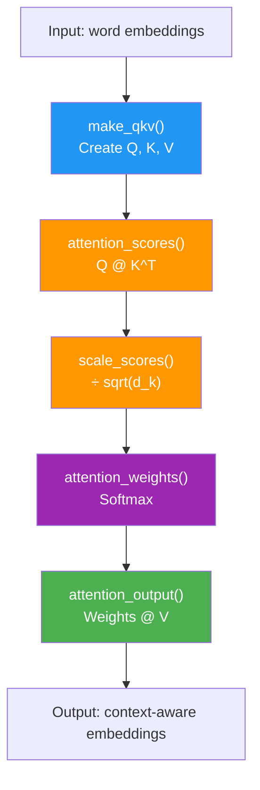
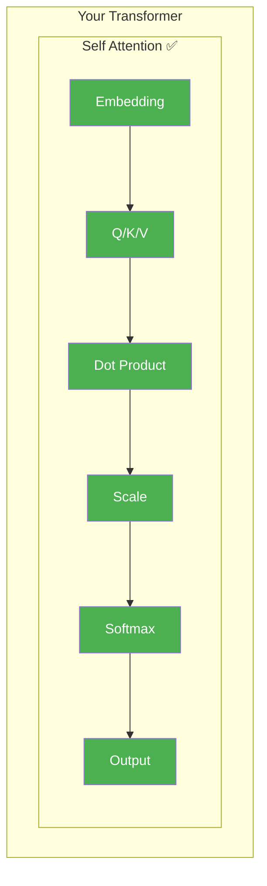

# Day 7: Milestone — Your First Attention

> You built six pieces over six days. Today you wire them together. When you're done, you'll have a working attention mechanism — the same core idea behind every modern AI language model.

## What You Need to Know First

- You've completed [Days 1-6](./day-06-mixing-the-answer.md)

---

## The Full Pipeline

Here's everything you've built, in order:



Each word goes in as "just itself." Each word comes out carrying information from every other word it found relevant. The word "it" comes out knowing it refers to "cat" because it paid 70% attention to "cat."

That transformation — from isolated word to context-aware word — is what attention does.

---

## Your Code

Add this to `my_transformer/attention.py`:

```python
def self_attention(x, W_q, W_k, W_v):
    """
    Full self-attention: input embeddings in, context-aware embeddings out.

    x:   numpy array of shape (seq_len, d_model)
    W_q: numpy array of shape (d_model, d_model)
    W_k: numpy array of shape (d_model, d_model)
    W_v: numpy array of shape (d_model, d_model)

    Returns: numpy array of shape (seq_len, d_model)
    """
    # Step 1: Create Q, K, V
    Q, K, V = make_qkv(x, W_q, W_k, W_v)

    # Step 2: Score every pair of words
    scores = attention_scores(Q, K)

    # Step 3: Scale to keep numbers manageable
    d_k = Q.shape[-1]
    scores = scale_scores(scores, d_k)

    # Step 4: Convert to percentages
    weights = attention_weights(scores)

    # Step 5: Blend the values
    return attention_output(weights, V)
```

Eight lines. Five function calls. That's the complete attention mechanism.

---

## Test It

```bash
python -m my_transformer.tests self_attention
```

You should see:

```
  PASS: self_attention — Full attention pipeline works! Shape (3, 4)
```

---

## What You Just Built



Take a moment. You just built the core mechanism that powers ChatGPT, Claude, Gemini, and every modern language model. The same idea. Not a simplified version — the actual mechanism.

Everything from here builds *on top of* what you just made.

---

## Check In

```bash
python days/check.py 7
```

This is a milestone day — you'll earn bonus XP!

## Go Deeper (Optional)

Ready for the math and interview questions? See the [attention interview guide](../architecture/attention-mechanisms-interview.md).

---

**Next: Day 8 — Why One Head Isn't Enough.** Your attention works great, but it can only focus on one kind of relationship at a time. What if a word needs to care about grammar *and* meaning *and* position? That's where multi-head attention comes in.
