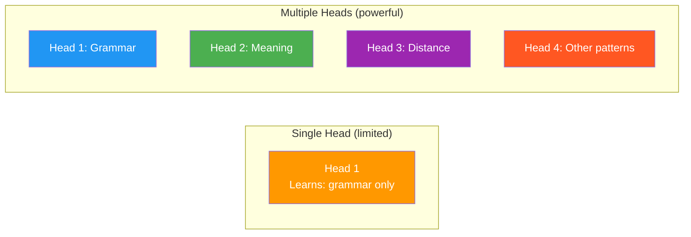
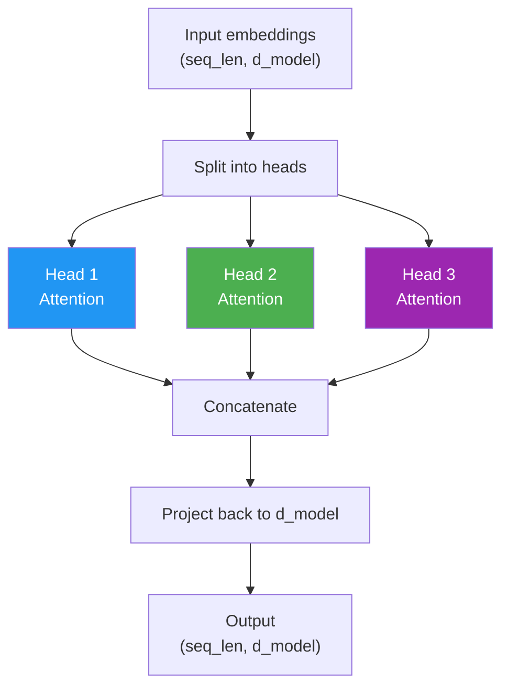

# Day 8: Why One Head Isn't Enough

> Your attention mechanism works — but it has a blind spot. Today you'll see why, and it'll set up the next four days.

## What You Need to Know First

- You've completed [Day 7: Your First Attention](./day-07-milestone-your-first-attention.md)

---

## The Idea

Read this sentence:

> "The **animal** didn't cross the **street** because **it** was too **wide**."

What does "it" refer to? The street — because streets are wide, not animals.

Now read this:

> "The **animal** didn't cross the **street** because **it** was too **tired**."

Now "it" refers to the animal — because animals get tired, not streets.

The word "it" needs to pay attention to different things depending on context:
- **Grammar:** "it" is a pronoun, look for nouns
- **Meaning:** "wide" relates to "street", "tired" relates to "animal"
- **Distance:** how far away is each candidate?

One attention head can only learn ONE pattern of "who to pay attention to." It might learn grammar, or meaning, but not both at the same time.



The solution: run multiple attention heads in parallel. Each head looks at the same words but learns to focus on different relationships.

---

## No Code Today

Today is about understanding *why* we need multi-head attention. The concept is simple:

1. **Split** the embeddings into smaller chunks (one per head)
2. **Run** attention independently on each chunk
3. **Combine** the results back together

You'll implement each of these steps over the next three days.

---

## What This Looks Like



---

## Check In

```bash
python days/check.py 8
```

---

**Tomorrow: Day 9 — Splitting Into Teams.** You'll write the function that splits embeddings into multiple heads. It's just reshaping an array — surprisingly simple.
