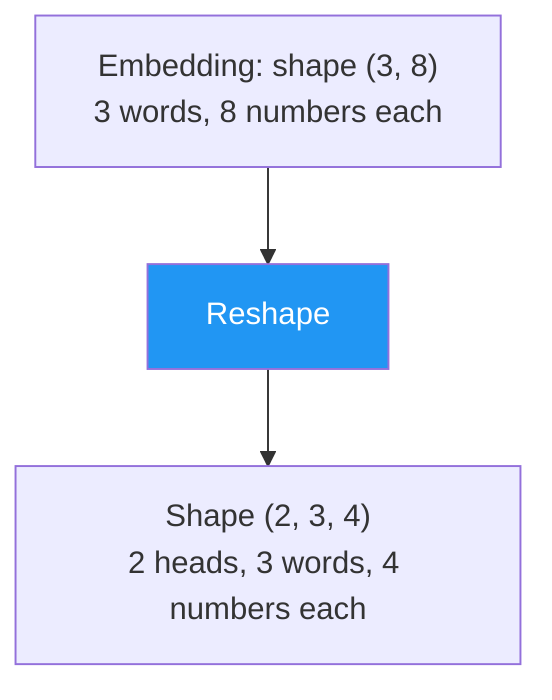
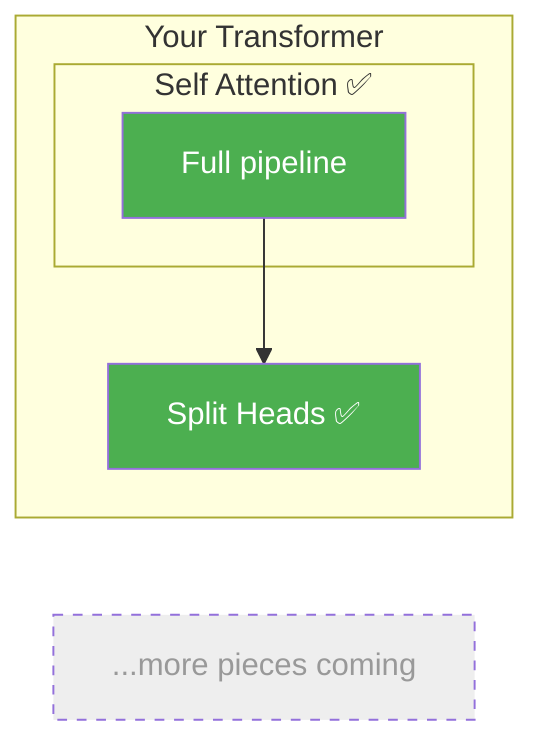

# Day 9: Splitting Into Teams

> Yesterday you saw why one head isn't enough. Today you'll split embeddings into multiple heads — it's just reshaping an array.

## What You Need to Know First

- You've completed [Day 8: Why One Isn't Enough](./day-08-why-one-isnt-enough.md)

---

## The Idea

Imagine a class of students working on a project. Instead of everyone reading the entire textbook, you split into teams:

- Team 1 reads chapters 1-4
- Team 2 reads chapters 5-8
- Team 3 reads chapters 9-12

Each team becomes an expert on their section. Then they share what they found.

Multi-head attention does the same thing. If your embedding has 8 numbers per word and you want 2 heads:

```
Original embedding: [a, b, c, d, e, f, g, h]   (8 numbers)

Split into 2 heads:
  Head 1: [a, b, c, d]   (4 numbers)
  Head 2: [e, f, g, h]   (4 numbers)
```

Each head runs attention independently on its 4 numbers. Head 1 might learn grammar patterns. Head 2 might learn meaning patterns.



The key insight: no numbers are created or destroyed. It's the same data, just organized differently — like dealing cards into two hands from one deck.

---

## Your Code

Create `my_transformer/multi_head.py`:

```python
import numpy as np

def split_heads(x, n_heads):
    """
    Split the last dimension of x into n_heads separate heads.

    x:       numpy array of shape (seq_len, d_model)
    n_heads: number of attention heads

    Returns: numpy array of shape (n_heads, seq_len, d_head)
             where d_head = d_model // n_heads
    """
    seq_len, d_model = x.shape
    d_head = d_model // n_heads
    # Reshape: (seq_len, d_model) → (seq_len, n_heads, d_head)
    x = x.reshape(seq_len, n_heads, d_head)
    # Transpose: (seq_len, n_heads, d_head) → (n_heads, seq_len, d_head)
    return x.transpose(1, 0, 2)
```

Two operations: reshape (split the numbers) and transpose (put heads first).

---

## Test It

```bash
python -m my_transformer.tests split_heads
```

You should see:

```
  PASS: split_heads — Shape (2, 3, 4) correct
```

---

## What You Just Built



---

## Check In

```bash
python days/check.py 9
```

---

**Tomorrow: Day 10 — Parallel Attention.** You'll run your `self_attention()` function on each head independently. You already have the code — you just need to loop over heads.
