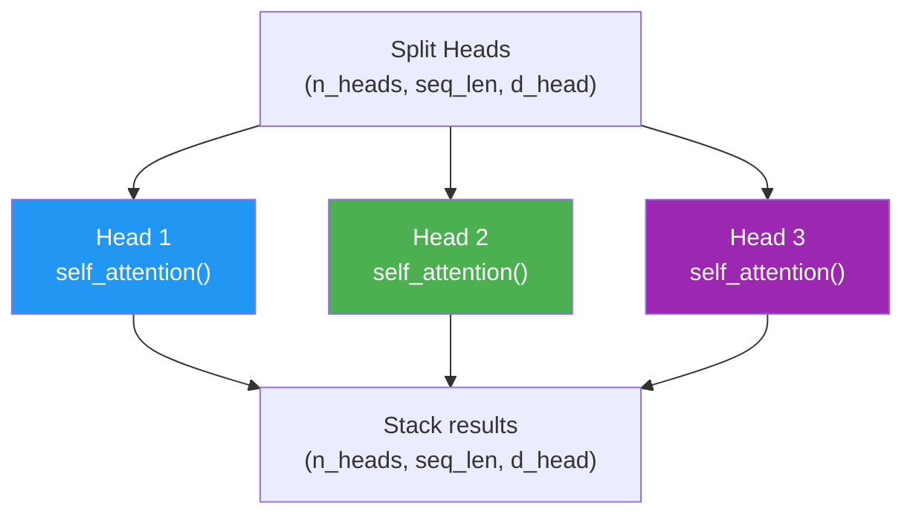

# Day 10: Parallel Attention

> You split embeddings into heads. Now you'll run attention on each head independently — using the function you already built on Day 7.

## What You Need to Know First

- You've completed [Day 9: Splitting Into Teams](./day-09-splitting-into-teams.md)

---

## The Idea

Remember the student teams from Day 9? Each team now does their own research independently. Team 1 reads their chapters and highlights what's important. Team 2 does the same with their chapters. They don't talk to each other yet.

That's parallel attention. Each head runs the exact same `self_attention()` you built on Day 7, but on a smaller slice of the data.



Each head has its own set of W_q, W_k, W_v weight matrices (smaller ones, since d_head < d_model). So each head learns to pay attention to different things.

---

## No New File Today

This step is conceptually important but doesn't need a standalone function. On Day 12 (milestone), you'll wire split + attention + merge into a single `MultiHeadAttention` class that does everything.

For now, understand the key point: **each head runs the same self_attention function you already built, just on a smaller piece of the embedding.** Nothing new to learn here — you're reusing what you already know.

```python
# What happens inside each head (conceptual — you'll write this on Day 12):
for i in range(n_heads):
    head_input = heads[i]                            # shape: (seq_len, d_head)
    head_output = self_attention(head_input, W_q[i], W_k[i], W_v[i])
    results.append(head_output)
```

---

## Check In

```bash
python days/check.py 10
```

---

**Tomorrow: Day 11 — The Team Report.** After each head does its own attention, you need to combine their findings back into a single embedding. That's the merge step.
