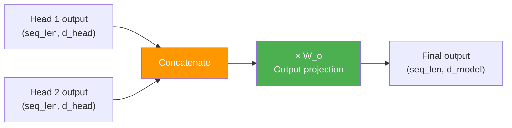
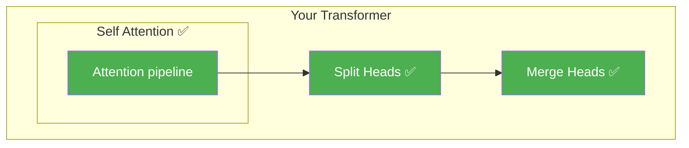

# Day 11: The Team Report

> Each head did its own attention. Now you'll merge their results back into a single embedding.

## What You Need to Know First

- You've completed [Day 10: Parallel Attention](./day-10-parallel-attention.md)

---

## The Idea

The student teams are done researching. Now they come back together and each team presents their findings. You combine all their reports into one comprehensive summary.

In code, this means:
1. **Concatenate** — stack all head outputs side by side
2. **Project** — multiply by a weight matrix to blend them



The concatenation just reverses the split from Day 9:

```
Head 1: [a, b, c, d]
Head 2: [e, f, g, h]

Concatenated: [a, b, c, d, e, f, g, h]   ← back to d_model size
```

The output projection (W_o) lets the model learn how to best combine the insights from different heads.

---

## Your Code

Add this to `my_transformer/multi_head.py`:

```python
def merge_heads(heads):
    """
    Reverse of split_heads: concatenate all heads back together.

    heads: numpy array of shape (n_heads, seq_len, d_head)

    Returns: numpy array of shape (seq_len, n_heads * d_head)
    """
    n_heads, seq_len, d_head = heads.shape
    # Transpose: (n_heads, seq_len, d_head) → (seq_len, n_heads, d_head)
    heads = heads.transpose(1, 0, 2)
    # Reshape: (seq_len, n_heads, d_head) → (seq_len, n_heads * d_head)
    return heads.reshape(seq_len, n_heads * d_head)
```

This is the exact reverse of `split_heads()` from Day 9. Transpose, then reshape.

---

## Test It

```bash
python -m my_transformer.tests merge_heads
```

You should see:

```
  PASS: merge_heads — Shape (3, 8) correct
```

---

## What You Just Built



You now have both halves — split and merge. Tomorrow you'll wire them together with the attention in between to create the complete `MultiHeadAttention`.

---

## Check In

```bash
python days/check.py 11
```

---

**Tomorrow: Day 12 — Milestone: Multi-Head Attention.** You'll combine split + attention + merge into a single class. This is the attention mechanism used in real transformers — not simplified, the real thing.
