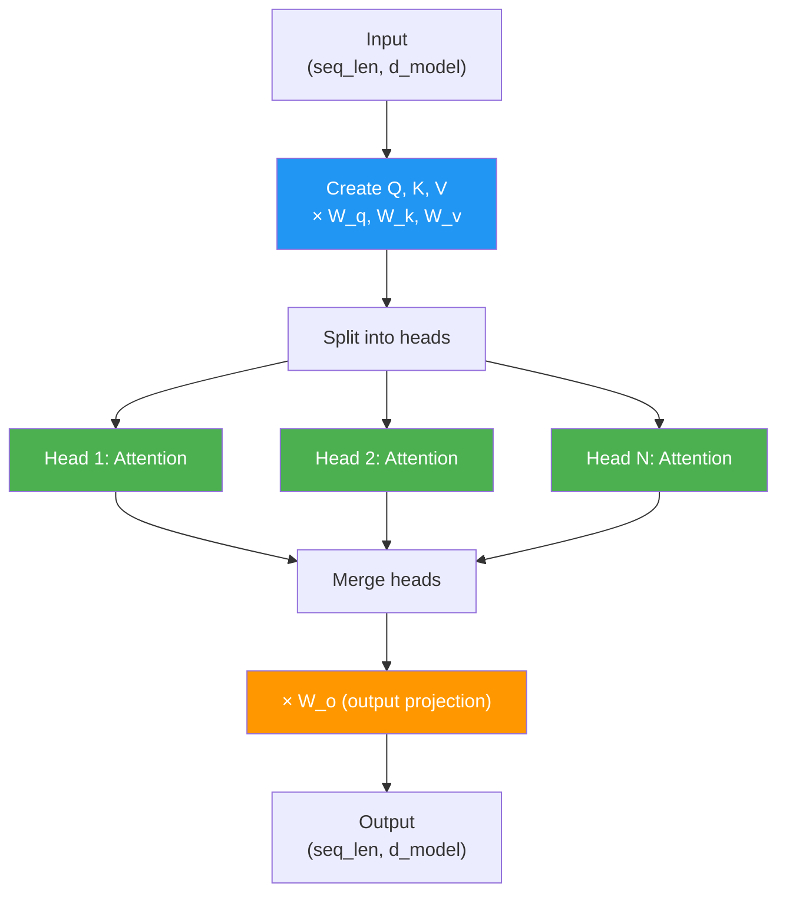
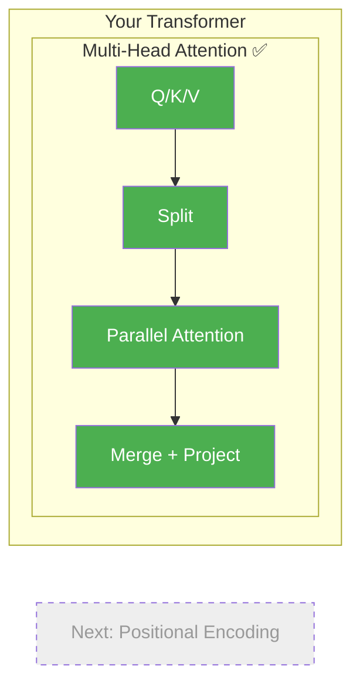

# Day 12: Milestone — Multi-Head Attention

> Split, attend, merge. Today you wire all three into a single class. This is the real multi-head attention — the same mechanism in GPT, Claude, and every production transformer.

## What You Need to Know First

- You've completed [Days 8-11](./day-11-the-team-report.md)

---

## The Full Pipeline



Input shape equals output shape. Multi-head attention is a drop-in replacement for single-head — same interface, more power.

---

## Your Code

Add this to `my_transformer/multi_head.py`:

```python
from my_transformer.attention import self_attention

class MultiHeadAttention:
    """Multi-head attention: split, attend in parallel, merge."""

    def __init__(self, d_model, n_heads):
        self.d_model = d_model
        self.n_heads = n_heads
        self.d_head = d_model // n_heads

        # Each head gets its own Q, K, V weights
        self.W_q = [np.random.randn(self.d_head, self.d_head) * 0.1 for _ in range(n_heads)]
        self.W_k = [np.random.randn(self.d_head, self.d_head) * 0.1 for _ in range(n_heads)]
        self.W_v = [np.random.randn(self.d_head, self.d_head) * 0.1 for _ in range(n_heads)]

        # Output projection
        self.W_o = np.random.randn(d_model, d_model) * 0.1

    def forward(self, x):
        """
        x: numpy array of shape (seq_len, d_model)
        Returns: numpy array of shape (seq_len, d_model)
        """
        # Split into heads
        heads = split_heads(x, self.n_heads)

        # Run attention on each head
        head_outputs = []
        for i in range(self.n_heads):
            out = self_attention(heads[i], self.W_q[i], self.W_k[i], self.W_v[i])
            head_outputs.append(out)

        # Merge heads back together
        head_outputs = np.array(head_outputs)
        merged = merge_heads(head_outputs)

        # Output projection
        return merged @ self.W_o
```

This class uses everything you've built: `split_heads` (Day 9), `self_attention` (Day 7), and `merge_heads` (Day 11).

---

## Try It

```python
import numpy as np
from my_transformer.multi_head import MultiHeadAttention

x = np.random.randn(5, 8)        # 5 words, embedding size 8
mha = MultiHeadAttention(d_model=8, n_heads=2)
output = mha.forward(x)
print(f"Input shape:  {x.shape}")      # (5, 8)
print(f"Output shape: {output.shape}")  # (5, 8)
```

Same shape in, same shape out. But now each word carries information from all other words, learned through multiple independent perspectives.

---

## What You Just Built



Two milestones down. You have a complete multi-head attention mechanism. The original "Attention Is All You Need" paper used 8 heads — your code supports any number.

---

## Check In

```bash
python days/check.py 12
```

Milestone day — bonus XP!

## Go Deeper (Optional)

See the [multi-head attention interview guide](../architecture/multi-head-attention-interview.md) for complexity analysis and interview questions.

---

**Next: Day 13 — The Shuffle Problem.** Your attention has a strange gap: it treats "dog bites man" and "man bites dog" as the same thing. Word order doesn't matter yet. That's a problem, and you'll see exactly why.
