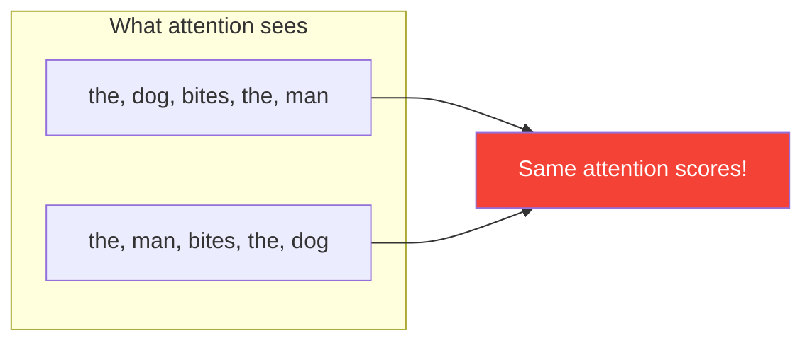

# Day 13: The Shuffle Problem

> Your attention mechanism has a blind spot: it doesn't know word order. Today you'll see the problem clearly. Tomorrow you'll fix it.

## What You Need to Know First

- You've completed [Day 12: Multi-Head Attention](./day-12-milestone-multi-head.md)

---

## The Idea

Read these two sentences:

> "The dog bites the man."
> "The man bites the dog."

Very different meaning, right? But your attention mechanism would treat them identically. Why?

Because attention only looks at *what* each word is (via embeddings) and *how relevant* words are to each other (via dot products). It never asks *where* each word is in the sentence.

Think of it like a bag of magnetic letters on a fridge. The letters "D-O-G" and "G-O-D" contain the exact same letters. If you only look at the letters (not their order), you can't tell them apart.



This is called **permutation invariance** — a fancy way of saying "shuffling the input doesn't change the output."

---

## Why This Matters

If your model can't tell "dog bites man" from "man bites dog," it will:
- Mistranslate sentences
- Get confused about who did what
- Fail to understand any language where order matters (which is basically all of them)

The fix: give each word a unique position signal *before* it enters the attention mechanism. "Word 1 gets this pattern, word 2 gets that pattern, word 3 gets another pattern..."

---

## No Code Today

This is a motivation day — understanding *why* we need the next piece before building it.

Try this thought experiment: take any sentence, shuffle the words randomly. Would your current `self_attention()` give a different output? (Hint: the scores would be the same, just in a different order. The final output for each word would be identical regardless of position.)

---

## Check In

```bash
python days/check.py 13
```

---

**Tomorrow: Day 14 — Wave Patterns.** You'll create unique position signals using sine and cosine waves. It sounds fancy, but it's just a lookup table of wave patterns — one per position.
