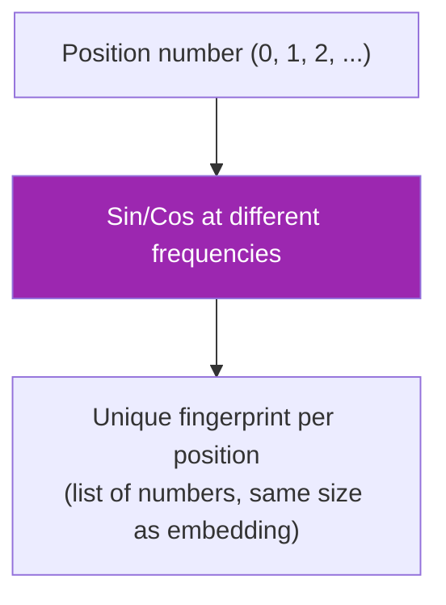
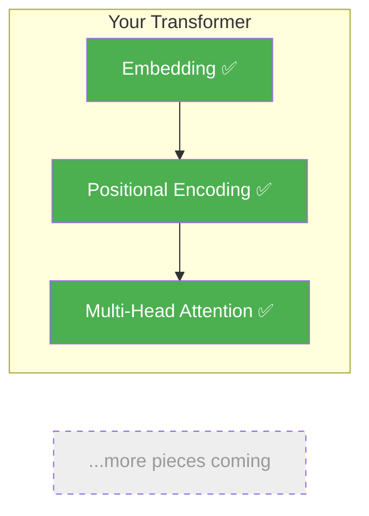

# Day 14: Wave Patterns

> Yesterday you saw the problem: no word order. Today you'll fix it by creating a unique "position fingerprint" for each position using wave patterns.

## What You Need to Know First

- You've completed [Day 13: The Shuffle Problem](./day-13-the-shuffle-problem.md)

---

## The Idea

Imagine a clock. The hour hand and minute hand both go in circles, but at different speeds. If you know both positions, you can tell exactly what time it is.

Positional encoding uses the same idea. For each position in a sentence, we create a pattern using waves at different speeds:

```
Position 0: [sin(slow), cos(slow), sin(fast), cos(fast), ...]
Position 1: [sin(slow), cos(slow), sin(fast), cos(fast), ...]
Position 2: [sin(slow), cos(slow), sin(fast), cos(fast), ...]
```

Each position gets a unique combination of wave values — like a fingerprint. No two positions have the same pattern.



Why waves? Because they repeat smoothly. The model can learn relative distances: "position 5 is two steps after position 3" shows up as a consistent pattern in the waves. This helps the model understand relationships like "the word 3 positions ago was the subject."

---

## Your Code

Create `my_transformer/positional.py`:

```python
import numpy as np

def sinusoidal_encoding(max_len, d_model):
    """
    Create position encodings using sine and cosine waves.

    max_len: maximum sequence length
    d_model: embedding dimension

    Returns: numpy array of shape (max_len, d_model)
    """
    pe = np.zeros((max_len, d_model))
    position = np.arange(max_len).reshape(-1, 1)       # column: [0, 1, 2, ...]
    # Frequencies: slow waves for even dims, fast waves for odd dims
    div_term = np.exp(np.arange(0, d_model, 2) * -(np.log(10000.0) / d_model))

    pe[:, 0::2] = np.sin(position * div_term)   # even columns: sin
    pe[:, 1::2] = np.cos(position * div_term)   # odd columns: cos

    return pe
```

The `div_term` creates waves at different speeds. Low dimensions get slow waves (capturing long-range position). High dimensions get fast waves (capturing nearby position).

---

## Test It

```bash
python -m my_transformer.tests positional
```

You should see:

```
  PASS: positional_encoding — Shape (10, 8), positions are unique
```

---

## What You Just Built



Now your model can tell position 0 from position 100. "Dog bites man" and "man bites dog" will produce different results.

---

## Check In

```bash
python days/check.py 14
```

## Go Deeper (Optional)

Want the math behind why 10000 is used as the base? See the [positional encoding interview guide](../architecture/positional-encoding-interview.md).

---

**Tomorrow: Day 15 — Adding Position.** You'll combine positional encoding with word embeddings. It's one line of code — but understanding *why* addition works is the interesting part.
