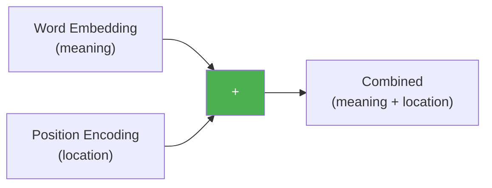
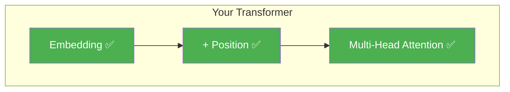

# Day 15: Adding Position

> You have embeddings (what a word means) and position encodings (where a word is). Today you'll combine them. It's surprisingly simple.

## What You Need to Know First

- You've completed [Day 14: Wave Patterns](./day-14-wave-patterns.md)

---

## The Idea

You write your name on a piece of paper. Then you write your address on the same paper. Now the paper has both pieces of information — who you are AND where you are.

That's exactly what we do with embeddings and position encodings: we **add** them together.

```
Word embedding:      [0.2, -0.5, 0.8, 0.1]   ← what the word means
Position encoding:   [0.0,  1.0, 0.0, 1.0]   ← where the word is
                    ──────────────────────────
Combined:            [0.2,  0.5, 0.8, 1.1]   ← meaning + position
```



Why addition and not concatenation (sticking them side by side)? Because addition keeps the embedding the same size. If we concatenated, we'd double the size and break all the weight matrices downstream.

The model learns to separate meaning from position because the position patterns are predictable (waves) while meaning patterns are learned. It's like hearing music plus a metronome — your brain can separate the beat from the melody.

---

## Your Code

Add this to `my_transformer/positional.py`:

```python
def add_position(embeddings, positional_encoding):
    """
    Add positional encoding to word embeddings.

    embeddings:          numpy array of shape (seq_len, d_model)
    positional_encoding: numpy array of shape (max_len, d_model), max_len >= seq_len

    Returns: numpy array of shape (seq_len, d_model)
    """
    seq_len = embeddings.shape[0]
    return embeddings + positional_encoding[:seq_len]
```

One line. We slice the position encoding to match the sequence length, then add.

---

## What You Just Built



Now every word entering your transformer carries both its meaning and its position. "Dog" at position 0 is different from "dog" at position 5.

---

## Check In

```bash
python days/check.py 15
```

---

**Tomorrow: Day 16 — Modern Alternatives.** Sinusoidal encoding works, but newer models use different position techniques. You'll get a quick overview of RoPE and ALiBi — no code, just awareness.
