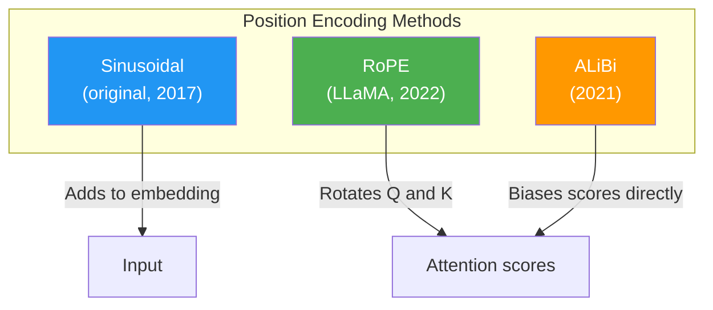

# Day 16: Modern Alternatives

> Sinusoidal encoding was the original approach. Newer models do it differently. Today is a quick tour — no code, just awareness.

## What You Need to Know First

- You've completed [Day 15: Adding Position](./day-15-adding-position.md)

---

## Three Approaches to Position



### 1. Sinusoidal (what you built)

- **How:** Add wave patterns to embeddings before attention
- **Used by:** Original Transformer, BERT
- **Strength:** Simple, works well for fixed lengths
- **Weakness:** Struggles with sequences much longer than training data

### 2. RoPE (Rotary Position Embedding)

- **How:** Instead of adding position to the embedding, it *rotates* the Q and K vectors based on position. Close positions rotate similarly; far positions rotate differently.
- **Used by:** LLaMA, Mistral, most modern open-source LLMs
- **Strength:** Naturally captures relative distance (how far apart two words are)
- **Why it matters:** This is what most LLMs you hear about today actually use

### 3. ALiBi (Attention with Linear Biases)

- **How:** Doesn't modify embeddings at all. Instead, subtracts a penalty from attention scores based on distance. Nearby words: small penalty. Far words: big penalty.
- **Used by:** BLOOM, some efficient transformers
- **Strength:** Can handle much longer sequences than it was trained on

---

## The Key Insight

All three approaches solve the same problem (word order) but at different points:

| Method | Where it acts | What it does |
|--------|--------------|--------------|
| Sinusoidal | Before attention (embedding) | Adds position signal |
| RoPE | During attention (Q, K) | Rotates vectors by position |
| ALiBi | During attention (scores) | Penalizes distant pairs |

You don't need to implement these right now. The sinusoidal approach you built works perfectly for learning. But in interviews, knowing that alternatives exist shows breadth.

---

## Check In

```bash
python days/check.py 16
```

## Go Deeper (Optional)

Full comparison with math: [positional encoding interview guide](../architecture/positional-encoding-interview.md).

---

**Tomorrow: Day 17 — Milestone: Position-Aware Model.** You'll prove that your model now treats "dog bites man" differently from "man bites dog." Position works!
