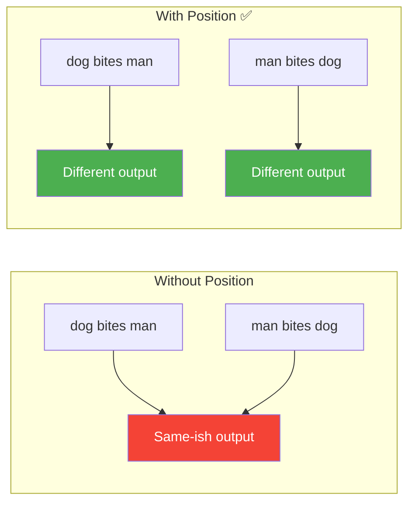

# Day 17: Milestone — Position-Aware Model

> Time to prove it works. You'll show that your model now treats word order differently — "dog bites man" vs "man bites dog" produce different outputs.

## What You Need to Know First

- You've completed [Days 13-16](./day-16-modern-alternatives.md)

---

## The Test

Here's the proof. Run this code (you can paste it into a Python file or run it directly):

```python
import numpy as np
from my_transformer.embedding import embed
from my_transformer.positional import sinusoidal_encoding, add_position
from my_transformer.multi_head import MultiHeadAttention

# Simple vocabulary
vocab = {"dog": 0, "bites": 1, "man": 2}
d_model = 8
n_heads = 2

# Random embedding table (same for both sentences)
np.random.seed(42)
table = np.random.randn(len(vocab), d_model)
pe = sinusoidal_encoding(10, d_model)
mha = MultiHeadAttention(d_model, n_heads)

# Sentence 1: "dog bites man"
tokens_1 = [vocab["dog"], vocab["bites"], vocab["man"]]
emb_1 = embed(tokens_1, table)
emb_1_pos = add_position(emb_1, pe)
out_1 = mha.forward(emb_1_pos)

# Sentence 2: "man bites dog" (same words, different order)
tokens_2 = [vocab["man"], vocab["bites"], vocab["dog"]]
emb_2 = embed(tokens_2, table)
emb_2_pos = add_position(emb_2, pe)
out_2 = mha.forward(emb_2_pos)

# Without position encoding (should be more similar)
out_no_pos_1 = mha.forward(emb_1)
out_no_pos_2 = mha.forward(emb_2)

diff_with_pos = np.abs(out_1 - out_2).mean()
diff_without_pos = np.abs(out_no_pos_1 - out_no_pos_2).mean()

print(f"Difference WITH position encoding:    {diff_with_pos:.4f}")
print(f"Difference WITHOUT position encoding: {diff_without_pos:.4f}")
print(f"\nPosition encoding makes the outputs {'more' if diff_with_pos > diff_without_pos else 'less'} different!")
print("Your model can now distinguish word order.")
```

---

## What You Just Proved



Three milestones down. Your transformer now has:
- Embeddings (meaning)
- Positional encoding (order)
- Multi-head attention (context)

The remaining piece is the transformer *block* — the wrapper that adds normalization, residual connections, and a feed-forward network around the attention.

---

## Check In

```bash
python days/check.py 17
```

Milestone day — bonus XP!

---

**Next: Day 18 — Skip Connections.** Deep networks have a problem: information gets lost as it passes through many layers. Skip connections are the fix — and they're just one line of code.
