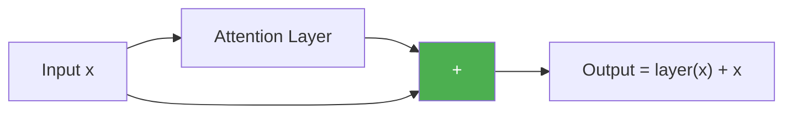

# Day 18: Skip Connections

> Deep networks lose information as it passes through layers. Today you'll add a one-line fix that solves this.

## What You Need to Know First

- You've completed [Day 17: Position-Aware Model](./day-17-milestone-position-aware.md)

---

## The Idea

Imagine passing a message through a line of 20 people (like the telephone game). By the end, the message is garbled. Too much got lost along the way.

Now imagine a shortcut: the original message is also handed directly to the last person. They can combine it with whatever came through the chain. Even if the chain garbled some things, the original is still there.

That's a **residual connection** (also called a skip connection). After every layer processes the input, you add the original input back:

```
output = layer(x) + x
```



Why this works: even if the layer learns nothing useful, the output is still at least as good as the input (because the input is added back). The layer only needs to learn the *difference* — what to add or adjust. This makes training much easier.

---

## Your Code

Create `my_transformer/transformer.py`:

```python
import numpy as np

def residual(x, sublayer_output):
    """
    Residual connection: add input to layer output.

    x:               original input, shape (seq_len, d_model)
    sublayer_output:  output of the sublayer, same shape

    Returns: x + sublayer_output
    """
    return x + sublayer_output
```

---

## Test It

```bash
python -m my_transformer.tests residual
```

You should see: `PASS: residual — x + sublayer(x) works`

---

## Check In

```bash
python days/check.py 18
```

---

**Tomorrow: Day 19 — Keeping Numbers Calm.** When you add things repeatedly, numbers can grow huge. Layer normalization keeps them in a reasonable range.
