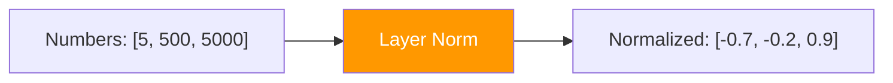

# Day 19: Keeping Numbers Calm

> After adding residual connections, numbers can grow large. Layer normalization rescales them so the model trains smoothly.

## What You Need to Know First

- You've completed [Day 18: Skip Connections](./day-18-skip-connections.md)

---

## The Idea

Imagine a classroom where test scores range wildly — one student gets 5, another gets 500, another gets 5000. It's hard to compare them or grade fairly.

**Normalization** rescales everyone to the same range. After normalizing:
- The average score becomes 0
- The spread becomes 1

```
Before:  [5, 500, 5000]   ← hard to work with
After:   [-0.7, -0.2, 0.9]  ← nice and tidy
```

In a transformer, **layer normalization** does this for each word's embedding independently. It keeps the numbers in a reasonable range so the model can learn efficiently.



The formula: subtract the mean, divide by the standard deviation. That's it.

---

## Your Code

Add this to `my_transformer/transformer.py`:

```python
def layer_norm(x, eps=1e-6):
    """
    Layer normalization: normalize each row to mean=0, std=1.

    x:   numpy array of shape (seq_len, d_model)
    eps: small number to prevent division by zero

    Returns: normalized array of same shape
    """
    mean = x.mean(axis=-1, keepdims=True)
    std = x.std(axis=-1, keepdims=True)
    return (x - mean) / (std + eps)
```

---

## Test It

```bash
python -m my_transformer.tests layer_norm
```

You should see: `PASS: layer_norm — Mean=0.0000, Std=1.0000`

---

## Check In

```bash
python days/check.py 19
```

---

**Tomorrow: Day 20 — The Thinking Layer.** Attention decides *which* words to combine. The feed-forward network decides *what to do* with that combined information. It's where the "thinking" happens.
