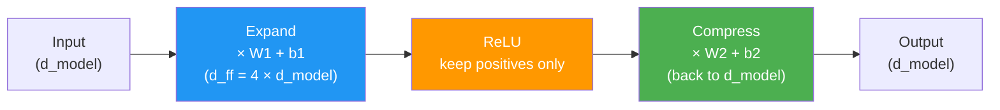

# Day 20: The Thinking Layer

> Attention gathers information. The feed-forward network processes it. This is where the model does its "thinking."

## What You Need to Know First

- You've completed [Day 19: Keeping Numbers Calm](./day-19-keeping-numbers-calm.md)

---

## The Idea

Attention is like a meeting where everyone shares what they know. But sharing information isn't enough — someone needs to *process* it and draw conclusions.

The **feed-forward network** (FFN) is that processor. For each word independently, it:
1. **Expands** the embedding to a larger space (more room to think)
2. **Applies ReLU** (keeps positive values, zeros out negatives — a simple filter)
3. **Compresses** back to the original size



Why expand then compress? The larger intermediate size gives the model more "workspace" — like using scratch paper for a calculation, then writing the answer on a smaller card.

The standard expansion factor is 4x. If d_model is 512, the FFN expands to 2048 then back to 512.

---

## Your Code

Add this to `my_transformer/transformer.py`:

```python
def feed_forward(x, W1, b1, W2, b2):
    """
    Feed-forward network: expand, ReLU, compress.

    x:  numpy array of shape (seq_len, d_model)
    W1: shape (d_model, d_ff)    — expansion weights
    b1: shape (d_ff,)            — expansion bias
    W2: shape (d_ff, d_model)    — compression weights
    b2: shape (d_model,)         — compression bias

    Returns: numpy array of shape (seq_len, d_model)
    """
    hidden = np.maximum(0, x @ W1 + b1)    # expand + ReLU
    return hidden @ W2 + b2                  # compress
```

Two matrix multiplications and a `max(0, ...)`. That's the entire feed-forward network.

---

## Test It

```bash
python -m my_transformer.tests feed_forward
```

You should see: `PASS: feed_forward — Shape (3, 4) correct`

---

## Check In

```bash
python days/check.py 20
```

---

**Tomorrow: Day 21 — Building the Block.** You'll assemble attention + FFN + norm + residual into a single transformer block. This is the repeating unit that gets stacked 12, 24, or 96 times in real models.
