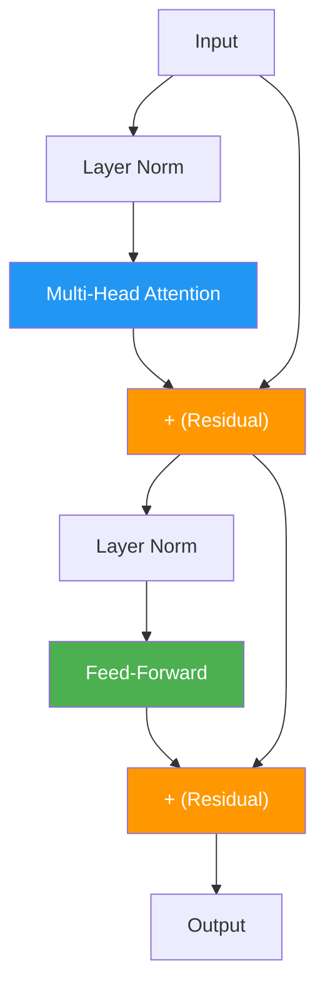
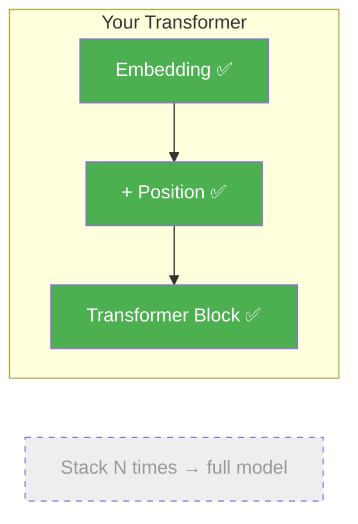

# Day 21: Building the Block

> Attention, FFN, normalization, residuals — you have all the pieces. Today you assemble them into a single transformer block, the repeating unit of every transformer model.

## What You Need to Know First

- You've completed [Day 20: The Thinking Layer](./day-20-the-thinking-layer.md)

---

## The Idea

A transformer block is like a factory station on an assembly line. Each station does the same two-step process:

1. **Gather context** (multi-head attention) — look at other words
2. **Process individually** (feed-forward) — think about what you gathered

Each step is wrapped with a residual connection and layer normalization for stability.



Real transformers stack this block many times:
- GPT-2 Small: 12 blocks
- GPT-3: 96 blocks
- Each block has the same structure, just different learned weights

---

## Your Code

Add this to `my_transformer/transformer.py`:

```python
from my_transformer.multi_head import MultiHeadAttention

def transformer_block(x, mha, W1, b1, W2, b2):
    """
    One transformer block: attention + FFN, each with residual + norm.

    x:   numpy array of shape (seq_len, d_model)
    mha: MultiHeadAttention instance
    W1, b1, W2, b2: feed-forward network weights

    Returns: numpy array of shape (seq_len, d_model)
    """
    # Step 1: Attention sub-layer
    normed = layer_norm(x)
    attn_out = mha.forward(normed)
    x = residual(x, attn_out)

    # Step 2: FFN sub-layer
    normed = layer_norm(x)
    ffn_out = feed_forward(normed, W1, b1, W2, b2)
    x = residual(x, ffn_out)

    return x
```

Eight lines. Two sub-layers. Each one: normalize, process, add residual. That's one complete transformer block.

---

## What You Just Built



This is the fundamental building block. Stack it 12 times and you have GPT-2 Small. Stack it 96 times and you have GPT-3. The architecture is the same — just more copies.

---

## Check In

```bash
python days/check.py 21
```

---

**Tomorrow: Day 22 — No Peeking.** For text generation (like ChatGPT), the model can only look at words *before* the current position — it can't peek at future words. You'll build the mask that enforces this rule.
