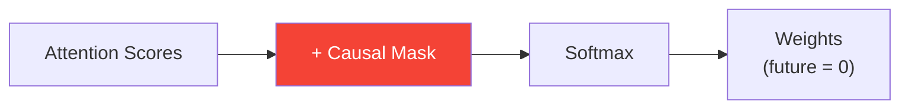

# Day 22: No Peeking

> ChatGPT generates words one at a time, left to right. It can't look at future words — that would be cheating. Today you'll build the mask that enforces this rule.

## What You Need to Know First

- You've completed [Day 21: Building the Block](./day-21-building-the-block.md)

---

## The Idea

Imagine taking an exam where the next question's answer is printed right below the current question. You'd need to cover the answers with a piece of paper and only reveal them one at a time.

A **causal mask** does exactly this for the transformer. When generating word 3, the model can see words 1, 2, and 3 — but not word 4 or beyond.

```
Generating: "The cat sat on"

Processing "The":   can see: [The]
Processing "cat":   can see: [The, cat]
Processing "sat":   can see: [The, cat, sat]
Processing "on":    can see: [The, cat, sat, on]
```

In the attention score matrix, we set future positions to negative infinity. After softmax, negative infinity becomes 0 — so those positions contribute nothing.

```
Mask (0 = allowed, -inf = blocked):

         The   cat   sat   on
The    [  0    -inf  -inf  -inf ]
cat    [  0     0    -inf  -inf ]
sat    [  0     0     0    -inf ]
on     [  0     0     0     0   ]
```



---

## Your Code

Add this to `my_transformer/transformer.py`:

```python
def causal_mask(seq_len):
    """
    Create a causal (look-ahead) mask.
    Lower triangle = 0 (allowed), upper triangle = -inf (blocked).

    seq_len: number of positions

    Returns: numpy array of shape (seq_len, seq_len)
    """
    mask = np.zeros((seq_len, seq_len))
    for i in range(seq_len):
        for j in range(i + 1, seq_len):
            mask[i, j] = -np.inf
    return mask
```

---

## Test It

```bash
python -m my_transformer.tests causal_mask
```

You should see: `PASS: causal_mask — Lower-triangular mask, shape (4, 4)`

---

## Check In

```bash
python days/check.py 22
```

---

**Tomorrow: Day 23 — Learning to Write.** You'll add a training loop and text generation function. This is where your transformer goes from "a bunch of math" to "a model that generates text."
