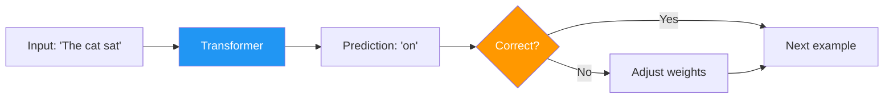
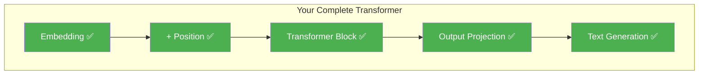

# Day 23: Learning to Write

> Your transformer has all the architecture pieces. Today you'll add a training loop and a text generation function. By the end, your model will learn from text and generate new text.

## What You Need to Know First

- You've completed [Day 22: No Peeking](./day-22-no-peeking.md)

---

## The Idea

How does a language model learn? One simple task:

> Given the words so far, predict the next word.

```
Input:  "The cat sat"  → Predict: "on"
Input:  "The cat sat on" → Predict: "the"
Input:  "The cat sat on the" → Predict: "mat"
```

The model makes a guess, checks if it's right, adjusts its weights, and tries again. After millions of examples, it gets good at predicting.



For generation, you do the same thing but keep going:
1. Start with a prompt: "The"
2. Model predicts the most likely next word: "cat"
3. Add "cat" to the input: "The cat"
4. Model predicts: "sat"
5. Keep going...

---

## What This Means for Our Code

For a full training loop, you'd need PyTorch or another deep learning framework. The conceptual pieces are:

1. A **loss function** that measures how wrong the prediction is
2. A **gradient descent** step that adjusts weights to reduce the loss
3. A **generation** function that predicts one word at a time

Today's code shows the generation concept using your existing components. Full training with PyTorch is covered in the [training experiment notebook](../experiments/01_training_a_small_transformer.ipynb).

---

## Your Code

Add this to `my_transformer/transformer.py`:

```python
def predict_next_token(x, mha, W1, b1, W2, b2, output_weights):
    """
    Run one forward pass and predict scores for the next token.

    x:              numpy array of shape (seq_len, d_model) — embedded input
    mha:            MultiHeadAttention instance
    W1, b1, W2, b2: FFN weights
    output_weights: numpy array of shape (d_model, vocab_size)

    Returns: numpy array of shape (vocab_size,) — score for each word
    """
    # Run through transformer block
    out = transformer_block(x, mha, W1, b1, W2, b2)

    # Take the last position's output
    last = out[-1]  # shape: (d_model,)

    # Project to vocabulary size
    logits = last @ output_weights  # shape: (vocab_size,)

    return logits


def generate(prompt_embeddings, mha, W1, b1, W2, b2, output_weights,
             embedding_table, max_new_tokens=5):
    """
    Generate text by predicting one token at a time.

    Returns: list of predicted token IDs
    """
    current = prompt_embeddings.copy()
    generated_ids = []

    for _ in range(max_new_tokens):
        logits = predict_next_token(current, mha, W1, b1, W2, b2, output_weights)

        # Pick the highest-scoring token (greedy decoding)
        next_id = int(np.argmax(logits))
        generated_ids.append(next_id)

        # Add the new token's embedding to the sequence
        next_emb = embedding_table[next_id].reshape(1, -1)
        current = np.vstack([current, next_emb])

    return generated_ids
```

---

## What You Just Built



You now have every piece of a working transformer, from input to output. The `generate()` function does exactly what ChatGPT does: predict one word, add it, predict the next, repeat.

---

## Check In

```bash
python days/check.py 23
```

---

**Tomorrow: Day 24 — Milestone: Your Transformer Writes!** You'll run the full pipeline on real text and see your transformer generate output. This is the grand finale of the build phase.
