# Day 24: Milestone — Your Transformer Writes!

> Twenty-three days ago you started with "what is an embedding?" Today your transformer generates text. Let's run it.

## What You Need to Know First

- You've completed [Day 23: Learning to Write](./day-23-learning-to-write.md)

---

## The Demo

Your `my_transformer/` package now has everything needed. Let's run the full pipeline:

```python
import numpy as np
from my_transformer.embedding import embed
from my_transformer.positional import sinusoidal_encoding, add_position
from my_transformer.multi_head import MultiHeadAttention
from my_transformer.transformer import generate

# Simple vocabulary
words = ["the", "cat", "sat", "on", "mat", "dog", "ran", "fast"]
word_to_id = {w: i for i, w in enumerate(words)}
id_to_word = {i: w for w, i in word_to_id.items()}
vocab_size = len(words)

# Model parameters
d_model = 16
n_heads = 2
d_ff = 64

np.random.seed(42)
embedding_table = np.random.randn(vocab_size, d_model) * 0.1
pe = sinusoidal_encoding(50, d_model)
mha = MultiHeadAttention(d_model, n_heads)
W1 = np.random.randn(d_model, d_ff) * 0.1
b1 = np.zeros(d_ff)
W2 = np.random.randn(d_ff, d_model) * 0.1
b2 = np.zeros(d_model)
output_weights = np.random.randn(d_model, vocab_size) * 0.1

# Generate from prompt
prompt = "the cat"
prompt_ids = [word_to_id[w] for w in prompt.split()]
prompt_emb = embed(prompt_ids, embedding_table)
prompt_emb = add_position(prompt_emb, pe)

generated_ids = generate(prompt_emb, mha, W1, b1, W2, b2,
                         output_weights, embedding_table, max_new_tokens=4)

generated_words = [id_to_word[i] for i in generated_ids]
print(f"Prompt:    {prompt}")
print(f"Generated: {' '.join(generated_words)}")
print(f"\nFull:      {prompt} {' '.join(generated_words)}")
```

The output won't make sense — the weights are random, not trained. But the *architecture* is real. Every piece works together. With real training data and gradient descent, this exact architecture learns to write coherent text.

To see a trained version in action, run the [training experiment notebook](../experiments/01_training_a_small_transformer.ipynb).

---

## What You Built Over 24 Days

```mermaid
graph TD
    subgraph "Your Complete Transformer ✅"
        INPUT["Text Input"]
        INPUT --> EMB["Day 1: Embedding"]
        EMB --> POS["Day 14-15: + Position"]
        POS --> QKV["Day 2: Q/K/V Projection"]
        QKV --> DOT["Day 3: Dot Product"]
        DOT --> SCALE["Day 4: Scaling"]
        SCALE --> SOFT["Day 5: Softmax"]
        SOFT --> AOUT["Day 6: Attention Output"]
        AOUT --> SPLIT["Day 9: Split Heads"]
        SPLIT --> MERGE["Day 11: Merge Heads"]
        MERGE --> RES["Day 18: Residual"]
        RES --> NORM["Day 19: Layer Norm"]
        NORM --> FFN["Day 20: Feed-Forward"]
        FFN --> BLOCK["Day 21: Block Assembly"]
        BLOCK --> MASK["Day 22: Causal Mask"]
        MASK --> GEN["Day 23: Generation"]
        GEN --> OUTPUT["Text Output"]
    end

    style EMB fill:#4CAF50,color:#fff
    style POS fill:#4CAF50,color:#fff
    style QKV fill:#4CAF50,color:#fff
    style DOT fill:#4CAF50,color:#fff
    style SCALE fill:#4CAF50,color:#fff
    style SOFT fill:#4CAF50,color:#fff
    style AOUT fill:#4CAF50,color:#fff
    style SPLIT fill:#4CAF50,color:#fff
    style MERGE fill:#4CAF50,color:#fff
    style RES fill:#4CAF50,color:#fff
    style NORM fill:#4CAF50,color:#fff
    style FFN fill:#4CAF50,color:#fff
    style BLOCK fill:#4CAF50,color:#fff
    style MASK fill:#4CAF50,color:#fff
    style GEN fill:#4CAF50,color:#fff
```



You started knowing nothing about transformers. Now you have a working implementation — not a toy version, but the real architecture with multi-head attention, positional encoding, residual connections, layer normalization, and autoregressive generation.

The only difference between your transformer and GPT-4 is scale:
- Your model: ~1,000 parameters
- GPT-4: ~1,800,000,000,000 parameters

Same architecture. Same ideas. Just more of everything.

---

## Check In

```bash
python days/check.py 24
```

This is a milestone — the biggest one yet. You earned it.

---

**Next: Days 25-28 — Interview Ready.** You've built it. Now you'll learn to *explain* it — a critical skill for staff and principal engineer interviews.
