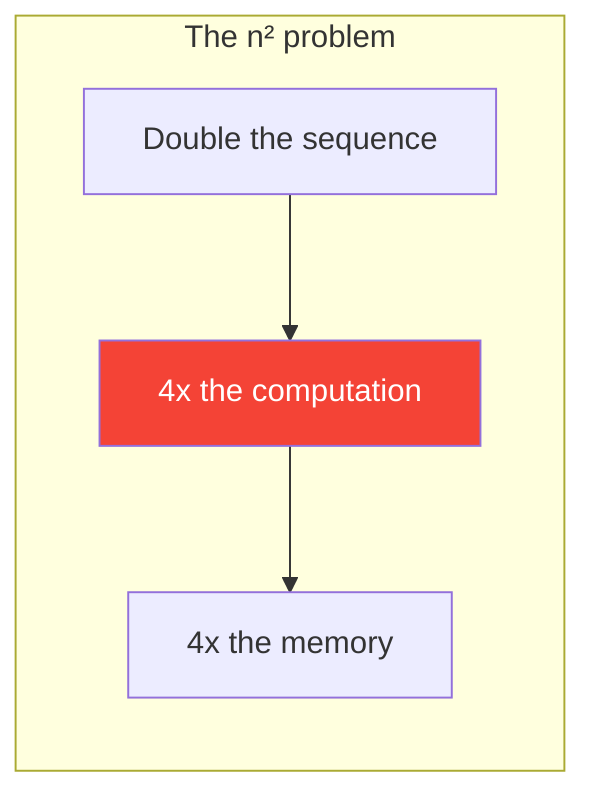

# Day 26: The Cost of Attention

> Attention is powerful but expensive. Today you'll understand why — and why this matters for production systems.

## What You Need to Know First

- You've completed [Day 25: Explain Attention](./day-25-explain-attention.md)

---

## The Key Bottleneck: O(n^2)

Remember Day 3? You compute a score between every pair of words. If your sentence has *n* words, that's n x n scores:

| Sequence Length | Attention Scores | Relative Cost |
|----------------|-----------------|---------------|
| 10 words | 100 | 1x |
| 100 words | 10,000 | 100x |
| 1,000 words | 1,000,000 | 10,000x |
| 100,000 words (a book) | 10,000,000,000 | 100,000,000x |



This is why early GPT models could only handle ~2,000 tokens. Even modern models with 128K+ context windows use tricks to manage this cost.

---

## Benchmark It

Run this to see the scaling yourself:

```python
import numpy as np
import time

def benchmark_attention(seq_len, d_model=64, runs=5):
    Q = np.random.randn(seq_len, d_model)
    K = np.random.randn(seq_len, d_model)
    times = []
    for _ in range(runs):
        start = time.time()
        scores = Q @ K.T                    # O(n^2 * d)
        np.exp(scores - scores.max())       # softmax part
        times.append(time.time() - start)
    return np.median(times) * 1000  # ms

for n in [100, 500, 1000, 2000, 5000]:
    ms = benchmark_attention(n)
    print(f"  n={n:>5d}  →  {ms:>8.2f} ms")
```

You should see the time roughly quadrupling every time you double the sequence length. That's O(n^2) in action.

---

## Why This Matters in Interviews

An interviewer might ask: "How would you handle a document with 1 million tokens?"

Good answers mention:
- **Chunking** — process the document in overlapping windows
- **Sparse attention** — only attend to nearby tokens and a few global ones
- **Linear attention** — approximate the softmax with kernels (O(n) instead of O(n^2))
- **KV caching** — for generation, cache past Key/Value computations

You don't need to implement these — just know they exist and why they're needed.

---

## Check In

```bash
python days/check.py 26
```

---

**Tomorrow: Day 27 — Encoder vs Decoder.** Not all transformers are the same. Some can see the whole input (encoders), some can only see the past (decoders). You'll understand when to use which.
