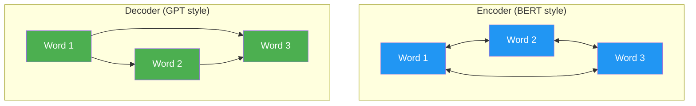

# Day 27: Encoder vs Decoder

> Your transformer uses a causal mask (decoder style). But some tasks need the model to see the whole input. Today you'll understand the difference.

## What You Need to Know First

- You've completed [Day 26: The Cost of Attention](./day-26-the-cost-of-attention.md)

---

## Two Flavors of Transformer



### Encoder (Bidirectional)

- Every word can see every other word (no mask)
- Best for **understanding** tasks: classification, sentiment, search
- Example: "Is this review positive or negative?" → the model reads the whole review at once
- Famous model: **BERT**

### Decoder (Causal / Autoregressive)

- Each word can only see words before it (causal mask from Day 22)
- Best for **generation** tasks: writing text, chatting, coding
- Example: "Complete this sentence: The cat..." → generates one word at a time
- Famous models: **GPT, Claude, LLaMA**

### Encoder-Decoder

- Encoder reads the full input, decoder generates output while attending to the encoder
- Best for **translation** and tasks where input and output are different sequences
- Famous model: **T5, the original Transformer**

---

## When to Use Which

| Task | Best Architecture | Why |
|------|-------------------|-----|
| Sentiment analysis | Encoder | Needs to see whole review |
| Text generation | Decoder | Generates left to right |
| Translation | Encoder-Decoder | Reads full source, generates target |
| Summarization | Encoder-Decoder (or Decoder) | Both work, different trade-offs |
| Question answering | Encoder (or Decoder) | Depends on format |

---

## The Key Interview Insight

> "The only architectural difference between an encoder and a decoder is the attention mask. Encoders use no mask (full attention). Decoders use a causal mask (lower-triangular). Everything else — embeddings, multi-head attention, FFN, residuals, normalization — is identical."

You already know this because you built both pieces. The causal mask (Day 22) is what turns an encoder into a decoder.

---

## Check In

```bash
python days/check.py 27
```

---

**Tomorrow: Day 28 — Break It to Prove You Understand It.** The final day. You'll deliberately remove components from your transformer and predict what breaks. This is the deepest form of understanding — and a powerful interview technique.
