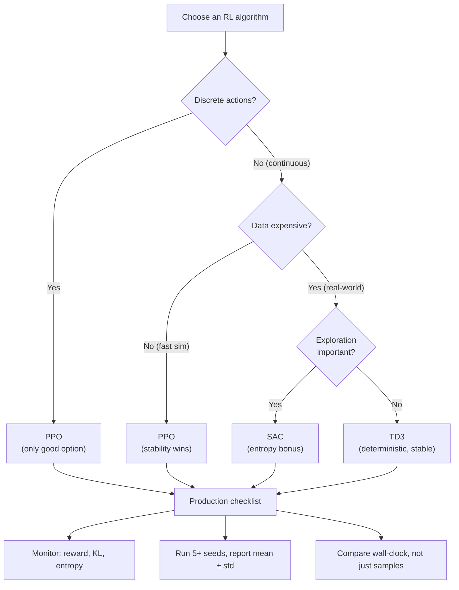

# Comparing Advanced Methods — Interview Deep Dive

> **What this file covers**
> - 🎯 Systematic comparison framework: on-policy vs off-policy, stochastic vs deterministic, constrained vs unconstrained
> - 🧮 Sample efficiency formulas, effective batch sizes, and wall-clock analysis
> - ⚠️ 3 failure modes: wrong algorithm for the task, unfair benchmarking, hyperparameter transfer
> - 📊 Benchmark comparison across environments with confidence intervals
> - 💡 PPO vs SAC vs TD3 vs TRPO: decision matrix with 8 dimensions
> - 🏭 Algorithm selection for production systems: RLHF, robotics, games

---

## Brief restatement

No single RL algorithm dominates all tasks. PPO is the reliable all-rounder for discrete and continuous actions. SAC maximizes entropy for sample-efficient continuous control. TD3 provides stable deterministic continuous control. TRPO offers theoretical guarantees at the cost of implementation complexity. The right choice depends on the action space, data budget, stability requirements, and deployment constraints.

---

## Full mathematical treatment

### 🧮 The on-policy vs off-policy divide

> **Words:** On-policy methods (PPO, TRPO) can only learn from data collected by the current policy. Off-policy methods (SAC, TD3) can learn from any data stored in a replay buffer. This fundamental difference drives most of the practical trade-offs.

> **On-policy data requirement:**
>
>     Data per update: n_steps × n_envs transitions
>     Data reuse: n_epochs passes (PPO) or 1 pass (TRPO)
>     Total data efficiency: each transition used n_epochs times, then discarded
>     Effective sample multiplier: n_epochs (typically 10 for PPO)

> **Off-policy data requirement:**
>
>     Data per update: batch_size transitions sampled from buffer
>     Data reuse: each transition sampled ~buffer_size/batch_size times over its lifetime
>     Total data efficiency: each transition used hundreds of times
>     Effective sample multiplier: buffer_size / batch_size (typically 1M/256 ≈ 4000)

> **Worked example — how many gradient updates per environment step:**
>
> PPO: 8192 transitions per rollout, 10 epochs × 128 minibatches = 1280 updates, so 1280/8192 ≈ 0.16 gradient updates per environment step.
>
> SAC: 1 gradient update per environment step (train_freq=1, gradient_steps=1). Each update uses a batch of 256 transitions from a 1M buffer.
>
> SAC does 6× more gradient updates per environment step than PPO, which is why it is more sample-efficient. The trade-off: SAC's updates use older data (from the buffer), which can introduce bias.

### 🧮 Stochastic vs deterministic policies

> **Words:** Stochastic policies (PPO, SAC, TRPO) output a probability distribution and sample actions from it. Deterministic policies (TD3) output a single action directly. The distinction affects exploration, gradient estimation, and variance.

> **Stochastic policy gradient (used by PPO, TRPO):**
>
>     ∇_θ J = E[ ∇_θ log π_θ(a|s) × Â(s, a) ]
>
> The gradient goes through log π, which requires sampling. Variance comes from both the advantage estimate and the policy sampling.

> **Deterministic policy gradient (used by TD3):**
>
>     ∇_θ J = E[ ∇_a Q(s, a)|_{a=μ(s)} × ∇_θ μ_θ(s) ]
>
> The gradient goes directly through the Q-function and the deterministic policy μ. No sampling variance from the policy. Exploration must be added externally (Gaussian noise or Ornstein-Uhlenbeck noise).

> **Reparameterized stochastic gradient (used by SAC):**
>
>     a = f_θ(s, ε),  ε ~ N(0, I)
>     ∇_θ J = E_ε[ ∇_θ Q(s, f_θ(s, ε)) - α ∇_θ log π_θ(f_θ(s, ε)|s) ]
>
> The gradient goes through the reparameterized sample, combining the low variance of deterministic gradients with the exploration benefits of stochastic policies.

### 🧮 Update constraint mechanisms

| Method | Constraint | Mathematical form |
|---|---|---|
| TRPO | KL divergence bound | max L(θ) s.t. KL(π_old ∥ π_new) ≤ δ |
| PPO-Clip | Ratio clipping | max min(r×Â, clip(r, 1-ε, 1+ε)×Â) |
| PPO-Penalty | KL penalty in loss | max L(θ) - β×KL(π_old ∥ π_new), β adaptive |
| SAC | Entropy regularization | max E[r + αH(π)] — implicit bound via α |
| TD3 | Delayed policy updates | Update policy every d critic updates |

Each mechanism addresses the same problem (preventing destructive updates) with different tools.

---

## 🗺️ Concept diagram

---

## ⚠️ Failure modes and edge cases

### 1. Wrong algorithm for the task

**What happens:** Using SAC for discrete actions (will not work — SAC requires continuous). Using PPO for a real robot with 1000 steps/hour budget (will take 10× longer than SAC). Using TRPO when PPO would work (unnecessary complexity).

**When it occurs:** Algorithm choice based on familiarity rather than task requirements. Blindly following "PPO is always good" without considering sample efficiency.

**Detection:** Poor sample efficiency compared to baselines. Training fails to start (wrong action space). Excessive wall-clock time for expected performance level.

**Fix:** Follow the decision flowchart. Match algorithm properties to task requirements. Start with PPO, switch only when a specific limitation is identified.

### 2. Unfair benchmarking

**What happens:** Comparing algorithms with different amounts of tuning. PPO with default hyperparameters vs SAC with extensively tuned hyperparameters. Or comparing sample efficiency without accounting for wall-clock time (SAC uses fewer samples but each gradient update is more expensive due to twin critics and replay buffer sampling).

**When it occurs:** Research papers, algorithm selection studies, production A/B tests.

**Detection:** One algorithm has been tuned on the target environment while the other uses defaults. Sample counts are compared but wall-clock times are not reported. Fewer than 5 random seeds per algorithm.

**Fix:** Equal tuning budget per algorithm (same number of hyperparameter trials). Report both sample efficiency AND wall-clock time. Run at least 5 seeds with different initializations. Use established benchmark protocols (e.g., procgen, DMControl).

### 3. Hyperparameter transfer failure

**What happens:** Hyperparameters tuned on one environment fail on another. Learning rate that works for CartPole diverges on Humanoid. Clip range that works for Atari is too aggressive for robotics. Buffer size that works for simple tasks is too small for complex ones.

**When it occurs:** Deploying algorithms in new environments without re-tuning. Using "recommended" hyperparameters from papers without verifying on the target task.

**Detection:** Training diverges or plateaus early on the new environment. Performance is much worse than expected from published benchmarks.

**Fix:** Start with defaults. Tune the most impactful hyperparameter first (usually learning rate). Use a systematic search (grid or Bayesian optimization). Re-tune when moving to substantially different environments.

---

## 📊 Complexity analysis — comprehensive comparison

| Metric | PPO | SAC | TD3 | TRPO |
|---|---|---|---|---|
| **Time per update** | O(n_epochs × n_mb × \|θ\|) | O(batch × \|θ\|) × 3 | O(batch × \|θ\|) × 3 | O(CG_iters × \|θ\|) + line search |
| **Memory** | O(rollout) | O(buffer + 4\|θ\|) | O(buffer + 4\|θ\|) | O(rollout) |
| **Env samples (CartPole)** | ~50K | N/A (discrete) | N/A (discrete) | ~50K |
| **Env samples (HalfCheetah)** | ~1M | ~300K | ~300K | ~1M |
| **Env samples (Humanoid)** | ~30M | ~3M | ~5M | ~30M |
| **Wall-clock (1M params, per update)** | ~0.5s | ~0.3s | ~0.2s | ~2s |
| **Gradient updates / env step** | ~0.16 | ~1.0 | ~1.0 | ~0.02 |

**Key insight:** SAC/TD3 do ~6× more gradient updates per environment step than PPO. This is why they are sample-efficient — they squeeze more learning from each interaction.

---

## 💡 Design trade-offs — 8-dimension comparison

| Dimension | PPO | SAC | TD3 | TRPO |
|---|---|---|---|---|
| **Action space** | Discrete + continuous | Continuous only | Continuous only | Discrete + continuous |
| **On/off-policy** | On-policy | Off-policy | Off-policy | On-policy |
| **Policy type** | Stochastic | Stochastic + entropy | Deterministic + noise | Stochastic |
| **Sample efficiency** | ★★☆ | ★★★ | ★★★ | ★★☆ |
| **Stability** | ★★★ | ★★★ | ★★★ | ★★★ |
| **Implementation ease** | ★★★ | ★★☆ | ★★☆ | ★☆☆ |
| **Hyperparameter robustness** | ★★★ | ★★★ | ★★☆ | ★★☆ |
| **Theoretical guarantees** | None | Convergence (soft) | Convergence | Monotonic improvement |

---

## 🏭 Production and scaling considerations

**RLHF (Language Models):** PPO dominates. Actions are discrete tokens, on-policy data gives accurate KL penalties, and stability at billion-parameter scale is critical.

**Robotics (Simulation):** SAC is preferred for sim-to-real transfer. Its stochastic policy and entropy bonus improve robustness to the sim-to-real gap. TD3 is preferred when the optimal behavior is well-defined and precision matters.

**Robotics (Real Hardware):** SAC strongly preferred due to sample efficiency. Real robots collect ~1000 steps per hour. SAC's 3-10× sample advantage over PPO translates to days or weeks saved.

**Game Playing (Discrete):** PPO is the standard. SAC and TD3 cannot handle discrete actions. For very large action spaces, PPO with action masking or hierarchical policies.

**Autonomous Driving (Continuous):** SAC or TD3 in simulation. PPO for the final safety-critical fine-tuning where stability guarantees matter more than sample efficiency.

**Multi-agent Systems:** PPO is most commonly used. Its on-policy nature avoids the non-stationarity issues that plague off-policy methods in multi-agent settings (other agents' policies change, making old replay buffer data invalid).

---

## Staff/Principal Interview Depth

### Q1: You need to train an RL agent for a real robot with a continuous action space. Data collection costs $100 per hour and each training episode takes 5 minutes. Which algorithm do you choose and why?

---

**No Hire**
*Interviewee:* "PPO because it's the most popular and reliable."
*Interviewer:* Does not recognize that data cost is the dominant constraint. PPO would require 10× more real-world data than SAC, costing $100K+ more.
*Criteria — Met:* none / *Missing:* sample efficiency analysis, cost calculation, off-policy advantage

**Weak Hire**
*Interviewee:* "SAC because it's more sample-efficient for continuous control. Off-policy learning means we can reuse past data."
*Interviewer:* Correct algorithm choice with correct reasoning. Missing the quantitative cost analysis and practical considerations (sim-to-real, safety).
*Criteria — Met:* SAC choice, off-policy reasoning / *Missing:* cost calculation, sim-to-real strategy, safety considerations

**Hire**
*Interviewee:* "SAC. Quantitatively: for a task like robot manipulation, SAC needs ~300K steps vs PPO's ~3M steps. At 5 minutes per episode (~200 steps), SAC needs 1500 episodes (125 hours, $12,500). PPO needs 15,000 episodes (1250 hours, $125,000). The 10× cost difference makes SAC the clear choice. Practically: (1) Pre-train in simulation (free data) with domain randomization, then fine-tune on the real robot with SAC. (2) Use SAC's entropy bonus — the stochastic policy transfers better to real hardware because it hasn't over-fit to simulator dynamics. (3) Start with a large replay buffer to maximize reuse of expensive real-world data."
*Interviewer:* Excellent cost analysis with concrete numbers. Sim-to-real strategy and replay buffer optimization show practical experience. Would be elevated by discussing safety constraints and the trade-off with TD3.
*Criteria — Met:* cost analysis, SAC choice, sim-to-real, replay strategy / *Missing:* safety, TD3 comparison

**Strong Hire**
*Interviewee:* "SAC, with a phased approach. Phase 1: Train in simulation with domain randomization — free data, unlimited steps. Use SAC's entropy bonus with high α for maximum exploration of the state-action space. Phase 2: Transfer to real robot. Initialize the replay buffer with sim data (even though dynamics differ, it provides a starting distribution). Fine-tune with real data. SAC's off-policy nature means every real-world transition is stored and reused ~4000 times. Cost estimate: 300K steps needed for fine-tuning, but many can come from simulation. Realistically 50K real-world steps needed = 250 episodes = 21 hours = $2,100. Compared to PPO: 500K real-world steps = 2500 episodes = 208 hours = $20,800. Alternative consideration: TD3 instead of SAC? TD3 is slightly more stable (delayed policy updates, target smoothing) but lacks entropy bonus. For a real robot where you want exploration of diverse strategies for robustness, SAC's entropy is worth the marginal stability trade-off. Safety note: add reward penalties for dangerous states, use a conservative initial policy, and implement physical safety constraints in the environment wrapper (not the algorithm). The algorithm should not be responsible for safety — hardware and software safety layers should be independent."
*Interviewer:* Complete phased strategy with cost estimates, sim-to-real transfer, TD3 comparison, and safety considerations. Demonstrates both algorithmic knowledge and production engineering judgment. Staff-level answer.
*Criteria — Met:* all

---

### Q2: How would you fairly compare PPO and SAC on a new continuous control benchmark?

---

**No Hire**
*Interviewee:* "Run both with default hyperparameters and compare final rewards."
*Interviewer:* Insufficient. Defaults may not be optimal for either algorithm on the new benchmark. No mention of multiple seeds, wall-clock time, or tuning budget.
*Criteria — Met:* none / *Missing:* multiple seeds, tuning budget, wall-clock, statistical testing

**Weak Hire**
*Interviewee:* "Run both algorithms with 5 random seeds each. Tune hyperparameters for each. Report mean and standard deviation of final performance."
*Interviewer:* Better — mentions multiple seeds and tuning. Missing specific tuning methodology, wall-clock comparison, and statistical testing.
*Criteria — Met:* multiple seeds, tuning / *Missing:* equal tuning budget, wall-clock, statistical tests, learning curves

**Hire**
*Interviewee:* "Fair comparison protocol: (1) Equal tuning budget — same number of hyperparameter trials for each (e.g., 50 random search trials each). Key hyperparameters: PPO (lr, clip_range, n_steps, n_epochs, ent_coef), SAC (lr, buffer_size, batch_size, tau, ent_coef or auto). (2) Multiple seeds — at least 10 seeds per best config. Report mean ± std and median. (3) Multiple metrics — sample efficiency (performance vs environment steps), wall-clock efficiency (performance vs training time), and final performance after convergence. (4) Learning curves — plot performance over time, not just final numbers. SAC may converge faster but to a lower ceiling, or vice versa. (5) Statistical testing — use a bootstrap confidence interval or Mann-Whitney U test to determine if the difference is significant."
*Interviewer:* Comprehensive protocol covering tuning, seeds, metrics, and statistical testing. Would be elevated by discussing environment-specific considerations and the PPO n_envs variable.
*Criteria — Met:* equal tuning, seeds, multiple metrics, statistical testing / *Missing:* PPO parallelism confound, environment-specific tuning

**Strong Hire**
*Interviewee:* "Several subtle confounds to control for: (1) PPO's effective batch size depends on n_envs × n_steps. Increasing n_envs from 1 to 16 makes PPO's samples 16× cheaper in wall-clock but uses the same total samples. When reporting 'sample efficiency', PPO with 16 envs collects 16 episodes of data in the time SAC collects 1 — so wall-clock vs samples tells opposite stories. Always report both. (2) SAC's replay buffer adds memory cost. A fair comparison should report peak memory usage alongside performance. (3) The tuning budget should match the compute budget, not the trial budget. If PPO trains in 1 hour and SAC in 10 minutes, giving each 50 trials means PPO gets 50 hours of tuning and SAC gets 8 hours — PPO had more opportunities to find good hyperparameters. Fix: give each algorithm the same total tuning compute. (4) Environment matters: SAC dominates on locomotion (HalfCheetah, Humanoid) but PPO can be competitive on simpler tasks (Pendulum, Reacher). Report results across a suite of environments (at least 5) to avoid cherry-picking. (5) Reproducibility: pin library versions, CUDA versions, and hardware. RL results vary across GPUs due to non-deterministic operations."
*Interviewer:* Identifies five non-obvious confounds that most benchmarks ignore: PPO's parallelism confound, memory costs, compute-budget tuning, environment selection bias, and hardware reproducibility. This is the kind of methodological rigor expected at staff level.
*Criteria — Met:* all

---

### Q3: Under what conditions would you recommend TRPO over PPO in 2024?

---

**No Hire**
*Interviewee:* "TRPO is outdated. Never use it."
*Interviewer:* Too absolute. TRPO has legitimate niche use cases.
*Criteria — Met:* none / *Missing:* monotonic improvement use case, safety-critical scenarios

**Weak Hire**
*Interviewee:* "TRPO has a theoretical guarantee of monotonic improvement that PPO lacks. You might want TRPO when you need guaranteed safe updates, like in safety-critical robotics."
*Interviewer:* Identifies the key advantage. Missing the caveat that the guarantee is on a surrogate objective under approximation assumptions, and does not discuss the practical cost.
*Criteria — Met:* monotonic improvement guarantee / *Missing:* guarantee limitations, practical cost, specific scenarios

**Hire**
*Interviewee:* "Three narrow scenarios: (1) Research papers building on TRPO's theory — if your contribution extends the monotonic improvement bound, you need TRPO as the baseline. (2) Safety-critical applications where you need formal guarantees per update — medical dosing, nuclear plant control, scenarios where any performance regression could be catastrophic. The monotonic improvement guarantee (J(θ_new) ≥ L(θ_new) - C×KL) provides a bound that PPO does not. (3) Constrained RL where you need to optimize under hard constraints — TRPO's framework extends naturally to Constrained Policy Optimization (CPO). However, I should note the caveats: TRPO's guarantee holds for the expected KL, not worst-case. The bound involves max|A|, which is hard to estimate. And conjugate gradient's approximation can violate the bound in practice. In practice, PPO with careful monitoring (approx_kl < 0.015, early stopping) provides nearly the same safety."
*Interviewer:* Three legitimate scenarios with honest caveats about the guarantee's limitations. Demonstrates deep understanding of both the theory and its practical limitations. Would be elevated by discussing the compute cost trade-off.
*Criteria — Met:* three scenarios, guarantee limitations, CPO connection / *Missing:* compute cost analysis

**Strong Hire**
*Interviewee:* "In 2024, TRPO's use cases are very narrow. Let me be precise about when and why. (1) Theoretical research: if you're proving a new bound on policy improvement, you need TRPO's framework. CPO (Constrained Policy Optimization) and related safe RL methods inherit from TRPO's constrained optimization structure. (2) Safety-critical systems with audit requirements: some regulatory environments require provable guarantees, even approximate ones. TRPO's bound, while involving approximations (the advantage max is estimated, Fisher matrix is approximated by CG, line search may not perfectly satisfy the constraint), is the closest thing to a provable bound that practical RL offers. PPO's clip is a heuristic with no formal guarantee. (3) Never for scale: TRPO's conjugate gradient requires computing Fisher-vector products via second backpropagation. For a 100M parameter network, each CG iteration costs ~2× a standard gradient step. With 10 CG iterations plus line search, TRPO is 20-30× slower per update than PPO. For billion-parameter language models, this is completely infeasible. The honest recommendation: use PPO with approx_kl monitoring and early stopping. This provides >95% of TRPO's stability at <20% of the cost. Reserve TRPO for the rare case where you need the formal guarantee for regulatory or theoretical reasons."
*Interviewer:* Precise analysis with honest assessment of TRPO's limitations, quantified compute costs, and a clear recommendation. The regulatory compliance angle shows awareness of production ML governance. Staff-level judgment.
*Criteria — Met:* all

---

## Key Takeaways

🎯 1. No single algorithm is best for all tasks. Match the algorithm to the task: discrete → PPO, continuous + expensive data → SAC, continuous + cheap data → PPO, need theory → TRPO.
   2. On-policy (PPO) does ~0.16 gradient updates per env step. Off-policy (SAC) does ~1.0. This 6× difference explains SAC's sample efficiency.
🎯 3. For fair benchmarking: equal tuning compute (not trials), 10+ seeds, report both sample and wall-clock efficiency, use statistical tests.
⚠️ 4. PPO's parallelism confound: increasing n_envs improves wall-clock but not sample efficiency. Always report both metrics.
   5. SAC's entropy bonus helps with sim-to-real transfer. TD3's deterministic policy is better for precision tasks.
   6. TRPO is justified only for theoretical research, CPO-based safe RL, or regulatory requirements. PPO + KL monitoring covers everything else.
🎯 7. Default starting point: PPO. Switch only when a specific limitation is identified and quantified.
