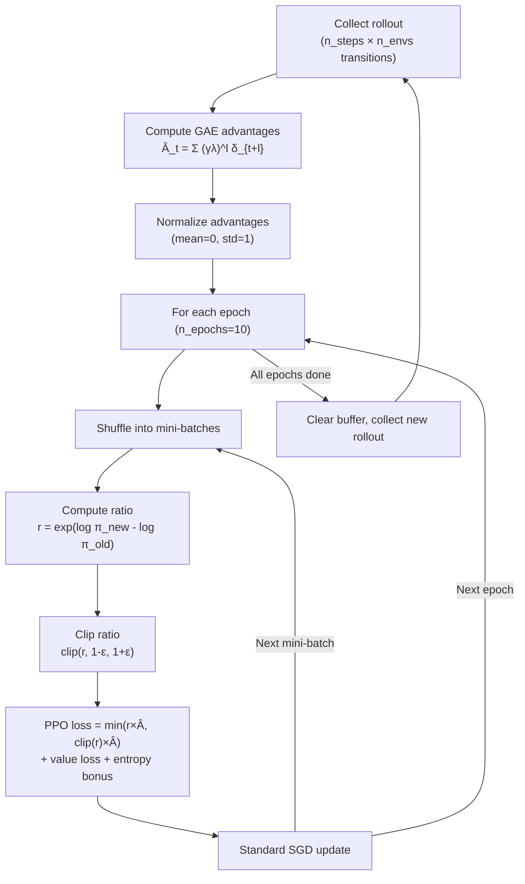

# PPO From Scratch — Interview Deep Dive

> **What this file covers**
> - 🎯 The PPO-Clip objective: why min(r×A, clip(r)×A) creates a pessimistic bound
> - 🧮 Full PPO update rule with worked example, GAE derivation, and advantage normalization
> - ⚠️ 4 failure modes: multi-epoch drift, value function lag, clip range sensitivity, entropy collapse
> - 📊 O(n_epochs × n_minibatches × |θ|) per update, O(rollout_size) memory
> - 💡 PPO-Clip vs PPO-Penalty vs TRPO — practical comparison
> - 🏭 PPO for RLHF: how the same algorithm aligns language models

---

## Brief restatement

PPO replaces TRPO's constrained optimization with a simpler clipped objective. It computes the probability ratio r(θ) = π_new/π_old, clips it to [1-ε, 1+ε], and takes the minimum of the clipped and unclipped objectives. This creates a pessimistic bound that prevents large policy changes without requiring Fisher matrices, conjugate gradient, or line search. The result is the most widely used RL algorithm in both research and industry.

---

## Full mathematical treatment

### 🧮 The PPO-Clip objective

> **Words:** PPO computes two versions of the surrogate objective — one with the original ratio and one with a clipped ratio — then takes whichever is smaller. This "pessimistic" choice ensures the gradient never encourages changes beyond the clip boundary.

> **Formula:**
>
>     L^CLIP(θ) = E_t[ min( r_t(θ) × Â_t,  clip(r_t(θ), 1-ε, 1+ε) × Â_t ) ]
>
> where:
>     r_t(θ) = π_θ(a_t | s_t) / π_θ_old(a_t | s_t)   — probability ratio
>     Â_t    — estimated advantage at timestep t
>     ε      — clip parameter, typically 0.2

**Case analysis — why the min works:**

| Advantage | Ratio | Unclipped r×A | Clipped r×A | min() picks | Effect |
|---|---|---|---|---|---|
| Â > 0 (good action) | r > 1+ε | Large positive | Capped positive | Clipped | Stops increasing probability |
| Â > 0 (good action) | r < 1+ε | Moderate positive | Same | Either | Normal gradient |
| Â < 0 (bad action) | r < 1-ε | Large negative | Capped negative | Unclipped | Stops decreasing probability |
| Â < 0 (bad action) | r > 1-ε | Moderate negative | Same | Either | Normal gradient |

The key insight: the min creates a **flat region** beyond the clip boundary where the gradient is zero. There is no incentive to push the ratio further.

> **Worked example:** Action a was taken in state s.
> - π_old(a|s) = 0.3, π_new(a|s) = 0.42, so r = 0.42/0.3 = 1.4
> - Advantage  = 2.0
> - Unclipped: 1.4 × 2.0 = 2.8
> - Clipped: clip(1.4, 0.8, 1.2) × 2.0 = 1.2 × 2.0 = 2.4
> - PPO picks min(2.8, 2.4) = 2.4
>
> The gradient with respect to θ comes from the clipped term, which treats r as if it were 1.2. This limits the update — the gradient does not benefit from pushing r above 1.2.

### 🧮 The full PPO loss

> **Words:** PPO combines three loss terms: the clipped policy loss, the value function loss, and an entropy bonus.

> **Formula:**
>
>     L^total(θ) = L^CLIP(θ) - c₁ × L^VF(θ) + c₂ × S[π_θ]
>
> where:
>     L^CLIP(θ) = E[ min(r × Â, clip(r, 1-ε, 1+ε) × Â) ]   — policy loss
>     L^VF(θ)   = E[ (V_θ(s_t) - V^target_t)² ]              — value function loss (MSE)
>     S[π_θ]    = E[ H(π_θ(·|s_t)) ]                          — entropy bonus
>     c₁ = 0.5  — value loss coefficient
>     c₂ = 0.01 — entropy coefficient

The signs are chosen for gradient ascent on the total objective: maximize policy improvement, minimize value error, maximize entropy.

### 🧮 Generalized Advantage Estimation (GAE)

> **Words:** GAE computes advantages by combining multiple TD residuals with exponential weighting. The parameter λ controls the bias-variance trade-off: λ=0 gives the 1-step TD advantage (low variance, high bias), λ=1 gives the Monte Carlo advantage (high variance, low bias).

> **Formula:** The TD residual at timestep t:
>
>     δ_t = r_t + γ V(s_{t+1}) - V(s_t)
>
> GAE combines TD residuals:
>
>     Â^GAE_t = δ_t + (γλ)δ_{t+1} + (γλ)²δ_{t+2} + ... = Σ_{l=0}^{T-t} (γλ)^l δ_{t+l}
>
> — γ = 0.99 (discount factor)
> — λ = 0.95 (GAE parameter)
> — Effective lookahead horizon: 1/(1-γλ) ≈ 20 steps

> **Worked example:** 3-step episode with γ=0.99, λ=0.95:
> - States: s₀, s₁, s₂ (terminal)
> - Rewards: r₀=1, r₁=2
> - Values: V(s₀)=3.0, V(s₁)=4.0, V(s₂)=0 (terminal)
>
> TD residuals:
> - δ₁ = 2 + 0.99×0 - 4.0 = -2.0
> - δ₀ = 1 + 0.99×4.0 - 3.0 = 0.96 + 1 - 3 = 0.96
>
> Wait — correcting: δ₀ = r₀ + γ×V(s₁) - V(s₀) = 1 + 0.99×4.0 - 3.0 = 1 + 3.96 - 3.0 = 1.96
>
> GAE advantages:
> - Â₁ = δ₁ = -2.0 (last step, no future terms)
> - Â₀ = δ₀ + (γλ)δ₁ = 1.96 + (0.99×0.95)×(-2.0) = 1.96 - 1.881 = 0.079
>
> Action at s₀ was slightly better than expected. Action at s₁ was much worse than expected.

### 🧮 Advantage normalization

> **Words:** Before using advantages in the PPO objective, normalize them to have mean 0 and standard deviation 1 across the current batch. This prevents the scale of returns from affecting the effective step size.

> **Formula:**
>
>     Â_normalized = (Â - mean(Â)) / (std(Â) + 1e-8)
>
> The 1e-8 prevents division by zero.

**Why this matters:** Without normalization, an environment that gives rewards of 1000 will have advantages ~100× larger than an environment with rewards of 10. The effective learning rate would be 100× larger, causing instability. Normalization makes PPO's behavior consistent across reward scales.

### 🧮 The PPO update procedure

The full update:

1. **Collect rollout** — run the current policy for n_steps steps across n_envs parallel environments. Store (s_t, a_t, log π_old(a_t|s_t), r_t, V(s_t), done_t) for each step.

2. **Compute GAE** — using stored rewards and values, compute Â_t for every timestep. Compute returns R_t = Â_t + V(s_t).

3. **Normalize advantages** — Â ← (Â - mean) / (std + ε).

4. **Multi-epoch optimization** — for each of n_epochs epochs:
   - Shuffle all transitions into random mini-batches of size batch_size
   - For each mini-batch:
     - Compute new log probs: log π_θ(a_t|s_t)
     - Compute ratio: r_t = exp(log π_θ - log π_old)
     - Compute clipped objective, value loss, entropy
     - Backpropagate and update θ

5. **Clear buffer** — discard all stored data.

---

## 🗺️ Concept diagram

---

## ⚠️ Failure modes and edge cases

### 1. Multi-epoch drift

**What happens:** PPO reuses the same rollout data for 10 epochs. By epoch 10, the current policy may have drifted significantly from π_old (whose log probs are stored in the buffer). The ratio r is still computed against π_old, so it will be large — but it was clipped at each mini-batch individually, so the cumulative drift was not bounded.

**When it occurs:** High learning rate (> 1e-3), many epochs (> 15), small rollout (< 512 steps per env).

**Detection:** Monitor approximate KL divergence after each update. If it exceeds 0.015, the policy has drifted too far.

**Fix:** Reduce learning rate. Reduce n_epochs to 3-5. Implement early stopping: stop epochs if approx_kl > target_kl (OpenAI's approach).

### 2. Value function lag

**What happens:** The critic learns slowly compared to the actor. The advantage estimates Â_t use a bad V(s), which makes the policy gradient noisy or biased. The actor improves rapidly in a wrong direction guided by a stale critic.

**When it occurs:** Shared actor-critic network where the policy head has larger gradients than the value head. Value coefficient c₁ too small. Complex environments with long horizons.

**Detection:** Value loss stops decreasing while policy loss continues to change. Explained variance of the value function drops below 0.5.

**Fix:** Increase c₁ from 0.5 to 1.0. Use separate networks for actor and critic. Clip value function updates (some implementations clip the value loss similarly to the policy loss).

### 3. Clip range sensitivity

**What happens:** The clip parameter ε interacts with the learning rate in non-obvious ways. A large ε (0.3+) allows big policy changes per step. A small ε (0.05) makes training extremely slow. The right ε depends on the environment and the learning rate.

**When it occurs:** Transferred hyperparameters from one environment to another. Changed the learning rate without adjusting ε.

**Detection:** With ε too large: occasional performance drops followed by recovery. With ε too small: flat learning curves, very low KL per update.

**Fix:** Use ε = 0.2 as default. If unstable, reduce to 0.1. If too slow, increase to 0.3. Some implementations anneal ε during training (start large, end small).

### 4. Entropy collapse

**What happens:** The policy becomes near-deterministic early in training. One action dominates with probability > 0.99. The agent stops exploring and gets stuck in a suboptimal strategy. The clipping cannot fix this because the gradient through the dominant action is already near-zero.

**When it occurs:** Environments with one obviously good action early on. Low entropy coefficient c₂. No entropy bonus (c₂ = 0).

**Detection:** Policy entropy drops below 0.1 within the first 10% of training. Action distributions peak at > 0.95 probability for one action.

**Fix:** Increase c₂ from 0.01 to 0.05-0.1. Anneal c₂ from high to low during training. Monitor entropy as a key training metric.

---

## 📊 Complexity analysis

| Metric | Formula | Typical values |
|---|---|---|
| **Data per update** | n_steps × n_envs | 2048 × 4 = 8192 transitions |
| **Gradient steps per update** | n_epochs × ⌈data / batch_size⌉ | 10 × 128 = 1280 steps |
| **Time per update** | O(n_epochs × n_minibatches × |θ|) | ~0.5s for 1M params |
| **Memory** | O(rollout_size + |θ|) — no replay buffer | ~50MB for 1M params, 8K rollout |
| **Total environment frames** | Problem-dependent | CartPole: ~100K, Atari: ~10M, RLHF: ~1M |

**Comparison with off-policy methods:**
- PPO needs 3-10× more environment samples than SAC/TD3 (on-policy waste)
- PPO uses ~10× less memory (no replay buffer)
- PPO's wall-clock per update is similar to SAC/TD3

---

## 💡 Design trade-offs

| | PPO-Clip | PPO-Penalty | TRPO |
|---|---|---|---|
| **Constraint mechanism** | Clip ratio to [1-ε, 1+ε] | Add β×KL to loss, adjust β adaptively | Constrain KL ≤ δ exactly |
| **Implementation** | Simple (1 extra line) | Moderate (adaptive β logic) | Complex (CG + line search) |
| **Formal guarantee** | None | None | Monotonic improvement |
| **Multi-epoch safe** | Yes (clipping bounds each step) | Yes (KL penalty grows with drift) | Not standard |
| **Hyperparameters** | ε, n_epochs | β_init, target_kl | δ, CG_iters |
| **Industry adoption** | Dominant | Occasional (RLHF variants) | Rare |

PPO-Clip won because it is simpler, faster, and empirically matches or exceeds the alternatives. PPO-Penalty is used in some RLHF systems where explicit KL control against the base model is important.

---

## 🏭 Production and scaling considerations

**PPO for RLHF — how ChatGPT was trained:**

1. **State** = conversation so far (token sequence). **Action** = next token. **Reward** = score from a reward model trained on human preferences.

2. **KL penalty against base model:** In RLHF, an additional KL term is added to the reward: r_modified = r_reward_model - β × KL(π_θ ∥ π_base). This prevents the RL-tuned model from diverging too far from the supervised-trained base model, preserving language quality.

3. **Scale:** The policy network has billions of parameters. PPO's clipping works with standard distributed training (data parallel, model parallel). TRPO's conjugate gradient would require specialized second-order distributed computation.

4. **Key hyperparameters for RLHF:** ε = 0.2, β (KL penalty) = 0.01-0.1, n_epochs = 1-4 (fewer than standard PPO because LLM inference is expensive), batch_size = large (for stable gradients).

5. **DPO challenge:** Direct Preference Optimization bypasses the reward model and RL loop entirely, optimizing preferences in a supervised manner. DPO is simpler but less flexible. PPO remains preferred when the reward signal is complex or dynamic.

---

## Staff/Principal Interview Depth

### Q1: Walk through the PPO-Clip objective. For both positive and negative advantage, explain what the clip does and why the min() is necessary.

---

**No Hire**
*Interviewee:* "PPO clips the ratio so the policy doesn't change too much. The min makes it more conservative."
*Interviewer:* No explanation of why clipping works differently for positive vs negative advantage. No case analysis.
*Criteria — Met:* none / *Missing:* case analysis, pessimistic bound explanation, gradient behavior

**Weak Hire**
*Interviewee:* "When the advantage is positive, we want to increase the action's probability. The clip prevents us from increasing it too much — the ratio is capped at 1.2. When the advantage is negative, the clip prevents us from decreasing it too much — the ratio is floored at 0.8. The min picks whichever is more conservative."
*Interviewer:* Correct intuition but does not explain which term the min selects in each case or what happens to the gradient beyond the clip boundary.
*Criteria — Met:* basic clipping intuition / *Missing:* which term min selects, gradient behavior, worked example

**Hire**
*Interviewee:* "For positive advantage: the unclipped term r× increases with r. The clipped term caps at 1.2×Â. When r > 1.2, the min picks the clipped term (1.2× < r×Â), so the gradient is zero with respect to further increases in r. This prevents over-optimization of good actions. For negative advantage: the unclipped term r× becomes more negative as r decreases. The clipped term caps at 0.8×Â. When r < 0.8, min picks the unclipped term (r× < 0.8× since both are negative), so the gradient with respect to r is zero for further decreases. This is the pessimistic bound — the min always picks the term that discourages extreme changes."
*Interviewer:* Complete case analysis with correct identification of which term min selects and why. Demonstrates understanding of the gradient behavior. Would elevate to Strong Hire with a numerical example and discussion of when this fails.
*Criteria — Met:* full case analysis, gradient behavior, pessimistic bound / *Missing:* worked example, failure conditions

**Strong Hire**
*Interviewee:* "Let me walk through with numbers. ε = 0.2. Suppose  = +2.0 and π_old(a|s) = 0.3. Case 1: π_new = 0.36, so r = 1.2. Unclipped: 1.2×2 = 2.4. Clipped: 1.2×2 = 2.4. Same — on the boundary. Case 2: π_new = 0.45, so r = 1.5. Unclipped: 3.0. Clipped: 1.2×2 = 2.4. Min picks 2.4. Gradient through the clipped term treats r as 1.2 — no signal to push r above 1.2. For  = -2.0: if r = 0.7, unclipped = -1.4, clipped = 0.8×(-2) = -1.6. Min picks -1.6, which is the clipped term. Wait — let me reconsider: min(-1.4, -1.6) = -1.6. So min picks the clipped term. But -1.6 is a larger penalty than -1.4. Actually, we're maximizing L^CLIP, so we want the loss to be large (less negative). The min gives us -1.6, which is worse than -1.4, so the optimizer pushes away from r < 0.8. The key subtlety: clipping creates a flat region in the objective where the gradient vanishes. Beyond the clip boundary, further changes provide no benefit (positive Â) or no reduction in penalty (negative Â). This fails when multiple mini-batch updates compound — each stays within [0.8, 1.2] individually, but cumulative KL can exceed 0.05+. Monitoring approx_kl and early stopping fixes this."
*Interviewer:* Exceptional walk-through with numerical examples for both cases, correct handling of the tricky negative advantage case, identification of the gradient behavior, and the key failure mode. Staff-level precision.
*Criteria — Met:* all

---

### Q2: Why does PPO normalize advantages, and what goes wrong without it?

---

**No Hire**
*Interviewee:* "Normalization makes the numbers smaller so training is more stable."
*Interviewer:* Vague and misses the key mechanism.
*Criteria — Met:* none / *Missing:* reward scale interaction with effective step size, mean-centering effect, specific failure mode

**Weak Hire**
*Interviewee:* "Different environments give rewards on different scales. Normalizing advantages to mean 0, std 1 makes PPO's behavior consistent across environments. Without it, high-reward environments would have larger gradients."
*Interviewer:* Correct observation about cross-environment consistency. Missing the deeper point about how advantage scale interacts with the clip range.
*Criteria — Met:* cross-environment consistency / *Missing:* clip range interaction, mean-centering analysis

**Hire**
*Interviewee:* "Normalization does two things. Mean-centering ensures roughly half the advantages are positive and half negative, so the policy both increases and decreases action probabilities each update — this prevents drift. Standard deviation scaling ensures that the effective step size is independent of reward magnitude. Without std scaling, in an environment with rewards of 1000, the advantages might be ±500, and the gradient r× would push the ratio far beyond the clip boundary even in a single step — the clip would always be active, and the gradient signal would be binary (clipped or not) rather than proportional."
*Interviewer:* Good analysis of both mean-centering and scaling. Identifies the interaction between advantage magnitude and clip range. Would be elevated by discussing edge cases (constant advantages, single-reward environments).
*Criteria — Met:* mean-centering, scaling, clip interaction / *Missing:* edge cases

**Strong Hire**
*Interviewee:* "Three effects of advantage normalization: (1) Scale invariance — the clip range ε = 0.2 implicitly defines the step size relative to advantage magnitude. If advantages are ±100, a ratio of 1.001 already contributes 0.1 to the objective, while if advantages are ±0.1, even a ratio of 2.0 only contributes 0.2. Normalizing to std=1 makes ε have a consistent meaning across environments. (2) Mean centering — without subtracting the mean, all advantages can be positive (if baseline is poor). This means the gradient always pushes to increase probabilities of all actions, just more for some than others. The policy drifts without any corrective signal. With mean=0, roughly half the updates decrease action probabilities. (3) Batch statistics — a subtle issue: normalization uses the batch mean/std, not global statistics. If the batch is too small, the normalization is noisy. If one trajectory dominates the batch, normalization can flip the sign of other trajectories' advantages. A batch size of at least 2048 transitions is needed for stable normalization."
*Interviewer:* Comprehensive three-point answer covering scale invariance, mean centering, and the subtle batch statistics issue. Staff-level attention to practical implementation details.
*Criteria — Met:* all

---

### Q3: Compare PPO to SAC. When is PPO the right choice despite being less sample-efficient?

---

**No Hire**
*Interviewee:* "PPO is simpler, SAC is better. Use SAC for robotics, PPO for everything else."
*Interviewer:* Oversimplified. Does not explain the on-policy vs off-policy distinction or why sample efficiency is not always the deciding factor.
*Criteria — Met:* none / *Missing:* on-policy vs off-policy, discrete actions, stability analysis, RLHF use case

**Weak Hire**
*Interviewee:* "PPO is on-policy and SAC is off-policy. SAC reuses data via a replay buffer so it needs fewer environment samples. But PPO is more stable and works with discrete actions, while SAC only works with continuous actions."
*Interviewer:* Correct high-level comparison. Missing the specific scenarios where PPO's properties outweigh SAC's sample efficiency.
*Criteria — Met:* on-policy vs off-policy, discrete actions / *Missing:* specific use cases, RLHF, stability analysis

**Hire**
*Interviewee:* "PPO is preferred in four scenarios: (1) Discrete actions — SAC requires a continuous action space for reparameterization; PPO works with Categorical distributions. (2) RLHF for LLMs — the 'action' is a discrete token, and PPO's stability is critical when fine-tuning a billion-parameter model. (3) Cheap simulation — when you can run 1000 environments in parallel (A2C-style), PPO's on-policy waste is offset by wall-clock efficiency. The data collection bottleneck disappears. (4) Simplicity and reliability — PPO has fewer hyperparameters (no replay buffer size, no tau for soft updates, no automatic temperature). It rarely diverges. SAC wins when continuous control data is expensive — real robots, slow physics sims — because its off-policy learning makes every sample count."
*Interviewer:* Four clear scenarios with good reasoning. Demonstrates understanding of when sample efficiency matters and when it doesn't. Would be elevated by discussing the RLHF KL penalty and why PPO's on-policy property is actually an advantage there.
*Criteria — Met:* discrete actions, RLHF, cheap simulation, simplicity / *Missing:* RLHF KL dynamics, on-policy advantage for alignment

**Strong Hire**
*Interviewee:* "PPO's on-policy nature, which is usually seen as a disadvantage, is actually beneficial for RLHF. In alignment, we want the policy to stay close to the base model — that's enforced by a KL penalty in the reward. An off-policy method like SAC would update using old data from a different policy, making the KL penalty stale. PPO always computes the KL against the current policy's behavior, giving accurate KL estimates. Additionally, PPO's stability is critical at scale: a single divergent update to a 70B parameter model wastes hours of GPU time. SAC's sample efficiency is irrelevant when the bottleneck is GPU inference cost, not environment samples — generating one RLHF trajectory requires running the full LLM. PPO's multi-epoch reuse (4 epochs) gives it 4× data efficiency for free, narrowing the gap with SAC. For continuous robotics, SAC clearly wins: a real robot can only collect ~1000 steps per hour, so 10× sample efficiency saves weeks. The decision rule is: discrete actions or LLMs → PPO. Continuous control with expensive data → SAC. Continuous control with cheap simulation → PPO (stability wins over sample efficiency)."
*Interviewer:* Exceptional answer. Identifies the non-obvious advantage of on-policy learning for alignment (KL accuracy), explains why sample efficiency is irrelevant for RLHF, and provides a clear decision framework. Staff-level systems thinking.
*Criteria — Met:* all

---

## Key Takeaways

🎯 1. PPO-Clip: L = min(r×Â, clip(r, 1-ε, 1+ε)×Â). The min creates a pessimistic bound that prevents large policy changes.
🎯 2. The full PPO loss combines clipped policy loss + c₁×value loss - c₂×entropy. Default: ε=0.2, c₁=0.5, c₂=0.01.
   3. GAE with λ=0.95 balances bias and variance in advantage estimation. Effective horizon ≈ 1/(1-γλ) ≈ 20 steps.
   4. Advantage normalization (mean=0, std=1) makes PPO's behavior independent of reward scale and prevents all-positive-advantage drift.
⚠️ 5. Multi-epoch drift: 10 epochs can push cumulative KL beyond safe bounds. Monitor approx_kl; early-stop if > 0.015.
⚠️ 6. Entropy collapse kills exploration. Monitor entropy; increase c₂ if it drops below 0.1 early in training.
   7. PPO dominates RLHF because on-policy learning gives accurate KL estimates, stability matters at billion-parameter scale, and sample efficiency is irrelevant when LLM inference is the bottleneck.
