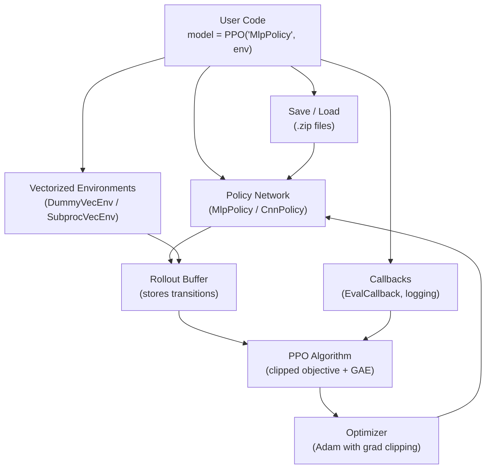

# PPO with Stable-Baselines3 — Interview Deep Dive

> **What this file covers**
> - 🎯 SB3 architecture: how production RL libraries are structured
> - 🧮 Vectorized environment math: effective batch size, throughput formulas
> - ⚠️ 3 failure modes: hyperparameter transfer, environment wrapping bugs, callback pitfalls
> - 📊 DummyVecEnv vs SubprocVecEnv: latency vs throughput trade-offs
> - 💡 From-scratch vs library: when each is appropriate
> - 🏭 Reproducibility, checkpointing, and deployment considerations

---

## Brief restatement

Stable-Baselines3 provides production-ready implementations of PPO, SAC, TD3, and other RL algorithms. It handles vectorized environments, rollout buffering, logging, and checkpointing — engineering concerns that are orthogonal to the algorithm but critical for reliable training. Using SB3 versus implementing from scratch is an engineering decision: from-scratch for learning and novel research, SB3 for production, benchmarking, and reproducibility.

---

## Full mathematical treatment

### 🧮 Vectorized environments and effective batch size

> **Words:** Vectorized environments run N copies of the same environment in parallel. Each PPO update collects n_steps transitions from each environment, giving a total rollout of n_steps × N transitions.

> **Formula:**
>
>     effective_batch = n_steps × n_envs
>     minibatch_count = ⌈effective_batch / batch_size⌉
>     gradient_steps_per_update = n_epochs × minibatch_count
>
> — n_steps = 2048 (default)
> — n_envs = 4 (typical)
> — batch_size = 64 (default)
> — n_epochs = 10 (default)

> **Worked example:** With defaults:
>
>     effective_batch = 2048 × 4 = 8192 transitions
>     minibatch_count = ⌈8192 / 64⌉ = 128 minibatches
>     gradient_steps = 10 × 128 = 1280 gradient steps per update
>
> Each "update" is 1280 SGD steps on 8192 data points. This is far more compute-intensive per environment step than REINFORCE (1 gradient step per episode).

### 🧮 Throughput analysis: DummyVecEnv vs SubprocVecEnv

> **Words:** DummyVecEnv runs environments sequentially in one process. SubprocVecEnv runs each in a separate process with true parallelism. The choice depends on environment speed.

> **Formula for wall-clock time per rollout:**
>
>     DummyVecEnv:    T_rollout = n_steps × n_envs × T_step
>     SubprocVecEnv:  T_rollout ≈ n_steps × T_step + n_steps × T_comm
>
> — T_step = time for one environment step
> — T_comm = inter-process communication overhead per step

> **Worked example:**
> - CartPole: T_step ≈ 0.01ms (very fast). T_comm ≈ 0.1ms.
>   - DummyVecEnv: 2048 × 4 × 0.01ms = 82ms
>   - SubprocVecEnv: 2048 × 0.01ms + 2048 × 0.1ms ≈ 225ms
>   - **DummyVecEnv wins** — communication overhead dominates.
>
> - MuJoCo: T_step ≈ 1ms. T_comm ≈ 0.1ms.
>   - DummyVecEnv: 2048 × 4 × 1ms = 8192ms
>   - SubprocVecEnv: 2048 × 1ms + 2048 × 0.1ms ≈ 2253ms
>   - **SubprocVecEnv wins** — true parallelism matters.

**Rule of thumb:** Use SubprocVecEnv when T_step > 1ms per step.

### 🧮 SB3 PPO defaults and their derivation

| Parameter | Default | Why this value |
|---|---|---|
| learning_rate | 3e-4 | Standard Adam default; works for most MLP policies |
| n_steps | 2048 | Large enough for stable GAE estimates; 2048 × 4 envs = 8192 batch |
| batch_size | 64 | Standard SGD minibatch; small enough for gradient noise to help exploration |
| n_epochs | 10 | Empirically found to give good multi-epoch reuse without excessive KL drift |
| clip_range | 0.2 | Allows 20% policy change; empirically robust across environments |
| gamma | 0.99 | Standard discount; effective horizon ≈ 100 steps |
| gae_lambda | 0.95 | Balances bias-variance in advantage estimation; effective lookahead ≈ 20 steps |
| ent_coef | 0.0 | SB3 default is 0; many practitioners set 0.01 for exploration |
| vf_coef | 0.5 | Value loss weight; standard from original PPO paper |
| max_grad_norm | 0.5 | Gradient clipping; prevents exploding gradients |

These defaults were tuned on a wide range of environments (Atari, MuJoCo, classic control). They rarely need adjustment for standard benchmarks.

---

## 🗺️ Concept diagram

---

## ⚠️ Failure modes and edge cases

### 1. Hyperparameter transfer failure

**What happens:** Hyperparameters tuned for one environment fail on another. A learning rate that works for CartPole causes divergence on Humanoid. Clip range that works for discrete actions is too tight for continuous. Default n_steps is too small for sparse-reward environments.

**When it occurs:** Using the same config across different environment families. Scaling from simple to complex environments without re-tuning.

**Detection:** Training diverges immediately or learning is flat. KL divergence per update is either always 0 (too conservative) or consistently > 0.05 (too aggressive).

**Fix:** Start with SB3 defaults. Adjust learning_rate first (try 1e-4 to 1e-3). Then n_steps (increase for sparse rewards). Then clip_range (decrease for stability). SB3 provides `optuna` integration for systematic hyperparameter search.

### 2. Environment wrapping bugs

**What happens:** SB3 expects environments to follow the Gymnasium API exactly. Common bugs: not resetting on done, returning wrong observation shapes, observation/action space mismatches, forgetting to handle truncation vs termination. These cause silent data corruption — the algorithm trains but learns garbage.

**When it occurs:** Custom environments, wrappers that modify observation/action spaces, environments that violate the step() contract.

**Detection:** SB3's `check_env()` utility catches many issues. Also: nonsensical learned behavior, value function diverging to infinity, NaN in observations.

**Fix:** Always run `check_env(env)` on custom environments. Wrap with `Monitor` for proper episode statistics. Test the environment manually before training.

### 3. Evaluation during training artifacts

**What happens:** Evaluating the policy during training (via EvalCallback) shows good performance, but the saved "best model" performs poorly when loaded separately. Common cause: evaluation uses a different random seed, different environment wrapper, or deterministic vs stochastic action selection.

**When it occurs:** EvalCallback with deterministic=True but production uses stochastic. Different observation normalization between training and evaluation environments.

**Detection:** Discrepancy between callback-reported rewards and loaded-model rewards.

**Fix:** Use the same environment wrapper for training and evaluation. Be explicit about deterministic vs stochastic. Save the VecNormalize statistics along with the model.

---

## 📊 Complexity analysis

| Component | Time | Memory |
|---|---|---|
| **Rollout collection** (DummyVecEnv, 4 envs) | O(n_steps × n_envs × T_step) | O(n_steps × n_envs × obs_dim) |
| **GAE computation** | O(n_steps × n_envs) | O(n_steps × n_envs) |
| **PPO update** (10 epochs, 128 minibatches) | O(n_epochs × n_minibatches × |θ|) | O(|θ|) |
| **Total per iteration** | Dominated by rollout or update, whichever is slower | O(rollout + |θ|) |
| **Model save/load** | O(|θ|) | O(|θ|) disk |

**Typical total training time (CartPole, 100K steps, laptop):** ~30 seconds
**Typical total training time (Atari, 10M steps, GPU):** ~12 hours
**Typical total training time (RLHF, 1M steps, 70B model, cluster):** ~days

---

## 💡 Design trade-offs

| | From scratch | Stable-Baselines3 | RLlib / CleanRL |
|---|---|---|---|
| **Control** | Full | Limited (use callbacks for customization) | Moderate |
| **Reliability** | Unknown (your bugs) | High (community tested) | High |
| **Features** | What you build | Logging, saving, callbacks, eval | Distributed, multi-agent |
| **Novel algorithms** | Easy to modify | Must subclass or fork | Framework-dependent |
| **Reproducibility** | Seed-dependent | Seed + versioned library | Seed + config system |
| **Best for** | Learning, research prototypes | Standard benchmarks, production | Large-scale distributed RL |

---

## 🏭 Production and scaling considerations

**Reproducibility:** SB3 supports seeded training via `seed=42` in the constructor. However, full reproducibility also requires: fixed library versions (pin `stable-baselines3==x.y.z`), fixed CUDA version (GPU operations are non-deterministic by default), and fixed environment version. Save the full config alongside the model.

**Checkpointing:** Use `CheckpointCallback` to save the model every N steps. For long training runs, this prevents losing hours of compute to a crash. The saved `.zip` file contains: network weights, optimizer state, and hyperparameters. It does NOT save: the replay buffer (for off-policy methods), or the VecNormalize running statistics (save separately).

**Monitoring:** SB3 integrates with TensorBoard. Key metrics to monitor: `ep_rew_mean` (episode reward), `approx_kl` (KL divergence per update), `entropy_loss` (policy entropy), `value_loss` (critic accuracy), `clip_fraction` (how often clipping is active — should be 0.1-0.3, not 0.0 or 1.0).

**Deployment:** Trained models can be exported for inference-only use. The key method is `model.predict(obs, deterministic=True)`. For production deployment, extract the PyTorch network from `model.policy` and deploy it independently of SB3.

---

## Staff/Principal Interview Depth

### Q1: When would you implement PPO from scratch instead of using Stable-Baselines3, and what are the risks of each approach?

---

**No Hire**
*Interviewee:* "Always use the library. It's better."
*Interviewer:* Does not recognize valid use cases for from-scratch implementation and shows no understanding of library limitations.
*Criteria — Met:* none / *Missing:* from-scratch use cases, library limitations, risk analysis

**Weak Hire**
*Interviewee:* "Use from-scratch for learning and research. Use SB3 for production. From scratch risks bugs, SB3 risks inflexibility."
*Interviewer:* Correct at a high level but no specific examples of when SB3's abstraction gets in the way or what kinds of bugs are common in from-scratch implementations.
*Criteria — Met:* basic trade-off / *Missing:* specific examples, risk categories

**Hire**
*Interviewee:* "From-scratch when: (1) Novel algorithm — SB3's PPO has a fixed structure; if you need a different loss function, a non-standard network architecture, or custom rollout logic, modifying SB3 is harder than writing it fresh. (2) Integration with non-standard environments — custom observation pipelines, multi-agent setups, or environments that don't follow the Gymnasium API. (3) Understanding — you can't debug what you don't understand. Risks of from-scratch: silent numerical bugs (wrong GAE sign, missing advantage normalization, incorrect entropy computation), missing engineering details (gradient clipping, observation normalization, proper done handling). Risks of SB3: treating it as a black box, not monitoring training metrics, using default hyperparameters when they don't fit the task."
*Interviewer:* Good specific examples for both approaches. Identifies important risk categories. Would be elevated by discussing reproducibility and benchmarking.
*Criteria — Met:* from-scratch use cases, library limitations, specific risks / *Missing:* reproducibility, benchmarking considerations

**Strong Hire**
*Interviewee:* "The decision depends on the goal. For a research paper: from-scratch if the contribution involves modifying the algorithm itself; SB3 if the contribution is a new environment or reward design. For production: SB3 unless the deployment target requires stripping the library dependency (then extract the trained network). For benchmarking: SB3 is essential — it provides reproducible baselines that reviewers trust. A 'we implemented PPO ourselves' baseline is suspect. The most common from-scratch bugs are: (1) GAE computation off-by-one in the done flag handling, (2) not detaching old log probs before computing the ratio, (3) applying softmax twice (once in the network, once when creating the Categorical distribution). The most common SB3 misuse is: (1) not using check_env() on custom environments, (2) ignoring VecNormalize requirements, (3) comparing models trained with different numbers of environments without accounting for effective batch size (n_steps × n_envs)."
*Interviewer:* Specific, actionable answer covering research, production, and benchmarking contexts. The bug inventory demonstrates real implementation experience. Staff-level practical judgment.
*Criteria — Met:* all

---

### Q2: Explain the difference between DummyVecEnv and SubprocVecEnv. When does each one provide better wall-clock performance?

---

**No Hire**
*Interviewee:* "SubprocVecEnv is always faster because it runs in parallel."
*Interviewer:* Incorrect. SubprocVecEnv has communication overhead that makes it slower for fast environments.
*Criteria — Met:* none / *Missing:* communication overhead, crossover analysis

**Weak Hire**
*Interviewee:* "DummyVecEnv runs environments sequentially in one process. SubprocVecEnv uses multiple processes for true parallelism. SubprocVecEnv is faster for slow environments, DummyVecEnv for fast ones because of communication overhead."
*Interviewer:* Correct qualitative answer. Missing the quantitative crossover point and specific examples.
*Criteria — Met:* qualitative trade-off / *Missing:* quantitative analysis, crossover point

**Hire**
*Interviewee:* "DummyVecEnv: total time = N × n_steps × T_step. SubprocVecEnv: total time ≈ n_steps × max(T_step, T_comm), where T_comm is IPC overhead per step. The crossover is when T_step ≈ T_comm. For CartPole (T_step ≈ 0.01ms, T_comm ≈ 0.1ms), DummyVecEnv is ~3× faster with 4 envs because the overhead dominates. For MuJoCo (T_step ≈ 1ms), SubprocVecEnv is ~4× faster because true parallelism saves 4× on the expensive step. For Atari with frame stacking (T_step ≈ 5ms), SubprocVecEnv is clearly better."
*Interviewer:* Quantitative analysis with concrete examples and a clear decision rule. Demonstrates practical experience. Would be elevated by discussing GIL, observation transfer costs, and startup overhead.
*Criteria — Met:* quantitative analysis, crossover point, examples / *Missing:* GIL discussion, large observation overhead

**Strong Hire**
*Interviewee:* "Three factors beyond raw step time: (1) Python's GIL — DummyVecEnv is GIL-bound. Even if environments release the GIL (C extensions), the Python-level step() wrapper holds it. SubprocVecEnv bypasses the GIL entirely. (2) Observation transfer — SubprocVecEnv serializes observations via pipes. For image observations (84×84×4 uint8 = 28KB), this is ~0.05ms per transfer. For large observations (e.g., point clouds), serialization can dominate. Shared memory wrappers help but add complexity. (3) Startup cost — SubprocVecEnv spawns N processes at creation. This takes 1-5 seconds and is a one-time cost, negligible for long training but significant for short experiments. Decision rule: T_step < 0.5ms → DummyVecEnv. T_step > 2ms → SubprocVecEnv. In between, benchmark both. For GPU-accelerated environments (IsaacGym, Brax), neither — use the environment's built-in batching which runs all instances on GPU without any Python IPC."
*Interviewer:* Deep systems-level answer covering GIL, serialization costs, startup overhead, and GPU-native environments. Demonstrates production engineering knowledge beyond standard RL.
*Criteria — Met:* all

---

### Q3: What metrics should you monitor during PPO training to detect problems early?

---

**No Hire**
*Interviewee:* "Just watch the reward curve."
*Interviewer:* Reward alone is insufficient. Many problems (entropy collapse, value divergence, excessive KL) are invisible in the reward curve until it's too late.
*Criteria — Met:* none / *Missing:* KL, entropy, value loss, clip fraction

**Weak Hire**
*Interviewee:* "Monitor reward, loss, and maybe entropy. If the reward stops improving, something is wrong."
*Interviewer:* Correct that multiple metrics matter but does not specify what each metric reveals or what values indicate problems.
*Criteria — Met:* awareness of multiple metrics / *Missing:* specific diagnostic values, interpretation

**Hire**
*Interviewee:* "Five key metrics: (1) ep_rew_mean — episode reward, the ultimate measure. Smooth upward trend is good. (2) approx_kl — approximate KL divergence per update. Should be 0.005-0.02. Above 0.03 means the policy is changing too fast. (3) entropy_loss — policy entropy. Should decrease gradually, not crash. A sudden drop below 0.1 means entropy collapse. (4) value_loss — critic accuracy. Should decrease over training. If it increases while reward increases, the critic is failing. (5) clip_fraction — fraction of samples where clipping was active. Should be 0.1-0.3. Near 0 means ε is too large. Near 1 means the policy is trying to change too much."
*Interviewer:* Five specific metrics with healthy ranges and diagnostic interpretation. Good breadth. Would be elevated by discussing explained_variance and learning rate schedules.
*Criteria — Met:* 5 metrics with ranges, diagnostic interpretation / *Missing:* explained_variance, corrective actions

**Strong Hire**
*Interviewee:* "I group metrics into three categories. Health metrics (monitor continuously): approx_kl (0.005-0.02, early-stop if > 0.015), clip_fraction (0.1-0.3), entropy (gradual decrease, never collapse). Performance metrics: ep_rew_mean (primary), ep_len_mean (shorter episodes often indicate better policy for goal-reaching tasks). Diagnostic metrics: explained_variance — Var(returns - V(s))/Var(returns). Should approach 1.0. Below 0.5 means the critic is a poor predictor, and advantage estimates are noisy. value_loss should decrease; if it rises while returns are stable, the critic architecture is too small. When I see problems: approx_kl too high → reduce lr or n_epochs. Clip fraction too low → increase lr or ε. Entropy collapse → increase ent_coef and add curriculum. Explained variance low → increase critic capacity or c₁. I log all of these to TensorBoard and set alerts for approx_kl > 0.03 and entropy < 0.1 in automated training pipelines."
*Interviewer:* Categorized monitoring system with specific diagnostic values, corrective actions, and automated alerting. Demonstrates production ML engineering discipline beyond just RL knowledge.
*Criteria — Met:* all

---

## Key Takeaways

🎯 1. SB3 provides production-ready PPO with tested code, vectorized environments, logging, and checkpointing. Same algorithm, better engineering.
   2. Effective batch size = n_steps × n_envs. Default: 2048 × 4 = 8192. Each update performs 10 × 128 = 1280 gradient steps.
   3. DummyVecEnv for fast environments (< 0.5ms/step), SubprocVecEnv for slow ones (> 2ms/step). Benchmark in between.
⚠️ 4. Always run check_env() on custom environments. Silent API violations cause garbage training.
   5. Key metrics: approx_kl (0.005-0.02), clip_fraction (0.1-0.3), entropy (gradual decrease), explained_variance (→ 1.0).
   6. From-scratch for learning and novel algorithms. SB3 for production, benchmarking, and reproducibility.
   7. Save VecNormalize statistics alongside the model — observation normalization is part of the policy.
