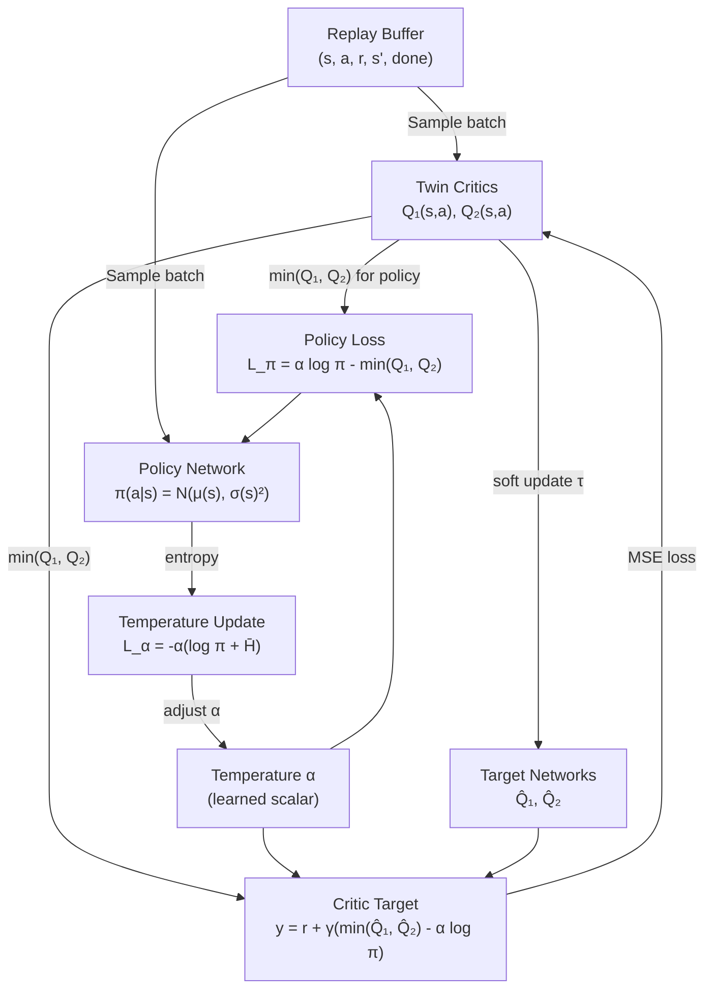

# SAC for Continuous Control — Interview Deep Dive

> **What this file covers**
> - 🎯 Maximum entropy RL: J(π) = E[Σ r + α H(π)] — why adding entropy helps
> - 🧮 SAC's three update rules: soft Q-function, policy via reparameterization, automatic temperature
> - ⚠️ 4 failure modes: temperature instability, Q overestimation despite twin critics, replay buffer staleness, entropy target mismatch
> - 📊 Off-policy sample efficiency: SAC needs 3-10× fewer samples than PPO
> - 💡 SAC vs TD3 vs PPO: on-policy/off-policy, stochastic/deterministic, discrete/continuous
> - 🏭 SAC for robotics: sim-to-real transfer and real-world deployment

---

## Brief restatement

SAC maximizes a modified objective that adds an entropy bonus to the standard expected return. This encourages the policy to maintain randomness — exploring diverse strategies while still achieving high reward. SAC is off-policy (uses a replay buffer for sample efficiency), uses twin critics (to prevent Q-value overestimation), and automatically tunes its temperature parameter α (balancing reward vs entropy). It is the state-of-the-art for continuous control tasks.

---

## Full mathematical treatment

### 🧮 The maximum entropy objective

> **Words:** Standard RL maximizes expected reward. SAC maximizes expected reward plus a weighted entropy term. Higher entropy means the policy stays random — it keeps multiple good strategies alive instead of committing to one.

> **Formula:**
>
>     J(π) = Σ_{t=0}^{T} E_{(s_t, a_t) ~ ρ_π} [ r(s_t, a_t) + α H(π(·|s_t)) ]
>
> where:
>     H(π(·|s)) = -E_{a ~ π} [ log π(a|s) ]  — entropy of the policy at state s
>     α > 0  — temperature parameter controlling the entropy-reward trade-off
>     ρ_π    — state-action distribution induced by π

> **Worked example (discrete for clarity):** State s, 3 actions.
> - Policy: π(a₁|s) = 0.5, π(a₂|s) = 0.3, π(a₃|s) = 0.2
> - H(π) = -(0.5 log 0.5 + 0.3 log 0.3 + 0.2 log 0.2) = -(−0.347 − 0.361 − 0.322) = 1.03 nats
> - Uniform policy: H = log 3 = 1.10 nats (maximum)
> - Deterministic policy: H = 0 nats (minimum)
>
> With α = 0.2 and expected reward = 5.0:
> J = 5.0 + 0.2 × 1.03 = 5.206. The entropy bonus adds 0.206 to the objective.

### 🧮 The soft Bellman equation

> **Words:** In maximum entropy RL, the value function includes the expected future entropy. The "soft" Q-function accounts for both future rewards and future randomness.

> **Formula:**
>
>     Q^soft(s, a) = r(s, a) + γ E_{s'} [ V^soft(s') ]
>     V^soft(s) = E_{a ~ π} [ Q^soft(s, a) - α log π(a|s) ]
>              = E_{a ~ π} [ Q^soft(s, a) ] + α H(π(·|s))
>
> The soft value function V^soft is the expected Q minus the log probability, which is equivalent to Q plus entropy.

### 🧮 SAC's three update rules

**1. Soft Q-function update (twin critics):**

> **Words:** SAC trains two Q-networks (Q₁ and Q₂) to predict the soft Q-value. The target uses the minimum of the two target networks to prevent overestimation.

> **Formula:**
>
>     Target: y = r + γ (min(Q̂₁(s', ã'), Q̂₂(s', ã')) - α log π(ã'|s'))
>     where ã' ~ π(·|s')
>
>     Loss: L_Q = E[ (Q_i(s, a) - y)² ]  for i = 1, 2
>
> — Q̂₁, Q̂₂ are target networks (slow-moving copies)
> — ã' is sampled from the current policy (not the replay buffer action)
> — The min prevents the optimistic bias that plagues single-critic methods

**2. Policy update (reparameterization trick):**

> **Words:** The policy outputs a mean μ and standard deviation σ for each action dimension. Actions are sampled via the reparameterization trick: a = tanh(μ + σ × ε), where ε ~ N(0, 1). This makes the sampling differentiable.

> **Formula:**
>
>     L_π = E_{s ~ D} [ E_{a ~ π} [ α log π(a|s) - min(Q₁(s, a), Q₂(s, a)) ] ]
>
> Gradient is computed through the reparameterized sample:
>
>     a_θ = tanh(μ_θ(s) + σ_θ(s) × ε),  ε ~ N(0, I)
>
> The tanh squashing ensures actions stay in [-1, 1]. A log-det-Jacobian correction accounts for this transformation:
>
>     log π(a|s) = log N(u; μ, σ²) - Σ_i log(1 - tanh²(u_i))
>
> where u is the pre-tanh action.

> **Worked example (1D action):**
> - μ = 0.3, σ = 0.5, sampled ε = 0.7
> - Pre-tanh: u = 0.3 + 0.5 × 0.7 = 0.65
> - Action: a = tanh(0.65) = 0.572
> - Log prob (Gaussian): log N(0.65; 0.3, 0.25) = -0.5 log(2π × 0.25) - (0.65-0.3)²/(2×0.25) = -1.144 - 0.245 = -1.389
> - Jacobian correction: -log(1 - tanh²(0.65)) = -log(1 - 0.327) = -log(0.673) = 0.396
> - Final log prob: -1.389 - 0.396 = -1.785

**3. Automatic temperature update:**

> **Words:** SAC learns α automatically by targeting a specific entropy level. If the policy's entropy is below the target, α increases (more exploration). If above, α decreases (more exploitation).

> **Formula:**
>
>     L_α = E_{a ~ π} [ -α (log π(a|s) + H̄) ]
>
> where H̄ is the target entropy, typically set to -dim(A) (negative of action dimensionality).
>
> — For a 3D action space: H̄ = -3
> — For a 1D action space: H̄ = -1

> **Worked example:** 2D action space, H̄ = -2.
> - Current policy entropy: H(π) = -E[log π] = 1.5 (above |H̄| = 2? No: entropy is 1.5, target magnitude is 2)
> - Since entropy (1.5) < target magnitude (2), α should increase to encourage more exploration
> - Gradient of L_α pushes α up when -log π(a|s) < |H̄|

---

## 🗺️ Concept diagram

---

## ⚠️ Failure modes and edge cases

### 1. Temperature instability

**What happens:** The learned α oscillates or diverges. If α becomes too large, the policy becomes nearly uniform (all actions equally likely) and reward signal is ignored. If α collapses to near-zero, the agent loses the entropy benefit and may get stuck.

**When it occurs:** Target entropy H̄ is poorly chosen. Very high-dimensional action spaces where the default H̄ = -dim(A) is too aggressive. Environments where the optimal policy is near-deterministic (α should be small but the automatic tuning fights this).

**Detection:** α changes by more than 10× during training. Policy entropy oscillates rather than smoothly decreasing. Performance degrades when α spikes.

**Fix:** Clip α to a reasonable range (e.g., [0.01, 1.0]). Adjust target entropy: use H̄ = -0.5 × dim(A) for easier tasks. Use a smaller learning rate for α (separate from the main learning rate).

### 2. Q-value overestimation despite twin critics

**What happens:** Twin critics reduce overestimation but do not eliminate it. Both Q-networks can be biased in the same direction if they are trained on the same data and have similar architectures. The min(Q₁, Q₂) then underestimates less than intended.

**When it occurs:** Small replay buffer (Q-networks see the same data repeatedly). Correlated Q-network initializations. Long training runs where both networks converge to similar biases.

**Detection:** Q-values grow steadily throughout training without corresponding reward improvement. Plot Q(s,a) vs actual discounted return for validation trajectories.

**Fix:** Increase replay buffer size. Use different random initializations. Some implementations add a small amount of noise to the target Q-values (target policy smoothing, from TD3).

### 3. Replay buffer staleness

**What happens:** The replay buffer contains very old transitions from a much worse policy. Training on these stale transitions slows learning or introduces bias — the Q-network learns values for states the current policy would never visit.

**When it occurs:** Large buffer size (> 1M) with slow environment. Early low-quality data dominates the buffer. Non-stationary environments where old data is actually wrong.

**Detection:** Mean replay buffer return is much lower than current policy return. Training loss is high even after many updates.

**Fix:** Use prioritized experience replay (sample important transitions more often). Reduce buffer size. Increase learning_starts to collect better initial data before training.

### 4. Entropy target mismatch

**What happens:** The default target entropy H̄ = -dim(A) assumes the optimal policy needs roughly 1 nat of entropy per action dimension. For tasks where the optimal policy is near-deterministic (e.g., precise grasping), this forces unnecessary exploration. For tasks with multiple optimal strategies, this target may be too low.

**When it occurs:** High-dimensional action spaces (dim > 10) where H̄ = -10 forces extremely random behavior. Tasks with a clear single optimum.

**Detection:** Final policy entropy stays far from the target. Policy ignores reward signal when α is large (chasing the entropy target instead of reward).

**Fix:** Set H̄ manually based on task characteristics. Use H̄ = -0.5 × dim(A) or -0.25 × dim(A) for precise control tasks. For tasks with multiple optima, the default is usually fine.

---

## 📊 Complexity analysis

| Metric | Formula | Typical values |
|---|---|---|
| **Updates per environment step** | train_freq × gradient_steps | 1 × 1 = 1 update per step |
| **Memory** | buffer_size × (obs_dim + act_dim + 3) × 4 bytes | 1M × 30 × 4 = 120MB |
| **Time per update** | O(batch_size × |θ|) × 3 (two critics + policy) | ~1ms for 256 batch, 1M params |
| **Sample efficiency** | Reaches good performance in 100K-500K steps (continuous control) | 3-10× fewer than PPO |
| **Wall-clock efficiency** | Limited by environment step speed (off-policy = fewer env steps needed) | — |

**SAC vs PPO sample efficiency (MuJoCo benchmarks):**
- HalfCheetah: SAC ~300K steps, PPO ~1M steps (3.3× ratio)
- Humanoid: SAC ~3M steps, PPO ~30M steps (10× ratio)
- Ant: SAC ~1M steps, PPO ~10M steps (10× ratio)

---

## 💡 Design trade-offs

| | SAC | TD3 | PPO |
|---|---|---|---|
| **Policy type** | Stochastic (Gaussian) | Deterministic + noise | Stochastic |
| **Exploration** | Built-in (entropy bonus) | Added noise (Gaussian/OU) | Built-in (stochastic policy) |
| **Off-policy** | Yes (replay buffer) | Yes (replay buffer) | No (on-policy) |
| **Action space** | Continuous only | Continuous only | Discrete or continuous |
| **Key innovation** | Maximum entropy + auto α | Delayed policy updates + target smoothing | Clipped objective |
| **Sample efficiency** | High | High | Lower |
| **Stability** | High (twin critics, auto α) | Very high (delayed updates, smoothing) | Very high (clipping) |
| **Best for** | Exploration-heavy continuous tasks | Precision continuous control | General purpose, RLHF |

---

## 🏭 Production and scaling considerations

**SAC for robotics — sim-to-real transfer:**

SAC's stochastic policy helps with sim-to-real transfer. In simulation, the physics are approximate. A deterministic policy trained in simulation may execute a precise sequence of actions that happens to work due to simulator artifacts. A stochastic policy trained with SAC naturally explores diverse strategies, and the entropy bonus prevents over-fitting to simulator-specific dynamics. This makes SAC policies more robust when transferred to real hardware.

**Practical deployment considerations:**

1. **Action clipping.** SAC's tanh squashing outputs actions in [-1, 1]. The environment wrapper must scale these to the actual action range. Incorrect scaling is a common deployment bug.

2. **Deterministic evaluation.** During training, SAC samples from the Gaussian. During evaluation/deployment, use the mean action (deterministic) for consistent behavior. SB3: `model.predict(obs, deterministic=True)`.

3. **Replay buffer memory.** A 1M-step buffer for a 100-dimensional observation space requires ~400MB. For image observations (84×84×3), this becomes ~20GB. Solutions: compress observations, use smaller buffers, or use disk-backed buffers.

4. **Multi-GPU training.** SAC's off-policy nature makes distributed training tricky — the replay buffer must be shared or synchronized. The standard approach is a centralized buffer with parallel environment workers feeding it and a single learner consuming from it.

---

## Staff/Principal Interview Depth

### Q1: Why does SAC add entropy to the reward, and what would go wrong without it?

---

**No Hire**
*Interviewee:* "Entropy encourages exploration. Without it, the agent would not explore enough."
*Interviewer:* Correct at surface level but does not explain why a stochastic policy without entropy bonus already has some exploration, or what specific failure modes the entropy bonus prevents.
*Criteria — Met:* none / *Missing:* specific failure modes, connection to robustness, multi-modality, mathematical formulation

**Weak Hire**
*Interviewee:* "Without the entropy bonus, a stochastic policy can still collapse to near-deterministic behavior. The entropy bonus explicitly rewards randomness, preventing premature convergence. This helps with exploration in sparse-reward environments."
*Interviewer:* Better — identifies premature convergence. Missing the robustness and multi-modality benefits, and no mathematical detail.
*Criteria — Met:* premature convergence prevention / *Missing:* robustness, multi-modality, temperature role, mathematical formulation

**Hire**
*Interviewee:* "Three benefits of entropy regularization: (1) Exploration — the policy maintains diversity in action selection, preventing it from getting stuck in local optima. (2) Robustness — by learning multiple near-optimal strategies, the policy is more robust to perturbations. If one strategy fails due to environment changes, alternatives are ready. (3) Pre-training for transfer — a high-entropy policy provides a better initialization for fine-tuning on new tasks. Without entropy, the policy would commit fully to one strategy, losing adaptability. The temperature α controls the trade-off: large α prioritizes entropy (more exploration), small α prioritizes reward. SAC auto-tunes α to maintain target entropy H̄ = -dim(A)."
*Interviewer:* Three clear benefits with good explanations. Mentions the temperature parameter and automatic tuning. Would be elevated by discussing the connection to energy-based models or the specific failure mode of Q-function over-exploitation.
*Criteria — Met:* three benefits, temperature role / *Missing:* Q-exploitation failure, connection to soft Bellman equation

**Strong Hire**
*Interviewee:* "The entropy bonus addresses a fundamental problem in off-policy actor-critic methods: the policy is optimized to maximize Q(s, a), but Q itself is an imperfect estimate. Without entropy, the policy finds narrow peaks in the Q-landscape — actions where the Q-network happens to have high values due to approximation error. This is called Q-exploitation. The policy becomes deterministic, exploiting errors in Q rather than finding genuinely good actions. Entropy regularization smooths this: instead of maximizing Q, the policy maximizes Q - α log π, which penalizes concentration. The resulting policy spreads probability mass across all actions proportional to exp(Q/α) — this is the soft Bellman equation, connecting SAC to Boltzmann-style energy-based policies. Without entropy, standard soft actor-critic degrades to DDPG-like deterministic behavior with the same overestimation and exploration failures. With entropy, the policy maintains a Gaussian distribution whose variance is adaptively controlled by α. The automatic temperature tuning ensures the policy converges to the right entropy level for the task — neither wasting exploration budget on easy tasks nor under-exploring hard ones."
*Interviewer:* Identifies Q-exploitation as the core failure, connects entropy to the soft Bellman equation and energy-based models, and explains automatic temperature tuning. Staff-level synthesis of theory and practice.
*Criteria — Met:* all

---

### Q2: How do SAC's twin critics prevent Q-value overestimation, and how does this differ from Double DQN's approach?

---

**No Hire**
*Interviewee:* "SAC uses two Q-networks and takes the minimum. Double DQN also uses two networks."
*Interviewer:* Does not distinguish between the two approaches or explain why overestimation occurs.
*Criteria — Met:* none / *Missing:* overestimation mechanism, SAC vs Double DQN difference, why min helps

**Weak Hire**
*Interviewee:* "Q-value overestimation happens because the max operator in Q-learning propagates noise upward — even random errors in Q lead to overestimates when you take the max over actions. SAC uses two separate Q-networks and takes the minimum for the target, which counteracts this. Double DQN uses the online network to select actions and the target network to evaluate them."
*Interviewer:* Correct distinction between SAC twin critics and Double DQN. Missing the mathematical explanation of why min helps and when it can underestimate.
*Criteria — Met:* overestimation mechanism, SAC vs Double DQN distinction / *Missing:* mathematical analysis, underestimation risk

**Hire**
*Interviewee:* "The overestimation problem: the target y = r + γ max_a Q(s', a) uses the same Q-function to both select and evaluate the best action. Noise in Q(s', a) means max_a Q > true max — the maximum of noisy estimates is biased upward. Double DQN decouples selection and evaluation: selects a* = argmax_a Q_online(s', a), evaluates with Q_target(s', a*). This reduces but does not eliminate the bias because Q_online still has noise in action selection. SAC goes further: it maintains two independent Q-networks with different random initializations. The target uses min(Q₁(s', a'), Q₂(s', a')), which gives a pessimistic estimate. If one Q-network overestimates, the other likely does not (because they have uncorrelated errors), so the min gives a better estimate. The risk is underestimation — taking the min can be too conservative, slowing learning. In practice, this underestimation is much less harmful than overestimation, which causes cascading errors."
*Interviewer:* Complete analysis of both approaches, identifies the underestimation trade-off. Would be elevated by discussing when twin critics fail (correlated errors) and the connection to TD3.
*Criteria — Met:* mathematical analysis, both approaches compared, underestimation risk / *Missing:* correlated error failure, TD3 connection

**Strong Hire**
*Interviewee:* "Three levels of defense against overestimation, in order of strength: (1) Target network (DQN) — uses a slow-moving copy for evaluation, reducing variance but not eliminating the maximization bias. (2) Double DQN — decouples selection (online) from evaluation (target), removing the bias when Q_online perfectly selects the best action, but in practice Q_online is noisy too. (3) Twin critics (SAC/TD3) — two independent Q-functions, take min for the target. This works because E[min(Q₁, Q₂)] ≤ min(E[Q₁], E[Q₂]) ≤ E[Q]. The gap between min and true Q is the underestimation bias. TD3 originated this idea but uses it with a deterministic policy; SAC adapted it with the entropy-augmented target: y = r + γ(min(Q̂₁, Q̂₂) - α log π). The twin critics can fail when both networks converge to similar biases — this happens with small buffers or highly correlated training. Increasing buffer size and using different architectures or random seeds mitigates this. Empirically, twin critics reduce overestimation by 50-80% compared to single-critic methods."
*Interviewer:* Hierarchical analysis across three methods, precise mathematical relationship, identifies the convergence failure mode, and provides empirical context. Staff-level depth.
*Criteria — Met:* all

---

### Q3: When should you choose SAC over PPO for a production RL system?

---

**No Hire**
*Interviewee:* "SAC is newer and better, so always use SAC."
*Interviewer:* Incorrect. PPO is better suited for many tasks. Shows no understanding of the trade-offs.
*Criteria — Met:* none / *Missing:* action space constraint, sample efficiency, stability analysis

**Weak Hire**
*Interviewee:* "Use SAC for continuous control because it's more sample-efficient. Use PPO for discrete actions because SAC only works with continuous. SAC also explores better."
*Interviewer:* Correct top-level rule. Missing the nuances of when PPO is better even for continuous control.
*Criteria — Met:* action space constraint, sample efficiency / *Missing:* cheap simulation scenario, RLHF, memory/stability analysis

**Hire**
*Interviewee:* "SAC when: (1) continuous actions AND data is expensive — real robots, slow simulations, where 3-10× sample efficiency saves weeks. (2) The task benefits from exploration — sparse rewards, multiple valid strategies, environment stochasticity. (3) You can afford the memory for a replay buffer. PPO when: (1) discrete actions (SAC cannot handle). (2) RLHF or language models (discrete tokens). (3) Cheap simulation — 1000 parallel environments make PPO's on-policy waste negligible, and its stability is an advantage. (4) Simpler deployment — PPO has no replay buffer to manage, no twin critics, no temperature tuning."
*Interviewer:* Good decision framework with four criteria for each algorithm. Would be elevated by discussing the memory and stability implications in more detail, and the on-policy advantage for RLHF.
*Criteria — Met:* comprehensive decision framework / *Missing:* memory analysis, RLHF on-policy advantage, deployment considerations

**Strong Hire**
*Interviewee:* "The decision has three dimensions: (1) Action space — discrete → PPO, continuous → both viable. (2) Data economics — if one environment step costs > 10ms wall-clock, SAC's 3-10× sample efficiency saves significant time. If environment steps are < 1ms and you can run 100+ in parallel, PPO's on-policy waste is irrelevant and its simplicity wins. (3) System engineering — SAC requires: replay buffer (can be 1-20GB for image observations), twin Q-networks and target networks (4× the model parameters), temperature scheduling. PPO requires: rollout buffer (much smaller), single actor-critic network. For RLHF specifically, PPO has a non-obvious advantage: the KL penalty against the base model requires computing log probabilities under both the current policy and the base model. With on-policy data, these log probs are computed once per trajectory and are always current. With off-policy data (SAC), the log probs in the buffer are stale — the current policy's KL divergence from the base model is different from when the data was collected. This makes the KL penalty less accurate, which can cause the fine-tuned model to diverge from the base model's language quality."
*Interviewer:* Three-dimensional decision framework, detailed engineering considerations, and the subtle on-policy advantage for RLHF KL penalties. Staff-level systems thinking that goes beyond algorithm comparison to production implications.
*Criteria — Met:* all

---

## Key Takeaways

🎯 1. SAC's objective: J(π) = E[Σ r + α H(π)]. Entropy bonus prevents Q-exploitation, improves exploration, and increases robustness.
🎯 2. Three learnable components: twin Q-functions (MSE on soft Bellman target), policy (maximize Q - α log π via reparameterization), temperature α (target entropy H̄ = -dim(A)).
   3. Twin critics: min(Q₁, Q₂) reduces overestimation. Risk: underestimation, correlated bias with small buffers.
   4. Reparameterization trick: a = tanh(μ + σε) makes sampling differentiable. Log-det-Jacobian corrects for tanh squashing.
⚠️ 5. Temperature instability: clip α to [0.01, 1.0]. Adjust H̄ for tasks where optimal policy is near-deterministic.
   6. SAC is 3-10× more sample-efficient than PPO on continuous control, but requires more memory (replay buffer) and engineering (twin critics, target networks, temperature).
🎯 7. Decision rule: continuous + expensive data → SAC. Discrete or RLHF → PPO. Continuous + cheap simulation → PPO (stability wins).
