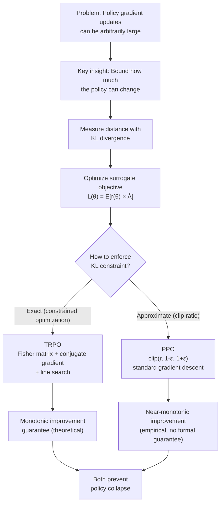

# Trust Region Methods — Interview Deep Dive

> **What this file covers**
> - 🎯 Why RL needs bounded policy updates (policy collapse and the data distribution shift)
> - 🧮 KL divergence formula, surrogate objective, and TRPO's constrained optimization
> - ⚠️ 4 failure modes: collapse spiral, trust region too tight/loose, KL vs weight space mismatch
> - 📊 TRPO: O(|θ|² ) Fisher matrix vs PPO: O(|θ|) standard gradient
> - 💡 TRPO vs PPO: theoretical guarantee vs practical simplicity
> - 🏭 PPO as industry standard for RLHF and language model alignment

---

## Brief restatement

Trust region methods prevent catastrophic policy updates by constraining how much the policy can change per step. TRPO enforces this through a KL divergence constraint solved with natural gradients and conjugate gradient descent. PPO replaces the constraint with a clipped surrogate objective, achieving similar bounded updates with standard gradient descent. Both ensure that a bad gradient step cannot destroy a well-trained policy.

---

## Full mathematical treatment

### 🧮 The policy collapse problem — why RL is different

In supervised learning, the data distribution is fixed. A bad model update on batch t does not change the data in batch t+1. The loss may spike, but recovery is straightforward.

In RL, the policy generates its own data. This creates a feedback loop:

> **Words:** A bad policy update makes the agent collect bad trajectories. Training on bad trajectories makes the policy even worse. The data distribution shifts with every update.

> **Formally:** Let π_θ be the current policy and d^π_θ(s) its induced state distribution. The expected return is:
>
>     J(θ) = Σ_s d^π_θ(s) Σ_a π_θ(a|s) Q^π_θ(s, a)
>
> Both the state distribution d^π_θ and the Q-function Q^π_θ depend on θ. A large change in θ changes the state distribution, which invalidates the data collected under the old policy.

This is why bounded updates matter: we need guarantees that the new policy does not move so far from the old one that the data becomes meaningless.

### 🧮 KL divergence — measuring policy distance

> **Words:** KL divergence measures how different two probability distributions are. A KL of 0 means identical distributions. Larger KL means more different.

> **Formula:**
>
>     KL(π_old(·|s) ∥ π_new(·|s)) = Σ_a π_old(a|s) log( π_old(a|s) / π_new(a|s) )
>
> — π_old(a|s) is the old policy's probability of action a in state s
> — π_new(a|s) is the new policy's probability
> — The sum is over all actions

> **Worked example:** Old policy: P(left) = 0.6, P(right) = 0.4. New policy: P(left) = 0.7, P(right) = 0.3.
>
>     KL = 0.6 × log(0.6/0.7) + 0.4 × log(0.4/0.3)
>        = 0.6 × (-0.1542) + 0.4 × (0.2877)
>        = -0.0925 + 0.1151
>        = 0.0226
>
> This is small — the policies are similar. TRPO with δ = 0.01 would reject this update, but just barely. With δ = 0.05, it would be accepted.

**Key properties of KL divergence:**
- KL(P ∥ Q) ≥ 0 always (Gibbs' inequality)
- KL(P ∥ Q) = 0 if and only if P = Q
- KL is not symmetric: KL(P ∥ Q) ≠ KL(Q ∥ P) in general
- TRPO uses KL(π_old ∥ π_new), which penalizes the new policy for assigning low probability where the old policy assigned high probability

### 🧮 The surrogate objective

> **Words:** Instead of optimizing J(θ) directly (which requires the new state distribution), we optimize a local approximation that uses data from the old policy.

> **Formula:** The surrogate objective (also called the importance-sampled objective):
>
>     L(θ) = E_{s ~ d^π_old, a ~ π_old} [ r(θ) × Â(s, a) ]
>
> where the probability ratio is:
>
>     r(θ) = π_θ(a|s) / π_θ_old(a|s)
>
> — r(θ) > 1: the new policy is more likely to take this action
> — r(θ) < 1: the new policy is less likely to take this action
> — Â(s, a) is the estimated advantage under the old policy

> **Worked example:** Action a was taken in state s. Old probability: π_old(a|s) = 0.3. New probability: π_new(a|s) = 0.45. Advantage: Â = 2.0.
>
>     r(θ) = 0.45 / 0.3 = 1.5
>     L = 1.5 × 2.0 = 3.0
>
> The new policy makes this good action 50% more likely, contributing 3.0 to the surrogate objective. Without a trust region, the gradient would push r even higher — potentially to 5× or 10× — which could destabilize training.

### 🧮 TRPO — constrained optimization

> **Words:** TRPO finds the update that maximizes the surrogate objective while keeping KL divergence below a threshold δ. This is a constrained optimization problem solved with second-order methods.

> **The TRPO optimization problem:**
>
>     maximize_θ  L(θ) = E[ r(θ) × Â ]
>     subject to  E_s[ KL(π_θ_old(·|s) ∥ π_θ(·|s)) ] ≤ δ
>
> where δ is typically 0.01.

**TRPO uses three techniques to solve this:**

**1. Natural gradient.** The ordinary gradient ∇_θ L points in the direction of steepest ascent in parameter space. But a small step in parameter space can correspond to a large step in policy space (or vice versa). The **natural gradient** corrects for this by using the Fisher Information Matrix:

>     F = E[ ∇ log π_θ(a|s) × (∇ log π_θ(a|s))^T ]
>     natural gradient = F^{-1} × ∇_θ L

The natural gradient points in the direction of steepest ascent in *policy* space (as measured by KL divergence), not parameter space.

**2. Conjugate gradient.** Computing F^{-1} directly requires O(|θ|²) memory and O(|θ|³) time — infeasible for large networks. Conjugate gradient iteratively solves F × x = g (where g = ∇_θ L) without ever computing F explicitly, only computing matrix-vector products F × v. This takes O(|θ|) per iteration and typically converges in 10-20 iterations.

**3. Line search.** After finding the natural gradient direction, TRPO does a backtracking line search: try a step size, check if KL ≤ δ and L(θ) improved, reduce step if not. This ensures the constraint is satisfied exactly, not just approximately.

### 🧮 The monotonic improvement guarantee

> **Words:** TRPO proves that if the KL constraint is satisfied, the true objective J(θ) is guaranteed to improve by at least as much as the surrogate objective minus a penalty term.

> **Formula (Kakade and Langford, 2002; Schulman et al., 2015):**
>
>     J(θ_new) ≥ L(θ_new) - (4εγ) / (1-γ)² × max_s KL(π_old(·|s) ∥ π_new(·|s))
>
> where ε = max_{s,a} |A^π_old(s,a)|

This means: if we maximize L while bounding KL, J is guaranteed to improve. This is the **monotonic improvement theorem** — each TRPO update either improves or maintains the true objective.

---

## 🗺️ Concept diagram

---

## ⚠️ Failure modes and edge cases

### 1. Policy collapse spiral (without trust regions)

**What happens:** A large gradient update pushes the policy far from its current behavior. The new policy collects data from a different state distribution. Training on this data pushes the policy further away. Performance drops catastrophically and never recovers.

**When it occurs:** High-variance returns (sparse rewards, long episodes), large learning rates, no gradient clipping.

**Detection:** Sudden drop in mean reward that does not recover within 5-10 updates. KL divergence between consecutive policies spikes above 0.1.

**Fix:** Use trust region methods (TRPO or PPO). Monitor KL divergence per update.

### 2. Trust region too tight (δ too small)

**What happens:** The policy is barely allowed to change. Training is extremely slow — the agent takes thousands of updates to make progress that should take dozens. The agent may never reach good performance within the compute budget.

**When it occurs:** δ < 0.001 in TRPO, or ε < 0.05 in PPO. Also happens when using PPO with a very small learning rate combined with aggressive clipping.

**Detection:** KL divergence per update is near zero. Policy entropy barely changes across updates. Returns improve very slowly or plateau early.

**Fix:** Increase δ to 0.01-0.05 (TRPO) or ε to 0.1-0.3 (PPO).

### 3. Trust region too loose (δ too large)

**What happens:** The constraint does not meaningfully limit updates. The algorithm behaves like unconstrained policy gradient and is susceptible to the same instabilities.

**When it occurs:** δ > 0.1 in TRPO, or ε > 0.5 in PPO. Also happens when using PPO with a large learning rate that allows the ratio to change significantly even within the clip range.

**Detection:** KL divergence per update varies widely (sometimes 0.001, sometimes 0.5). Occasional performance drops that partially recover.

**Fix:** Decrease δ or ε. In PPO, also reduce the learning rate.

### 4. KL divergence vs weight distance mismatch

**What happens:** TRPO constrains KL divergence (policy behavior), not weight norm (parameter magnitude). A small weight change near a decision boundary can cause a large KL divergence, while a large weight change in a less-sensitive region causes tiny KL divergence. The Fisher matrix captures this sensitivity, but conjugate gradient approximation can miss it.

**When it occurs:** Policies with sharp decision boundaries, high-dimensional action spaces, or near-deterministic policies (low entropy).

**Detection:** Conjugate gradient residual is high. Line search requires many steps. KL constraint is intermittently violated after the line search.

**Fix:** Increase conjugate gradient iterations (from 10 to 20-50). Use a more conservative δ. In practice, switch to PPO.

---

## 📊 Complexity analysis

| | TRPO | PPO |
|---|---|---|
| **Time per update** | O(|θ| × CG_iters) for conjugate gradient + O(rollout_size) for line search | O(|θ| × n_epochs × n_minibatches) for standard SGD |
| **Memory** | O(|θ|) — conjugate gradient avoids storing F explicitly | O(|θ|) — same as any SGD method |
| **Fisher matrix cost** | O(|θ|) per conjugate gradient step (matrix-vector product via backprop) | Not needed |
| **Practical wall-clock** | 2-5× slower than PPO per update due to CG and line search | Baseline |
| **Sample complexity** | Similar to PPO — both are on-policy and need similar amounts of data | Similar to TRPO |

**Concrete numbers (Atari, ~1M parameter network):**
- PPO update: ~0.5 seconds (10 epochs × 32 minibatches × standard backprop)
- TRPO update: ~2 seconds (10 CG iterations × Fisher-vector products + line search)
- Both need ~10M environment frames for good Atari performance

---

## 💡 Design trade-offs

| | TRPO | PPO | Unconstrained PG |
|---|---|---|---|
| **Update constraint** | KL ≤ δ (exact) | Clip ratio to [1-ε, 1+ε] | None |
| **Guarantee** | Monotonic improvement (theoretical) | Empirically stable (no formal guarantee) | No guarantee |
| **Implementation** | Complex (Fisher, CG, line search) | Simple (standard SGD) | Simple |
| **Hyperparameters** | δ (trust region size) | ε (clip range), n_epochs | Learning rate only |
| **Multi-epoch reuse** | Not standard (data invalid after large KL) | Safe due to clipping | Unsafe (causes instability) |
| **Wall-clock speed** | Slow | Fast | Fast |
| **Industry adoption** | Rare | Dominant | Rare (unstable) |

---

## 🏭 Production and scaling considerations

**PPO is the industry standard for RLHF.** OpenAI (ChatGPT), Anthropic (Claude), Google (Gemini), and Meta (Llama) all use PPO or PPO-based methods for language model alignment. The reasons:

1. **Stability at scale.** Language models have billions of parameters. TRPO's conjugate gradient would be extremely expensive. PPO's clipping works with standard distributed training infrastructure.

2. **Multi-epoch efficiency.** PPO's clipping makes it safe to reuse data for multiple gradient passes. This is critical when each data sample requires expensive inference from a large language model.

3. **Simplicity of implementation.** PPO can be implemented in ~100 lines of PyTorch. TRPO requires careful numerical implementations of Fisher-vector products, conjugate gradient, and line search.

4. **KL monitoring (not constraining).** In practice, many RLHF systems compute KL divergence between the RL-tuned policy and the original supervised policy, using it as a penalty term in the reward rather than as a hard constraint. This is even simpler than PPO's clipping.

**TRPO's niche:** Research papers where theoretical guarantees matter, safety-critical robotics where monotonic improvement is worth the computational cost.

---

## Staff/Principal Interview Depth

### Q1: Why can't standard policy gradient methods guarantee monotonic improvement, and how does TRPO fix this?

---

**No Hire**
*Interviewee:* "Policy gradients can overshoot. TRPO adds a constraint so they don't."
*Interviewer:* Correct at the surface level but lacks any explanation of why overshooting is uniquely dangerous in RL (vs supervised learning) and provides no mathematical description of the constraint.
*Criteria — Met:* none / *Missing:* data distribution shift, KL formulation, surrogate objective, monotonic improvement theorem

**Weak Hire**
*Interviewee:* "In RL, the agent collects its own data. A large policy update changes the data distribution, so the gradient computed from old data no longer applies. TRPO constrains KL divergence between old and new policies to keep the update valid."
*Interviewer:* Good identification of the core issue (data distribution shift) and the KL constraint. Missing the surrogate objective formulation and the monotonic improvement bound.
*Criteria — Met:* data distribution shift, KL constraint / *Missing:* surrogate objective, monotonic improvement theorem, Fisher matrix / conjugate gradient

**Hire**
*Interviewee:* "Standard policy gradients optimize J(θ) using data from π_old. The problem is that J depends on the state distribution d^π_θ, which changes with θ. A large update makes d^π_new very different from d^π_old, so the surrogate objective L(θ) = E_{π_old}[r(θ) × Â] is no longer a good approximation to J. TRPO bounds this error by constraining KL(π_old ∥ π_new) ≤ δ. The monotonic improvement theorem shows J(θ_new) ≥ L(θ_new) minus a penalty proportional to max KL. TRPO solves this with natural gradients via conjugate gradient."
*Interviewer:* Strong answer. Connects the surrogate objective to the true objective, states the monotonic improvement bound, and mentions the solution method. Would be elevated to Strong Hire by discussing the practical comparison with PPO.
*Criteria — Met:* data distribution shift, surrogate objective, monotonic improvement theorem, conjugate gradient / *Missing:* PPO comparison, practical trade-offs

**Strong Hire**
*Interviewee:* "The fundamental issue is that policy gradient methods use a first-order approximation to J(θ) that is only valid near θ_old. The surrogate L(θ) = E_{π_old}[r(θ) × Â] equals J at θ = θ_old and has the same gradient, but diverges as θ moves away. Kakade and Langford showed that J(θ_new) ≥ L(θ_new) - C × max_s KL(π_old ∥ π_new), where C = 4εγ/(1-γ)². TRPO makes this practical by constraining mean KL ≤ δ and using the Fisher matrix to define the natural gradient direction — the direction of steepest ascent in policy space, not parameter space. Conjugate gradient avoids materializing the Fisher matrix. In practice, PPO replaced TRPO by noting that clipping the ratio to [1-ε, 1+ε] achieves similar bounded updates without any second-order computation. PPO loses the formal guarantee but empirically matches TRPO and is 2-5× faster, which is why it dominates in industry and RLHF."
*Interviewer:* Complete answer. Derives the bound, explains why natural gradients matter, and connects to PPO with a clear trade-off analysis. Demonstrates staff-level understanding of both theory and practice.
*Criteria — Met:* all

---

### Q2: What is the relationship between the Fisher Information Matrix and KL divergence, and why does TRPO use it?

---

**No Hire**
*Interviewee:* "TRPO uses the Fisher matrix to compute the gradient."
*Interviewer:* Confuses Fisher matrix with the gradient. Does not understand that Fisher matrix is used to define the trust region geometry, not the gradient direction.
*Criteria — Met:* none / *Missing:* Fisher-KL relationship, natural gradient, conjugate gradient

**Weak Hire**
*Interviewee:* "The Fisher Information Matrix measures how sensitive the policy is to parameter changes. TRPO uses it to compute natural gradients that respect the KL constraint."
*Interviewer:* Correct high-level description. Missing the mathematical relationship between Fisher matrix and KL divergence (Fisher is the Hessian of KL), and why this matters for the trust region shape.
*Criteria — Met:* Fisher as sensitivity measure / *Missing:* Fisher = Hessian of KL, trust region geometry, conjugate gradient details

**Hire**
*Interviewee:* "The Fisher Information Matrix is the second derivative (Hessian) of KL divergence with respect to the policy parameters, evaluated at the current policy. That is, F = ∇²_θ KL(π_θ ∥ π_θ') |_{θ'=θ}. The KL constraint KL ≤ δ defines an ellipsoid in parameter space: Δθ^T F Δθ ≤ 2δ (to second order). The natural gradient F^{-1} g finds the direction of steepest ascent within this ellipsoid. TRPO uses conjugate gradient to compute F^{-1} g without storing F, then line searches for the right step size."
*Interviewer:* Precise mathematical answer. States the Fisher-KL relationship, derives the ellipsoidal trust region, and explains why conjugate gradient avoids materializing F. Strong hire territory.
*Criteria — Met:* Fisher-KL relationship, trust region geometry, conjugate gradient / *Missing:* comparison with parameter-space regularization

**Strong Hire**
*Interviewee:* "The Fisher matrix F is the expected outer product of score functions: F = E[∇log π × (∇log π)^T]. It equals the Hessian of KL divergence at θ = θ_old, so the KL constraint is locally a quadratic: KL ≈ ½Δθ^T F Δθ. This defines an ellipsoid — the trust region is not a sphere in parameter space but an ellipsoid shaped by the Fisher geometry. Directions where the policy is sensitive (large eigenvalues of F) are constrained more tightly. The natural gradient F^{-1}g maximizes L(θ) per unit of KL, not per unit of weight distance. This is why TRPO outperforms simple weight clipping or L2 regularization — those constrain in the wrong metric. Conjugate gradient avoids O(|θ|²) memory by computing F×v via a second backprop. PPO sidesteps all of this by directly clipping the ratio, which implicitly bounds KL (since the ratio and KL are monotonically related for small changes) without computing any second-order quantities."
*Interviewer:* Exceptional answer. Derives both formulations of Fisher, explains the geometric interpretation, connects to why parameter-space methods are inferior, and bridges to PPO. Clear staff-level thinking.
*Criteria — Met:* all

---

### Q3: PPO clips the probability ratio to achieve bounded updates. Under what conditions does clipping fail to prevent large policy changes, and how would you detect this in practice?

---

**No Hire**
*Interviewee:* "PPO clips the ratio between 0.8 and 1.2 so the policy can't change too much. I don't think it can fail."
*Interviewer:* Does not recognize any failure mode. PPO clipping can fail in several well-known scenarios.
*Criteria — Met:* none / *Missing:* any failure mode, detection strategy

**Weak Hire**
*Interviewee:* "PPO clips the ratio, but if the learning rate is too high, the network weights might change a lot within each mini-batch. The ratio is computed against the old policy from the start of the rollout, so by the 10th epoch, the current policy might be far from where it started even though each individual ratio was clipped."
*Interviewer:* Identifies the multi-epoch drift issue correctly. But does not quantify it, mention other failure modes (e.g., high-dimensional action spaces), or propose monitoring.
*Criteria — Met:* multi-epoch drift / *Missing:* high-dimensional failure, KL monitoring, concrete detection metrics

**Hire**
*Interviewee:* "Three scenarios where PPO clipping is insufficient: (1) Multiple epochs — the ratio is clipped per mini-batch, but after 10 epochs the cumulative change can be large. The ratio at epoch 10 is compared to π_old from before the update, but within each epoch the policy has already changed from previous mini-batches. (2) High-dimensional action spaces — clipping the ratio per action dimension does not bound the joint probability ratio. A 20% change in each of 10 independent dimensions compounds. (3) Large learning rates — the gradient step can move parameters significantly even when the ratio is clipped, because clipping removes the gradient signal (zero gradient) but doesn't pull the policy back. Detection: monitor mean KL divergence per update. If KL consistently exceeds 0.01-0.05, the clipping is not constraining effectively."
*Interviewer:* Three distinct failure modes with clear explanations. The KL monitoring suggestion is practical. Would be elevated by proposing an adaptive solution (like adaptive KL penalty or early stopping).
*Criteria — Met:* multi-epoch drift, high-dimensional failure, KL monitoring / *Missing:* adaptive solutions

**Strong Hire**
*Interviewee:* "PPO's clipping is a heuristic, not a constraint. It has no formal guarantee that KL stays bounded. Specific failures: (1) Multi-epoch drift: 10 epochs × 32 mini-batches = 320 gradient steps. Each clips the ratio individually, but cumulative drift can push total KL to 0.1+. This is worse with large learning rates. (2) High-dimensional actions: the ratio r(θ) = π_new(a|s)/π_old(a|s) is a joint probability. Clipping the joint ratio to [0.8, 1.2] does not prevent individual action dimensions from changing drastically. (3) Entropy collapse: as the policy becomes near-deterministic, small weight changes cause large ratio changes. Detection: compute KL(π_old ∥ π_new) after each update. OpenAI's original PPO implementation includes an 'approx_kl' metric. If it exceeds a threshold (typically 0.015), it's a signal to reduce the learning rate or stop the current set of epochs early. The PPO variant 'PPO with KL penalty' directly adds β × KL to the loss, with β adjusted adaptively to target a KL of 0.01. This hybrid approach combines PPO's simplicity with TRPO's KL guarantee."
*Interviewer:* Comprehensive answer covering three failure modes with quantification, a practical detection strategy (approx_kl), and an adaptive solution (PPO-KL penalty). Demonstrates production-level understanding of PPO's limitations.
*Criteria — Met:* all

---

## Key Takeaways

🎯 1. RL has a unique failure mode: bad policy → bad data → worse policy. Trust regions prevent this by bounding policy updates.
🎯 2. KL divergence measures policy distance. TRPO constrains KL ≤ δ; PPO approximates this by clipping the probability ratio to [1-ε, 1+ε].
   3. The surrogate objective L(θ) = E[r(θ) × Â] approximates the true improvement using data from the old policy.
🎯 4. TRPO uses the Fisher Information Matrix (Hessian of KL) to define a trust region ellipsoid in parameter space, solved via conjugate gradient.
   5. PPO is 2-5× faster than TRPO per update and achieves similar empirical performance despite losing the formal monotonic improvement guarantee.
⚠️ 6. PPO's clipping is a heuristic — it can fail with too many epochs, high-dimensional actions, or entropy collapse. Monitor KL divergence per update.
   7. PPO dominates industry use: RLHF for ChatGPT, Claude, Gemini, and Llama all use PPO or PPO-based methods.
