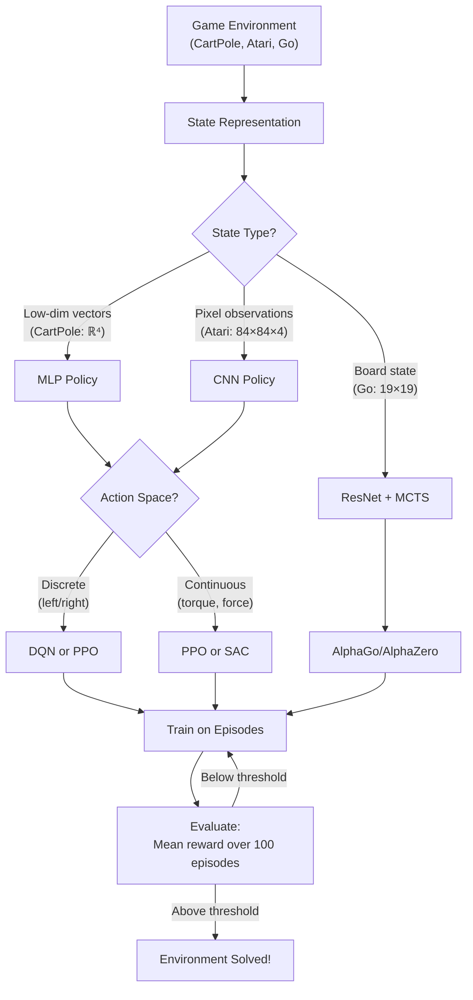

# Game Playing with RL — Interview Deep Dive

> **What this file covers**
> - 🎯 Why games are the canonical testbed for RL algorithms
> - 🧮 Full MDP formulation for game environments with worked examples
> - ⚠️ 4 failure modes: sparse rewards, reward shaping pitfalls, sample inefficiency, sim-to-real gap
> - 📊 Complexity analysis across environments and algorithms
> - 💡 DQN vs PPO vs A2C: when each wins and why
> - 🏭 From Atari to AlphaGo: scaling RL to superhuman performance

---

## Brief restatement

Game playing is where RL algorithms prove themselves. The agent observes the game state (screen pixels, positions, scores), takes actions (joystick movements, button presses), and receives rewards (points, penalties). The same algorithms — DQN, PPO, A2C — that solve CartPole in minutes also powered AlphaGo's victory over the world champion. The key challenges are sparse rewards (MountainCar gives no signal until the goal is reached), large state spaces (Atari screens have ~33,600 pixels), and credit assignment (which action in a 200-step episode actually mattered?).

---

## Full mathematical treatment

### 🧮 Game as a Markov Decision Process

> **Words:** Every game environment is formalized as an MDP. The agent observes a state, chooses an action, receives a reward, and transitions to a new state. The goal is to find a policy that maximizes the total discounted reward over the episode.

> **Formula:**
>
>     MDP = (S, A, P, R, γ)
>
> — S = state space (what the agent observes)
> — A = action space (what the agent can do)
> — P(s' | s, a) = transition function (game physics)
> — R(s, a) = reward function (scoring)
> — γ ∈ [0, 1] = discount factor (how much to value future rewards)
>
>     Objective: max_π E[ ∑_{t=0}^{T} γ^t R(s_t, a_t) ]

> **Worked example (CartPole):**
> - S = (cart position, cart velocity, pole angle, pole angular velocity) → ℝ⁴
> - A = {push left, push right} → |A| = 2
> - R = +1 for each timestep the pole stays upright
> - γ = 0.99
> - Episode ends when pole angle > 12° or cart leaves bounds
> - Maximum return = 500 (solved threshold: 475)

### 🧮 Algorithm selection for games

> **Words:** Different games have different properties that make certain algorithms better suited. The key factors are: discrete vs continuous actions, dense vs sparse rewards, and how many environment samples you can afford.

> **DQN approach (value-based):**
>
>     Q(s, a; θ) ≈ Q*(s, a)
>     Loss = E[(r + γ max_{a'} Q(s', a'; θ⁻) - Q(s, a; θ))²]
>
> — Works only for discrete action spaces
> — Uses experience replay buffer for sample efficiency
> — Target network θ⁻ updated periodically for stability

> **PPO approach (policy-based):**
>
>     L^CLIP = E[min(r_t(θ) Â_t, clip(r_t(θ), 1-ε, 1+ε) Â_t)]
>     r_t(θ) = π_θ(a_t | s_t) / π_{θ_old}(a_t | s_t)
>
> — Works for both discrete and continuous actions
> — Stable training via clipped objective
> — On-policy: discards data after each update

> **A2C approach (actor-critic):**
>
>     ∇J = E[∇_θ log π_θ(a|s) · (R - V(s; φ))]
>     L_value = E[(R - V(s; φ))²]
>
> — Synchronous advantage actor-critic
> — Faster wall-clock time than PPO (fewer epochs per update)
> — Less stable but suitable for simple environments

### 🧮 Sparse reward problem

> **Words:** In MountainCar, the reward is -1 at every step until the car reaches the top of the hill. Random actions almost never reach the goal. The expected return under a random policy is approximately -200 (the maximum episode length). The agent must discover the solution through exploration before it can learn anything from rewards.

> **Formula (exploration bonus approach):**
>
>     r_augmented = r_env + η · r_intrinsic
>
>     r_intrinsic = ||f(s'; θ) - f(s'; θ̂)||²
>
> — r_intrinsic = prediction error of a learned dynamics model
> — η = scaling coefficient for intrinsic reward
> — Novel states produce high prediction error → agent is rewarded for exploring new areas
> — As the dynamics model improves, intrinsic reward decreases → agent stops exploring visited states

> **Worked example:** In MountainCar, a random policy averages return = -200. With intrinsic motivation (η = 0.01), the agent explores the state space and discovers that rocking back and forth builds momentum. After discovering the solution, the intrinsic reward fades and the agent optimizes the extrinsic reward.

---

## 🗺️ Concept flow diagram

---

## ⚠️ Failure modes and edge cases

### Failure Mode 1: Sparse reward starvation

**What happens:** In environments like MountainCar, the agent never reaches the goal during random exploration. Without reaching the goal, it never sees positive reward. Without positive reward, it never learns to reach the goal. The agent is stuck in a loop of failure.

**Detection:** Mean episode return stays at the minimum value (e.g., -200 for MountainCar) for thousands of episodes.

**Fix:** Add intrinsic motivation (curiosity-driven exploration), use hindsight experience replay (HER), or shape the reward to provide intermediate signals. Reward shaping must be potential-based to preserve the optimal policy.

### Failure Mode 2: Reward shaping that changes the optimal policy

**What happens:** To speed up learning, you add extra reward signals (e.g., +1 for moving right in MountainCar). But this changes what the agent is optimizing. The agent might learn to go right forever (to collect shaping rewards) instead of learning to reach the goal.

**Detection:** The agent achieves high shaped reward but low true reward. The learned behavior looks wrong even though the numbers look good.

**Fix:** Use potential-based reward shaping: F(s, s') = γ·Φ(s') - Φ(s), where Φ is a potential function. This form is provably the only shaping that preserves the optimal policy.

### Failure Mode 3: Catastrophic forgetting in multi-game agents

**What happens:** When training a single agent on multiple games (as in the original DQN paper), the agent can forget how to play earlier games when training on later ones. The replay buffer fills with recent experiences and old experiences get overwritten.

**Detection:** Performance on earlier games drops while performance on the current game improves.

**Fix:** Use a large replay buffer, prioritized experience replay with game-stratified sampling, or separate replay buffers per game.

### Failure Mode 4: Sim-to-real gap

**What happens:** An agent trained in a simulated game environment fails when deployed in a real-world setting (e.g., a physical robot playing a game). The simulation does not capture all the physics, noise, and delays of the real world.

**Detection:** High performance in simulation, poor performance in deployment.

**Fix:** Domain randomization (vary simulation parameters during training), system identification (calibrate the simulation), or fine-tune with real-world data.

---

## 📊 Complexity analysis

| Environment | State dim | Action dim | Timesteps to solve | Algorithm | Wall-clock time |
|-------------|-----------|------------|--------------------|-----------|-----------------|
| CartPole-v1 | 4 | 2 | ~50K | PPO/DQN/A2C | ~1 min |
| LunarLander-v2 | 8 | 4 | ~500K | PPO/DQN | ~10 min |
| MountainCar-v0 | 2 | 3 | ~200K | DQN + exploration | ~5 min |
| Acrobot-v1 | 6 | 3 | ~100K | A2C/PPO | ~3 min |
| Atari (Breakout) | 84×84×4 | 4 | ~10M | DQN | ~12 hours |
| Atari (Montezuma) | 84×84×4 | 18 | ~200M+ | RND + PPO | ~days |
| Go (19×19) | 19×19×17 | 362 | ~5M self-play games | AlphaZero | ~3 days (5000 TPUs) |

**Sample efficiency comparison for CartPole:**

| Algorithm | Samples to solve | Replay buffer | On/Off-policy |
|-----------|-----------------|---------------|---------------|
| DQN | ~30K | Yes (50K) | Off-policy |
| PPO | ~50K | No | On-policy |
| A2C | ~50K | No | On-policy |
| Random | Never | — | — |

---

## 💡 Design trade-offs and alternatives

| Factor | DQN | PPO | A2C | AlphaZero |
|--------|-----|-----|-----|-----------|
| Action space | Discrete only | Discrete + continuous | Discrete + continuous | Discrete (board games) |
| Sample efficiency | High (replay buffer) | Medium | Low | High (self-play) |
| Training stability | Medium (target net) | High (clipping) | Low | High |
| Wall-clock speed | Medium | Slow (multiple epochs) | Fast | Very slow (MCTS) |
| Hyperparameter sensitivity | High (ε, buffer size) | Low | Medium | Low |
| Parallelism | Low | High (vectorized envs) | High | High |
| Best for | Simple discrete games | General purpose | Quick prototyping | Perfect-info board games |

---

## 🏭 Production and scaling considerations

**Environment vectorization:** Training speed scales linearly with the number of parallel environments. Stable-Baselines3 supports vectorized environments via `SubprocVecEnv` (separate processes) or `DummyVecEnv` (shared process). For PPO, 8-64 parallel environments is typical.

**Frame stacking and preprocessing:** Atari games require stacking 4 frames to capture motion (a single frame does not show velocity). Images are downsampled from 210×160×3 to 84×84×1 (grayscale). This reduces the input dimension by 30x.

**Self-play for competitive games:** In two-player games (Go, Chess), the agent plays against copies of itself. The opponent gets updated periodically. This creates an automatic curriculum — as the agent improves, the opponent gets harder. AlphaZero used this exclusively (no human game data at all).

**Evaluation protocol:** Performance is measured as mean reward over 100 consecutive episodes with a fixed seed. For Atari, the standard is to compare against human performance (normalized so random = 0%, human = 100%). DQN achieved >75% human-normalized score on 29 of 49 games.

---

## Staff/Principal Interview Depth — Q&A

### Q1: Why are games the canonical testbed for RL, and what are the limitations of evaluating RL algorithms only on games?

---
**No Hire**
*Interviewee:* "Games are easy to run and have clear scores, so they are good for testing."
*Interviewer:* Surface-level answer. No discussion of what properties games have that matter for RL, or what is missing when you only test on games.
*Criteria — Met:* none / *Missing:* formal properties, limitations, connection to real-world

**Weak Hire**
*Interviewee:* "Games are good because they have clear reward signals, fast simulation, and reproducible results. The limitation is that games are simpler than the real world."
*Interviewer:* Correct high-level points but lacks specificity. Does not identify which game properties matter most or explain how game-only evaluation can mislead.
*Criteria — Met:* basic understanding / *Missing:* specific properties (MDP formulation, dense rewards, reset), specific misleading scenarios

**Hire**
*Interviewee:* "Games satisfy the MDP assumption well — states are fully observable, rewards are well-defined, and episodes reset cleanly. They allow millions of samples cheaply. The limitations are that games have shaped rewards (unlike real robotics where rewards are sparse), no safety constraints (crashing a simulated lander has no cost), and no sim-to-real gap. An algorithm that looks good on Atari may fail on real tasks because it relies on dense rewards and cheap resets that do not exist in production."
*Interviewer:* Solid answer with specific properties and concrete limitations. Would push to Strong Hire with discussion of which Atari games actually reveal algorithm weaknesses.
*Criteria — Met:* MDP properties, sample availability, 3 limitations / *Missing:* specific hard games (Montezuma's Revenge), connection to benchmark-driven research incentives

**Strong Hire**
*Interviewee:* "Games satisfy key MDP assumptions — full observability, deterministic or known stochastic transitions, well-defined reward, and episodic resets. This makes them fast to iterate on. But game-only evaluation creates blind spots. Most Atari games have dense rewards, so algorithms like DQN appear to solve the exploration problem when they actually do not — Montezuma's Revenge (sparse reward, requires long-horizon planning) remains largely unsolved. Games also have no safety constraints, no partial observability in most benchmarks, and no deployment gap. An algorithm that needs 10M frames of CartPole is 'solved' in the benchmark but useless for a real robot that gets 1000 interactions. The field recognized this — MuJoCo, DMControl, and ProcGen were created specifically to test generalization and continuous control, and Montezuma's Revenge became the standard test for exploration. The risk is that algorithms get overfitted to the benchmark suite rather than being genuinely capable."
*Interviewer:* Excellent depth. Identifies the specific weakness (dense rewards masking exploration failures), names the hard case (Montezuma), and connects to the broader concern about benchmark overfitting. Staff-level thinking about what evaluations actually measure.
*Criteria — Met:* all
---

### Q2: Explain the sparse reward problem and compare three solutions.

---
**No Hire**
*Interviewee:* "Sparse rewards means the agent does not get reward very often, so it is hard to learn."
*Interviewer:* Correct definition but no solutions, no math, no specifics.
*Criteria — Met:* none / *Missing:* formal definition, solutions, trade-offs

**Weak Hire**
*Interviewee:* "Sparse rewards means the reward is zero for most timesteps and only nonzero at the goal. You can fix it with reward shaping — add intermediate rewards. Or use curiosity to encourage exploration."
*Interviewer:* Knows two approaches but does not discuss the risk of reward shaping or the math of curiosity.
*Criteria — Met:* problem definition, 2 solutions named / *Missing:* potential-based shaping requirement, formal curiosity formulation, trade-offs

**Hire**
*Interviewee:* "Sparse reward means R(s,a) = 0 for most (s,a) pairs. Three solutions: (1) Potential-based reward shaping F(s,s') = γΦ(s') - Φ(s), which is the only form that preserves the optimal policy. (2) Intrinsic curiosity — reward the agent for visiting states where its prediction error is high. (3) Hindsight Experience Replay — relabel failed trajectories with the state actually reached as the goal. Reward shaping is simple but requires domain knowledge. Curiosity is general but can waste time on stochastic elements. HER works well for goal-conditioned tasks but does not apply to all settings."
*Interviewer:* Strong. Knows the potential-based requirement, the math of curiosity, and when each fails. Would need AlphaGo-style MCTS for Strong Hire.
*Criteria — Met:* formal definition, 3 solutions with math, failure modes / *Missing:* MCTS as a solution, worked example

**Strong Hire**
*Interviewee:* "Sparse reward means the expected return under a random policy is near the minimum — in MountainCar, E[G] ≈ -200 because random actions never reach the hilltop. Three approaches: (1) Potential-based shaping F = γΦ(s') - Φ(s) adds intermediate signal without changing the optimal policy — Ng et al. (1999) proved this is the unique safe form. For MountainCar, Φ(s) = |s.position - goal| gives reasonable shaping. (2) Random Network Distillation (RND) trains a predictor to match a fixed random network — prediction error is high for novel states, providing intrinsic reward. RND solved Montezuma's Revenge (first 24 rooms) by driving exploration. The risk is 'noisy TV problem' — stochastic environment elements always produce high prediction error, distracting the agent. (3) Hindsight Experience Replay relabels (s, a, s') with g = s' as the achieved goal, so every trajectory provides learning signal. It is provably unbiased for goal-conditioned policies. A fourth approach is Monte Carlo Tree Search — AlphaGo uses tree search to look ahead and estimate value without relying on reward signals at all. The right choice depends on whether the environment is deterministic (MCTS), goal-conditioned (HER), or general (RND/curiosity)."
*Interviewer:* Complete treatment. Names the theorem (Ng 1999), gives a concrete worked example, identifies the noisy TV problem, and adds MCTS as a fourth approach. Staff-level synthesis across subfields.
*Criteria — Met:* all
---

### Q3: How did AlphaGo combine RL with search, and why was this necessary?

---
**No Hire**
*Interviewee:* "AlphaGo used deep learning to play Go. It beat the world champion."
*Interviewer:* No technical content. Does not mention RL, MCTS, or why search was needed.
*Criteria — Met:* none / *Missing:* everything technical

**Weak Hire**
*Interviewee:* "AlphaGo used a neural network to evaluate board positions and Monte Carlo tree search to look ahead. It combined supervised learning from human games with self-play RL."
*Interviewer:* Correct components named but no detail on how they interact or why pure RL was insufficient.
*Criteria — Met:* components listed / *Missing:* how MCTS uses the networks, why search is needed, AlphaZero comparison

**Hire**
*Interviewee:* "Go has a branching factor of ~250, making exhaustive search impossible. AlphaGo uses two networks: a policy network p(a|s) to guide MCTS (reducing branching factor by focusing on promising moves) and a value network v(s) to evaluate positions (replacing random rollouts). MCTS runs ~1600 simulations per move, using the networks to select and evaluate positions. The policy network was first trained supervised on human expert games, then improved via self-play RL. AlphaZero later showed you can skip the supervised phase entirely and learn from self-play alone."
*Interviewer:* Solid technical understanding. Knows the role of each network in MCTS, the branching factor problem, and the progression to AlphaZero.
*Criteria — Met:* branching factor, two networks, MCTS integration, AlphaZero / *Missing:* PUCT formula, why pure RL without search fails at this scale

**Strong Hire**
*Interviewee:* "Go's state space is ~10^{170} and branching factor ~250, making tabular or brute-force methods impossible. AlphaGo's insight is to use neural networks to compress the search space. The policy network p_θ(a|s) reduces the effective branching factor — MCTS only explores moves with high prior probability. The value network v_φ(s) replaces rollouts — instead of playing to the end, MCTS evaluates positions directly. MCTS uses the PUCT formula: a(s) = argmax_a[Q(s,a) + c·p_θ(a|s)·√N(s)/(1+N(s,a))], balancing exploitation (Q value) with exploration (prior × visit ratio). Why is search necessary even with good networks? A policy network alone would play the single best move at each position — no lookahead. In Go, the evaluation of a position depends on future play by both sides. MCTS gives the policy effective lookahead: it simulates 'if I play here, and they respond there...' for ~1600 moves. This is why AlphaGo plays much better during MCTS search than the raw policy network. AlphaZero simplified this by removing the supervised phase — pure self-play RL with MCTS was sufficient, and it also mastered chess and shogi with the same algorithm."
*Interviewer:* Complete depth. PUCT formula, why search is needed (not just useful), the key insight about lookahead, and the generalization to AlphaZero. Staff-level answer.
*Criteria — Met:* all
---

---

## Key Takeaways

🎯 1. Games formalize perfectly as MDPs — clear states, actions, rewards, and episode boundaries — making them ideal for developing and testing RL algorithms
   2. The choice between DQN, PPO, and A2C depends on action space type, sample budget, and stability requirements — PPO is the safest default
🎯 3. Sparse rewards are the hardest challenge in game RL — potential-based shaping is the only reward modification that provably preserves the optimal policy
   4. Atari benchmarks mask the exploration problem because most games have dense rewards — Montezuma's Revenge is the true test
⚠️ 5. Game-only evaluation creates blind spots: no safety constraints, cheap resets, and no sim-to-real gap — algorithms that look good on games may fail in production
🎯 6. AlphaGo showed that neural networks + MCTS can solve games with 10^{170} states by using learned priors to compress the search space — this same idea (learning to guide search) appears across RL
   7. The progression from TD-Gammon (1992) to AlphaZero (2017) to RLHF (2022) shows that the core RL ideas scale — value functions, policy gradients, and self-play remain the foundation
