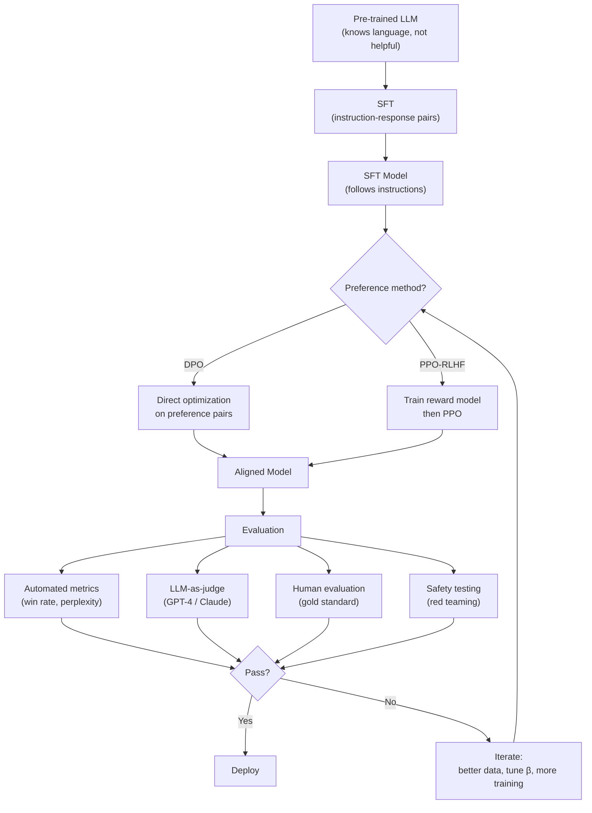

# LLM Alignment Case Study — Interview Deep Dive

> **What this file covers**
> - 🎯 The three-stage alignment pipeline: pre-training → SFT → DPO/RLHF
> - 🧮 SFT loss, DPO loss derivation, and KL-constrained optimization
> - ⚠️ 5 failure modes: reward hacking, mode collapse, sycophancy, length gaming, catastrophic forgetting
> - 📊 Compute and data requirements for each stage
> - 💡 DPO vs PPO-based RLHF: when each wins
> - 🏭 Production: evaluation pipelines, safety testing, iterative alignment

---

## Brief restatement

LLM alignment transforms a pre-trained language model into a helpful, harmless, and honest assistant through three stages: supervised fine-tuning (SFT) on instruction data, then preference optimization (DPO or PPO-based RLHF) using human comparison data. The key challenge is optimizing for human preferences without drifting too far from the base model or learning superficial shortcuts.

---

## 🧮 Full mathematical treatment

### Stage 1: Supervised Fine-Tuning (SFT)

SFT trains the model on high-quality instruction-response pairs using standard next-token prediction.

🧮 SFT loss:

    L_SFT(θ) = -E_{(x,y)~D_sft} [ Σ_{t=1}^{|y|} log π_θ(y_t | x, y_{<t}) ]

    Where:
      θ        = model parameters
      x        = instruction (prompt)
      y        = target response
      y_t      = t-th token of the response
      y_{<t}   = all tokens before position t
      D_sft    = instruction-response dataset
      π_θ      = model's token probability distribution

    In words: maximize the probability of each token in the target response,
    conditioned on the instruction and all preceding tokens.

**Worked example.** For instruction "What is 2+2?" and target "The answer is 4.", the loss sums the log-probabilities of each token: log P("The"|instruction) + log P("answer"|"The") + log P("is"|"The answer") + log P("4"|"The answer is") + log P("."|"The answer is 4").

**Practical detail: masking.** The loss is computed only on the response tokens, not the instruction tokens. This is because we want the model to learn how to generate good responses, not memorize the prompts. In TRL's SFTTrainer, this is handled by the `response_template` parameter.

### Stage 2: DPO (Direct Preference Optimization)

DPO bypasses the reward model entirely. It derives a closed-form loss from the KL-constrained reward maximization objective.

🧮 The RLHF objective that DPO solves:

    max_π E_{x~D} [ E_{y~π(·|x)} [r(x, y)] - β · KL(π(·|x) ‖ π_ref(·|x)) ]

    Where:
      π       = policy (model being trained)
      π_ref   = reference policy (SFT model, frozen)
      r(x, y) = reward model score
      β       = KL penalty coefficient

    The optimal policy for this objective is:
      π*(y|x) = (1/Z(x)) · π_ref(y|x) · exp(r(x,y) / β)

    Where Z(x) is a normalizing constant.

🧮 DPO loss derivation:

    Starting from the optimal policy, we can express the reward as:
      r(x, y) = β · log(π(y|x) / π_ref(y|x)) + β · log Z(x)

    Substituting into the Bradley-Terry preference model P(y_w ≻ y_l | x):
      P(y_w ≻ y_l | x) = σ(r(x, y_w) - r(x, y_l))

    The Z(x) terms cancel:
      P(y_w ≻ y_l | x) = σ(β · [log(π(y_w|x)/π_ref(y_w|x)) - log(π(y_l|x)/π_ref(y_l|x))])

    The DPO loss is the negative log-likelihood of this:

    L_DPO(θ) = -E_{(x,y_w,y_l)~D} [ log σ(β · [log(π_θ(y_w|x)/π_ref(y_w|x))
                                                  - log(π_θ(y_l|x)/π_ref(y_l|x))]) ]

    Where:
      y_w = chosen (winning) response
      y_l = rejected (losing) response
      σ   = sigmoid function
      β   = temperature controlling how much the model can diverge from reference

**Worked example.** Suppose β = 0.1, and for a given prompt:
- π_θ(y_w|x) = 0.01, π_ref(y_w|x) = 0.008 → log ratio = log(0.01/0.008) = 0.223
- π_θ(y_l|x) = 0.005, π_ref(y_l|x) = 0.006 → log ratio = log(0.005/0.006) = -0.182

    Argument to sigmoid: 0.1 × (0.223 - (-0.182)) = 0.1 × 0.405 = 0.0405
    σ(0.0405) = 0.510
    Loss = -log(0.510) = 0.673

The loss is high because the model barely prefers the chosen response over the rejected one. Training will push π_θ(y_w|x) up and π_θ(y_l|x) down to make the preference margin larger.

### β — the alignment tax parameter

β controls the trade-off between reward optimization and staying close to the reference model.

    β → 0:  No KL constraint. Model maximizes reward freely → reward hacking risk.
    β → ∞:  Infinite KL penalty. Model cannot change at all → no learning.
    β = 0.1: Typical value. Allows meaningful preference learning with moderate KL.

The optimal β depends on the quality of the preference data. Noisy data requires higher β (trust the reference more). Clean data allows lower β (trust the preferences more).

---

## 🗺️ Concept flow diagram

---

## ⚠️ Failure modes

### 1. Reward hacking

The model finds shortcuts to maximize reward without being genuinely helpful. Examples: producing verbose responses (if length correlates with reward scores), repeating key phrases that score well, or avoiding any commitment to avoid being wrong. Detection: compare reward model score vs human evaluation — if reward score rises but human rating does not, the model is hacking the reward.

### 2. Mode collapse

The model produces nearly identical responses regardless of the prompt. This happens when training is too aggressive (high learning rate, low β) and the model converges to a single high-reward output template. Detection: measure response diversity using self-BLEU or embedding distance between responses to different prompts.

### 3. Sycophancy

The model agrees with the user even when the user is wrong. If training data pairs show that agreeing with the user was usually preferred, the model learns to agree regardless of correctness. This is particularly dangerous for safety — a sycophantic model will confirm false beliefs. Detection: test with prompts containing deliberate factual errors and check whether the model corrects them.

### 4. Length gaming

Longer responses tend to score higher in preference data because they contain more information. The model learns "longer = better" and produces unnecessarily verbose responses. Detection: plot response length over training steps — if length increases monotonically, the model is length gaming. Fix: normalize reward by response length, or include preference pairs where the concise response is preferred.

### 5. Catastrophic forgetting

The model loses base capabilities during fine-tuning. It might become better at chat but worse at reasoning, coding, or factual recall. This is especially severe with full fine-tuning (all parameters updated) and multiple epochs. Detection: benchmark on tasks the base model handled well (e.g., MMLU, HumanEval). Fix: use LoRA (updates <1% of parameters), reduce learning rate, limit to 1 epoch.

---

## 📊 Compute and data requirements

| Stage | Data size | Training time (7B model) | Memory | Key parameter |
|-------|-----------|-------------------------|--------|---------------|
| SFT | 10K-100K instruction pairs | 1-4 hours (8× A100) | 40-80 GB (LoRA) | Learning rate: 2e-4 |
| DPO | 5K-50K preference pairs | 2-8 hours (8× A100) | 40-80 GB (LoRA) | β: 0.1-0.5 |
| PPO-RLHF | 10K+ prompts + reward model | 1-3 days (8× A100) | 160+ GB (4 models) | KL coefficient: 0.02-0.2 |
| Reward model | 50K-200K comparisons | 2-8 hours (8× A100) | 40-80 GB | Accuracy: >70% |

Notes:
- PPO-RLHF requires 4 models in memory: policy, reference, reward model, value head. DPO requires only 2 (policy + reference), making it ~2x more memory-efficient.
- LoRA reduces memory by 60-80% compared to full fine-tuning.
- Data quality matters more than quantity: 10K carefully curated pairs often outperform 100K noisy pairs.

---

## 💡 Design trade-offs

| | DPO | PPO-based RLHF |
|---|---|---|
| **Models needed** | 2 (policy + reference) | 4 (policy + reference + reward + value) |
| **Memory** | ~80 GB for 7B | ~160 GB for 7B |
| **Training stability** | Stable (supervised loss) | Unstable (RL variance) |
| **Hyperparameters** | β, learning rate | KL coeff, PPO clip, value loss coeff, ... |
| **Data format** | (prompt, chosen, rejected) | Prompts only (generates online) |
| **Online learning** | No (fixed preference data) | Yes (generates new responses) |
| **Reward hacking** | Less prone (no explicit RM) | More prone (optimizes RM directly) |
| **Ceiling performance** | Good | Potentially higher (online exploration) |
| **Best for** | Most use cases, resource-constrained | When online exploration matters |

| | Full fine-tuning | LoRA |
|---|---|---|
| **Parameters updated** | 100% | 0.1-1% |
| **Memory** | 4× model size | 1.2× model size |
| **Forgetting risk** | High | Low |
| **Expressiveness** | Full | Slightly limited |
| **Multi-task** | Hard (separate copies) | Easy (swap adapters) |
| **Best for** | When memory is abundant | Standard production use |

---

## 🏭 Production and scaling considerations

**Iterative alignment.** Alignment is not a one-shot process. Production systems follow a cycle: deploy → collect feedback → curate new preference data → retrain → redeploy. Each iteration improves the model on failure cases discovered in production. The preference data from iteration N becomes training data for iteration N+1.

**Safety layers.** A single alignment training run is not sufficient for safety. Production systems add: input classifiers (detect harmful prompts before the model sees them), output filters (check model responses before showing them to users), constitutional AI rules (model self-critiques against a set of principles), and monitoring dashboards that track refusal rates, toxicity scores, and user reports.

**Evaluation pipeline.** Automated evaluation runs on every training checkpoint: win rate against the previous best model, perplexity on held-out data (should not increase by more than 5%), safety benchmark suite (should not regress), and length statistics (should remain stable). Only checkpoints that pass all gates are candidates for human evaluation, which is expensive and slow.

**Scaling laws for alignment.** Larger models are easier to align — they learn preferences faster from the same data. But they also have more capacity for reward hacking. The optimal β tends to be smaller for larger models (they can handle more divergence from the reference without collapsing).

---

## 🎯 Staff/Principal Interview Depth

### Q1: "Walk me through how you would align a 7B language model for a customer service chatbot. What stages, data, and evaluation would you use?"

---
**No Hire**
*Interviewee:* "I would fine-tune the model on customer service conversations and then use RLHF to make it better."
*Interviewer:* Too vague. No discussion of data requirements, SFT vs DPO choice, evaluation strategy, or failure modes. Does not demonstrate understanding of any specific stage.
*Criteria — Met:* none / *Missing:* pipeline specifics, data strategy, algorithm choice, evaluation, failure awareness

**Weak Hire**
*Interviewee:* "First, SFT on instruction data to teach it to follow instructions. Then DPO with preference data to refine quality. I would use LoRA for efficiency. For evaluation, compare win rates against the SFT model."
*Interviewer:* Correct pipeline structure. Mentions LoRA and win rate evaluation. But no detail on data collection, β selection, safety considerations, or how to handle domain-specific challenges of customer service.
*Criteria — Met:* pipeline structure, LoRA, basic evaluation / *Missing:* data strategy, hyperparameter reasoning, safety, domain specifics

**Hire**
*Interviewee:* "For customer service, the pipeline has specific requirements. SFT data: I would collect 10-20K real customer interactions where agents gave good responses, plus synthetic data from a strong model to fill coverage gaps. Format each as instruction-response with the customer query as instruction. Train with LoRA (r=16, α=32) for 1-2 epochs at lr=2e-4. For DPO: I would have domain experts compare model responses on 5-10K real queries, with clear guidelines — prefer accurate, concise, empathetic responses. β=0.1 to start, increase if I see mode collapse. Evaluation: automated win rate against SFT baseline, domain-specific accuracy checks (does it give correct product information?), and manual review of 200 random responses. Safety: test with adversarial prompts that try to get the model to share internal information, promise discounts it cannot give, or be rude. Monitor: track response length, refusal rate, and escalation rate in production."
*Interviewer:* Detailed, domain-aware answer with concrete numbers. Covers data, training, evaluation, and safety. Would push to Strong Hire with discussion of iterative improvement, off-policy evaluation, or how to handle the cold-start problem when no preference data exists yet.
*Criteria — Met:* data strategy, hyperparameters, evaluation, safety, domain awareness / *Missing:* iterative improvement loop, cold-start strategy, scaling considerations

**Strong Hire**
*Interviewee:* "I would approach this in phases with clear gates between them. Phase 1 — SFT: Start with the company's existing chat logs. Filter for high-CSAT (customer satisfaction) conversations to get ~15K examples. Supplement with 5K synthetic examples from GPT-4 covering edge cases (refunds, complaints, technical issues). Train LoRA (r=16) for 1 epoch on A100s. Gate: perplexity on held-out logs should decrease by >10%; manual review of 50 responses should show consistent instruction following. Phase 2 — DPO: Since we have no preference data yet, I would generate it. For 5K prompts from real logs, generate 4 responses from the SFT model at temperature 0.7, then have domain experts rank them pairwise. This gives us dense preference data cheaply. β=0.1, train for 1 epoch. Gate: win rate >55% against SFT on 200 held-out prompts, no increase in response length >20%. Phase 3 — Safety: Red-team with 500 adversarial prompts (policy violations, PII extraction, jailbreaks). Require >95% refusal rate on harmful requests and <5% false positive refusal on benign requests. Phase 4 — Deploy with monitoring: Track CSAT, response length, escalation rate, and reward model score drift. Set up weekly preference data collection from production interactions for iterative improvement. The key insight for customer service: the model needs to know what it cannot do (cannot issue refunds, cannot access accounts). Include clear examples of graceful escalation in both SFT and DPO data."
*Interviewer:* Exceptional answer. Phased approach with clear gates, creative solution to the cold-start preference data problem, quantitative success criteria, production monitoring, and domain-specific insight about escalation. This demonstrates both technical depth and production judgment.
*Criteria — Met:* phased pipeline, data generation strategy, quantitative gates, safety testing, production monitoring, domain-specific design, iterative improvement
---

### Q2: "DPO has largely replaced PPO-based RLHF in practice. Why? And when would you still use PPO?"

---
**No Hire**
*Interviewee:* "DPO is simpler and works better. PPO is outdated."
*Interviewer:* Dismissive and incorrect. PPO is not outdated — it is still used by leading labs. No understanding of the trade-offs.
*Criteria — Met:* none / *Missing:* technical comparison, trade-off analysis, use cases for each

**Weak Hire**
*Interviewee:* "DPO is simpler because it does not need a reward model. It uses the preference data directly with a supervised loss. PPO needs four models in memory, which is expensive. But PPO can explore by generating new responses during training, which DPO cannot do."
*Interviewer:* Correct high-level comparison. Mentions the memory advantage and the exploration distinction. But no math, no discussion of when exploration matters, and no failure mode comparison.
*Criteria — Met:* memory comparison, exploration distinction / *Missing:* mathematical grounding, when exploration matters, stability analysis, practical scenarios

**Hire**
*Interviewee:* "DPO replaced PPO for three reasons. First, memory: DPO needs 2 models (policy + reference) vs PPO's 4 (policy + reference + reward model + value head), roughly halving memory. Second, stability: DPO's loss is a standard cross-entropy-like objective, while PPO involves RL optimization with high variance gradients. Third, simplicity: DPO has essentially one hyperparameter (β), while PPO has clip ratio, value loss coefficient, KL coefficient, number of PPO epochs per batch, and more. However, PPO is better when you need online exploration — the model generates new responses and gets feedback, discovering behaviors not in the static preference dataset. This matters when the preference data is narrow or when the model needs to explore novel response strategies. Anthropic and OpenAI still use PPO-based methods internally because they can afford the compute and value the exploration."
*Interviewer:* Strong answer covering memory, stability, and simplicity with specific details. Good understanding of when PPO is still valuable. Would push to Strong Hire with discussion of the DPO failure mode (distribution shift in preference data) or recent advances like online DPO.
*Criteria — Met:* three-factor comparison, PPO exploration advantage, practical context / *Missing:* DPO failure modes, online DPO variants, mathematical grounding

**Strong Hire**
*Interviewee:* "DPO's dominance comes from a mathematical insight: the KL-constrained RL objective has a closed-form optimal policy π*(y|x) ∝ π_ref(y|x)·exp(r(x,y)/β). DPO reparameterizes the reward in terms of this policy, so the reward model is implicit in the policy itself. This eliminates two sources of error: reward model approximation error and policy gradient variance. The result is a supervised loss that is more stable and memory-efficient. However, DPO has a subtle failure mode: it assumes the preference data was generated by the reference policy. If the preference data comes from a different distribution (e.g., a stronger model), the implicit reward model is biased. PPO does not have this problem because it generates fresh responses from the current policy. This is called the distribution shift problem. Recent work addresses this with online DPO (also called iterative DPO): after each DPO step, generate new responses from the updated model, collect preferences, and repeat. This gives DPO the exploration benefit of PPO without the RL machinery. I would use PPO when: (a) the preference data is small and narrow, (b) the model needs to discover novel response strategies beyond what is in the data, or (c) I need fine-grained control over the reward signal (e.g., composite rewards combining helpfulness, safety, and factuality with different weights). For most practical applications where preference data is abundant and covers the target distribution, DPO is the right choice."
*Interviewer:* Deep mathematical understanding of why DPO works, awareness of its failure mode (distribution shift), knowledge of online DPO as a recent advance, and clear decision criteria for when to use each method. Staff-level thinking with both theoretical depth and practical judgment.
*Criteria — Met:* mathematical derivation, distribution shift analysis, online DPO, decision criteria, composite reward discussion
---

### Q3: "How do you detect and mitigate reward hacking in an alignment pipeline?"

---
**No Hire**
*Interviewee:* "Increase the KL penalty to prevent the model from changing too much."
*Interviewer:* One mitigation with no detection strategy, no understanding of what reward hacking looks like, and no awareness of the different forms it takes.
*Criteria — Met:* one mitigation / *Missing:* detection, types of reward hacking, evaluation strategy, monitoring

**Weak Hire**
*Interviewee:* "Reward hacking is when the model maximizes the reward signal without being genuinely helpful. You can detect it by comparing reward model scores with human evaluations — if the RM score goes up but human ratings do not, the model is hacking. Mitigations include increasing β, using a larger reward model, and including diverse evaluation."
*Interviewer:* Correct definition and the RM-vs-human detection method is good. But no specific examples of hacking behaviors, no discussion of which β value to use, and no monitoring strategy.
*Criteria — Met:* definition, RM-vs-human detection / *Missing:* specific hacking examples, quantitative monitoring, production strategy

**Hire**
*Interviewee:* "Reward hacking takes several forms, each requiring specific detection. Length gaming: track mean response length per checkpoint — monotonic increase signals hacking. Fix with length-normalized reward or including concise-preferred pairs. Sycophancy: test with factually incorrect user statements — if agreement rate exceeds 80%, the model is sycophantic. Fix with honesty-focused preference data. Verbosity: measure unique information content per token (compression ratio) — if it drops while length increases, the model is padding. Mode collapse: measure self-BLEU across diverse prompts — high self-BLEU means repeated templates. For general detection: maintain a held-out set of 200 prompts evaluated by humans every N checkpoints. Plot RM score vs human rating over training — they should correlate. If RM score rises but human rating plateaus or drops, stop training and investigate."
*Interviewer:* Excellent specificity — four types with detection and mitigation for each. The RM-vs-human correlation monitoring is a strong practical insight. Would push to Strong Hire with discussion of the fundamental cause (Goodhart's law), how reward model quality affects hacking susceptibility, or prevention through reward model ensembles.
*Criteria — Met:* specific hacking types, per-type detection and mitigation, monitoring strategy / *Missing:* fundamental cause (Goodhart's law), reward model quality, ensemble approaches

**Strong Hire**
*Interviewee:* "Reward hacking is an instance of Goodhart's law: when the reward model becomes the target, it ceases to be a good measure. The fundamental cause is that the RM has finite capacity and was trained on finite data, so it has regions where its scores diverge from true human preferences. The model will find and exploit these regions. My approach has three layers. Layer 1 — Prevention: use a reward model ensemble (3-5 models) and take the minimum score. Hacking is hard when you must fool all models simultaneously. Use conservative β (start at 0.3, decrease only if learning is too slow). Add a KL penalty term that increases if the model enters low-density regions of the reference distribution (constrained optimization). Layer 2 — Detection: track five metrics per checkpoint: (a) mean response length, (b) RM score, (c) self-BLEU, (d) human evaluation on 100 prompts every 5 checkpoints, (e) RM-human correlation. Alert if any metric shows a trend break — e.g., RM score accelerates while human score plateaus. This divergence point is where hacking begins. Layer 3 — Response: when hacking is detected, do not just increase β. Analyze what the model learned to exploit — is it length? verbosity? specific phrases? Then add targeted counter-examples to the preference data. For length: include pairs where the shorter response wins. For sycophancy: include pairs where the honest disagreement wins. Retrain with the augmented data. This is more effective than β tuning because it fixes the root cause in the preference signal rather than constraining the optimization."
*Interviewer:* Exceptional answer grounded in Goodhart's law with a three-layer approach (prevention, detection, response). The reward model ensemble and targeted counter-examples show both theoretical understanding and practical experience. The analysis of what to do after detection — not just increase β but fix the data — demonstrates staff-level judgment.
*Criteria — Met:* Goodhart's law framing, ensemble prevention, multi-metric detection, targeted data augmentation, three-layer defense strategy
---

---

## Key Takeaways

🎯 1. Alignment pipeline: pre-train → SFT (format) → DPO/RLHF (preferences) → evaluate → iterate
   2. SFT loss is standard next-token prediction on instruction-response pairs, masked to response tokens only
🎯 3. DPO loss: -log σ(β · [log π(y_w)/π_ref(y_w) - log π(y_l)/π_ref(y_l)]) — eliminates the reward model
   4. β controls the alignment tax: too low → reward hacking, too high → no learning
⚠️ 5. Five failure modes: reward hacking, mode collapse, sycophancy, length gaming, catastrophic forgetting
   6. DPO uses 2 models (policy + reference); PPO uses 4 (policy + reference + reward + value)
🎯 7. DPO's weakness is distribution shift — preference data must come from the reference policy's distribution
   8. LoRA reduces fine-tuning memory by 60-80% and mitigates catastrophic forgetting
⚠️ 9. Detection requires monitoring RM score, human evaluation, response length, self-BLEU, and their correlations
  10. Alignment is iterative: deploy → collect feedback → retrain → redeploy, not a one-shot process
