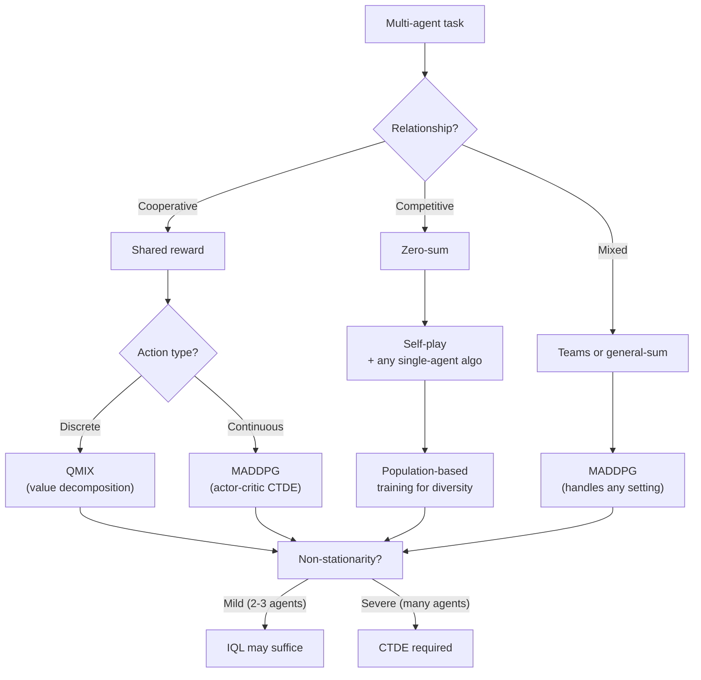

# Multi-Agent Systems — Interview Deep Dive

> **What this file covers**
> - 🎯 Multi-agent MDP formulation: stochastic games and partial observability
> - 🧮 Nash equilibrium computation, QMIX factorization, MADDPG objective
> - ⚠️ 4 failure modes: non-stationarity divergence, lazy agent problem, credit assignment, relative overgeneralization
> - 📊 Complexity: exponential joint action space, communication overhead
> - 💡 IQL vs QMIX vs MADDPG: when each wins
> - 🏭 Production: self-play curriculum, population-based training, scalability

---

## Brief restatement

Multi-agent RL extends single-agent RL to settings where multiple agents share an environment. The core challenge is non-stationarity: each agent's optimal strategy depends on the other agents' strategies, which are also changing during training. Solutions include centralized training with decentralized execution (CTDE), value decomposition (QMIX), and multi-agent actor-critic methods (MADDPG). Game theory concepts — Nash equilibrium, Pareto optimality, best response — provide the theoretical framework.

---

## 🧮 Full mathematical treatment

### Stochastic game formulation

A multi-agent environment is formalized as a stochastic game (also called Markov game).

🧮 Stochastic game tuple:

    G = (N, S, {A_i}, T, {R_i}, γ)

    Where:
      N       = set of n agents
      S       = state space (shared)
      A_i     = action space for agent i
      T       = transition function: S × A_1 × ... × A_n → Δ(S)
      R_i     = reward function for agent i: S × A_1 × ... × A_n → ℝ
      γ       = discount factor

    The joint action space is A = A_1 × A_2 × ... × A_n.
    If each agent has |A_i| = k actions and there are n agents,
    the joint action space has k^n elements.

**Worked example.** Two agents (n=2), each with 4 actions (up/down/left/right). The joint action space has 4² = 16 elements. With 5 agents and 4 actions each: 4⁵ = 1024 joint actions. This exponential growth is the fundamental scalability challenge.

### Nash equilibrium

A Nash equilibrium is a set of strategies where no agent can improve by unilaterally changing their strategy.

🧮 Nash equilibrium definition:

    A joint policy (π₁*, π₂*, ..., πₙ*) is a Nash equilibrium if,
    for every agent i and every alternative policy π'_i:

      V_i(π₁*, ..., πᵢ*, ..., πₙ*) ≥ V_i(π₁*, ..., π'ᵢ, ..., πₙ*)

    Where V_i is agent i's expected return under the joint policy.

    In words: given what everyone else is doing, no agent can do better
    by changing their own strategy.

**Worked example (Prisoner's Dilemma):**

    Payoff matrix:
                    Agent 2
                    C       D
    Agent 1   C   (3,3)   (0,5)
              D   (5,0)   (1,1)

    Check (D,D): Agent 1 gets 1. Can they improve by switching to C? V(C,D) = 0 < 1. No.
    Agent 2 gets 1. Can they improve by switching to C? V(D,C) = 0 < 1. No.
    Neither can improve → (D,D) is a Nash equilibrium.

    Check (C,C): Agent 1 gets 3. Can they improve by switching to D? V(D,C) = 5 > 3. Yes!
    So (C,C) is NOT a Nash equilibrium, even though it gives higher payoffs.

### Independent Q-Learning (IQL)

The simplest multi-agent approach: each agent runs its own Q-learning, treating other agents as part of the environment.

🧮 IQL update for agent i:

    Q_i(s, a_i) ← Q_i(s, a_i) + α [r_i + γ max_{a'_i} Q_i(s', a'_i) - Q_i(s, a_i)]

    This is identical to single-agent Q-learning, but the transition
    and reward depend on all agents' actions, not just agent i's.

    Problem: other agents are learning → T and R change over time
    → the Markov property is violated → convergence not guaranteed.

### QMIX — value decomposition for cooperative MARL

QMIX represents the joint Q-function as a monotonic mixing of individual Q-values.

🧮 QMIX factorization:

    Q_tot(s, a₁, ..., aₙ) = f_mix(Q₁(o₁, a₁), Q₂(o₂, a₂), ..., Qₙ(oₙ, aₙ); s)

    Monotonicity constraint:
      ∂Q_tot / ∂Q_i ≥ 0  for all i

    This guarantees:
      argmax_{a} Q_tot = (argmax_{a₁} Q₁, ..., argmax_{aₙ} Qₙ)

    In words: the joint action that maximizes Q_tot can be found by
    each agent independently maximizing its own Q_i. No coordination
    needed at execution time.

    The mixing network f_mix is a neural network with non-negative weights
    (enforced by absolute value), conditioned on the global state s.

**Why monotonicity matters.** Without it, the optimal joint action might require coordinated search over k^n possibilities. With monotonicity, each agent can independently pick its best action — O(nk) instead of O(k^n).

**What monotonicity loses.** QMIX cannot represent non-monotonic value functions. In some cooperative tasks, one agent doing well can actually reduce the total value (e.g., two agents that must avoid the same area). QPLEX and WQMIX relax this constraint.

### MADDPG — multi-agent actor-critic

MADDPG extends DDPG to multi-agent settings using CTDE: centralized critic, decentralized actors.

🧮 MADDPG objective for agent i:

    Actor (decentralized):
      π_i(a_i | o_i)  — agent i's policy uses only its own observation

    Critic (centralized):
      Q_i(s, a₁, ..., aₙ)  — critic sees global state and ALL agents' actions

    Actor update:
      ∇_θᵢ J = E [ ∇_θᵢ π_i(o_i) · ∇_{aᵢ} Q_i(s, a₁, ..., aₙ) |_{aᵢ=πᵢ(oᵢ)} ]

    Critic update (standard TD):
      L = E [ (Q_i(s, a) - (r_i + γ Q_i'(s', a')))² ]
      where a' = (π'₁(o'₁), ..., π'ₙ(o'ₙ)) uses target policies

    Key insight: the critic can see everyone's actions during training,
    but the actor uses only local observations at execution time.

**Worked example.** Two agents in a cooperative navigation task. Agent 1's critic Q₁(s, a₁, a₂) takes both agents' actions. During training, it learns: "when I go right AND agent 2 goes left, total reward is high." During execution, agent 1 only sees its own observation and acts using π₁(a₁|o₁), trusting that agent 2 will play its trained policy.

---

## 🗺️ Concept flow diagram

---

## ⚠️ Failure modes

### 1. Non-stationarity divergence

When agents learn independently, each agent's environment changes as others update their policies. Q-values can oscillate without converging. In the iterated Prisoner's Dilemma: agent 1 learns to defect → agent 2 learns to defect → both get low rewards → agent 1 explores cooperation → agent 2 exploits it → cycle repeats. Detection: plot Q-values over training steps — sustained oscillation instead of convergence signals non-stationarity. Fix: CTDE or opponent modeling.

### 2. Lazy agent problem

In cooperative settings with shared rewards, one agent may learn to do nothing while the other does all the work. The shared reward is still positive (the active agent succeeds), so the lazy agent sees no gradient to improve. Detection: measure each agent's action entropy — a collapsed policy (always picks the same action) may indicate a lazy agent. Fix: individual reward shaping, or counterfactual baselines (COMA) that measure each agent's marginal contribution.

### 3. Credit assignment

With shared rewards, each agent struggles to determine its own contribution to the team outcome. Did the team succeed because of agent 1's action or agent 2's? This is the multi-agent credit assignment problem. It is harder than single-agent temporal credit assignment because the signal is diluted across agents as well as across time. Fix: difference rewards (each agent's reward = team reward minus reward without that agent), or centralized critics that can attribute value to individual actions.

### 4. Relative overgeneralization

Agents converge to a suboptimal joint policy because the optimal policy requires precise coordination that is hard to discover. If the optimal joint action (A₁=left, A₂=right) gives reward 10 but any mismatch gives reward 0, while a suboptimal joint action (A₁=stay, A₂=stay) gives reward 3 regardless, agents will converge to (stay, stay) because it is robust to the other agent's exploration. Detection: compare achieved return to known optima (if available). Fix: count-based exploration bonuses on joint actions, or curricula that gradually increase coordination requirements.

---

## 📊 Complexity analysis

| Component | Single-agent | Multi-agent (n agents, k actions) |
|-----------|-------------|----------------------------------|
| Action space | k | k^n (exponential) |
| Q-table size | \|S\| × k | \|S\| × k^n |
| QMIX per-step | — | O(n × k + mixing network forward) |
| MADDPG per-step | O(critic + actor) | O(n × (critic + actor)) |
| Communication (CTDE) | — | O(n² × message_size) at training |
| Self-play | — | O(population_size × n × episode_length) |

| System | Agents | Training compute | Key algorithm |
|--------|--------|-----------------|---------------|
| AlphaGo (2016) | 2 (self-play) | 1,920 CPUs + 280 GPUs × 3 weeks | MCTS + policy/value networks |
| OpenAI Five (2019) | 10 (5v5) | 128,000 CPU cores × 10 months | PPO + LSTM |
| AlphaStar (2019) | 2 (self-play) | 16 TPUv3 × 14 days per agent | Multi-agent league |
| Pluribus (2019) | 6 players | 128 CPU cores × 8 days | CFR+ (counterfactual regret) |

---

## 💡 Design trade-offs

| | IQL | QMIX | MADDPG |
|---|---|---|---|
| **Setting** | Any | Cooperative only | Any |
| **Action space** | Discrete | Discrete | Continuous |
| **Training** | Decentralized | CTDE | CTDE |
| **Scalability** | Best (independent) | Good (linear in n) | Moderate (quadratic critic) |
| **Coordination** | Poor | Good (with monotonicity limit) | Good |
| **Convergence** | Not guaranteed | Better (centralized critic) | Better (centralized critic) |
| **When to use** | Weak coupling, baseline | Cooperative discrete tasks | General-purpose |

| | Self-play | Population-based training (PBT) |
|---|---|---|
| **Diversity** | Low (single opponent) | High (many opponents) |
| **Convergence** | Faster | Slower |
| **Exploitation risk** | High (overfits to self) | Low (robust to diverse opponents) |
| **Compute** | Lower | Higher (multiple agents) |
| **Used in** | AlphaGo, simple games | AlphaStar, complex games |

---

## 🏭 Production and scaling considerations

**Self-play curriculum.** In competitive settings, training against a fixed opponent leads to overfitting. Self-play — where the agent trains against copies of itself — creates an auto-curriculum. The opponent difficulty scales with the agent's own ability. AlphaZero used pure self-play to achieve superhuman Go without any human data.

**Population-based training.** Self-play against a single opponent can cycle (rock-paper-scissors dynamics). AlphaStar solved this with a league of agents: main agents train against a population of past versions and specialized exploiters. This ensures robustness against diverse strategies, not just the latest one.

**Communication protocols.** In cooperative settings, agents may need to share information. Learned communication channels (CommNet, TarMAC) allow agents to send continuous messages. The challenge: the communication channel itself must be learned, adding another non-stationarity source. In production, communication bandwidth and latency are real constraints.

**Scalability.** The joint action space grows exponentially with the number of agents. Mean-field approaches approximate the effect of many agents as a single "average" agent. Parameter sharing (all agents use the same network with agent ID as input) reduces memory linearly. Hierarchical MARL decomposes the problem into sub-teams.

---

## 🎯 Staff/Principal Interview Depth

### Q1: "You're designing a multi-agent system for a fleet of 100 delivery drones. How would you approach this?"

---
**No Hire**
*Interviewee:* "I would use MADDPG with a centralized critic that takes all 100 agents' observations and actions."
*Interviewer:* A centralized critic over 100 agents is computationally infeasible — the input dimension alone would be enormous. No discussion of scalability, communication, or how to decompose the problem.
*Criteria — Met:* knows MADDPG exists / *Missing:* scalability analysis, problem decomposition, practical constraints

**Weak Hire**
*Interviewee:* "100 agents is too many for standard MARL algorithms. I would group drones into zones and use QMIX within each zone since they are cooperating. Each zone has 5-10 drones, making the problem tractable. Between zones, I would use a higher-level coordinator."
*Interviewer:* Good instinct to decompose the problem. Mentions QMIX and zone-based grouping. But no detail on what the higher-level coordinator does, how zones interact, or how to handle drones crossing zone boundaries.
*Criteria — Met:* scalability awareness, hierarchical decomposition / *Missing:* boundary handling, communication design, reward shaping, production details

**Hire**
*Interviewee:* "I would use a hierarchical approach. Low level: each drone runs a local policy for navigation and obstacle avoidance — this is single-agent continuous control, trained with PPO or SAC in simulation. Mid level: groups of 10-15 drones in a zone use QMIX to coordinate deliveries within their zone — who picks up which package, routing to avoid collisions. The shared reward is zone-level delivery throughput. High level: a centralized dispatcher assigns packages to zones based on demand and drone availability — this can be optimization-based (mixed-integer programming) rather than RL. For the QMIX training: use parameter sharing (all drones run the same network with drone ID and zone position as input) to handle the variable number of drones per zone. Train in simulation with domain randomization over demand patterns, wind conditions, and drone failures."
*Interviewer:* Excellent hierarchical decomposition with appropriate algorithm choices at each level. Parameter sharing for scalability is a strong choice. Would push to Strong Hire with discussion of sim-to-real transfer, safety constraints, or how to handle communication failures.
*Criteria — Met:* three-level hierarchy, algorithm selection, parameter sharing, simulation training / *Missing:* safety constraints, communication failures, sim-to-real, online adaptation

**Strong Hire**
*Interviewee:* "I would decompose this into three levels, each with different MARL requirements. Level 1 (motion): single-agent PPO for each drone's low-level control (velocity, altitude). Trained in simulation with domain randomization. Level 2 (coordination): mean-field MARL within geographic clusters. Each drone models the average behavior of nearby drones rather than tracking all individuals. This scales to arbitrary fleet sizes. Reward: individual delivery success minus collision penalty minus energy cost. Level 3 (dispatch): combinatorial optimization for package-to-drone assignment, solved with Lagrangian relaxation updated every 30 seconds based on fleet state. For safety: hard constraints on minimum separation distance enforced at the motion level (overrides RL actions if violated). For communication: design for intermittent connectivity — each drone caches its latest plan locally and re-optimizes if communication drops for >5 seconds. For sim-to-real: train with randomized wind, GPS noise, and 10% actuator degradation. Deploy with an online adaptation layer that adjusts the policy based on the drone's actual performance metrics. Monitor: track delivery time, collision near-misses, energy per delivery, and coordination efficiency (wasted trips) — if any metric degrades >15% from simulation baseline, trigger retraining."
*Interviewer:* Comprehensive answer covering all scales, safety, communication robustness, sim-to-real, and production monitoring. The mean-field approximation shows knowledge of scalable MARL. The safety override and monitoring dashboard show production engineering judgment. Staff-level answer.
*Criteria — Met:* hierarchical design, mean-field MARL, safety constraints, communication robustness, sim-to-real, monitoring, production readiness
---

### Q2: "Explain why independent Q-learning fails in multi-agent settings and how CTDE fixes it."

---
**No Hire**
*Interviewee:* "Independent Q-learning doesn't work because agents don't communicate. CTDE adds communication."
*Interviewer:* Misses the core issue entirely. IQL fails because of non-stationarity, not lack of communication. CTDE is not about adding communication during execution — it is about centralized training.
*Criteria — Met:* none / *Missing:* non-stationarity concept, why Q-learning assumptions break, how CTDE addresses it

**Weak Hire**
*Interviewee:* "IQL fails because each agent treats other agents as part of the environment. Since other agents are learning, the environment is non-stationary — the transition function changes over time. This violates the Markov property that Q-learning relies on. CTDE fixes this by using a centralized critic during training that sees all agents' information, making the training signal more stable."
*Interviewer:* Correct identification of non-stationarity as the root cause and how CTDE addresses it. But no math, no worked example, and no discussion of what specific Q-learning convergence guarantee breaks.
*Criteria — Met:* non-stationarity identification, CTDE mechanism / *Missing:* mathematical grounding, convergence analysis, concrete example

**Hire**
*Interviewee:* "Q-learning converges to the optimal Q-function under two conditions: (1) every state-action pair is visited infinitely often, and (2) the environment is stationary (same transition and reward functions). In multi-agent settings, condition 2 is violated. Agent 1's Q-update assumes Q₁(s, a₁) converges to E[r + γ max Q₁(s', a'₁)], but the expectation depends on agent 2's policy π₂, which is changing. So the target is non-stationary — it is like trying to hit a moving goalpost. The Q-values can oscillate. In the Prisoner's Dilemma: if agent 2 cooperates, Q(D) > Q(C) for agent 1 (temptation payoff 5 > 3). Agent 1 defects. Now agent 2 sees defection and learns Q(D) > Q(C) too. Both defect, getting payoff 1. Now neither can improve — but the Q-values oscillated through multiple phases before settling. CTDE fixes this by giving the critic access to all agents' policies during training. Q₁(s, a₁, a₂) conditions on agent 2's actual action, so it can learn the joint value function stably. The actor π₁(a₁|o₁) still uses only local observations, so execution is decentralized."
*Interviewer:* Strong answer with both the mathematical conditions and a concrete example. The Prisoner's Dilemma walkthrough effectively demonstrates the oscillation. Would push to Strong Hire with discussion of when IQL actually works despite non-stationarity, or the relationship to convergence in fictitious play.
*Criteria — Met:* convergence conditions, non-stationarity mechanism, concrete example, CTDE fix / *Missing:* when IQL works anyway, fictitious play connection, CTDE limitations

**Strong Hire**
*Interviewee:* "The core issue is that Q-learning's convergence proof requires a stationary MDP — specifically, that the Bellman operator is a contraction mapping in the sup-norm. With multiple learning agents, the effective transition T_i(s'|s, a_i) = Σ_{a_{-i}} T(s'|s, a_i, a_{-i})·π_{-i}(a_{-i}) depends on other agents' policies π_{-i}, which change during training. The Bellman operator is no longer a contraction because the target keeps moving. This can cause Q-values to cycle. Interestingly, IQL does work in some settings despite this: when the coupling between agents is weak (each agent's reward depends mostly on its own action), IQL converges to a local Nash equilibrium because the non-stationarity effect is small. This is why IQL is a surprisingly strong baseline in loosely coupled cooperative tasks. CTDE fixes the convergence issue by conditioning the critic on the joint action Q(s, a₁, ..., aₙ), which makes the Bellman operator a contraction again because there is no marginalization over unknown policies. However, CTDE has its own limitation: the centralized critic's input dimension grows linearly with the number of agents (or quadratically if encoding pairwise interactions), creating scalability issues beyond ~20 agents. QMIX addresses this by factoring Q_tot as a monotonic function of individual Q_i values — this maintains the contraction property while keeping per-agent computation constant. The trade-off is representational: QMIX cannot represent non-monotonic joint value functions, meaning it may converge to a suboptimal Nash equilibrium in games where agents' contributions are complementary rather than additive."
*Interviewer:* Deep mathematical understanding connecting Bellman operator contraction to convergence, explaining when IQL works and why, and identifying CTDE's scalability limitation with QMIX as a principled solution. The monotonicity trade-off discussion shows understanding of the QMIX limitations literature. Staff-level answer.
*Criteria — Met:* contraction mapping argument, when IQL works, CTDE mechanism and limitation, QMIX factorization and its trade-off, representational analysis
---

### Q3: "How would you handle the credit assignment problem in a cooperative multi-agent task with shared rewards?"

---
**No Hire**
*Interviewee:* "Give each agent the team reward divided by the number of agents."
*Interviewer:* Dividing the reward equally does not solve credit assignment — it does not tell each agent whether its action was good or bad for the team. All agents get the same signal regardless of their contribution.
*Criteria — Met:* none / *Missing:* understanding of the credit assignment problem, any solution

**Weak Hire**
*Interviewee:* "The credit assignment problem is that with shared rewards, each agent cannot tell if its action was helpful or not. I would use individual reward shaping — add a small reward for each agent based on its local progress toward a subgoal. For example, in a cooperative navigation task, each agent gets a reward for moving closer to its assigned target."
*Interviewer:* Correct problem statement. Individual reward shaping works but requires domain knowledge to design the shaping function, and poorly designed shaping can change the optimal joint policy. No mention of principled solutions like difference rewards or counterfactual baselines.
*Criteria — Met:* problem understanding, one practical solution / *Missing:* principled methods, shaping pitfalls, counterfactual reasoning

**Hire**
*Interviewee:* "Credit assignment in cooperative MARL is hard because the shared reward conflates all agents' contributions. Three approaches, in order of sophistication. First, difference rewards: agent i's reward = team reward minus reward the team would get without agent i (replaced by a default policy). This isolates agent i's marginal contribution. It is principled but requires simulating the counterfactual 'without agent i,' which can be expensive. Second, COMA (Counterfactual Multi-Agent policy gradient): uses a centralized critic to compute a counterfactual baseline. Agent i's advantage = Q(s, a) - Σ_{a'_i} π_i(a'_i) × Q(s, (a_{-i}, a'_i)). This marginalizes out agent i's action to get the expected value, then compares with the actual Q-value. The difference is agent i's specific contribution. Third, attention-based critics that learn which agents' actions are most relevant to each agent's reward — similar to transformer attention over agent observations."
*Interviewer:* Comprehensive answer with three principled approaches at increasing sophistication. The COMA formula is correct and well-explained. Would push to Strong Hire with discussion of when each approach fails, or how credit assignment relates to the lazy agent problem.
*Criteria — Met:* difference rewards, COMA, attention-based critics, mathematical grounding / *Missing:* failure modes of each approach, lazy agent connection, computational trade-offs

**Strong Hire**
*Interviewee:* "The credit assignment problem has two dimensions: temporal (which time step mattered?) and agent-level (which agent mattered?). Single-agent RL solves temporal credit assignment with TD learning and GAE. Multi-agent adds the agent dimension. I would layer solutions. First, COMA provides a counterfactual baseline: advantage_i = Q(s, a) - Σ_{a'_i} π_i(a'_i|o_i) × Q(s, (a_{-i}, a'_i)). This computes the expected Q if agent i acted randomly while all others acted as they did. The difference isolates agent i's contribution. However, COMA requires evaluating Q for all possible actions of agent i — O(|A_i|) forward passes — which is expensive for large action spaces. For large action spaces, I would use QMIX with a shaped individual reward: r_i = r_team + λ × ∂Q_tot/∂Q_i × ΔQ_i, which weights the team reward by agent i's influence on Q_tot (measured via the QMIX mixing network gradient). This is cheap because the gradient is already computed during backpropagation. The lazy agent problem is directly related: it occurs when the credit assignment signal is too diffuse. An agent that always takes a no-op action gets the same team reward as the active agent. Difference rewards solve this because the team-without-agent-i still succeeds, so the lazy agent's difference reward is zero — it gets no credit for the team's success, and the gradient pushes it to contribute."
*Interviewer:* Exceptional answer connecting temporal and agent-level credit assignment, providing COMA's formula with computational analysis, proposing a practical gradient-based approximation via QMIX, and linking credit assignment to the lazy agent problem with a clear mechanism for why difference rewards fix it. Staff-level understanding of both theory and practical implications.
*Criteria — Met:* two-dimensional credit assignment, COMA formula and complexity, QMIX gradient approximation, lazy agent connection, computational analysis
---

---

## Key Takeaways

🎯 1. Multi-agent RL adds non-stationarity: other agents change the effective transition function during training
   2. The joint action space grows exponentially: k^n for n agents with k actions each
🎯 3. CTDE solves non-stationarity by conditioning the critic on all agents' actions during training
   4. QMIX decomposes Q_tot into monotonically mixed individual Q_i values — scalable but limited representationally
⚠️ 5. Nash equilibrium ≠ Pareto optimality — individually rational behavior can lead to collectively bad outcomes
   6. MADDPG handles any setting (cooperative, competitive, mixed) with continuous actions
   7. Credit assignment is two-dimensional: temporal (which step?) and agent-level (which agent?)
⚠️ 8. Lazy agent problem: shared rewards allow agents to free-ride; fix with difference rewards or COMA
   9. Self-play creates auto-curricula for competitive settings; population-based training prevents cycling
  10. Scalability requires mean-field approximation, parameter sharing, or hierarchical decomposition beyond ~20 agents
