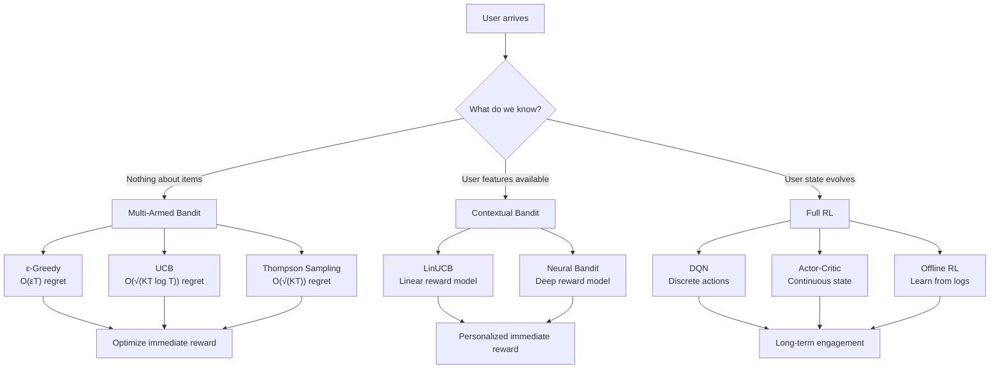

# Recommendation Systems with RL — Interview Deep Dive

> **What this file covers**
> - 🎯 Multi-armed bandit formulation and regret bounds
> - 🧮 UCB formula derivation and Thompson Sampling posterior update
> - ⚠️ 4 failure modes: cold start, popularity bias, filter bubbles, delayed rewards
> - 📊 Regret bounds: O(√(KT log T)) for UCB, O(√(KT)) for Thompson Sampling
> - 💡 Bandits vs contextual bandits vs full RL: when each wins
> - 🏭 Production: offline evaluation, logging policy, off-policy correction

---

## Brief restatement

Recommendation systems use RL to balance exploring unknown items with exploiting known preferences. The simplest form — multi-armed bandits — treats each item as an arm with unknown reward probability and minimizes cumulative regret. Contextual bandits add user features for personalization. Full RL models how recommendations change user state over time, optimizing long-term engagement rather than immediate clicks.

---

## 🧮 Full mathematical treatment

### Multi-armed bandit formulation

We start with the simplest version and build up.

**The setup.** There are K arms (items to recommend). Each arm i has a true reward probability μᵢ that the agent does not know. At each time step t, the agent picks an arm A_t and observes reward R_t ~ Bernoulli(μ_{A_t}).

**The goal.** Minimize cumulative regret — the gap between what the best arm would have earned and what the agent actually earned.

🧮 Regret formula:

    Regret(T) = T · μ* - Σ_{t=1}^{T} μ_{A_t}

    Where:
      T     = total number of time steps
      μ*    = max_i μᵢ  (the best arm's true probability)
      A_t   = arm chosen at time t
      μ_{A_t} = true probability of the chosen arm

    In words: regret counts how many extra rewards the agent missed by not always
    picking the best arm.

**Worked example.** K = 3 arms with μ = [0.3, 0.7, 0.5]. After T = 100 steps, the agent picked arm 2 sixty times and arms 1 and 3 twenty times each.

    Regret = 100 × 0.7 - (20 × 0.3 + 60 × 0.7 + 20 × 0.5)
           = 70 - (6 + 42 + 10)
           = 70 - 58
           = 12

The agent missed 12 rewards compared to always picking the best arm.

### Epsilon-greedy

The simplest strategy. With probability ε, pick a random arm. Otherwise, pick the arm with the highest estimated value.

🧮 Value estimate update:

    Q_{n+1}(a) = Q_n(a) + (1/N_a) × (R - Q_n(a))

    Where:
      Q_n(a) = estimated value of arm a after n total steps
      N_a    = number of times arm a has been pulled
      R      = observed reward

    This is the incremental mean: each new observation moves the estimate
    by a fraction 1/N_a toward the new reward.

**Regret bound.** Epsilon-greedy with fixed ε has linear regret: Regret(T) = O(εT). The ε fraction of random exploration never stops, even after the agent has learned which arm is best. This is the main weakness.

### UCB (Upper Confidence Bound)

UCB adds an optimism bonus to each arm. Arms that have been tried fewer times get a larger bonus.

🧮 UCB selection formula:

    A_t = argmax_a [ Q_t(a) + c × √(ln(t) / N_t(a)) ]

    Where:
      Q_t(a)  = estimated value of arm a at time t
      N_t(a)  = number of times arm a has been pulled by time t
      t       = total number of pulls so far
      c       = exploration coefficient (typically √2)

    The bonus term √(ln(t) / N_t(a)):
      - Grows with t (total time) → keeps exploring over time
      - Shrinks with N_t(a) (pulls of arm a) → stops exploring well-known arms

**Worked example.** At time t = 100, arm 1 has been pulled 50 times with Q = 0.6, arm 2 has been pulled 5 times with Q = 0.4.

    UCB(arm 1) = 0.6 + √2 × √(ln(100) / 50) = 0.6 + 1.41 × √(4.6 / 50) = 0.6 + 0.43 = 1.03
    UCB(arm 2) = 0.4 + √2 × √(ln(100) / 5)  = 0.4 + 1.41 × √(4.6 / 5)  = 0.4 + 1.35 = 1.75

Arm 2 is selected despite a lower estimated value because the uncertainty bonus is much larger. After being pulled more, the bonus will shrink and the true value will dominate.

**Regret bound.** UCB achieves O(√(KT log T)) regret — sublinear, which means the per-step regret goes to zero.

### Thompson Sampling

Thompson Sampling maintains a Bayesian posterior for each arm's reward probability and samples from it.

🧮 Thompson Sampling for Bernoulli bandits:

    Prior:    μᵢ ~ Beta(1, 1)  (uniform on [0, 1])

    After observing Sᵢ successes and Fᵢ failures for arm i:
    Posterior: μᵢ | data ~ Beta(1 + Sᵢ, 1 + Fᵢ)

    Selection:
      1. Sample θ̃ᵢ ~ Beta(1 + Sᵢ, 1 + Fᵢ) for each arm i
      2. Pick arm A_t = argmax_i θ̃ᵢ

    Update after reward R_t:
      If R_t = 1: S_{A_t} ← S_{A_t} + 1
      If R_t = 0: F_{A_t} ← F_{A_t} + 1

**Worked example.** Arm 1 has seen 8 successes and 2 failures → Beta(9, 3), mean = 0.75. Arm 2 has seen 3 successes and 1 failure → Beta(4, 2), mean = 0.67.

Arm 1's distribution is narrow (peaked around 0.75). Arm 2's distribution is wide (could be anywhere from 0.3 to 0.9). When sampling, arm 2 sometimes samples above arm 1 — that is when it gets explored. As more data comes in, the distributions narrow and the best arm gets picked almost every time.

**Regret bound.** Thompson Sampling achieves O(√(KT)) regret — matching the theoretical lower bound (Lai-Robbins).

### Contextual bandits — LinUCB

In contextual bandits, the agent observes a context vector x_t (user features) before selecting an arm. The reward depends on both the context and the arm.

🧮 LinUCB formula:

    Assume: E[r | x, a] = x^T θ_a  (linear reward model for each arm)

    Selection:
      A_t = argmax_a [ x_t^T θ̂_a + α × √(x_t^T A_a^{-1} x_t) ]

    Where:
      θ̂_a = A_a^{-1} b_a   (ridge regression estimate)
      A_a  = I + Σ x_τ x_τ^T  (design matrix for arm a, sum over times a was pulled)
      b_a  = Σ r_τ x_τ        (reward-weighted context sum for arm a)
      α    = exploration coefficient

    Update after observing reward r_t for arm A_t:
      A_{A_t} ← A_{A_t} + x_t x_t^T
      b_{A_t} ← b_{A_t} + r_t × x_t

**Worked example.** Context x = [1, 0.5] (young user, moderate action preference). Two arms with current estimates θ̂₁ = [0.8, 0.3] and θ̂₂ = [0.2, 0.9].

    Mean reward estimates:
      Arm 1: [1, 0.5] · [0.8, 0.3] = 0.8 + 0.15 = 0.95
      Arm 2: [1, 0.5] · [0.2, 0.9] = 0.2 + 0.45 = 0.65

    After adding uncertainty bonus (depends on A_a^{-1}), arm 1 is selected.
    For a different user with x = [0, 1], arm 2 would be preferred.

---

## 🗺️ Concept flow diagram

---

## ⚠️ Failure modes

### 1. Cold start — new items get no exposure

New items have zero interaction data. UCB gives them a bonus, but in systems with millions of items, even the bonus may not surface them. Thompson Sampling with uninformative priors (Beta(1,1)) helps, but the problem persists at scale. Production systems use content-based features to bootstrap new item estimates.

### 2. Popularity bias — rich get richer

Items that are recommended more get more clicks, which makes them look even better, which gets them recommended even more. The feedback loop amplifies initial advantages. Items that happen to start with a few good interactions dominate, while potentially better items with bad early luck never recover. Diversity constraints or fairness-aware bandits mitigate this.

### 3. Filter bubbles — shrinking exploration

Over time, the system narrows recommendations to a small set of "safe" items the user has liked before. The user never sees new genres, new creators, or new topics. Engagement metrics look fine (the user clicks on familiar content), but long-term satisfaction drops. This is epsilon-greedy's weakness at scale — the exploration is uniform over all items, so it rarely surfaces items outside the user's known preferences.

### 4. Delayed and sparse rewards

Bandit algorithms assume immediate reward. But in practice, a movie recommendation's true value is revealed 2 hours later (did the user finish it?), and a product recommendation's value might take days (did they return it?). Delayed rewards make credit assignment hard. Sparse rewards (most recommendations get no feedback) make learning slow. Both problems push practitioners toward full RL or offline RL from logged data.

---

## 📊 Complexity analysis

| Algorithm | Per-step time | Per-step memory | Regret bound | Notes |
|-----------|--------------|----------------|--------------|-------|
| ε-Greedy | O(K) | O(K) | O(εT) linear | Fixed ε never stops exploring |
| UCB | O(K) | O(K) | O(√(KT log T)) | Provably sublinear |
| Thompson Sampling | O(K) | O(K) | O(√(KT)) | Matches Lai-Robbins bound |
| LinUCB | O(Kd² + Kd³) | O(Kd²) | O(d√(T log T)) | d = context dimension; matrix inverse dominates |
| Full RL (DQN) | O(batch × network) | O(replay buffer) | No regret bound | Depends on MDP structure |

K = number of arms, T = time horizon, d = context dimension.

LinUCB's O(Kd³) comes from inverting the d×d design matrix for each arm. In practice, the Sherman-Morrison formula updates A⁻¹ incrementally in O(d²), reducing per-step cost to O(Kd²).

---

## 💡 Design trade-offs

| | Bandits | Contextual Bandits | Full RL |
|---|---|---|---|
| **What it models** | Item quality (global) | Item quality per user type | User state transitions |
| **Personalization** | None | Per-context | Per-trajectory |
| **Handles boredom** | No | No | Yes |
| **Data requirements** | Low (counts only) | Moderate (context features) | High (state trajectories) |
| **Theoretical guarantees** | Strong (regret bounds) | Moderate (contextual regret) | Weak (depends on MDP) |
| **Production complexity** | Low | Moderate | High |
| **Best for** | A/B testing, thumbnail selection | Personalized homepage | Session-level optimization |

| | ε-Greedy | UCB | Thompson Sampling |
|---|---|---|---|
| **Exploration** | Uniform random | Optimism-based | Posterior sampling |
| **Parameters to tune** | ε | c (exploration coefficient) | Prior only |
| **Adapts over time** | No (fixed ε) | Yes (bonus shrinks) | Yes (posterior narrows) |
| **Computational cost** | Lowest | Low | Moderate (sampling) |
| **Empirical performance** | Good baseline | Strong | Often best |
| **Handles non-stationarity** | With decaying ε | Poorly (assumes stationarity) | With windowed posteriors |

---

## 🏭 Production and scaling considerations

**Offline evaluation.** You cannot A/B test every algorithm change on live users. Offline evaluation uses logged data: for each historical recommendation, check whether the proposed algorithm would have made the same choice. If so, use the logged reward. This is called replay evaluation. Its weakness: it can only evaluate actions the logging policy actually took.

**Off-policy correction (IPS).** When the proposed policy differs from the logging policy, use inverse propensity scoring:

    V̂(π) = (1/T) Σ_{t=1}^{T} (π(a_t | x_t) / π_log(a_t | x_t)) × r_t

This re-weights rewards by the ratio of proposed vs logged action probabilities. High variance when the ratio is large (proposed policy strongly disagrees with logger).

**Batch updates.** Production systems do not update per-interaction. They batch interactions (e.g., hourly), retrain the model, and deploy. This means the exploration policy is stale between updates. Thompson Sampling is more robust to batching than UCB because the posterior still captures uncertainty even with delayed updates.

**Multi-objective rewards.** Real systems optimize for multiple signals: clicks, watch time, purchases, returns, and user retention. These are often combined as a weighted sum, but the weights require business judgment. Optimizing for clicks alone leads to clickbait. Optimizing for watch time alone leads to addictive recommendations.

---

## 🎯 Staff/Principal Interview Depth

### Q1: "You're building a recommendation system for a new e-commerce platform. How would you choose between bandits and full RL?"

---
**No Hire**
*Interviewee:* "I would use deep RL because it's the most powerful approach. We can use DQN to learn the optimal recommendation policy."
*Interviewer:* Jumps to the most complex solution without considering simpler alternatives. No discussion of data requirements, cold start, or the practical difficulty of defining state transitions for e-commerce.
*Criteria — Met:* none / *Missing:* problem decomposition, data awareness, trade-off analysis, practical judgment

**Weak Hire**
*Interviewee:* "I would start with multi-armed bandits for simplicity. Each product is an arm. We can use Thompson Sampling because it has good empirical performance. If we need personalization, we can move to contextual bandits with user features."
*Interviewer:* Correct high-level reasoning and good instinct to start simple. But no discussion of regret bounds, cold start for new products, how to handle the transition from bandits to contextual bandits, or when full RL would actually be needed.
*Criteria — Met:* start-simple instinct, algorithm choice / *Missing:* math, failure modes, production concerns, when to escalate

**Hire**
*Interviewee:* "It depends on the data maturity and what we are optimizing. Day one with no data: epsilon-greedy or Thompson Sampling with uninformative priors, K = number of product categories to keep K small. Once we have user features: contextual bandits via LinUCB, where the context vector includes user demographics and browsing history. Full RL only if we have evidence that recommendations affect future user behavior — like boredom effects or preference drift — because full RL requires state transition modeling and much more data. I would measure: does showing category X at time t change click rates for category Y at time t+1? If no sequential dependence, bandits are sufficient and have stronger theoretical guarantees."
*Interviewer:* Good progression from simple to complex with clear criteria for escalation. Mentions data requirements and how to test the assumption that full RL is needed. Would push to Strong Hire with discussion of offline evaluation, cold start mitigation, and multi-objective rewards.
*Criteria — Met:* progressive complexity, data-driven escalation, regret awareness / *Missing:* offline evaluation, cold start strategy, production deployment details

**Strong Hire**
*Interviewee:* "First, I would separate the decision into two parts: what to show and how to evaluate. For what to show: start with Thompson Sampling over product categories (not individual products — K would be too large). Use Beta posteriors with informative priors from content features to handle cold start. Move to LinUCB once we have enough user feature data, using Sherman-Morrison for O(d²) incremental updates. For evaluation: implement replay evaluation on logged data with IPS correction, capped at some maximum weight to control variance. Monitor the propensity ratio distribution — if it is heavy-tailed, the evaluation is unreliable. Only consider full RL if offline analysis shows sequential dependencies in user behavior, and even then, start with offline RL (batch constrained Q-learning) before any online RL. For multi-objective: define reward as a weighted combination of click, purchase, and 30-day retention, with the weights treated as business parameters reviewed quarterly."
*Interviewer:* Complete answer covering algorithm selection, cold start, evaluation methodology, progression criteria, and multi-objective design. The mention of propensity ratio monitoring and offline-first RL approach shows production experience. Staff-level thinking.
*Criteria — Met:* progressive complexity, cold start, evaluation, off-policy correction, multi-objective design, production deployment strategy
---

### Q2: "Thompson Sampling often outperforms UCB empirically, but UCB has better worst-case regret bounds. Explain this apparent contradiction."

---
**No Hire**
*Interviewee:* "Thompson Sampling uses Bayesian methods which are better than frequentist methods like UCB."
*Interviewer:* This is not a meaningful distinction. The question asks about a specific performance gap, and the answer substitutes a buzzword classification for analysis.
*Criteria — Met:* none / *Missing:* regret bound comparison, explanation of empirical vs theoretical gap, understanding of both algorithms

**Weak Hire**
*Interviewee:* "UCB has O(√(KT log T)) regret and Thompson Sampling has O(√(KT)) regret, so Thompson actually has the better bound. Empirically, Thompson also does well because it naturally calibrates exploration to uncertainty."
*Interviewer:* Knows the bounds and gives a reasonable intuition. But the question specifically says UCB has better worst-case bounds — the candidate corrected the premise but did not explain why UCB was historically considered to have stronger guarantees or discuss the problem-dependent vs minimax distinction.
*Criteria — Met:* knows bounds, basic intuition / *Missing:* problem-dependent vs minimax distinction, historical context, concrete mechanism

**Hire**
*Interviewee:* "The apparent contradiction comes from two different notions of 'regret bound.' UCB has tighter problem-dependent bounds: O(Σ (log T / Δᵢ)) where Δᵢ is the gap between arm i and the best arm. This bound is instance-specific and very tight when the gaps are well-separated. Thompson Sampling's O(√(KT)) is a minimax bound — worst case over all problem instances. Empirically, Thompson wins because: (1) its exploration is implicitly proportional to uncertainty, so it stops exploring bad arms faster than UCB, and (2) UCB's constant c is often too conservative in practice — theoretically correct but wastes exploration budget. Thompson Sampling adapts its exploration to the actual problem difficulty without a tuning constant."
*Interviewer:* Excellent distinction between problem-dependent and minimax regret. Good explanation of why UCB over-explores in practice. Would push to Strong Hire with discussion of when UCB is actually preferable or how to tune c.
*Criteria — Met:* problem-dependent vs minimax, practical mechanism, no-tuning advantage / *Missing:* when UCB wins, batched settings, non-stationary environments

**Strong Hire**
*Interviewee:* "There are actually three things going on. First, the bound types differ: UCB's classic result is problem-dependent O(Σ (log T / Δᵢ)), tight when gaps are known; Thompson's is minimax O(√(KT)), tight over all instances. Second, UCB's constant c = √2 comes from a Hoeffding bound, which is loose for Bernoulli rewards — the actual concentration is tighter (KL-UCB fixes this and is nearly as good as Thompson empirically). Third, Thompson naturally implements probability matching — the probability of selecting arm i roughly equals the posterior probability that i is optimal. This means it allocates exploration budget proportionally to remaining uncertainty, which is information-theoretically efficient. UCB, by contrast, explores any arm whose upper confidence bound exceeds the best lower bound, which can include clearly suboptimal arms for a long time. That said, UCB wins in adversarial or non-stationary settings where Bayesian assumptions break, and it is easier to analyze theoretically, which matters for providing guarantees to stakeholders."
*Interviewer:* Deep understanding of both algorithms' strengths. The KL-UCB reference and probability matching insight show genuine expertise. The note about adversarial settings where UCB is preferable demonstrates balanced judgment. Staff-level answer.
*Criteria — Met:* bound type distinction, practical mechanism, information-theoretic efficiency, KL-UCB, adversarial settings, probability matching
---

### Q3: "How would you detect and prevent filter bubbles in a bandit-based recommendation system?"

---
**No Hire**
*Interviewee:* "Increase epsilon to explore more. If you explore 20% of the time instead of 10%, users will see more diverse content."
*Interviewer:* Increasing epsilon helps but does not solve the problem — random exploration over millions of items has near-zero probability of surfacing items outside the user's current preference cluster. No understanding of why filter bubbles form or how to measure them.
*Criteria — Met:* none / *Missing:* bubble measurement, diversity metrics, structured exploration, root cause analysis

**Weak Hire**
*Interviewee:* "Filter bubbles happen because the algorithm narrows recommendations over time. I would add a diversity constraint: ensure each user sees items from at least 5 different categories per session. I would also track the entropy of recommended categories over time — if entropy drops, we have a bubble forming."
*Interviewer:* Good instinct to measure with entropy and enforce diversity. But diversity constraints are ad-hoc and may hurt engagement. No discussion of how to balance diversity with relevance, or how to distinguish between a bubble and a user who genuinely has narrow preferences.
*Criteria — Met:* measurement (entropy), diversity constraint / *Missing:* diversity-relevance trade-off, user intent distinction, structured approaches

**Hire**
*Interviewee:* "I would approach this at three levels. Measurement: track intra-list diversity (average pairwise distance between recommended items), coverage (fraction of catalog shown to each user over 30 days), and surprise (fraction of recommendations outside the user's historical categories). Detection: alert when any user's 30-day coverage drops below a threshold or when category entropy decreases monotonically over 7 days. Prevention: rather than random exploration, use category-level Thompson Sampling — maintain posteriors at the category level (K ~ 20 categories, not millions of items) and sample from those to decide which category to explore, then pick the best item within that category. This gives structured exploration that is more likely to surface genuinely different content. The key trade-off: too much forced diversity reduces short-term engagement. I would run an A/B test comparing engagement at 7 days vs 90 days under different diversity levels to find the sweet spot."
*Interviewer:* Comprehensive answer covering measurement, detection, and prevention with a concrete algorithm modification. The category-level Thompson Sampling idea is practical and well-motivated. The 7-day vs 90-day evaluation insight shows awareness of short-term vs long-term trade-offs. Would push to Strong Hire with discussion of fairness implications or off-policy evaluation of diversity interventions.
*Criteria — Met:* measurement metrics, detection criteria, structured exploration, trade-off analysis / *Missing:* fairness dimension, off-policy evaluation of diversity changes

**Strong Hire**
*Interviewee:* "Filter bubbles are a causal problem: the recommendation policy causes the user's observed preferences to narrow, which causes the policy to narrow further. Breaking this cycle requires intervention at multiple points. First, measurement: I would track both supply-side diversity (what the system offers) and demand-side diversity (what the user engages with). If supply diversity drops but demand diversity stays constant, the system is creating the bubble, not the user. Second, structured exploration via hierarchical bandits: maintain category-level and item-level posteriors. Use category-level Thompson Sampling to ensure exploration across categories, then item-level Thompson Sampling within the chosen category. Third, counterfactual evaluation: before deploying any diversity intervention, use doubly robust estimators on logged data to estimate the causal effect of the intervention on long-term engagement. IPS alone has high variance here because the diversity policy and the logging policy differ substantially in their item distributions. Fourth, I would distinguish between preference narrowing (the user genuinely likes only action movies) and exposure narrowing (the user was never shown documentaries). A/B test with forced exposure to new categories — if engagement is positive, the narrowing was exposure-driven. If negative, respect the user's preferences. This distinction matters for fairness: some users benefit from exploration, others find it annoying."
*Interviewer:* Exceptional answer. The causal framing, supply vs demand diversity distinction, hierarchical bandits, and doubly robust evaluation show deep expertise. The forced-exposure test to distinguish preference vs exposure narrowing is a publishable insight. Staff-level thinking throughout.
*Criteria — Met:* causal framing, measurement taxonomy, hierarchical exploration, off-policy evaluation, user intent distinction, fairness awareness
---

---

## Key Takeaways

🎯 1. Regret measures cumulative suboptimality: Regret(T) = T·μ* - Σ μ_{A_t}
   2. ε-Greedy has O(εT) linear regret — it never stops exploring
🎯 3. UCB achieves O(√(KT log T)) sublinear regret via optimism bonus √(ln t / N_a)
🎯 4. Thompson Sampling achieves O(√(KT)) regret — matches the theoretical lower bound
   5. Contextual bandits (LinUCB) add personalization: reward depends on user features
⚠️ 6. Filter bubbles form when the feedback loop narrows both supply and demand diversity
   7. Full RL is needed only when recommendations affect future user state (boredom, preference drift)
   8. Offline evaluation with IPS correction enables safe policy comparison without A/B tests
⚠️ 9. Multi-objective reward design requires business judgment — optimizing clicks alone leads to clickbait
  10. Start simple (bandits), escalate to contextual bandits, then full RL only with evidence of sequential dependence
