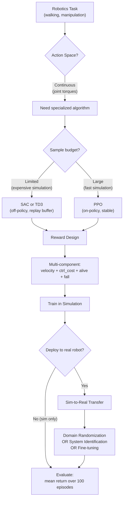

# Robotics Simulation — Interview Deep Dive

> **What this file covers**
> - 🎯 Why continuous control is fundamentally harder than discrete control
> - 🧮 SAC objective with entropy bonus and automatic temperature tuning
> - ⚠️ 4 failure modes: action saturation, reward hacking gaits, sim-to-real failure, early termination bias
> - 📊 Complexity scaling across MuJoCo environments
> - 💡 SAC vs TD3 vs PPO: when each wins for robotics
> - 🏭 Domain randomization and sim-to-real transfer in production

---

## Brief restatement

Robotics simulation applies RL to continuous control problems where actions are real-valued torques applied to robot joints. The key challenges beyond game playing are: infinite action spaces requiring specialized algorithms (SAC, TD3), multi-component reward design balancing speed, energy, and stability, and the sim-to-real gap between training in simulation and deploying on physical hardware. SAC (Soft Actor-Critic) is the default algorithm because its entropy bonus encourages exploration of the continuous action space while its off-policy replay buffer provides sample efficiency.

---

## Full mathematical treatment

### 🧮 Continuous action MDP formulation

> **Words:** In robotics, actions are continuous vectors — each dimension is a torque applied to a joint. The policy outputs a probability distribution over these continuous actions, typically a Gaussian with learned mean and variance for each joint.

> **Formula:**
>
>     π_θ(a|s) = N(μ_θ(s), σ_θ(s)²)
>
> — a ∈ ℝ^d_a = vector of joint torques
> — μ_θ(s) = neural network mapping state to action mean
> — σ_θ(s) = neural network mapping state to action standard deviation
> — d_a = number of actuated joints (1 for Pendulum, 6 for HalfCheetah, 17 for Humanoid)

> **Worked example (Pendulum):**
> - State s = [cos(θ), sin(θ), θ̇] ∈ ℝ³
> - Action a = [torque] ∈ [-2, 2]
> - Network outputs: μ = 1.3, σ = 0.4
> - Sampled action: a ~ N(1.3, 0.16) → a = 1.47
> - Clipped to [-2, 2]: a = 1.47 (within range)

### 🧮 SAC objective with entropy bonus

> **Words:** SAC maximizes expected reward plus an entropy bonus. The entropy term H(π) = -E[log π(a|s)] encourages the policy to spread probability across actions rather than collapsing to a single deterministic action. This provides automatic exploration in continuous spaces.

> **Formula:**
>
>     J(π) = E_{τ~π}[ ∑_t γ^t (R(s_t, a_t) + α · H(π(·|s_t))) ]
>
>     H(π(·|s)) = -E_{a~π}[log π(a|s)]
>
>     = E[-log π(a|s)]  (for Gaussian: ½ d_a (1 + log 2π) + ∑_i log σ_i)
>
> — α = temperature parameter controlling exploration-exploitation balance
> — Higher α → more exploration (wider Gaussian)
> — Lower α → more exploitation (narrower Gaussian)
> — SAC automatically tunes α to maintain a target entropy H̄

> **Automatic temperature tuning:**
>
>     L(α) = -α · E_{a~π}[log π(a|s) + H̄]
>
>     H̄ = -d_a  (target entropy = negative action dimension)
>
> — If actual entropy < target: α increases, widening the policy
> — If actual entropy > target: α decreases, narrowing the policy

> **Worked example:** For HalfCheetah (d_a = 6), target entropy H̄ = -6. If the current policy has entropy = -3 (too exploratory), α decreases to make the policy more focused. If entropy = -10 (too deterministic), α increases to encourage more varied actions.

### 🧮 Multi-component locomotion reward

> **Words:** Locomotion rewards combine several objectives into a single scalar. The standard MuJoCo reward sums forward velocity, subtracts a control cost, adds an alive bonus, and penalizes falling.

> **Formula:**
>
>     r(s, a) = v_forward - c_ctrl · ||a||² + r_alive - c_fall · 𝟙[fell]
>
> — v_forward = forward velocity of the center of mass
> — c_ctrl = control cost coefficient (typically 0.1)
> — ||a||² = sum of squared action magnitudes
> — r_alive = small bonus for each step the robot stays upright (typically 1.0)
> — c_fall = large penalty for falling (typically 10)

> **Worked example (HalfCheetah, one step):**
> - v_forward = 3.0 m/s
> - a = [0.5, -0.3, 0.8, -0.1, 0.4, -0.6], ||a||² = 1.31
> - c_ctrl = 0.1
> - Alive: robot is upright
> - r = 3.0 - 0.1 × 1.31 + 1.0 = 3.869
> - Without control cost, the agent might use a = [2.0, 2.0, ...] for maximum speed but waste energy

---

## 🗺️ Concept flow diagram

---

## ⚠️ Failure modes and edge cases

### Failure Mode 1: Action saturation

**What happens:** The policy outputs actions at the boundary of the allowed range (e.g., always ±2.0 for Pendulum). The Gaussian mean drifts far outside the action bounds, and every sample gets clipped to the boundary. The policy gradient becomes zero because clipping is not differentiable.

**Detection:** Check the distribution of executed actions. If >80% are at the boundary values, the policy is saturated.

**Fix:** Use tanh squashing (standard in SAC): a = tanh(μ + σ·ε), which naturally bounds outputs to [-1, 1]. Apply action scaling after tanh. The log-probability correction is: log π(a|s) = log N(u; μ, σ²) - ∑ log(1 - tanh²(u_i)).

### Failure Mode 2: Reward hacking gaits

**What happens:** The robot finds an unnatural movement that scores high on the reward function but would never work in the real world. Common examples: sliding on its back (faster than walking), vibrating in place (collecting alive bonus), or doing a handstand (technically "moving forward" along the wrong axis).

**Detection:** Visualize the learned behavior. High reward but unnatural-looking motion is the signal.

**Fix:** Add regularization terms to the reward: joint velocity penalty, symmetry bonus (left-right legs should behave similarly), or reference motion tracking (penalize deviation from a natural gait cycle).

### Failure Mode 3: Sim-to-real failure

**What happens:** A policy trained in simulation fails on the real robot because the simulation does not capture real-world physics. The robot may fall immediately, move erratically, or behave completely differently from simulation.

**Detection:** Large performance gap between simulated evaluation and real-robot evaluation.

**Fix:** Domain randomization (randomize friction, mass, motor delay, sensor noise during training), system identification (calibrate simulation parameters from real-world measurements), or progressive training (start with basic motions, gradually increase complexity).

### Failure Mode 4: Early termination bias

**What happens:** Episodes that terminate early (e.g., robot falls) are shorter and produce lower returns. The value function underestimates the value of states near the termination boundary, causing the agent to be excessively cautious. The robot learns to stand still rather than risk falling.

**Detection:** The agent achieves moderate alive bonus but near-zero forward velocity.

**Fix:** Separate done_timeout (episode time limit) from done_fall (actual failure). Only use done_fall for bootstrapping terminal states. Many environments now distinguish `terminated` from `truncated` for this reason.

---

## 📊 Complexity analysis

| Environment | State dim | Action dim | Typical steps to solve | Algorithm | Wall-clock time |
|-------------|-----------|------------|----------------------|-----------|-----------------|
| Pendulum-v1 | 3 | 1 | 30K | SAC/TD3 | ~2 min |
| HalfCheetah-v4 | 17 | 6 | 1M | SAC/TD3 | ~1 hour |
| Walker2d-v4 | 17 | 6 | 2M | SAC | ~2 hours |
| Ant-v4 | 111 | 8 | 3M | SAC | ~3 hours |
| Humanoid-v4 | 376 | 17 | 10M+ | SAC + careful tuning | ~10+ hours |

**Sample efficiency comparison (HalfCheetah, 1M steps):**

| Algorithm | Mean return | Replay buffer | Entropy bonus | Notes |
|-----------|-----------|---------------|---------------|-------|
| SAC | ~8000 | Yes (1M) | Yes (automatic) | Default choice |
| TD3 | ~7500 | Yes (1M) | No | Simpler, deterministic policy |
| PPO | ~4000 | No | No | Needs 3-5x more samples |
| Random | ~-300 | — | — | Baseline |

---

## 💡 Design trade-offs and alternatives

| Factor | SAC | TD3 | PPO |
|--------|-----|-----|-----|
| Policy type | Stochastic (Gaussian) | Deterministic + noise | Stochastic (Gaussian) |
| Exploration | Entropy bonus (automatic) | Action noise (manual) | On-policy sampling |
| Sample efficiency | High | High | Low (3-5x more samples) |
| Stability | High (twin Q, soft update) | High (twin Q, delayed update) | Very high (clipping) |
| Hyperparameter sensitivity | Low (auto temperature) | Medium (noise schedule) | Low |
| Continuous actions | Native | Native | Works but less efficient |
| Best for | Default robotics | When SAC is unstable | When stability is critical |

---

## 🏭 Production and scaling considerations

**Domain randomization in practice:** Randomize physics parameters within plausible ranges. For a walking robot: mass ±20%, friction ±30%, motor strength ±15%, action delay 0-2 steps, sensor noise ±5%. Train with a new random configuration each episode. OpenAI used this approach to transfer dexterous manipulation from simulation to a real robot hand.

**Reward engineering heuristics:** Start with the simplest reward that produces desired behavior. Add terms only when needed. Common pattern: r = v_forward - 0.1·||a||² + 1.0·alive. If the robot finds degenerate gaits, add specific penalties. Document every reward term and why it exists.

**Action scaling and normalization:** Always normalize observations and scale actions. SAC assumes actions in [-1, 1]; the environment wrapper scales them to the actual torque range. Without normalization, the policy gradient has very different magnitudes for different joints, causing unstable training.

**Parallel simulation:** Use vectorized environments (8-32 copies) to speed up data collection. For SAC, each environment adds experiences to a shared replay buffer. For PPO, parallel environments directly increase batch size.

---

## Staff/Principal Interview Depth — Q&A

### Q1: Why does SAC outperform PPO on most continuous control tasks, and when would you still choose PPO?

---
**No Hire**
*Interviewee:* "SAC is better because it uses a replay buffer."
*Interviewer:* Only mentions one factor. Does not explain why replay helps or when PPO would be preferred.
*Criteria — Met:* none / *Missing:* entropy bonus, sample efficiency analysis, PPO advantages

**Weak Hire**
*Interviewee:* "SAC is more sample-efficient because of the replay buffer and it explores better because of the entropy bonus. PPO is more stable."
*Interviewer:* Correct factors but no depth on how they work or quantitative comparison.
*Criteria — Met:* three factors named / *Missing:* automatic temperature, quantitative gap, specific PPO advantages

**Hire**
*Interviewee:* "SAC outperforms PPO on continuous control for two reasons: (1) off-policy learning with a replay buffer lets SAC reuse every transition ~10 times, while PPO discards data after each update; (2) the entropy bonus H(π) = -E[log π(a|s)] encourages exploration of the continuous action space, preventing premature convergence to suboptimal gaits. The automatic temperature α tuning means you do not need to manually set the exploration-exploitation trade-off. PPO wins when you need guaranteed monotonic improvement (safety-critical), when training is massively parallel (PPO scales linearly with workers), or when the task has discrete actions (entropy bonus is less important)."
*Interviewer:* Solid understanding of both algorithms' strengths. Would push for the PUCT/quantitative comparison for Strong Hire.
*Criteria — Met:* replay, entropy, auto-temp, PPO advantages / *Missing:* quantitative gap, when TD3 beats SAC

**Strong Hire**
*Interviewee:* "SAC's advantage comes from three independent sources: (1) off-policy replay gives ~5x sample efficiency on HalfCheetah (SAC reaches 8000 return at 1M steps vs PPO at 5M); (2) maximum entropy objective J = E[r + α·H(π)] prevents premature convergence — with target entropy H̄ = -d_a, the policy maintains exploration proportional to the action dimension; (3) twin Q-networks with min(Q_1, Q_2) reduce overestimation, which is especially important in continuous spaces where the max over continuous actions amplifies errors. PPO is preferred when: (a) you have thousands of parallel environments (PPO's on-policy nature parallelizes perfectly, recovering the sample efficiency gap); (b) safety constraints require monotonic improvement guarantees; (c) you are in a multi-task setting where entropy-regularized policies transfer better to new tasks (actually, this favors SAC too). TD3 beats SAC when you want deterministic policies (easier to analyze) or when the automatic temperature tuning overshoots. In practice, I would start with SAC, try TD3 if SAC is unstable, and only use PPO if I have abundant parallel simulation or need stability guarantees."
*Interviewer:* Quantitative comparison, three distinct SAC advantages with mechanism explanations, nuanced PPO vs TD3 guidance. Staff-level practical judgment.
*Criteria — Met:* all
---

### Q2: Design a reward function for a quadruped robot learning to walk. What terms would you include and how would you prevent reward hacking?

---
**No Hire**
*Interviewee:* "Give +1 for moving forward and -1 for falling."
*Interviewer:* Too simple. Would produce a robot that slides on its back or vibrates forward.
*Criteria — Met:* none / *Missing:* control cost, alive bonus, gait quality, hacking prevention

**Weak Hire**
*Interviewee:* "Use forward velocity as the main reward, subtract control cost to encourage efficiency, and add an alive bonus. To prevent hacking, watch the behavior visually."
*Interviewer:* Correct components but no specific values, no gait quality terms, and visual inspection is not scalable.
*Criteria — Met:* 3 components / *Missing:* specific coefficients, gait quality metrics, automated hacking detection

**Hire**
*Interviewee:* "r = v_forward - 0.1·||a||² + 1.0·alive - 10·fell + symmetry_bonus. Forward velocity drives locomotion. Control cost (coefficient 0.1) penalizes energy waste and jerky motion. Alive bonus keeps the robot upright. Fall penalty strongly discourages falling. Symmetry bonus rewards left-right gait symmetry to prevent hopping or dragging. To detect reward hacking: monitor the ratio of forward velocity to total reward — if the robot finds a high-reward behavior with low velocity, it is probably hacking. Also track joint velocity variance — natural gaits have periodic, bounded joint velocities."
*Interviewer:* Good practical answer with specific coefficients and automated detection metrics. Would need reference motion tracking for Strong Hire.
*Criteria — Met:* 5 terms, coefficients, 2 detection metrics / *Missing:* reference motion, curriculum, energy efficiency metric

**Strong Hire**
*Interviewee:* "I would design the reward in two phases. Phase 1 (basic locomotion): r = v_forward - c_ctrl·||a||² + r_alive - c_fall·𝟙[fell], with c_ctrl = 0.1, r_alive = 1.0, c_fall = 10. This gets the robot walking. Phase 2 (gait quality): add terms for foot clearance (penalize dragging), contact force (penalize hard impacts), gait symmetry (||a_left - a_right_mirrored||²), and optionally reference motion tracking (||q - q_ref(phase)||²) from a recorded animal gait. For hacking prevention: (1) monitor v_forward/r_total ratio — should be roughly constant; (2) track periodicity of joint angles — natural gaits are periodic; (3) use a held-out evaluation environment with slightly different physics (domain randomization during eval) — hacked gaits often fail under perturbation. I would also use curriculum learning: start with gentle terrain, then add slopes and obstacles. This prevents the agent from discovering degenerate behaviors before it learns to walk properly. The key insight is that reward terms interact — adding too many terms at once makes optimization harder. Add them sequentially and verify each one produces the expected behavior before adding the next."
*Interviewer:* Two-phase design, specific coefficients, gait quality metrics, three automated detection methods, curriculum learning, and the insight about sequential reward design. Staff-level engineering judgment.
*Criteria — Met:* all
---

### Q3: How does domain randomization work for sim-to-real transfer, and what are its limitations?

---
**No Hire**
*Interviewee:* "You randomize the simulation to make it more realistic."
*Interviewer:* Vague. Does not explain what is randomized, why it works, or what can go wrong.
*Criteria — Met:* none / *Missing:* mechanism, specific parameters, failure modes

**Weak Hire**
*Interviewee:* "Domain randomization changes simulation parameters like friction and mass during training. The policy learns to handle variation, so it works in the real world which is just another variation. It does not work if the real world is outside the randomization range."
*Interviewer:* Correct mechanism but lacks specificity. Does not discuss the trade-off with performance.
*Criteria — Met:* mechanism, one limitation / *Missing:* specific ranges, performance cost, alternative approaches

**Hire**
*Interviewee:* "Domain randomization trains the policy under a distribution of simulation parameters P(ξ), where ξ includes mass (±20%), friction (±30%), motor delay (0-2 steps), and observation noise (±5%). The policy learns to be robust to all settings in this range. The key assumption is that the real world falls within this range. Two limitations: (1) wider randomization makes the task harder — the policy may learn a conservative, suboptimal behavior that works everywhere but excels nowhere; (2) if the real world has physics not captured by the simulation at all (e.g., cable dynamics, soft contacts), no amount of randomization helps."
*Interviewer:* Specific parameters and ranges, two concrete limitations. Would need quantitative analysis for Strong Hire.
*Criteria — Met:* specific parameters, two limitations, mechanism / *Missing:* performance-robustness trade-off quantification, adaptive randomization

**Strong Hire**
*Interviewee:* "Domain randomization is a form of robust optimization: max_π min_ξ J(π, ξ) where ξ ~ P(ξ). In practice, we uniformly randomize ξ during training and the policy gradient averages over the parameter distribution. OpenAI's dexterous manipulation paper randomized 68 parameters — including object size, mass, friction, action latency, and even lighting for the vision policy. Key trade-offs: (1) robustness vs performance — widening the randomization range by 2x can reduce in-simulation performance by 30%, but the sim-to-real transfer rate (percentage of simulation performance retained on real hardware) improves; (2) the real world must be within the support of P(ξ) — this is hard to verify without real-world experiments; (3) some parameters matter much more than others — sensitivity analysis (train with one parameter randomized at a time) identifies the critical ones. Advanced approaches: Automatic Domain Randomization (ADR) starts with narrow ranges and widens them as the policy improves, ensuring the task remains at the frontier of difficulty. System identification + targeted randomization combines measured real-world parameters with randomization only around those values. The trend in recent work (2023-2024) is toward learned simulation — using neural networks to model the sim-to-real gap directly rather than relying on hand-specified randomization ranges."
*Interviewer:* Formal robust optimization framing, specific paper reference, quantitative trade-offs, sensitivity analysis, ADR, and forward-looking trends. Staff-level depth.
*Criteria — Met:* all
---

---

## Key Takeaways

🎯 1. Continuous control requires specialized algorithms — SAC's entropy bonus provides automatic exploration in infinite action spaces, making it the default choice for robotics
   2. SAC achieves ~5x better sample efficiency than PPO on standard locomotion benchmarks (HalfCheetah: 8000 return at 1M steps vs 5M for PPO)
🎯 3. Locomotion reward design combines velocity, control cost, alive bonus, and fall penalty — getting the coefficients right determines whether the robot walks or discovers degenerate behaviors
⚠️ 4. Reward hacking produces high-scoring but unnatural gaits (sliding, vibrating) — monitor velocity/reward ratio and gait periodicity to detect it
   5. Action saturation kills learning — use tanh squashing with log-probability correction to keep actions bounded
🎯 6. Domain randomization enables sim-to-real transfer by training under varied physics parameters — but wider randomization ranges trade off in-simulation performance for real-world robustness
   7. The terminated vs truncated distinction prevents early termination bias — only bootstrap with zero value for actual failures, not time limits
