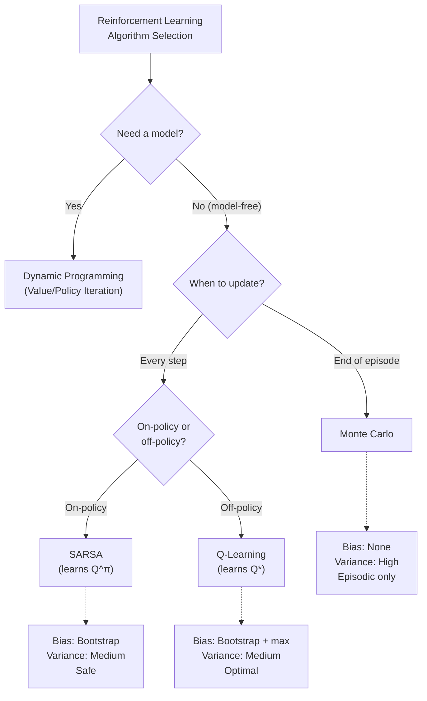

# Comparing Classic RL Algorithms — Interview Deep Dive

> **What this file covers**
> - 🎯 Side-by-side comparison of MC, TD(0), Q-learning, and SARSA
> - 🧮 Bias-variance analysis across the backup spectrum
> - ⚠️ Common mistakes when choosing algorithms: mismatched assumptions
> - 📊 Convergence speed, sample efficiency, and computational cost
> - 💡 Decision framework: which algorithm for which problem
> - 🏭 How classic algorithms map to modern deep RL methods

## Brief Restatement

The four classic RL algorithms — Monte Carlo, TD learning, Q-learning, and SARSA — differ along three axes: when they update (episode end vs every step), what they bootstrap from (real returns vs estimates), and which policy they learn about (current vs optimal). Understanding these trade-offs and knowing when each algorithm is appropriate is a key staff-level competency.

---

## 🧮 Full Mathematical Treatment

### The Four Update Rules Side by Side

All four algorithms update a value estimate toward a target. The difference is the target.

**Monte Carlo (first-visit):**

    Q(s, a) ← Q(s, a) + α · [ G_t - Q(s, a) ]

Where G_t = Σ_{k=0}^{T-t-1} γ^k r_{t+k+1} is the actual return (computed after episode ends).

**TD(0) prediction:**

    V(s) ← V(s) + α · [ r + γ · V(s') - V(s) ]

Uses one-step bootstrap. For control, TD(0) with Q-values is essentially Q-learning.

**Q-learning (off-policy TD control):**

    Q(s, a) ← Q(s, a) + α · [ r + γ · max_{a'} Q(s', a') - Q(s, a) ]

Uses max over next actions — learns Q*.

**SARSA (on-policy TD control):**

    Q(s, a) ← Q(s, a) + α · [ r + γ · Q(s', a') - Q(s, a) ]

Uses actual next action a' from the current policy — learns Q^π.

### The Bias-Variance Spectrum

The target determines the bias-variance trade-off:

| Target | Bias | Variance | Formula |
|--------|------|----------|---------|
| MC return G_t | 0 | O(σ²/(1-γ²)) | Sums T random rewards |
| n-step return G_t^{(n)} | O(γ^n\|\|V̂-V\|\|) | Grows with n | Sums n rewards + bootstrap |
| TD(0) target | O(\|\|V̂-V\|\|) | O(σ²) | One reward + bootstrap |

The bias comes from bootstrapping (using V̂ instead of V). The variance comes from summing random rewards. MC has zero bias but maximum variance. TD(0) has maximum bias but minimum variance.

### Unified View: The λ-Return

All methods fit on a spectrum parameterized by λ ∈ [0, 1]:

    G_t^λ = (1-λ) Σ_{n=1}^{T-t-1} λ^{n-1} G_t^{(n)} + λ^{T-t-1} G_t

- λ = 0: TD(0)
- λ = 1: MC
- λ ∈ (0,1): TD(λ), with eligibility traces for efficient computation

### On-Policy vs Off-Policy: Formal Definition

**On-policy:** The target policy (what we learn about) equals the behavior policy (what generates data).

    π_target = π_behavior = π

SARSA and MC control with ε-greedy are on-policy.

**Off-policy:** The target policy differs from the behavior policy.

    π_target ≠ π_behavior

Q-learning is off-policy: behavior is ε-greedy, target is greedy (max).

Key consequence: off-policy methods can use experience replay. On-policy methods cannot (without importance sampling corrections).

---

## 🗺️ Concept Flow

---

## ⚠️ Failure Modes and Common Mistakes

### 1. Using MC for Long or Continuing Tasks

MC requires complete episodes. If episodes average 10,000 steps, MC updates are extremely slow (one update per 10,000 steps, vs one per step for TD). For continuing tasks (no terminal state), MC cannot be applied at all.

**The mistake:** Choosing MC because "it is unbiased" without considering that 10,000x fewer updates overwhelms the variance advantage.

**When MC is correct:** Short episodes (< 100 steps), episodic tasks with clear boundaries (card games, board games).

### 2. Using Q-learning in Safety-Critical Settings

Q-learning's Q-values assume optimal future behavior, which is wrong during training (the agent explores randomly ε of the time). Near dangerous states, Q-learning's policy walks along the cliff edge — "optimal" if you never slip, catastrophic if you do.

**The mistake:** Deploying Q-learning's policy in a real-world system where the ε-greedy behavior is not turned off.

**When Q-learning is correct:** Simulation (mistakes are free), or after training when ε → 0.

### 3. Comparing Algorithms Without Controlling Hyperparameters

MC with α = 1/N is compared to TD with α = 0.01, and someone concludes "TD is better." But the difference is the learning rate, not the algorithm.

**The mistake:** Not controlling for α, ε, γ, and n-step length when comparing.

**Correct comparison:** Fix all hyperparameters except the one structural difference (backup method), sweep over remaining hyperparameters, and report the best for each.

---

## 📊 Complexity Analysis

| Metric | Monte Carlo | TD(0) / Q-learning | SARSA |
|--------|-------------|---------------------|-------|
| **Update frequency** | 1 per episode | 1 per step | 1 per step |
| **Time per update** | O(\|A\|) | O(\|A\|) | O(\|A\|) |
| **Updates to converge** | O(\|S\|×\|A\|/ε²) episodes | O(\|S\|×\|A\|/ε²) steps | O(\|S\|×\|A\|/ε²) steps |
| **Wall-clock per convergence unit** | O(T) per episode | O(1) per step | O(1) per step |
| **Effective convergence speed** | O(T/ε²) steps | O(1/ε²) steps per state | O(1/ε²) steps per state |
| **Memory** | O(\|S\|×\|A\|) | O(\|S\|×\|A\|) | O(\|S\|×\|A\|) |
| **Replay buffer** | Not useful | Yes (off-policy) | No (on-policy) |

For episodes of length T, TD methods are T times faster per convergence unit.

---

## 💡 Design Trade-offs

### Comprehensive Comparison Table

| Property | Monte Carlo | Q-Learning | SARSA | Expected SARSA |
|----------|-------------|------------|-------|----------------|
| **Update timing** | End of episode | Every step | Every step | Every step |
| **Bootstraps** | No | Yes | Yes | Yes |
| **Bias** | None | Bootstrap + max | Bootstrap | Bootstrap |
| **Variance** | High | Medium | Medium-high | Low |
| **Policy type** | On-policy | Off-policy | On-policy | On-policy |
| **Learns** | Q^π | Q* | Q^π | Q^π |
| **Continuing tasks** | No | Yes | Yes | Yes |
| **Safety** | N/A | Low | High | High |
| **Replay buffer** | No | Yes | No | With corrections |
| **Overestimation** | No | Yes (max bias) | No | No |
| **Best for** | Short episodes | Simulation/games | Safety-critical | General tabular |

### Decision Framework

1. **Does the task have clear episodes?**
   - No → Cannot use MC. Use TD-based methods.
   - Yes, but very long → Avoid MC (high variance). Use TD.
   - Yes, short → MC is a good option.

2. **Is the environment a simulator or the real world?**
   - Simulator → Q-learning (off-policy, optimal, can use replay).
   - Real world → SARSA or Expected SARSA (on-policy, safer).

3. **Will exploration continue after training?**
   - Yes → SARSA (Q^π is the correct target).
   - No (ε → 0) → Q-learning (Q* is the correct target).

4. **How important is sample efficiency?**
   - Very → Q-learning with replay buffer.
   - Less → On-policy methods are simpler and more stable.

---

## 🏭 Production and Scaling Considerations

### Classic → Modern Lineage

Each classic algorithm has a modern deep RL descendant:

| Classic | Modern | What Changed |
|---------|--------|-------------|
| Q-learning | DQN → Double DQN → Rainbow | Neural net Q function, replay, target nets |
| SARSA | A2C → TRPO → PPO | Neural net policy + value, parallel envs |
| MC (returns) | REINFORCE → policy gradient | Neural net policy, variance reduction |
| TD(λ) | GAE (λ=0.95) | Used in PPO for advantage estimation |

### Choosing in Practice (Deep RL)

The classic on/off-policy divide persists in modern deep RL:

- **Off-policy (SAC, TD3, DQN):** ~10x more sample-efficient. Require replay buffer, target networks. More complex engineering. Preferred when environment interaction is expensive.

- **On-policy (PPO, A2C):** Simpler, more stable, embarrassingly parallel. Require fresh data each iteration. Preferred when parallel simulation is cheap.

The bias-variance trade-off also persists through GAE:
- λ = 0 (TD-like): low variance, high bias — good when value function is well-trained
- λ = 1 (MC-like): high variance, no bias — good at start of training
- λ = 0.95 (default): balanced — works well across most tasks

---

## Staff/Principal Interview Depth

### Q1: Compare the bias-variance properties of MC, TD(0), and TD(λ). When does bias matter more than variance?

---
**No Hire**
*Interviewee:* "MC has high variance and TD has bias. You have to balance them."
*Interviewer:* Textbook statement with no depth or practical guidance.
*Criteria — Met:* basic fact / *Missing:* formulas, when each matters, practical implications

**Weak Hire**
*Interviewee:* "MC variance comes from summing many random rewards: Var(G_t) grows with episode length. TD bias comes from bootstrapping: V̂(s') may be wrong. TD(λ) interpolates — λ close to 0 is low variance, λ close to 1 is low bias. You tune λ based on the problem."
*Interviewer:* Correct direction but no quantitative analysis or decision criteria.
*Criteria — Met:* source of bias and variance, λ interpolation / *Missing:* formulas, decision criteria, interaction with function approximation

**Hire**
*Interviewee:* "Quantitatively: MC variance ≈ σ²/(1-γ²), growing with effective horizon 1/(1-γ). TD(0) bias ≈ ||V̂ - V^π||∞, decreasing as V̂ improves. Bias matters more than variance when: (1) function approximation is used — bootstrap bias can create divergent feedback loops (the deadly triad). (2) V̂ is poorly initialized — the bias takes many iterations to wash out. Variance matters more when: (1) episodes are very long (γ close to 1). (2) the environment is highly stochastic. TD(λ) with λ = 0.95 is the standard compromise. GAE uses this for advantage estimation in PPO."
*Interviewer:* Quantitative analysis with practical decision criteria. Strong.
*Criteria — Met:* formulas, decision criteria, GAE connection / *Missing:* MSE analysis, empirical evidence

**Strong Hire**
*Interviewee:* "The optimal λ minimizes MSE = bias² + variance. For n-step: bias² = γ^{2n}||V̂-V||² and variance ∝ nσ². The optimal n (and approximately λ) depends on ||V̂-V||/σ — the ratio of approximation error to stochastic noise. Early in training, ||V̂-V|| is large → bias dominates → use larger λ (more MC-like). Late in training, ||V̂-V|| is small → variance dominates → use smaller λ (more TD-like). In practice, a fixed λ = 0.95-0.97 works because it is close enough to the MSE optimum across training stages. The critical exception: when function approximation is used off-policy, bootstrap bias can compound instead of decrease, making MC-style returns safer (this is why REINFORCE, an MC method, is sometimes preferred over TD-based actor-critics despite higher variance). Schulman et al.'s GAE paper showed empirically that λ = 0.95-0.99 gives the best learning curves on MuJoCo tasks."
*Interviewer:* Full MSE analysis with training-stage dynamics, the function approximation exception, and empirical grounding. Staff-level.
*Criteria — Met:* all — MSE decomposition, training dynamics, FA exception, empirical evidence
---

### Q2: If you had to choose one algorithm for a new RL problem with no other information, which would you pick and why?

---
**No Hire**
*Interviewee:* "Q-learning, because it finds the optimal policy."
*Interviewer:* Gives an answer but cannot justify it beyond one sentence.
*Criteria — Met:* an answer / *Missing:* justification, trade-off analysis, caveats

**Weak Hire**
*Interviewee:* "Q-learning is a good default because it is off-policy (can use replay), learns Q* (optimal), and works for both episodic and continuing tasks. The main risk is overestimation bias, which can be fixed with Double Q-learning."
*Interviewer:* Reasonable choice with some justification. Missing analysis of when it would be the wrong choice.
*Criteria — Met:* choice with justification / *Missing:* when wrong, alternative recommendations, safety considerations

**Hire**
*Interviewee:* "It depends on two factors: (1) Is it a simulator or the real world? Simulator → Q-learning (off-policy, replay, finds Q*). Real world → SARSA/Expected SARSA (safer during learning). (2) Are episodes short? Short episodes + stochastic environment → MC is competitive because unbiased returns average well. My default would be Expected SARSA: it is on-policy (safe), has lower variance than SARSA, reduces to Q-learning when ε=0, and works for continuing tasks. It is the most robust choice."
*Interviewer:* Thoughtful decision framework. Expected SARSA is an excellent default choice with good reasoning.
*Criteria — Met:* decision framework, Expected SARSA recommendation, justification / *Missing:* scaling considerations, deep RL connection

**Strong Hire**
*Interviewee:* "For tabular: Expected SARSA. It has the safety of on-policy, the low variance of taking expectations, and reduces to Q-learning in the greedy limit. It dominates both SARSA and Q-learning on most tabular benchmarks. For deep RL with a simulator: SAC (the deep off-policy descendant). It combines continuous action support, entropy-regularized exploration, and off-policy sample efficiency. For deep RL in the real world: PPO (the deep on-policy descendant). It is simple, stable, parallelizable, and the default choice for robotics and language model alignment. The 'no information' assumption is key — with domain knowledge, you might pick differently. For example, if the reward is extremely sparse, you might start with curiosity-driven exploration or hindsight experience replay rather than choosing between these four."
*Interviewer:* Gives recommendations at three levels (tabular, deep sim, deep real), names the modern equivalents, and acknowledges the limits of the no-information assumption. Staff-level breadth.
*Criteria — Met:* all — multi-level recommendation, modern connections, limitation awareness
---

### Q3: How do the classic algorithms relate to modern deep RL? Trace the lineage.

---
**No Hire**
*Interviewee:* "DQN is Q-learning with a neural network. PPO is a more advanced method."
*Interviewer:* Two correct facts without connections or understanding of the evolution.
*Criteria — Met:* two associations / *Missing:* lineage, what problems each step solved, on-policy vs off-policy split

**Weak Hire**
*Interviewee:* "Q-learning → DQN (add neural network, replay, target nets). SARSA → A2C (on-policy actor-critic with neural nets). MC returns are used in REINFORCE for policy gradients. TD(λ) is used in GAE for advantage estimation in PPO."
*Interviewer:* Four correct lineage connections. Missing the 'why' — what problem each step solves.
*Criteria — Met:* four lineage connections / *Missing:* problem-solution narrative, convergence/stability analysis

**Hire**
*Interviewee:* "Two main branches: Off-policy: Q-learning → DQN (scale to pixels, stabilize with replay + target nets) → Double DQN (fix overestimation) → Rainbow (six improvements combined) → SAC (continuous actions via entropy-regularized policy). Each step addresses a specific failure: instability, bias, architecture, action space. On-policy: SARSA → A2C (neural net actor-critic) → TRPO (trust region for stable updates) → PPO (simpler clipped surrogate, same stability). MC returns → REINFORCE → actor-critic with GAE (λ interpolation between MC and TD advantages). The on/off-policy divide from classic algorithms directly maps to the PPO-vs-SAC choice in modern deep RL."
*Interviewer:* Clear two-branch narrative with problem-solution pairs. Strong.
*Criteria — Met:* two lineages with problem-solution, modern endpoint / *Missing:* formal connection between classic and modern update rules

**Strong Hire**
*Interviewee:* "The classic algorithms established three fundamental choices that persist in deep RL: (1) Backup depth (MC vs TD): appears in GAE as λ ∈ [0,1]. PPO defaults to λ=0.95, a compromise that emerged from the classic bias-variance analysis. (2) On/off-policy: determines whether you can use replay buffers. Off-policy (Q-learning → DQN → SAC) is 10x more sample-efficient but requires target networks to stabilize the deadly triad. On-policy (SARSA → A2C → PPO) avoids instability and parallelizes trivially. (3) Value vs policy learning: Q-learning learns Q then derives π. REINFORCE learns π directly. Actor-critic combines both, inheriting the best of each. The modern consensus: off-policy for sample-limited settings (robotics sim), on-policy for compute-limited settings (LLM alignment with PPO/DPO). Every modern method is a composition of these three classic design choices plus neural network engineering."
*Interviewer:* Maps three classic design choices to modern algorithm design, identifies the compositional nature, and gives the modern consensus on when each applies. Staff-level synthesis.
*Criteria — Met:* all — three design dimensions, compositional view, modern consensus, LLM alignment connection
---

---

## Key Takeaways

🎯 1. The four classic algorithms differ along three axes: update timing (episode vs step), bootstrapping (MC vs TD), and policy type (on vs off-policy)
   2. The bias-variance spectrum: MC (zero bias, high variance) → TD(λ) (tunable) → TD(0) (high bias, low variance)
🎯 3. Q-learning learns Q* (optimal), SARSA learns Q^π (current policy) — this difference determines safety and final performance
⚠️ 4. Common mistake: choosing MC for long episodes. MC needs O(T) steps per update vs O(1) for TD — a factor of T slower
   5. Expected SARSA often dominates both SARSA and Q-learning in tabular settings: on-policy safety with lower variance
🎯 6. Classic algorithms map directly to modern deep RL: Q-learning → DQN → SAC (off-policy), SARSA → A2C → PPO (on-policy), MC → REINFORCE, TD(λ) → GAE
   7. The on/off-policy and bias/variance trade-offs are not historical curiosities — they drive the PPO-vs-SAC choice in every production RL system today
