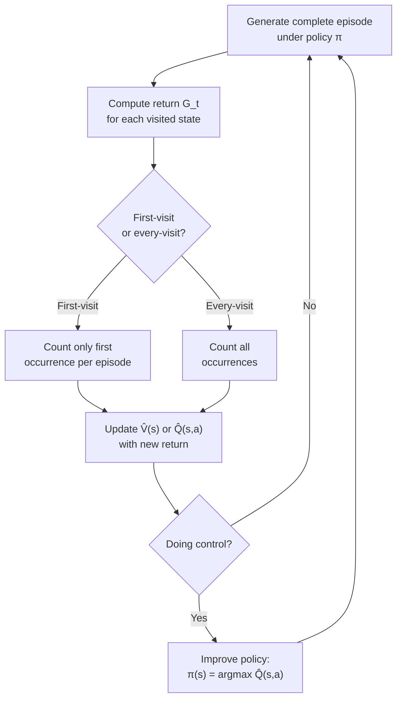

# Monte Carlo Methods — Interview Deep Dive

> **What this file covers**
> - 🎯 First-visit and every-visit MC: formal definitions and convergence guarantees
> - 🧮 MC prediction and control with worked examples
> - ⚠️ High variance, slow convergence, and the exploring starts assumption
> - 📊 Sample complexity: O(1/ε²) episodes for ε-accurate estimates
> - 💡 MC vs TD: the bias-variance tradeoff
> - 🏭 Importance sampling for off-policy MC and its pitfalls

## Brief Restatement

Monte Carlo methods estimate value functions by averaging actual returns from complete episodes. They are model-free (no transition probabilities needed) and unbiased (they use real returns, not estimates). The trade-off is high variance and the requirement that episodes must terminate.

---

## 🧮 Full Mathematical Treatment

### MC Prediction: Estimating V^π

The value of a state under policy π is the expected return starting from that state:

    V^π(s) = E_π [ G_t | s_t = s ]

Where the return is:

    G_t = r_{t+1} + γ · r_{t+2} + γ² · r_{t+3} + ... = Σ_{k=0}^{T-t-1} γ^k · r_{t+k+1}

Monte Carlo estimates V^π(s) by collecting actual returns from many episodes and averaging them:

    V̂(s) = (1/N(s)) · Σ_{i=1}^{N(s)} G_i(s)

Where:
- N(s) is the number of times state s was visited (first-visit: once per episode; every-visit: every occurrence)
- G_i(s) is the return observed from the i-th visit to state s

By the law of large numbers, V̂(s) → V^π(s) as N(s) → ∞.

### First-Visit vs Every-Visit

**First-visit MC:** Only counts the return from the first time state s appears in each episode.
- Produces independent samples of G_t
- Unbiased: E[V̂(s)] = V^π(s) for any N(s) ≥ 1
- Converges by the strong law of large numbers

**Every-visit MC:** Counts the return from every occurrence of state s in each episode.
- Samples are correlated (returns from the same episode)
- Also unbiased and converges, but the proof is more involved
- Typically lower MSE in practice because it uses more data per episode

### MC Control: Finding Q*

To find the optimal policy without a model, MC learns Q(s,a) instead of V(s):

    Q̂(s,a) = (1/N(s,a)) · Σ_{i=1}^{N(s,a)} G_i(s,a)

The policy improvement step is:

    π(s) = argmax_a Q̂(s,a)

This requires that every state-action pair is visited. Two approaches:

**1. Exploring starts:** Every episode begins from a randomly chosen (s, a) pair. Guarantees coverage but impractical in most real environments.

**2. Epsilon-greedy exploration:**

    π(a|s) = { 1 - ε + ε/|A|    if a = argmax Q(s,a)
             { ε/|A|             otherwise

This guarantees π(a|s) ≥ ε/|A| > 0 for all actions, ensuring every pair is visited infinitely often.

### Incremental Update Form

Instead of storing all returns and computing the mean, use the incremental update:

    V(s) ← V(s) + α · (G_t - V(s))

Where:
- α = 1/N(s) recovers the exact sample mean
- α = constant gives a recency-weighted average (useful for non-stationary environments)

### Worked Example

Consider a 3-state chain: A → B → C (terminal).

    Rewards: r(A→B) = -1, r(B→C) = +5
    γ = 0.9

Episode 1: A → B → C

    G(B) = 5
    G(A) = -1 + 0.9 × 5 = 3.5

Episode 2: A → B → C

    G(B) = 5
    G(A) = -1 + 0.9 × 5 = 3.5

Episode 3: A → B → A → B → C (revisits A and B)

    First-visit: G(A) = -1 + 0.9×(-1) + 0.9²×(-1) + 0.9³×5 = -1 - 0.9 - 0.81 + 3.645 = 0.935
    First-visit: G(B) = -1 + 0.9×(-1) + 0.9²×5 = -1 - 0.9 + 4.05 = 2.15

    After 3 episodes:
    V̂(A) = (3.5 + 3.5 + 0.935) / 3 = 2.645
    V̂(B) = (5 + 5 + 2.15) / 3 = 4.05

---

## 🗺️ Concept Flow

---

## ⚠️ Failure Modes and Edge Cases

### 1. High Variance

MC uses the full return G_t = r_{t+1} + γ r_{t+2} + ... which sums many random variables. The variance of G_t grows with the episode length:

    Var(G_t) ≈ σ_r² / (1 - γ²)

Where σ_r² is the variance of individual rewards. With γ = 0.99, Var(G_t) ≈ 50 × σ_r². This means MC needs many episodes to get accurate estimates. In practice, MC often requires 10-100x more episodes than TD methods.

**Detection:** Large fluctuations in learning curves; V̂(s) changes significantly between evaluations.

**Mitigation:** Use baselines to reduce variance (subtract a baseline from G_t), or switch to TD methods that bootstrap.

### 2. The Exploring Starts Problem

MC control with exploring starts assumes you can start each episode from any state-action pair. In most real environments, you cannot choose the starting state.

**Detection:** Some state-action pairs have N(s,a) = 0 after many episodes. The learned Q-values for these pairs are unreliable.

**Mitigation:** Use epsilon-greedy exploration instead. Or use importance sampling for off-policy learning.

### 3. Non-Terminating Episodes

MC requires complete episodes. If the environment can run forever (continuing tasks), MC cannot be applied directly. Even if episodes eventually terminate, very long episodes cause two problems: high variance of returns and slow learning.

**Detection:** Average episode length is growing or unbounded.

**Mitigation:** Use TD methods instead. Or impose a maximum episode length (but this introduces bias).

---

## 📊 Complexity Analysis

| Metric | Formula | Notes |
|--------|---------|-------|
| **Time per episode** | O(T) where T is episode length | Must complete the episode |
| **Memory (table)** | O(\|S\| × \|A\|) for Q-table | Same as any tabular method |
| **Memory (returns)** | O(N × T) if storing all returns | Can use incremental form to avoid this |
| **Sample complexity** | O(1/ε²) episodes per state for ε-accurate V̂ | Follows from CLT: SE ≈ σ/√N |
| **Convergence** | First-visit: √N rate; Every-visit: same asymptotically | Both converge with probability 1 |

**Key comparison:** MC needs O(1/ε²) samples per state. TD(0) needs O(1/ε²) too, but each sample is one step, not one episode. For long episodes (T >> 1), TD converges much faster in wall-clock terms.

---

## 💡 Design Trade-offs

| | Monte Carlo | TD(0) | Dynamic Programming |
|---|---|---|---|
| **Model required?** | No | No | Yes |
| **Bias** | None (uses true G_t) | Bootstrapping bias | None (exact if converged) |
| **Variance** | High (sum of many rewards) | Lower (one-step target) | None (deterministic) |
| **Episode requirement** | Must terminate | Can learn every step | No episodes needed |
| **Continuing tasks?** | No | Yes | Yes |
| **Sample efficiency** | Low (need many full episodes) | Higher (learns every step) | N/A (uses model) |
| **Online learning?** | No (update at episode end) | Yes (update every step) | No (full sweep needed) |

### When MC Wins Over TD

- **Markov property is not satisfied.** TD bootstraps from V̂(s'), so errors in V̂ propagate. MC uses actual returns, so it is correct even in non-Markov environments (given enough data).
- **Short episodes.** When T is small, MC's variance is manageable and you get the benefit of unbiased estimates.
- **Stochastic environments with function approximation.** MC's unbiasedness can be valuable when combined with neural networks, where bootstrapping can cause instability (the deadly triad).

---

## 🏭 Production and Scaling Considerations

- **Off-policy MC with importance sampling.** To learn about a target policy π from data collected under a behavior policy b, weight each return by the importance ratio: ρ = Π_{k=t}^{T-1} π(a_k|s_k) / b(a_k|s_k). The ordinary importance sampling estimator is unbiased but can have extremely high variance when ρ is large. Weighted importance sampling is biased but has much lower variance.

- **Monte Carlo Tree Search (MCTS).** The most successful production use of MC ideas. AlphaGo and AlphaZero use MCTS to evaluate positions by simulating games to completion. MCTS combines MC evaluation with tree search and UCB exploration. It works because: (1) games have clear termination, (2) simulation is cheap, and (3) the branching factor is manageable with pruning.

- **MC for policy gradient estimation.** REINFORCE and similar algorithms are MC methods — they sample full trajectories and use the return to weight the policy gradient. Variance reduction through baselines (subtracting V(s) from G_t) is essential to make this work at scale.

---

## Staff/Principal Interview Depth

### Q1: Why is MC unbiased while TD is biased, and when does this matter?

---
**No Hire**
*Interviewee:* "MC uses real returns and TD uses estimates, so TD has some error."
*Interviewer:* Correct at a surface level but no precision about what "biased" means statistically, or when the bias matters.
*Criteria — Met:* basic distinction / *Missing:* formal definition of bias, conditions where it matters, interaction with function approximation

**Weak Hire**
*Interviewee:* "MC's target is G_t, the actual return, so E[G_t|s_t=s] = V^π(s) — unbiased. TD's target is r + γV̂(s'), which depends on V̂ being correct. If V̂ is wrong, the target is biased. The bias decreases as V̂ improves."
*Interviewer:* Correct formal explanation. Missing the practical significance — when does bias vs variance matter for convergence and final performance?
*Criteria — Met:* formal bias definition, TD bias source / *Missing:* practical implications, function approximation interaction, convergence guarantees

**Hire**
*Interviewee:* "The bias in TD comes from bootstrapping: E[r + γV̂(s')] ≠ V^π(s) unless V̂ = V^π. But this bias shrinks to zero as V̂ converges, so asymptotically TD is also consistent. The practical advantage of MC's unbiasedness shows up in two cases: (1) with function approximation, where TD's bootstrapping can create a feedback loop that diverges (the deadly triad), and (2) in non-Markov environments, where V̂(s') is meaningless because the next state does not contain enough information. MC works in both cases because it never relies on V̂."
*Interviewer:* Strong answer connecting bias to convergence and the deadly triad. Would push to Strong Hire with discussion of variance trade-off.
*Criteria — Met:* formal analysis, deadly triad, non-Markov case / *Missing:* variance analysis, practical guidance on choosing MC vs TD

**Strong Hire**
*Interviewee:* "MC is unbiased but has variance O(σ²/(1-γ²)), which grows with effective horizon. TD has bias O(||V̂ - V^π||) but variance proportional to σ² (one-step reward). For long horizons and accurate V̂, TD's lower variance wins despite the bias — it converges faster. But the deadly triad (function approximation + bootstrapping + off-policy) can cause TD to diverge entirely, while MC always converges. In practice, GAE with λ interpolates between MC (λ=1) and TD (λ=0), letting you tune the bias-variance trade-off. For policy gradient methods, MC-style returns with a learned baseline give the best of both worlds."
*Interviewer:* Full understanding of the trade-off with quantitative bounds, practical implications, and the connection to GAE and policy gradients. Staff-level.
*Criteria — Met:* all — formal bounds, deadly triad, GAE interpolation, practical guidance
---

### Q2: Explain importance sampling in the context of off-policy MC and why it can fail.

---
**No Hire**
*Interviewee:* "Importance sampling lets you use data from one policy to learn about another policy."
*Interviewer:* Correct definition but no mechanism, no formula, no failure modes.
*Criteria — Met:* definition / *Missing:* formula, variance analysis, failure modes

**Weak Hire**
*Interviewee:* "You multiply the return by the ratio of probabilities: π(a|s)/b(a|s) for each step. This reweights the data so it looks like it came from the target policy. The problem is that these ratios can be very large, causing high variance."
*Interviewer:* Good intuition and identifies the variance problem. Missing the distinction between ordinary and weighted IS, and the exponential blowup.
*Criteria — Met:* mechanism, variance issue / *Missing:* ordinary vs weighted, exponential blowup with horizon, practical mitigation

**Hire**
*Interviewee:* "For a trajectory of length T, the importance ratio is ρ = Π_{t=0}^{T-1} π(a_t|s_t) / b(a_t|s_t). This product of T terms can be exponentially large or small. Ordinary IS is unbiased but has variance that grows exponentially with T. Weighted IS (dividing by the sum of ratios) is biased but has bounded variance. In practice, weighted IS is always preferred because ordinary IS is unusable for long episodes. The real solution is to avoid full-trajectory importance sampling entirely — per-decision IS or TD-style methods with one-step corrections are much more stable."
*Interviewer:* Strong understanding of the exponential variance problem and practical solutions. Staff-level with the mention of per-decision IS.
*Criteria — Met:* formal ratio, ordinary vs weighted, exponential blowup, practical alternatives / *Missing:* nothing significant

**Strong Hire**
*Interviewee:* "The fundamental issue is that importance sampling corrects the distribution but the correction has variance Var(ρ) that scales as exp(O(T)) with trajectory length. This makes full-trajectory off-policy MC impractical. Three solutions: (1) Weighted IS, which bounds variance at the cost of bias. (2) Per-decision IS, which applies the correction to each reward separately, reducing the product length. (3) Retrace(λ) and V-trace, which truncate the importance ratios to bound variance while maintaining some correction. Modern off-policy algorithms like SAC and TD3 avoid this problem entirely by using one-step TD updates with replay buffers, where the IS correction is either one-step (bounded) or ignored (acceptable bias). The key insight is that off-policy MC is theoretically correct but practically broken for long episodes."
*Interviewer:* Connects classical IS theory to modern algorithm design. Excellent breadth from theory to production methods.
*Criteria — Met:* all — exponential variance, three correction methods, connection to modern algorithms
---

### Q3: Why does Monte Carlo Tree Search (MCTS) work so well for games like Go, and where does it fail?

---
**No Hire**
*Interviewee:* "MCTS plays many random games and picks the move that wins most often."
*Interviewer:* Basic idea but misses the tree structure, UCB exploration, and the role of neural networks in AlphaGo.
*Criteria — Met:* MC simulation idea / *Missing:* tree structure, UCB, neural network guidance, failure modes

**Weak Hire**
*Interviewee:* "MCTS builds a tree of game states. For each move, it simulates many random games (rollouts) and estimates the win rate. It uses UCB to balance exploring new moves vs exploiting known good moves. AlphaGo replaced random rollouts with a neural network evaluation."
*Interviewer:* Good description of MCTS components. Missing analysis of why it works for Go specifically and where it breaks down.
*Criteria — Met:* tree structure, UCB, neural network / *Missing:* why Go is suitable, failure modes, computational analysis

**Hire**
*Interviewee:* "MCTS works for Go because: (1) the game terminates, so MC estimates are well-defined, (2) the branching factor (~200) is large but MCTS handles it via selective exploration with UCB, (3) positions can be evaluated cheaply with a neural network, making each simulation fast. MCTS fails when: (1) the game tree is too deep (credit assignment over hundreds of moves is noisy), (2) there is imperfect information (cannot simulate the true state), (3) the action space is continuous (cannot enumerate branches). For real-time control or continuous action spaces, policy gradient methods are preferred."
*Interviewer:* Strong analysis of why MCTS fits games and where it fails. Would reach Strong Hire with quantitative analysis of simulation budget.
*Criteria — Met:* success factors, failure modes, alternatives / *Missing:* simulation budget analysis, comparison to pure RL approaches

**Strong Hire**
*Interviewee:* "MCTS succeeds in Go because the UCB exploration concentrates simulations on promising branches — the effective branching factor is much smaller than the legal move count. AlphaZero's key insight was replacing random rollouts with a value network V(s), making each simulation O(1) instead of O(game_length). The policy network π(a|s) further guides which branches to explore, creating a feedback loop: better value/policy networks → better MCTS → better training data → better networks. MCTS fails for: (1) stochastic environments where the tree must branch on nature's moves too, exponentially increasing the tree size, (2) continuous action spaces where you cannot enumerate branches, (3) problems requiring very long-horizon reasoning where even guided MCTS cannot search deep enough. The simulation budget scales as O(b^d) where b is the effective branching factor and d is the search depth — practical limits are ~10^4 simulations per move."
*Interviewer:* Full analysis including the AlphaZero feedback loop, computational scaling, and precise failure conditions. Staff-level systems thinking.
*Criteria — Met:* all — UCB analysis, AlphaZero architecture, scaling limits, failure modes with analysis
---

---

## Key Takeaways

🎯 1. MC estimates V(s) by averaging actual returns — unbiased but high variance, requiring O(1/ε²) episodes per state
🎯 2. MC requires complete episodes — it cannot be used for continuing tasks or tasks with very long episodes
   3. First-visit MC is simpler and more common; every-visit MC uses more data per episode but with correlated samples
⚠️ 4. Off-policy MC via importance sampling has exponentially growing variance with episode length — practically unusable for long trajectories
   5. MC's unbiasedness is valuable when bootstrapping is dangerous (deadly triad, non-Markov environments)
🎯 6. MCTS combines MC estimation with tree search and UCB — the engine behind AlphaGo and AlphaZero
   7. In modern RL, MC ideas appear in REINFORCE and policy gradient methods, where variance reduction via baselines is essential
