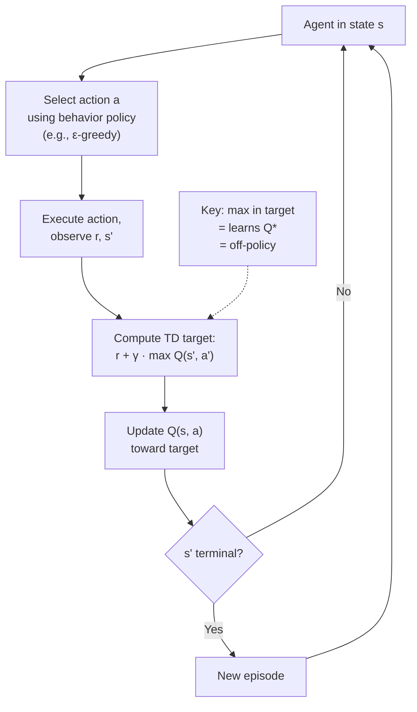

# Q-Learning — Interview Deep Dive

> **What this file covers**
> - 🎯 Q-learning update rule and proof of convergence to Q*
> - 🧮 Off-policy learning: behavior vs target policy separation
> - ⚠️ Maximization bias, overestimation, and Double Q-learning
> - 📊 Convergence conditions and sample complexity
> - 💡 Q-learning vs SARSA: on-policy vs off-policy trade-off
> - 🏭 From tabular Q-learning to DQN: the path to deep RL

## Brief Restatement

Q-learning is an off-policy TD control algorithm that learns the optimal action-value function Q* directly, without needing to follow the optimal policy. It does this by using the max operator in the update target: the agent updates Q(s,a) toward r + γ max_{a'} Q(s', a'), regardless of which action it actually takes next. This separation between the behavior policy (what the agent does) and the target policy (what it learns about) is the key innovation.

---

## 🧮 Full Mathematical Treatment

### The Q-Learning Update

After observing a transition (s, a, r, s'), Q-learning updates:

    Q(s, a) ← Q(s, a) + α · [ r + γ · max_{a'} Q(s', a') - Q(s, a) ]

Where:
- α ∈ (0, 1] is the learning rate
- γ ∈ [0, 1) is the discount factor
- max_{a'} Q(s', a') is the maximum Q-value over all actions in the next state
- The term in brackets is the TD error: δ = r + γ max_{a'} Q(s', a') - Q(s, a)

### Off-Policy Property

The behavior policy (how the agent selects actions) and the target policy (what Q-learning learns about) are different:

    Behavior policy: any policy that visits all state-action pairs (e.g., ε-greedy)
    Target policy: π*(s) = argmax_a Q(s, a) (the greedy policy derived from Q)

This means Q-learning can learn Q* from data collected by any exploratory policy, as long as every (s, a) pair is visited infinitely often.

### Convergence Theorem

Q-learning converges to Q* with probability 1, provided:

1. All state-action pairs are visited infinitely often
2. The learning rate satisfies: Σ_t α_t(s,a) = ∞ and Σ_t α_t²(s,a) < ∞
3. The rewards are bounded

This is a consequence of the stochastic approximation theorem. The Bellman optimality operator T* defined by:

    (T*Q)(s, a) = E[ r + γ max_{a'} Q(s', a') | s, a ]

is a contraction mapping with factor γ in the max-norm. Q-learning performs stochastic fixed-point iteration on this operator.

### Connection to the Bellman Optimality Equation

Q* satisfies:

    Q*(s, a) = Σ_{s'} P(s'|s,a) [ R(s,a,s') + γ · max_{a'} Q*(s', a') ]

Q-learning uses single samples (s, a, r, s') to approximate this expectation. The max in the update corresponds to the max in the Bellman optimality equation.

### Worked Example

Three states {A, B, C}, two actions {left, right}. Transition: A-right→B, B-right→C (terminal), all others stay. Rewards: r(B→C) = +10, all others = -1. γ = 0.9, α = 0.1.

Initialize Q = 0 everywhere.

Episode 1: A, right → B (r=-1). B, right → C (r=+10).

    Step 1 at A: δ = -1 + 0.9 × max(Q(B,left), Q(B,right)) - Q(A,right)
                   = -1 + 0.9 × 0 - 0 = -1
                 Q(A, right) ← 0 + 0.1 × (-1) = -0.1

    Step 2 at B: δ = 10 + 0.9 × 0 - Q(B, right)  (C is terminal)
                   = 10 - 0 = 10
                 Q(B, right) ← 0 + 0.1 × 10 = 1.0

Episode 2: A, right → B, B, right → C.

    Step 1 at A: δ = -1 + 0.9 × max(0, 1.0) - (-0.1) = -1 + 0.9 + 0.1 = 0
                 Q(A, right) ← -0.1 + 0.1 × 0 = -0.1

    Step 2 at B: δ = 10 - 1.0 = 9
                 Q(B, right) ← 1.0 + 0.1 × 9 = 1.9

True Q*: Q*(B, right) = 10, Q*(A, right) = -1 + 0.9 × 10 = 8.
After 2 episodes: Q(B, right) = 1.9, Q(A, right) = -0.1. Converging slowly but correctly.

---

## 🗺️ Concept Flow

---

## ⚠️ Failure Modes and Edge Cases

### 1. Maximization Bias (Overestimation)

The max operator in Q-learning creates a systematic positive bias:

    E[ max_a Q̂(s, a) ] ≥ max_a E[ Q̂(s, a) ] = max_a Q*(s, a)

When Q estimates are noisy (which they always are during learning), taking the max selects the action with the highest estimate, which tends to be the one with the most positive noise. This causes Q-values to be systematically overestimated.

**Detection:** Q-values that grow larger than the maximum possible return (Σγ^t r_max).

**Mitigation:** **Double Q-learning** uses two independent Q-tables (Q_A and Q_B). To update Q_A:

    a* = argmax_a Q_A(s', a)        ← Q_A selects the action
    Q_A(s,a) ← Q_A(s,a) + α[r + γ · Q_B(s', a*) - Q_A(s,a)]   ← Q_B evaluates it

This decouples selection and evaluation, eliminating the positive bias.

### 2. Insufficient Exploration

Q-learning converges to Q* only if every (s, a) pair is visited infinitely often. With a fixed low ε, rare state-action pairs may never be visited enough. The greedy policy derived from Q will be suboptimal for these pairs.

**Detection:** Some Q(s, a) values have not been updated for thousands of episodes. Policy avoids certain states entirely.

**Mitigation:** Decay ε slowly (e.g., ε = 1/√t). Use optimistic initialization (set Q(s,a) high initially to encourage exploration). Use UCB-style exploration bonuses.

### 3. Function Approximation Instability

Tabular Q-learning converges provably. With a neural network as the Q function (DQN), convergence is not guaranteed. The deadly triad (function approximation + bootstrapping + off-policy) can cause divergence.

**Detection:** Loss increasing over time, Q-values oscillating or diverging.

**Mitigation:** Target networks (freeze Q for the bootstrap), experience replay (break temporal correlations), gradient clipping, and careful learning rate tuning.

---

## 📊 Complexity Analysis

| Metric | Formula | Notes |
|--------|---------|-------|
| **Time per step** | O(\|A\|) | Must compute max over all actions |
| **Memory** | O(\|S\| × \|A\|) | One Q-value per state-action pair |
| **Convergence** | O(1/α) steps per (s,a) pair | With decreasing α satisfying Robbins-Monro |
| **Total to converge** | O(\|S\| × \|A\| / α) | Must visit every pair many times |
| **With ε-greedy** | O(\|S\| × \|A\| / ε) expected visits | Each pair visited with prob ≥ ε/\|A\| |

### Comparison: Q-learning vs SARSA convergence

| | Q-learning | SARSA |
|---|---|---|
| **Converges to** | Q* (optimal) | Q^π (current ε-greedy policy) |
| **Convergence rate** | Similar per-step | Similar per-step |
| **With ε fixed** | Q* (ignores ε) | Q^{π_ε} (accounts for ε) |
| **Greedy policy quality** | Optimal if ε → 0 | Suboptimal (accounts for exploration) |

---

## 💡 Design Trade-offs

| | Q-Learning (off-policy) | SARSA (on-policy) |
|---|---|---|
| **Update target** | r + γ max Q(s', a') | r + γ Q(s', a'), a' from π |
| **Learns** | Q* | Q^π |
| **Safety during learning** | Dangerous near cliffs | Safe (accounts for exploration) |
| **Can use replay buffer** | Yes (off-policy) | No (on-policy) |
| **Overestimation bias** | Yes (max operator) | No (uses actual next action) |
| **After training (ε→0)** | Optimal policy | Also optimal (SARSA ≈ Q-learning when ε=0) |
| **Best for** | Simulation, games | Real-world, safety-critical |

### The Cliff Walking Insight

In the cliff walking environment:
- Q-learning learns the optimal path (along the cliff edge) because it assumes the greedy policy
- SARSA learns a safer path (away from the cliff) because it accounts for the ε probability of falling
- During training with ε > 0, SARSA gets higher average reward because it avoids cliff falls
- After training with ε → 0, both learn the same optimal path

---

## 🏭 Production and Scaling Considerations

- **From Q-learning to DQN.** Replace the Q-table with a neural network: Q(s, a; θ). Train by minimizing MSE loss: L = E[(r + γ max_{a'} Q(s', a'; θ⁻) - Q(s, a; θ))²]. Key additions: target network θ⁻ (updated every C steps), experience replay buffer (sample random mini-batches), reward clipping, frame stacking for Atari.

- **Double DQN.** Use the online network to select the action and the target network to evaluate it: y = r + γ Q(s', argmax_{a'} Q(s', a'; θ); θ⁻). This eliminates overestimation bias from the max operator.

- **Dueling DQN.** Decompose Q(s, a) = V(s) + A(s, a) where V is the state value and A is the advantage. This helps in states where the action choice does not matter much.

- **Rainbow DQN.** Combines six improvements: Double Q, Dueling architecture, prioritized replay, n-step returns, distributional RL (C51), noisy networks. Each contributes incrementally; together they achieve state-of-the-art on Atari.

---

## Staff/Principal Interview Depth

### Q1: Explain overestimation bias in Q-learning and how Double Q-learning fixes it.

---
**No Hire**
*Interviewee:* "Q-learning overestimates because it uses the max. Double Q-learning uses two Q-tables."
*Interviewer:* Correct facts but no mechanism explanation, no formula, no understanding of why two tables help.
*Criteria — Met:* basic facts / *Missing:* mechanism, formula, why decoupling helps

**Weak Hire**
*Interviewee:* "The max over noisy estimates has positive bias: E[max Q̂] ≥ max E[Q̂]. This is Jensen's inequality applied to the convex max function. Double Q-learning fixes this by using one table to select the action and another to evaluate it, so the noise in selection does not correlate with the evaluation."
*Interviewer:* Good explanation with the Jensen's inequality insight. Missing quantification and practical impact.
*Criteria — Met:* mechanism, Jensen connection, decoupling / *Missing:* quantification, practical impact, DQN extension

**Hire**
*Interviewee:* "The overestimation has magnitude approximately σ√(2 log |A|/N) for Gaussian noise with variance σ² and N samples per action. This means more actions and fewer samples cause worse overestimation. In DQN, this bias propagates through bootstrapping — overestimated Q(s') inflates Q(s), creating a feedback loop. Double DQN decouples selection (argmax from online network) and evaluation (value from target network). Van Hasselt et al. showed this reduces overestimation by 50-80% on Atari games and improves scores on 80% of games."
*Interviewer:* Quantitative understanding with practical impact. Strong answer.
*Criteria — Met:* mechanism, quantification, DQN extension, empirical results / *Missing:* nothing significant

**Strong Hire**
*Interviewee:* "Overestimation is a consequence of using the same values to both select and evaluate actions. With unbiased estimators Q̂(s,a) = Q*(s,a) + noise, E[max_a Q̂] ≥ max_a Q* by Jensen's. The magnitude scales as O(σ√(log|A|/N)), making it worse in high-dimensional action spaces. In deep RL, this is particularly dangerous because bootstrapping creates a positive feedback loop: overestimated Q(s') → overestimated target → overestimated Q(s). Double Q-learning breaks this by decoupling: use network 1 to select a* = argmax Q_1(s', a), but evaluate using network 2: Q_2(s', a*). The noise in selection is independent of the noise in evaluation, eliminating the bias. In DQN, this is implemented cheaply by using the online network for selection and the already-existing target network for evaluation — zero additional parameters. Maxmin Q-learning generalizes this to N networks and provably underestimates, giving you a tunable knob between over and underestimation."
*Interviewer:* Full theory through practice with extensions beyond Double Q-learning. Staff-level.
*Criteria — Met:* all — mechanism, quantification, DQN implementation, extensions beyond standard
---

### Q2: Why is Q-learning off-policy and what are the practical implications?

---
**No Hire**
*Interviewee:* "Off-policy means Q-learning can learn from any data, not just from the current policy."
*Interviewer:* Correct intuition but no explanation of how or why, and no practical implications.
*Criteria — Met:* basic definition / *Missing:* mechanism (max operator), replay buffer connection, comparison with on-policy

**Weak Hire**
*Interviewee:* "Q-learning is off-policy because the update target uses max Q(s', a'), which corresponds to the greedy policy, not the policy that collected the data. This means we can store past transitions in a replay buffer and learn from them multiple times, improving sample efficiency."
*Interviewer:* Good explanation of the mechanism and replay buffer connection. Missing deeper analysis.
*Criteria — Met:* mechanism, replay buffer / *Missing:* IS corrections, deadly triad implications, comparison of benefits/costs

**Hire**
*Interviewee:* "The max operator makes Q-learning off-policy because it implicitly evaluates the greedy policy regardless of the behavior policy. Practical implications: (1) Experience replay is valid — past data remains useful even as the policy changes. (2) Data from multiple behavior policies can be combined. (3) The agent can learn from human demonstrations. But off-policy also means: (4) No guarantee that the learned policy is safe during execution. (5) Combined with function approximation and bootstrapping, it triggers the deadly triad. (6) Distribution mismatch between behavior and target policies can slow convergence."
*Interviewer:* Balanced view of benefits and costs. Strong understanding.
*Criteria — Met:* mechanism, benefits, costs, deadly triad / *Missing:* IS correction analysis, formal convergence differences

**Strong Hire**
*Interviewee:* "Q-learning is off-policy because the Bellman optimality operator T* does not depend on the data collection policy — it only depends on the transition dynamics P(s'|s,a). This means any policy that covers the state-action space is sufficient. The practical benefits are enormous: experience replay gives 10-100x sample efficiency improvement, and offline RL (learning from logged data) becomes possible. But the costs are real: (1) The deadly triad requires architectural mitigations in deep RL. (2) Unlike SARSA, Q-learning's value estimates do not account for the behavior policy, so they can be dangerously optimistic near risky states. (3) In continuous action spaces, the max over actions is itself intractable — this is why continuous-action off-policy methods like SAC use a separate policy network to approximate the max. (4) Off-policy convergence with function approximation requires implicit or explicit importance sampling corrections, which is why gradient TD methods and emphatic TD were developed."
*Interviewer:* Covers the full landscape from theory through continuous action spaces and modern algorithms. Staff-level systems perspective.
*Criteria — Met:* all — theory, practical benefits, costs, continuous actions, modern methods
---

### Q3: Walk through the evolution from tabular Q-learning to DQN. What problem does each addition solve?

---
**No Hire**
*Interviewee:* "DQN uses a neural network instead of a table. It also has experience replay and target networks."
*Interviewer:* Lists components but cannot explain what problem each solves.
*Criteria — Met:* component list / *Missing:* problem each solves, why needed together, historical context

**Weak Hire**
*Interviewee:* "The table cannot handle large state spaces like Atari (84×84×4 pixels). A neural network generalizes across states. Experience replay breaks the correlation between consecutive samples. Target networks stabilize the bootstrap target."
*Interviewer:* Correct explanations but shallow. Missing details on why correlations matter and how target networks work.
*Criteria — Met:* basic problem-solution pairs / *Missing:* mechanism details, alternative solutions, further improvements

**Hire**
*Interviewee:* "Step 1: Replace table with neural net — handles continuous/high-dim states, generalizes across similar states. Problem: training is unstable because (a) consecutive transitions are correlated (violates i.i.d. SGD assumption), (b) the target changes with every update (non-stationary). Step 2: Experience replay — stores transitions in a buffer, samples random mini-batches, breaking temporal correlations and enabling data reuse. Step 3: Target network — a frozen copy of Q updated every C steps. This stabilizes the target r + γ max Q_target(s', a'), preventing the feedback loop where updating Q immediately changes the target. Step 4: Reward clipping and frame stacking for Atari-specific issues."
*Interviewer:* Clear step-by-step evolution with problem identification. Would push to Strong Hire with discussion of subsequent improvements.
*Criteria — Met:* step-by-step evolution, problem identification / *Missing:* subsequent improvements, alternative approaches, theoretical perspective

**Strong Hire**
*Interviewee:* "The evolution addresses specific failure modes: (1) Neural network: scalability from O(|S||A|) table to parametric generalization. (2) Replay buffer: breaks temporal correlation and enables sample reuse — DQN replays each transition ~8 times on average. (3) Target network: stabilizes the semi-gradient update — without it, the loss landscape is non-stationary and can diverge. Mnih et al. showed all three are necessary; removing any one causes failure. Post-DQN improvements each address a remaining weakness: Double DQN (overestimation bias), Dueling (state value vs advantage separation), Prioritized replay (focus on surprising transitions using |δ| as priority), n-step returns (reduce bootstrapping bias), Distributional RL (model full return distribution, not just mean), Noisy nets (replace ε-greedy with learnable exploration). Rainbow combines all six and achieves 4x median human performance on Atari. The key insight is that each improvement is orthogonal — they fix different problems and compose multiplicatively."
*Interviewer:* Complete evolution from DQN through Rainbow with the insight that improvements are orthogonal. Staff-level breadth and depth.
*Criteria — Met:* all — step-by-step evolution, each problem identified, post-DQN improvements, Rainbow composition insight
---

---

## Key Takeaways

🎯 1. Q-learning learns Q* directly by using max in the update target — this makes it off-policy, meaning the behavior policy can differ from the learned policy
🎯 2. Overestimation bias from the max operator is systematic — Double Q-learning fixes it by decoupling action selection and evaluation
   3. Q-learning converges to Q* if every (s,a) is visited infinitely often and the learning rate satisfies Robbins-Monro conditions
⚠️ 4. Off-policy + bootstrapping + function approximation = the deadly triad. DQN addresses it with target networks and replay
   5. Q-learning ignores exploration risk in its value estimates — near dangerous states, SARSA gives safer behavior during training
🎯 6. The path from Q-learning to DQN to Rainbow is a series of targeted fixes: neural net (scale), replay (correlation), target net (stability), Double (bias), Dueling (architecture), priorities (efficiency), n-step (bootstrapping), distributional (representation), noisy nets (exploration)
   7. In continuous action spaces, the max over actions is intractable — this motivates actor-critic methods like SAC and DDPG
