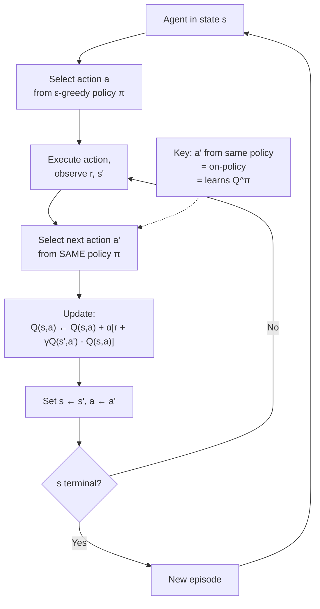

# SARSA — Interview Deep Dive

> **What this file covers**
> - 🎯 SARSA update rule and on-policy convergence to Q^π
> - 🧮 On-policy vs off-policy: formal definitions and consequences
> - ⚠️ Suboptimality with fixed ε, the GLIE condition, and convergence issues
> - 📊 SARSA vs Q-learning: empirical performance on cliff walking
> - 💡 Expected SARSA as a bridge between SARSA and Q-learning
> - 🏭 On-policy methods in production: from SARSA to PPO

## Brief Restatement

SARSA (State-Action-Reward-State-Action) is an on-policy TD control algorithm. Unlike Q-learning, which uses max_{a'} Q(s', a') in the update target, SARSA uses Q(s', a') where a' is the action actually selected by the current policy. This means SARSA's Q-values reflect the true performance of the policy being followed, including the cost of exploration. The result is safer behavior near dangerous states but convergence to Q^π instead of Q*.

---

## 🧮 Full Mathematical Treatment

### The SARSA Update

After observing the quintuple (s, a, r, s', a'), SARSA updates:

    Q(s, a) ← Q(s, a) + α · [ r + γ · Q(s', a') - Q(s, a) ]

Where:
- a' is selected by the same policy (e.g., ε-greedy based on current Q)
- The TD error is: δ = r + γ · Q(s', a') - Q(s, a)

The name comes from the five elements needed: **S**tate, **A**ction, **R**eward, **S**tate', **A**ction'.

### On-Policy Property

SARSA learns about the policy it is currently following. Formally:

    Target policy = Behavior policy = π_ε (the ε-greedy policy based on Q)

The Q-values converge to Q^{π_ε} — the true action values under the ε-greedy policy, not the optimal Q*.

For a fixed ε = 0.1 and 4 actions:

    π_ε(a|s) = { 0.925   if a = argmax Q(s,a)
               { 0.025   each for the other 3 actions

SARSA learns Q-values that account for the 7.5% probability of taking a suboptimal random action.

### SARSA vs Q-Learning: The One-Line Difference

    SARSA:      Q(s,a) ← Q(s,a) + α [ r + γ · Q(s', a')          - Q(s,a) ]
    Q-learning: Q(s,a) ← Q(s,a) + α [ r + γ · max_{a'} Q(s', a') - Q(s,a) ]

The difference: Q(s', a') vs max_{a'} Q(s', a'). That is, SARSA uses the actual next action; Q-learning uses the best next action.

### Expected SARSA

A variant that takes the expectation over next actions under the current policy:

    Q(s,a) ← Q(s,a) + α [ r + γ · Σ_{a'} π(a'|s') · Q(s', a') - Q(s,a) ]

This eliminates the variance from sampling a single a' while remaining on-policy. Expected SARSA:
- Has lower variance than SARSA (expectation instead of sample)
- Reduces to Q-learning when π is greedy (expected value of greedy = max)
- Is a smooth interpolation between SARSA and Q-learning

### Convergence: GLIE Condition

SARSA converges to Q* (not just Q^π) if the exploration satisfies **GLIE** (Greedy in the Limit with Infinite Exploration):

1. All state-action pairs are visited infinitely often: N(s,a) → ∞
2. The policy converges to greedy: π(s) → argmax_a Q(s,a) as t → ∞

The standard approach: use ε_t = 1/t (decay epsilon). This guarantees exploration forever but converges to greedy.

With fixed ε, SARSA converges to Q^{π_ε}, which is suboptimal because the policy never stops exploring.

### Worked Example: Cliff Walking

Consider being one step north of a cliff cell. Actions: {up, right, down, left}. Down leads to the cliff (-100 reward, reset to start). ε = 0.1, 4 actions.

**Q-learning's perspective:** max_{a'} Q(s', a') uses the best action. If right is optimal, Q-learning sees Q(s, right) → high value. It ignores the 2.5% chance of accidentally going down.

**SARSA's perspective:** a' is sampled from ε-greedy. 2.5% of the time, a' = down, giving Q(cliff) which is very negative. Over many updates:

    Q_SARSA(s, right) ≈ 0.925 × Q(right_neighbor) + 0.025 × Q(cliff) + ...

The cliff possibility pulls Q down, making SARSA prefer states farther from the cliff.

---

## 🗺️ Concept Flow

---

## ⚠️ Failure Modes and Edge Cases

### 1. Suboptimality with Fixed ε

With a fixed ε > 0, SARSA converges to Q^{π_ε}, not Q*. The ε-greedy policy is suboptimal by construction — it takes random actions ε of the time. The gap between Q^{π_ε} and Q* can be significant when random actions are costly (e.g., near cliffs or in tasks with negative rewards for bad actions).

**Detection:** The learned policy performs noticeably worse than Q-learning's policy when evaluated greedily (ε = 0).

**Mitigation:** Decay ε over time (GLIE condition). Or use Expected SARSA, which is more stable. In practice, evaluate the greedy policy periodically even while training with ε > 0.

### 2. Overly Cautious Behavior

Because SARSA accounts for exploration risk, it can learn overly conservative policies. In cliff walking, the safe path is 20+ steps longer than the optimal path. If ε is large (say 0.3), SARSA will stay very far from the cliff, taking an extremely long route.

**Detection:** SARSA's path length is much longer than Q-learning's, even after many episodes.

**Mitigation:** Reduce ε over time. Or use Expected SARSA which smooths out the extreme cases. Accept the safety-performance trade-off when appropriate.

### 3. Cannot Use Experience Replay

SARSA is on-policy: the update depends on (s, a, r, s', a') where a' comes from the current policy. Past transitions stored in a replay buffer were generated by an older policy, so replaying them violates the on-policy assumption. This limits SARSA's sample efficiency compared to Q-learning with replay.

**Detection:** Not a failure per se, but a design constraint. SARSA uses each transition once, while Q-learning can replay transitions 8-10 times.

**Mitigation:** Use n-step SARSA to extract more learning per transition. Or switch to Expected SARSA with importance sampling corrections. In deep RL, on-policy methods like PPO collect fresh data each iteration and discard it after a few updates.

---

## 📊 Complexity Analysis

| Metric | SARSA | Q-Learning | Expected SARSA |
|--------|-------|------------|----------------|
| **Time per step** | O(\|A\|) | O(\|A\|) | O(\|A\|) |
| **Memory** | O(\|S\| × \|A\|) | O(\|S\| × \|A\|) | O(\|S\| × \|A\|) |
| **Converges to** | Q^{π_ε} (fixed ε) or Q* (GLIE) | Q* | Q^{π_ε} or Q* |
| **Variance per update** | Higher (single a' sample) | Higher (max over noisy Q) | Lower (expectation over a') |
| **Bias** | On-policy: accounts for ε | Off-policy: ignores ε | On-policy with lower variance |
| **Replay buffer** | No | Yes | With corrections |

---

## 💡 Design Trade-offs

### When SARSA Beats Q-Learning

| Scenario | SARSA Advantage | Why |
|----------|-----------------|-----|
| **Near dangerous states** | Higher reward during training | Avoids states where random actions cause catastrophe |
| **Robot learning in real world** | Fewer hardware-breaking episodes | Policy reflects actual exploration risk |
| **Financial trading** | Fewer catastrophic losses | Conservative strategy matches actual execution |
| **ε stays fixed after training** | Correct value estimates | Q^{π_ε} is the right target if policy is ε-greedy |

### When Q-Learning Beats SARSA

| Scenario | Q-Learning Advantage | Why |
|----------|---------------------|-----|
| **Simulation environments** | Finds truly optimal policy | Mistakes are free, want Q* |
| **ε → 0 after training** | More useful Q-values | Q* is the right target for greedy deployment |
| **Sample efficiency matters** | Can use replay buffer | Off-policy enables data reuse |
| **Multiple data sources** | Can learn from any policy's data | Off-policy property |

### The SARSA → PPO Lineage

SARSA's on-policy philosophy extends to modern deep RL:

    SARSA → A2C (on-policy actor-critic) → TRPO (trust region) → PPO (clipped surrogate)

All share: learn from data generated by the current policy, discard after use, collect fresh data for next update. PPO is essentially "deep on-policy RL with function approximation and careful policy updates."

---

## 🏭 Production and Scaling Considerations

- **On-policy sample efficiency.** On-policy methods discard data after each update, requiring 3-10x more environment interactions than off-policy methods. In simulation (Atari, MuJoCo), this is acceptable. In real-world robotics, it is often too expensive, motivating sim-to-real transfer.

- **Parallel data collection.** On-policy methods benefit enormously from parallel environments. A2C/A3C run N parallel workers, each collecting data with the current policy. This reduces wall-clock time without violating the on-policy assumption because all workers use the same policy.

- **Expected SARSA in practice.** Expected SARSA is sometimes preferred over standard SARSA because it has the same on-policy semantics but lower variance (takes expectation instead of sampling a'). It is especially useful when the action space is small enough to sum over all actions efficiently.

- **Safe RL.** SARSA's cautious behavior near dangerous states foreshadows the field of safe RL (constrained MDPs, Lagrangian methods, shielded policies). In safety-critical applications, learning a policy that accounts for its own imperfections is a feature, not a bug.

---

## Staff/Principal Interview Depth

### Q1: Explain on-policy vs off-policy learning and give an example where each is preferred.

---
**No Hire**
*Interviewee:* "On-policy learns from the current policy. Off-policy learns from any data."
*Interviewer:* Correct definition but no depth. No examples, no trade-off analysis.
*Criteria — Met:* basic definition / *Missing:* examples, trade-offs, mechanism, practical implications

**Weak Hire**
*Interviewee:* "On-policy (SARSA) uses the actual next action from the current policy for the update. Off-policy (Q-learning) uses the max action. On-policy is safer because it accounts for exploration mistakes. Off-policy is more sample-efficient because it can use a replay buffer."
*Interviewer:* Correct and practical. Missing formal definitions and deeper analysis.
*Criteria — Met:* mechanism, safety/efficiency trade-off / *Missing:* formal definition, IS corrections, deadly triad, modern examples

**Hire**
*Interviewee:* "Formally, on-policy means the behavior policy equals the target policy: we evaluate and improve the same π. Off-policy means they differ: the behavior policy b generates data, but we learn about a target policy π ≠ b. The key consequence: off-policy methods can reuse past data (replay buffer), making them ~10x more sample-efficient. But off-policy + bootstrapping + function approximation = the deadly triad, requiring target networks and replay to stabilize. On-policy avoids the triad entirely. Example: robot learning to walk — on-policy (PPO) is preferred because falls are expensive and the policy should account for its own errors. Game AI in simulation — off-policy (DQN/SAC) is preferred because data is cheap and sample efficiency matters."
*Interviewer:* Strong formal and practical understanding. Covers the deadly triad and gives good examples.
*Criteria — Met:* formal definition, trade-offs, deadly triad, practical examples / *Missing:* IS corrections, deep analysis of convergence differences

**Strong Hire**
*Interviewee:* "The on/off-policy distinction affects convergence, stability, and sample complexity. On-policy: the data distribution matches the target, so SGD on the Bellman error converges under standard assumptions. Off-policy: the data distribution mismatches, requiring importance sampling corrections ρ = π(a|s)/b(a|s) for correct convergence. In practice, these corrections have high variance, so methods like V-trace and Retrace(λ) truncate them. The practical landscape: on-policy methods (PPO, A2C) are simpler, more stable, and embarrassingly parallel — run 64 environments in parallel, collect one batch, update, repeat. Off-policy methods (SAC, TD3) are more sample-efficient but require careful engineering (replay buffer, target nets, delayed updates). The SARSA-to-PPO lineage shows how on-policy ideas scaled: SARSA → n-step SARSA → A2C → TRPO → PPO. The Q-learning-to-SAC lineage shows the off-policy path: Q-learning → DQN → DDPG → TD3 → SAC."
*Interviewer:* Traces both lineages, covers IS corrections and their practical limitations, and understands the parallelization advantage of on-policy. Staff-level systems view.
*Criteria — Met:* all — formal IS connection, convergence, both lineages, practical systems perspective
---

### Q2: Why does SARSA learn a different path than Q-learning in cliff walking?

---
**No Hire**
*Interviewee:* "SARSA takes the safe path and Q-learning takes the optimal path."
*Interviewer:* States the observation but cannot explain the mechanism.
*Criteria — Met:* observation / *Missing:* mechanism, math, generalization

**Weak Hire**
*Interviewee:* "Q-learning uses max Q(s', a'), which assumes the best action. SARSA uses the actual next action a', which includes random exploration. Near the cliff, the random action might go off the cliff, so SARSA's Q-values are lower near the edge. SARSA learns to avoid those states."
*Interviewer:* Good intuition. Missing the quantitative analysis.
*Criteria — Met:* mechanism / *Missing:* quantitative impact of ε, expected value calculation, generalization to other domains

**Hire**
*Interviewee:* "Consider state s one step north of the cliff with ε = 0.1 and 4 actions. Q-learning: target = max Q(s', a') — assumes the agent will take the best action (stay north or go right). The cliff risk is ignored. SARSA: target = Q(s', a') where a' is ε-greedy. With probability ε/4 = 2.5%, a' = down, which enters the cliff (reward -100). This 2.5% chance pulls Q(s, down-adjacent) lower, making SARSA prefer states where even random actions are safe. The gap between SARSA and Q-learning paths increases with ε: higher ε → more exploration risk → SARSA takes a wider detour."
*Interviewer:* Quantitative explanation with the ε/|A| probability. Good.
*Criteria — Met:* quantitative mechanism, ε dependence / *Missing:* formal expected value, convergence target analysis

**Strong Hire**
*Interviewee:* "The fundamental difference is what each algorithm's Q-values represent. Q-learning Q-values are Q* — the value under the optimal (greedy) policy. SARSA Q-values are Q^{π_ε} — the value under the actual ε-greedy policy. Near the cliff, Q*(s) is high because the optimal policy never falls. Q^{π_ε}(s) is lower because π_ε sometimes takes random actions, and random actions near the cliff occasionally cause -100 penalty. The expected one-step value near the cliff under π_ε is: (1-ε)Q(best) + (ε/|A|)Σ Q(each action). If one action leads to -100, this pulls the entire expected value down significantly. The result: SARSA's greedy policy w.r.t. Q^{π_ε} avoids the cliff because those states have genuinely low value under the exploration policy. This is the correct behavior if the agent will continue using ε-greedy during deployment. It is suboptimal only if ε → 0 after training."
*Interviewer:* Distinguishes Q* from Q^{π_ε} precisely and connects the mathematical difference to the behavioral consequence. The deployment consideration adds practical depth. Staff-level.
*Criteria — Met:* all — formal Q* vs Q^{π_ε}, expected value calculation, deployment context
---

### Q3: What is Expected SARSA and why is it sometimes preferred over both SARSA and Q-learning?

---
**No Hire**
*Interviewee:* "Expected SARSA averages over the next actions instead of sampling one."
*Interviewer:* Correct but no depth.
*Criteria — Met:* basic idea / *Missing:* formula, advantages, when it reduces to Q-learning

**Weak Hire**
*Interviewee:* "Instead of using Q(s', a') for a single sampled a', Expected SARSA computes Σ π(a'|s') Q(s', a'). This reduces variance because we take the expectation instead of a sample. It is still on-policy because we use the current policy's probabilities."
*Interviewer:* Correct formula and variance reduction. Missing the connection to Q-learning and practical use.
*Criteria — Met:* formula, variance reduction / *Missing:* Q-learning connection, practical comparison, when preferred

**Hire**
*Interviewee:* "Expected SARSA's target is E_{a'~π}[Q(s', a')] = Σ π(a'|s')Q(s', a'). Three key properties: (1) Lower variance than SARSA because the expectation is deterministic. (2) When π is greedy (ε=0), it reduces to max Q(s', a'), which is Q-learning. (3) When π is ε-greedy, it accounts for exploration just like SARSA but without sampling noise. In practice, Expected SARSA often outperforms both: it is safer than Q-learning (on-policy) but more stable than SARSA (lower variance). The downside is O(|A|) per update to compute the sum."
*Interviewer:* Excellent analysis. Clear, correct, and practical.
*Criteria — Met:* formula, three properties, practical comparison / *Missing:* deep analysis of when variance matters most

**Strong Hire**
*Interviewee:* "Expected SARSA is the natural midpoint: its target E_π[Q(s',a')] = (1-ε)max Q + (ε/|A|)ΣQ smoothly interpolates between SARSA (sample one a') and Q-learning (ε=0 gives max). The variance reduction is significant: Var(sample) ≈ Var_π(Q(s', a')) per step, while Expected SARSA has zero sampling variance in the target (deterministic given Q). This matters most when Q-values within a state vary widely — near cliffs, some Q values are -100 while others are -10, so a single SARSA sample has high variance. Expected SARSA in this case gives the stable on-policy estimate without noise. In tabular settings, Expected SARSA dominates both SARSA and Q-learning on most benchmarks. With function approximation, it forms the basis of methods like SAC's critic update: Q(s,a) ← r + γ E_{a'~π}[Q(s',a') - α log π(a'|s')], which is Expected SARSA with an entropy bonus."
*Interviewer:* Connects Expected SARSA to the SAC critic update, provides quantitative variance analysis, and identifies the interpolation formula. Staff-level depth.
*Criteria — Met:* all — interpolation formula, variance analysis, SAC connection, practical dominance
---

---

## Key Takeaways

🎯 1. SARSA updates Q(s,a) using the actual next action a' — this makes it on-policy, learning Q^{π_ε} instead of Q*
   2. The one-line difference: SARSA uses Q(s', a'), Q-learning uses max Q(s', a') — this changes what the Q-values represent
🎯 3. Near dangerous states, SARSA is safer because Q^{π_ε} accounts for the probability of exploration mistakes
⚠️ 4. With fixed ε, SARSA converges to Q^{π_ε} (suboptimal) — use GLIE (decaying ε) to converge to Q*
   5. SARSA cannot use experience replay because it is on-policy — this limits sample efficiency
🎯 6. Expected SARSA averages over next actions, reducing variance while staying on-policy — it reduces to Q-learning when ε = 0
   7. SARSA's on-policy philosophy extends through A2C → TRPO → PPO, the dominant modern on-policy deep RL lineage
