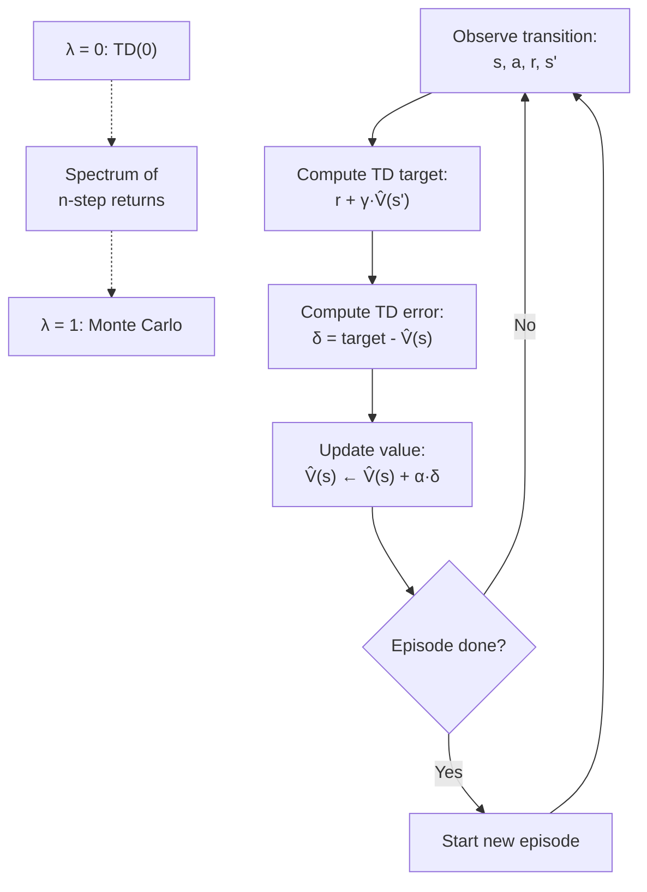

# Temporal Difference Learning — Interview Deep Dive

> **What this file covers**
> - 🎯 TD(0) update rule and its derivation from the Bellman equation
> - 🧮 TD error, eligibility traces, and TD(λ) unification
> - ⚠️ Bootstrapping bias, maximization bias, and the deadly triad
> - 📊 Convergence rates: TD vs MC sample complexity
> - 💡 TD vs MC vs DP: the full spectrum of backup methods
> - 🏭 N-step returns and GAE for practical variance control

## Brief Restatement

Temporal difference learning updates value estimates after every step instead of waiting for the episode to end. It combines MC's model-free learning with DP's bootstrapping: the update target uses the current estimate V̂(s') instead of the full return G_t. This reduces variance at the cost of introducing bias from the estimate.

---

## 🧮 Full Mathematical Treatment

### The TD(0) Update

TD(0) updates V(s) after observing one transition (s, r, s'):

    V(s) ← V(s) + α · δ_t

Where the **TD error** is:

    δ_t = r_{t+1} + γ · V(s_{t+1}) - V(s_t)

In words: the TD error is the difference between what you got (r + γV(s')) and what you expected (V(s)). If the TD error is positive, the outcome was better than expected. If negative, it was worse.

Where:
- α ∈ (0, 1] is the learning rate (step size)
- γ is the discount factor
- V(s_{t+1}) is the current estimate of the next state's value (the "bootstrap")
- The target r_{t+1} + γ · V(s_{t+1}) is called the **TD target**

### Why TD Works: Connection to the Bellman Equation

The Bellman equation says:

    V^π(s) = E_π [ r_{t+1} + γ · V^π(s_{t+1}) | s_t = s ]

TD(0) uses a single sample of r_{t+1} + γ · V̂(s_{t+1}) as an estimate of this expectation. As the learning rate decreases and more samples are collected, V̂ converges to V^π under standard conditions (tabular, decreasing α with Σα = ∞, Σα² < ∞).

### N-Step Returns

Between TD(0) (one-step) and MC (full episode) lies a spectrum:

    G_t^{(n)} = r_{t+1} + γr_{t+2} + ... + γ^{n-1}r_{t+n} + γ^n V(s_{t+n})

- n = 1: TD(0) target, r_{t+1} + γV(s_{t+1})
- n = T-t: MC target, G_t (the full return)
- Intermediate n: blend of real rewards and bootstrap

### TD(λ): Unifying MC and TD

TD(λ) averages over all n-step returns using exponential weighting:

    G_t^λ = (1-λ) Σ_{n=1}^{T-t-1} λ^{n-1} G_t^{(n)} + λ^{T-t-1} G_t

Where:
- λ = 0: reduces to TD(0)
- λ = 1: reduces to MC
- λ ∈ (0,1): interpolates between bias (TD) and variance (MC)

The **eligibility trace** implementation avoids computing all n-step returns:

    e_t(s) = γλ · e_{t-1}(s) + 𝟙(s_t = s)
    V(s) ← V(s) + α · δ_t · e_t(s)    for all s

This propagates the TD error backward to recently visited states, with the trace decaying by γλ per step.

### Worked Example

3-state chain: A → B → C (terminal), r(A→B) = 0, r(B→C) = 1, γ = 0.9.

Initialize V(A) = 0, V(B) = 0, V(C) = 0, α = 0.1.

Step 1: Agent in A, moves to B, reward = 0.

    δ = 0 + 0.9 × V(B) - V(A) = 0 + 0.9 × 0 - 0 = 0
    V(A) ← 0 + 0.1 × 0 = 0

Step 2: Agent in B, moves to C, reward = 1.

    δ = 1 + 0.9 × V(C) - V(B) = 1 + 0 - 0 = 1
    V(B) ← 0 + 0.1 × 1 = 0.1

After one episode: V(A) = 0, V(B) = 0.1.
The true values are V^π(A) = 0.9, V^π(B) = 1.0.

Step 3 (next episode): Agent in A, moves to B.

    δ = 0 + 0.9 × 0.1 - 0 = 0.09
    V(A) ← 0 + 0.1 × 0.09 = 0.009

TD learns incrementally — V(A) starts increasing once V(B) has been updated. MC would have gotten V(A) = 0.9 in one episode, but with higher variance across episodes.

---

## 🗺️ Concept Flow

---

## ⚠️ Failure Modes and Edge Cases

### 1. Bootstrapping Bias

TD's target r + γV̂(s') depends on V̂, which may be wrong. This creates a bias that propagates: if V̂(s') is overestimated, V̂(s) will be overestimated too. In tabular settings, this bias vanishes as V̂ converges. With function approximation, the bias can create feedback loops that diverge.

**Detection:** V̂ values growing unboundedly or oscillating wildly.

**Mitigation:** Use target networks (freeze V̂ for the bootstrap), reduce α, or switch to MC-style updates for critical states.

### 2. Learning Rate Sensitivity

TD(0) requires careful tuning of α. Too large: values oscillate and may not converge. Too small: learning is extremely slow. The Robbins-Monro conditions (Σα = ∞, Σα² < ∞) guarantee convergence but do not specify a practical schedule.

**Detection:** Learning curves that oscillate or plateau very early.

**Mitigation:** Use α = 1/N(s) for exact convergence. Or use Adam/RMSProp for function approximation settings.

### 3. The Deadly Triad

When three things are combined — (1) function approximation, (2) bootstrapping, (3) off-policy learning — TD can diverge. This is called the deadly triad (Sutton & Barto).

**Detection:** Loss increasing over time despite more data.

**Mitigation:** Remove any one of the three: use tabular methods (remove approximation), use MC (remove bootstrapping), or use on-policy methods like SARSA (remove off-policy). In practice, DQN addresses this with target networks and experience replay.

---

## 📊 Complexity Analysis

| Metric | TD(0) | MC | DP (Value Iteration) |
|--------|-------|----|-----------------------|
| **Update frequency** | Every step | End of episode | Full sweep over all states |
| **Time per update** | O(1) per state | O(1) per state | O(\|S\| × \|A\|) per sweep |
| **Model required** | No | No | Yes |
| **Memory** | O(\|S\|) for V, O(\|S\|×\|A\|) for Q | Same + return storage | O(\|S\| × \|A\|) |
| **Convergence (tabular)** | Yes, with Robbins-Monro α | Yes, by law of large numbers | Yes, contraction mapping |
| **Bias** | Yes (bootstrapping) | No | No |
| **Variance per update** | Low (one-step target) | High (full return) | Zero (deterministic) |

---

## 💡 Design Trade-offs

### TD(0) vs MC: The Bias-Variance Spectrum

| Property | TD(0) (λ=0) | TD(λ) | MC (λ=1) |
|----------|-------------|-------|----------|
| **Bias** | Highest (one-step bootstrap) | Decreasing with λ | Zero |
| **Variance** | Lowest (one reward) | Increasing with λ | Highest (full return) |
| **Convergence speed** | Fast (for good V̂) | Tunable | Slow |
| **Sensitivity to V̂ init** | High (bootstrap depends on init) | Moderate | None |
| **Continuing tasks** | Yes | Yes (with truncation) | No |

### Choosing λ

- **λ = 0 (TD(0)):** Best when the environment is Markov and V̂ is reasonably initialized. Fastest convergence per sample.
- **λ = 0.9-0.95:** Common in practice. GAE (Generalized Advantage Estimation) uses this range. Balances bias and variance well for policy gradient methods.
- **λ = 1 (MC):** Use when the Markov property is violated or when function approximation makes bootstrapping unstable.

---

## 🏭 Production and Scaling Considerations

- **TD in deep RL.** DQN is TD applied to neural networks: the loss is (r + γ max_a Q_target(s', a) - Q(s, a))². The target network (frozen copy of Q) stabilizes the bootstrap target. Experience replay decorrelates samples. Both are essential to avoid the deadly triad.

- **GAE (Generalized Advantage Estimation).** Production policy gradient methods (PPO, TRPO) use TD(λ)-style advantage estimates: Â_t = Σ_{l=0}^{T-t-1} (γλ)^l δ_{t+l}. Setting λ = 0.95 and γ = 0.99 is standard. The advantage  replaces G_t in the policy gradient, reducing variance while introducing controlled bias.

- **Prioritized experience replay.** TD errors |δ| indicate surprise. Prioritized replay samples transitions with high |δ| more often, focusing learning on the most informative experiences. This can speed up learning by 2-5x in practice.

---

## Staff/Principal Interview Depth

### Q1: What is the TD error and why is it important beyond just updating V?

---
**No Hire**
*Interviewee:* "The TD error is the difference between the target and the current estimate. It tells you how much to update."
*Interviewer:* Correct but surface-level. Does not connect TD error to broader concepts.
*Criteria — Met:* basic definition / *Missing:* connection to advantage, reward prediction error, prioritized replay

**Weak Hire**
*Interviewee:* "δ = r + γV(s') - V(s). It measures the surprise — how much better or worse the outcome was compared to the prediction. Positive δ means things went better than expected. It is used in the update rule V(s) ← V(s) + αδ."
*Interviewer:* Good intuition about surprise. Missing connections to the advantage function, neuroscience, and practical uses.
*Criteria — Met:* formula, surprise interpretation / *Missing:* advantage function connection, neuroscience link, practical applications

**Hire**
*Interviewee:* "The TD error δ = r + γV(s') - V(s) is central to RL in three ways. First, it drives value updates in TD learning. Second, it approximates the advantage function: A(s,a) ≈ δ when V is accurate, which is used in actor-critic methods. Third, |δ| indicates how surprising a transition is, which motivates prioritized experience replay in DQN — transitions with high |δ| are replayed more often. The connection to the advantage makes TD error the bridge between value-based and policy-based methods."
*Interviewer:* Strong connections across RL. Would push to Strong Hire with the neuroscience connection or deeper analysis of GAE.
*Criteria — Met:* formula, advantage connection, prioritized replay / *Missing:* GAE derivation, neuroscience parallel

**Strong Hire**
*Interviewee:* "The TD error is RL's universal learning signal. Beyond value updates: (1) In actor-critic, δ estimates the advantage A(s,a) = Q(s,a) - V(s), which tells the policy gradient which actions are better than average. (2) GAE sums discounted TD errors: Â_t = Σ (γλ)^l δ_{t+l}, giving a biased but low-variance advantage estimate that PPO uses. (3) In neuroscience, dopamine neurons fire in proportion to the reward prediction error, which is exactly the TD error — this was the key insight of the Schultz et al. experiments. (4) |δ| drives prioritized replay, and in distributional RL, the sign and magnitude of δ reveal the full return distribution. The TD error connects value learning, policy learning, and neuroscience through one simple quantity."
*Interviewer:* Exceptional breadth connecting RL theory, practical algorithms, and neuroscience. Staff-level.
*Criteria — Met:* all — advantage, GAE, neuroscience, distributional RL, prioritized replay
---

### Q2: Explain the deadly triad and how modern deep RL algorithms address it.

---
**No Hire**
*Interviewee:* "The deadly triad is when neural networks are used with RL and things diverge."
*Interviewer:* Vague. Cannot name the three components or explain why they cause divergence.
*Criteria — Met:* awareness of instability / *Missing:* three components, mechanism, solutions

**Weak Hire**
*Interviewee:* "The deadly triad is: function approximation, bootstrapping, and off-policy learning. When all three are present, TD can diverge because the bootstrap target depends on the function approximator, which is changing as it learns. DQN fixes this with target networks and experience replay."
*Interviewer:* Correct components and one solution. Missing deeper analysis of why each component contributes and what other solutions exist.
*Criteria — Met:* three components, DQN solution / *Missing:* mechanism analysis, alternative solutions, formal understanding

**Hire**
*Interviewee:* "Each component of the triad contributes differently. Function approximation means updating V(s) changes V(s') too (parameter sharing), creating non-stationary targets. Bootstrapping feeds these errors back into the target. Off-policy learning means the data distribution does not match the target policy, amplifying errors. DQN addresses all three: target networks reduce non-stationarity in the bootstrap, experience replay provides diverse i.i.d.-like samples. SARSA avoids the off-policy component entirely. MC avoids the bootstrapping component. Removing any one element stabilizes learning."
*Interviewer:* Strong mechanistic understanding. Would reach Strong Hire with formal analysis or mention of more recent solutions.
*Criteria — Met:* mechanism for each component, multiple solutions / *Missing:* formal stability conditions, modern approaches beyond DQN

**Strong Hire**
*Interviewee:* "The deadly triad causes divergence because the Bellman backup becomes an expansion rather than a contraction under off-policy distributions with function approximation. Formally, the projected Bellman operator may not be a contraction in the off-policy case, so iterating it diverges. Solutions form a spectrum: (1) Remove off-policy: use SARSA, A2C, PPO (on-policy). (2) Remove bootstrapping: use MC returns (REINFORCE). (3) Constrain the function approximator: use linear FA with tile coding (provably stable with TD). (4) Stabilize the bootstrap: target networks in DQN, Polyak averaging in SAC. (5) Correct the distribution: importance sampling corrections in Retrace(λ), V-trace. (6) Use distributional RL: C51 and QR-DQN are empirically more stable. Modern systems combine several of these. PPO avoids the triad entirely by being on-policy with MC-style returns."
*Interviewer:* Full theoretical and practical understanding with a taxonomy of solutions. Staff-level systems thinking.
*Criteria — Met:* all — formal contraction analysis, taxonomy of six solutions, modern algorithm connections
---

### Q3: How does n-step TD interpolate between TD(0) and MC, and what is the optimal choice?

---
**No Hire**
*Interviewee:* "N-step TD uses n steps of real rewards before bootstrapping. Bigger n is more like MC."
*Interviewer:* Correct but no depth. No formula, no trade-off analysis.
*Criteria — Met:* basic idea / *Missing:* formula, bias-variance trade-off, practical guidance

**Weak Hire**
*Interviewee:* "The n-step return is G^n = r + γr' + ... + γ^{n-1}r^{(n)} + γ^n V(s_{t+n}). With n=1, it is TD(0). With n=T, it is MC. Larger n has less bias but more variance. You have to choose n based on the problem."
*Interviewer:* Correct formula and trade-off direction. Missing practical guidance and the connection to TD(λ).
*Criteria — Met:* formula, bias-variance direction / *Missing:* TD(λ) connection, practical guidance, variance quantification

**Hire**
*Interviewee:* "N-step returns have bias ∝ γ^n||V̂ - V^π|| and variance that grows with n (more random variables summed). The optimal n depends on the quality of V̂: if V̂ is accurate, n=1 is best (low variance, minimal bias). If V̂ is poor, larger n avoids propagating the error. TD(λ) avoids choosing a single n by exponentially averaging all n-step returns with weights (1-λ)λ^{n-1}. In practice, λ=0.95 with GAE is the standard choice because it gives low-variance advantage estimates for policy gradients."
*Interviewer:* Strong understanding with practical guidance. Connects to GAE and gives actionable advice.
*Criteria — Met:* bias-variance trade-off, TD(λ), GAE, practical guidance / *Missing:* nothing significant

**Strong Hire**
*Interviewee:* "The bias of n-step TD decays as γ^n||V̂ - V^π||_∞ while the variance grows as O(σ²(1-γ^{2n})/(1-γ²)). The optimal n minimizes MSE = bias² + variance, which depends on the specific problem. TD(λ) elegantly avoids this choice: its forward view averages n-step returns, and its backward view uses eligibility traces e(s) = γλe(s) + 𝟙, making it efficient to implement. GAE is TD(λ) applied to advantages: Â = Σ(γλ)^l δ_{t+l}. Schulman et al. showed empirically that λ=0.95-0.98 works well across Atari and MuJoCo, because policy gradient variance dominates bias at these values. The choice of n (or λ) is ultimately an empirical hyperparameter, but the theoretical framework tells you which direction to search."
*Interviewer:* Quantitative bias-variance formulas, forward/backward view equivalence, and practical wisdom from Schulman et al. Staff-level.
*Criteria — Met:* all — quantitative bounds, eligibility traces, GAE, empirical guidance
---

---

## Key Takeaways

🎯 1. TD(0) updates after every step using δ = r + γV̂(s') - V̂(s) — lower variance than MC but introduces bootstrapping bias
🎯 2. The TD error δ is the universal learning signal in RL — it drives value updates, approximates the advantage, and corresponds to dopamine in neuroscience
   3. N-step returns interpolate between TD(0) and MC: bias decreases and variance increases with n
⚠️ 4. The deadly triad (function approximation + bootstrapping + off-policy) can cause divergence — DQN addresses it with target networks and replay
   5. TD(λ) with eligibility traces avoids choosing a single n by exponentially averaging all n-step returns
🎯 6. GAE (λ=0.95, γ=0.99) is the standard advantage estimator in production policy gradient methods
   7. TD converges faster than MC in wall-clock time because it learns every step rather than every episode
