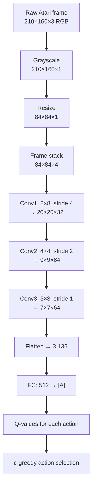

# Playing Atari Games — Interview Deep Dive

> **What this file covers**
> - 🎯 Why DQN on Atari was a breakthrough: the first end-to-end pixel-to-action deep RL system
> - 🧮 Preprocessing pipeline math: grayscale, resize, frame stacking with exact dimensions
> - ⚠️ Preprocessing mistakes that silently break training, CNN architecture pitfalls
> - 📊 CNN parameter counts, FLOP analysis, and training compute requirements
> - 💡 Architecture choices: kernel sizes, strides, and why the DQN CNN looks the way it does
> - 🏭 Stable-Baselines3 usage, hyperparameter selection, and training diagnostics for Atari

## Brief Restatement

DQN on Atari demonstrated that a single algorithm could learn to play 49 different video games from raw pixels with no game-specific engineering. The key innovation beyond the core DQN algorithm was the preprocessing pipeline: converting 210×160 RGB frames to 84×84 grayscale, stacking 4 consecutive frames to provide motion information, and feeding the result through a CNN that extracts spatial features hierarchically. This end-to-end approach — raw pixels in, actions out — eliminated the need for hand-crafted features and proved that deep learning and reinforcement learning could work together at scale.

---

## 🧮 Full Mathematical Treatment

### Preprocessing Pipeline

Raw Atari frames are 210×160×3 (height × width × RGB channels) = 100,800 values per frame.

**Step 1 — Grayscale conversion:**

    gray(r, g, b) = 0.299r + 0.587g + 0.114b

These coefficients match human perception (green contributes most to perceived brightness). The output is 210×160×1 = 33,600 values. Reduction: 3x.

**Step 2 — Resize to 84×84:**

Using bilinear interpolation:

    resized(i, j) = interpolate(gray, i × 210/84, j × 160/84)

The output is 84×84×1 = 7,056 values. Reduction from raw: 14.3x. The 84×84 size was chosen because it is large enough to distinguish game objects (paddle, ball, aliens) but small enough for the CNN to process efficiently.

**Step 3 — Frame stacking:**

Stack the 4 most recent preprocessed frames along the channel dimension:

    observation_t = stack(frame_{t-3}, frame_{t-2}, frame_{t-1}, frame_t)

The output is 84×84×4 = 28,224 values. This provides temporal information: the difference between consecutive frames encodes velocity and direction of objects.

**Frame skipping (action repeat):** the agent selects an action every 4th frame, repeating the previous action for 3 frames in between. This reduces the effective decision frequency from 60 Hz to 15 Hz and speeds up training by 4x. The max of the last 2 raw frames is taken to handle Atari's flickering (some objects are rendered only on alternating frames).

### CNN Architecture

The DQN CNN from Mnih et al. (2015):

| Layer | Input | Kernel | Stride | Output | Parameters |
|-------|-------|--------|--------|--------|------------|
| Conv1 | 84×84×4 | 8×8×32 | 4 | 20×20×32 | 4×8×8×32 + 32 = 8,224 |
| Conv2 | 20×20×32 | 4×4×64 | 2 | 9×9×64 | 32×4×4×64 + 64 = 32,832 |
| Conv3 | 9×9×64 | 3×3×64 | 1 | 7×7×64 | 64×3×3×64 + 64 = 36,928 |
| FC1 | 3,136 | — | — | 512 | 3136×512 + 512 = 1,606,144 |
| FC2 | 512 | — | — | 18 | 512×18 + 18 = 9,234 |
| **Total** | | | | | **1,693,362** |

Where:
- Output spatial size = floor((input - kernel) / stride) + 1
- Conv1: floor((84 - 8) / 4) + 1 = 20
- Conv2: floor((20 - 4) / 2) + 1 = 9
- Conv3: floor((9 - 3) / 1) + 1 = 7
- Flatten: 7 × 7 × 64 = 3,136
- 18 actions is the maximum across Atari games (most games use 4–9)

### Why These Specific Kernel Sizes and Strides

The architecture follows a principle: large receptive field early, fine detail later.

**Conv1 (8×8, stride 4):** looks at 8×8 pixel patches and skips 4 pixels between patches. This captures large-scale features (the overall shape of the paddle, the ball's position) and aggressively reduces spatial dimensions. An 8×8 kernel at the original 210×160 resolution would cover approximately 10% of the paddle width — enough to detect it.

**Conv2 (4×4, stride 2):** looks at 4×4 patches of the Conv1 output. Each patch corresponds to 14×14 pixels in the original image (receptive field growth). This captures medium-scale features (the ball relative to the paddle, gaps in the brick wall).

**Conv3 (3×3, stride 1):** looks at 3×3 patches without reducing spatial dimension further. Each patch has a receptive field of 22×22 original pixels. This captures spatial relationships (ball approaching paddle from the left, tunnel in the bricks).

### FLOPs Analysis

For a single forward pass (one observation):

| Layer | FLOPs |
|-------|-------|
| Conv1 | 2 × 4 × 8 × 8 × 32 × 20 × 20 = 6,553,600 |
| Conv2 | 2 × 32 × 4 × 4 × 64 × 9 × 9 = 5,308,416 |
| Conv3 | 2 × 64 × 3 × 3 × 64 × 7 × 7 = 3,612,672 |
| FC1 | 2 × 3136 × 512 = 3,211,264 |
| FC2 | 2 × 512 × 18 = 18,432 |
| **Total** | **~18.7M FLOPs** |

On a modern GPU: ~0.1 ms per forward pass. The bottleneck is not compute but environment stepping (game simulation) and replay buffer sampling.

### Reward Clipping

DQN clips all rewards to {-1, 0, +1}:

    clipped_reward = sign(reward)

This normalizes the reward scale across all 49 games. Without clipping, a single point in Pong (+1) and destroying an alien in Space Invaders (+100) would produce very different loss magnitudes, requiring per-game learning rate tuning.

**Cost of clipping:** the agent cannot distinguish between a 10-point event and a 100-point event — both become +1. This loses relative importance information. For games where reward magnitude matters (e.g., choosing between a 100-point and 10-point target), clipping hurts.

---

## 🗺️ Concept Flow



---

## ⚠️ Failure Modes and Edge Cases

### 1. Missing Frame Max-Pooling

Atari renders some objects only on alternating frames (a hardware limitation of the original console). If the agent sees only every 4th frame (due to frame skipping), it may miss objects that appear on the skipped frames. The fix: take the pixel-wise maximum of the last 2 raw frames before preprocessing. This ensures every visible object appears in the processed frame.

**If missed:** certain objects (enemy bullets, specific game elements) become invisible to the agent. The agent dies from threats it cannot see. This is a silent failure — the training runs without errors but performance is poor on games with flickering.

### 2. Incorrect Frame Stacking Order

The frame stack must be ordered chronologically: [t-3, t-2, t-1, t] with the oldest frame in channel 0 and the newest in channel 3 (or vice versa, as long as it is consistent). If frames are stacked in the wrong order, the agent infers incorrect velocity information (the ball appears to move backward).

**If missed:** the agent makes systematically wrong predictions about object motion, leading to poor performance on games that require trajectory prediction (Pong, Breakout, Seaquest).

### 3. No Frame Stack at Episode Boundaries

When a new episode starts, there are no previous frames to stack. The standard approach: fill the missing frames with zeros (black frames) or repeat the first frame 4 times. If the buffer contains transitions that span episode boundaries (last state of episode N next to first state of episode N+1), the frame stack can contain frames from two different episodes, showing a discontinuous scene.

**The fix:** mark episode boundaries in the replay buffer. When sampling a transition at the start of an episode, use zero-padded frames instead of frames from the previous episode.

### 4. Reward Clipping Hides Reward Structure

On games like Ms. Pac-Man, eating a dot gives 10 points, eating a fruit gives 100–5000 points, and eating a ghost gives 200–1600 points. After clipping, all of these become +1. The agent cannot learn to prioritize high-value targets over low-value ones.

**Games most affected:** Atlantis (rewards range from 20 to 5400), Ms. Pac-Man (rewards range from 10 to 5000), Video Pinball (rewards range from 1 to 100,000).

**Modern fix:** PopArt normalization (Van Hasselt et al., 2016) adaptively normalizes rewards using running mean and variance, preserving relative magnitudes. R2D2 and Agent57 use this instead of clipping.

### 5. CNN Does Not Generalize Across Games

Although DQN uses the same architecture for all 49 games, the learned weights are completely different for each game. A network trained on Breakout cannot play Pong. Transfer learning across Atari games has been explored but with limited success — the visual features (paddle shapes, enemy types, game mechanics) differ too much.

---

## 📊 Complexity Analysis

| Metric | Value | Notes |
|--------|-------|-------|
| **Input size** | 84×84×4 = 28,224 | After preprocessing |
| **Network parameters** | ~1.7M | Dominated by FC1 (1.6M) |
| **Forward pass FLOPs** | ~18.7M | ~0.1 ms on GPU |
| **Replay buffer memory** | 7–28 GB | For 1M transitions, depending on compression |
| **Training frames** | 50M (10M steps × 4 frame skip) | ~200M gradient updates |
| **Wall-clock training** | 7–10 days (2015), 1–2 days (modern GPU) | Single GPU |
| **Games evaluated** | 49 | ALE (Arcade Learning Environment) |
| **Superhuman games** | ~29 of 49 | >100% of human score |
| **Subhuman games** | ~20 of 49 | Montezuma's Revenge, Pitfall (sparse reward) |

### Where DQN Fails: The Sparse Reward Problem

| Game | DQN Score | Human Score | % Human | Why DQN Fails |
|------|-----------|-------------|---------|---------------|
| Breakout | 401.2 | 31.8 | 1262% | Dense rewards, simple strategy |
| Pong | 20.9 | 9.3 | 225% | Dense rewards, reactive play |
| Montezuma's Revenge | 0 | 4,753 | 0% | Extremely sparse rewards, requires planning |
| Pitfall | 0 | 6,464 | 0% | Extremely sparse rewards, requires exploration |
| Solaris | 12.3 | 12,327 | 0.1% | Complex strategy, sparse feedback |

DQN fails catastrophically on exploration-heavy games. In Montezuma's Revenge, the agent must navigate multiple rooms, pick up keys, and open doors before receiving any reward. Random ε-greedy exploration almost never discovers the first reward. Solutions: curiosity-driven exploration (ICM, RND), Go-Explore, Agent57.

---

## 💡 Design Trade-offs

### Preprocessing Choices

| Choice | DQN (2015) | Alternative | Trade-off |
|--------|-----------|-------------|-----------|
| Grayscale | Yes | Keep RGB | 3x input reduction vs potential loss of color-coded info |
| Resize to 84×84 | Yes | 64×64, 96×96, 128×128 | Compute vs detail |
| Frame stack 4 | Yes | Stack 2, 3, 8 | Motion information vs input size |
| Frame skip 4 | Yes | Skip 2, 8 | Decision frequency vs training speed |
| Max over last 2 frames | Yes | Use last frame only | Flickering fix vs minor blur |

### Architecture Choices

| Choice | DQN CNN | Alternative | Trade-off |
|--------|---------|-------------|-----------|
| 3 conv layers | Standard | ResNet, deeper CNNs | Simplicity vs capacity |
| Large first kernel (8×8) | Aggressive downsampling | 3×3 with pooling | Speed vs fine detail |
| 512 FC units | Standard | 256, 1024 | Capacity vs overfitting |
| ReLU activation | Standard | ELU, GELU | Simplicity vs gradient flow |

### Frame Stack Size

| Stack Size | Pros | Cons | Best For |
|-----------|------|------|----------|
| 1 frame | Smallest input, fastest | No motion info | Static games (puzzle games) |
| 2 frames | Some motion, small input | Limited velocity estimation | Simple motion |
| 4 frames | Good velocity + acceleration | 4x input size | Standard choice (most Atari games) |
| 8+ frames | Long-term motion patterns | Large input, slow training | Games with long motion arcs |

---

## 🏭 Production and Scaling Considerations

### Stable-Baselines3 Configuration

The standard SB3 configuration for Atari:

```python
from stable_baselines3 import DQN
from stable_baselines3.common.env_util import make_atari_env
from stable_baselines3.common.vec_env import VecFrameStack

env = make_atari_env("BreakoutNoFrameskip-v4", n_envs=1, seed=42)
env = VecFrameStack(env, n_stack=4)

model = DQN(
    "CnnPolicy",
    env,
    learning_rate=1e-4,
    buffer_size=100_000,      # Reduced from 1M for memory
    batch_size=32,
    gamma=0.99,
    target_update_interval=1000,
    learning_starts=10_000,
    train_freq=4,
    exploration_fraction=0.1,
    exploration_final_eps=0.01,
    verbose=1,
)
```

Key points:
- `make_atari_env` handles all preprocessing (grayscale, resize, frame skip, reward clipping)
- `VecFrameStack` adds frame stacking
- `CnnPolicy` selects the DQN CNN architecture
- `buffer_size=100_000` is reduced from the paper's 1M due to memory constraints

### Training Time Estimates

| Steps | GPU Hours | Expected Performance |
|-------|-----------|---------------------|
| 100K | 0.25 | Random — verifying setup works |
| 1M | 2–4 | Beginning to learn — reward should increase |
| 10M | 20–40 | Good performance on easy games (Pong, Breakout) |
| 50M | 100–200 | Near paper results on most games |
| 200M | 400+ | Best possible DQN performance |

### Evaluation Protocol

DQN evaluation requires care:
1. Use ε = 0.05 during evaluation (not ε = 0), to avoid deterministic loops
2. Evaluate over 30+ episodes and report mean and standard deviation
3. Use sticky actions (repeat previous action with probability 0.25) for harder evaluation (Machado et al., 2018)
4. Report both average score and human-normalized score: (agent - random) / (human - random)

### Beyond DQN on Atari

| Algorithm | Year | Median Human-Normalized Score | Key Innovation |
|-----------|------|-------------------------------|----------------|
| DQN | 2015 | 79% | First deep RL from pixels |
| Double DQN | 2016 | 112% | Reduced overestimation |
| Dueling DQN | 2016 | 117% | V/A separation |
| Rainbow | 2018 | 223% | Combined 6 improvements |
| R2D2 | 2019 | 344% | Recurrent + distributed |
| Agent57 | 2020 | >100% on all 57 games | Exploration bonus + meta-learning |
| EfficientZero | 2021 | 194% (at 100K steps) | Model-based, sample efficient |

Agent57 was the first algorithm to exceed human performance on all 57 Atari games, including Montezuma's Revenge and Pitfall. It uses intrinsic motivation (exploration bonuses) and a meta-controller that adapts the exploration-exploitation trade-off per game.

---

## 🎯 Staff/Principal Interview Depth

### Q1: Walk through the DQN preprocessing pipeline for Atari. Why is each step necessary?

---
**No Hire**
*Interviewee:* "DQN takes game screenshots and feeds them into a neural network. The images are made smaller to reduce computation."
*Interviewer:* Vague understanding. Does not mention grayscale, frame stacking, or frame skipping. Does not know the specific dimensions.
*Criteria — Met:* knows images are the input / *Missing:* grayscale reasoning, specific dimensions, frame stacking purpose, frame skipping, max-pooling for flickering

**Weak Hire**
*Interviewee:* "The raw frame is 210×160 RGB. DQN converts to grayscale (color does not help gameplay), resizes to 84×84, and stacks 4 frames together so the agent can see motion. The final input is 84×84×4."
*Interviewer:* Correct steps and purpose. Missing the specific details (frame skipping, max-pooling, episode boundaries) and the reasoning behind 84×84.
*Criteria — Met:* all three steps with basic reasoning / *Missing:* frame skipping, max-pooling, 84×84 reasoning, episode boundary handling

**Hire**
*Interviewee:* "The pipeline has several steps:

1. Max-pool the last 2 raw frames pixel-wise. This handles Atari's flickering — some objects render only on alternating frames due to original hardware limitations.

2. Grayscale: 0.299R + 0.587G + 0.114B. Color information is irrelevant for gameplay in Atari. Reduces channels from 3 to 1.

3. Resize to 84×84 using bilinear interpolation. The specific size balances resolution (game objects are still distinguishable) with computation (CNN processes this in ~0.1ms). Smaller (64×64) loses detail; larger (128×128) increases compute quadratically.

4. Frame skip (action repeat): the agent selects an action every 4th frame, repeating it for 3 frames in between. This reduces the decision frequency from 60 Hz to 15 Hz and speeds training by 4x.

5. Frame stacking: concatenate the last 4 processed frames along the channel dimension → 84×84×4. A single frame is a photograph (position only). Four frames are a short video (position + velocity + acceleration). Without stacking, the agent cannot determine the direction or speed of objects.

6. At episode boundaries: pad with zeros or repeat the first frame. Never stack frames from two different episodes.

Final input: 84×84×4 = 28,224 values. Reduction from raw: 100,800 → 28,224 = 3.6x, while adding temporal information that the raw frame lacks."
*Interviewer:* Thorough treatment of all steps with specific numbers and reasoning. The max-pooling for flickering and episode boundary handling show attention to implementation details.
*Criteria — Met:* all steps with reasoning, max-pooling, frame skip, episode boundaries / *Missing:* reward clipping, normalization, alternative preprocessing

**Strong Hire**
*Interviewee:* [All of Hire, plus:]

"Two additional preprocessing details matter:

Reward clipping: sign(reward) → {-1, 0, +1}. This normalizes the reward scale across all 49 games, allowing the same learning rate to work everywhere. The cost: the agent cannot distinguish between a 10-point event and a 1000-point event. PopArt normalization is the modern replacement.

Pixel normalization: the raw uint8 pixels (0-255) are divided by 255 to get float values in [0, 1]. This is done inside the network (first operation in forward pass) rather than in preprocessing, so the buffer stores uint8 values (1 byte each) rather than float32 (4 bytes each), reducing buffer memory by 4x.

The choice of 84×84 specifically: the original Nature paper used 84×84. There is nothing magical about this number. It was chosen because the first conv layer (8×8, stride 4) produces a clean 20×20 output: (84 - 8)/4 + 1 = 20. An input of 80×80 would give (80-8)/4 + 1 = 19, which also works fine. The key constraint is that the spatial dimensions must work out to integer values through all three conv layers.

An interesting comparison: modern approaches like IMPALA use 96×72 with a ResNet architecture (more depth, smaller kernels). The preprocessing is the same, but the architecture extracts more from the same input. The choice of 84×84 + DQN CNN is now considered a historical artifact rather than an optimized design."
*Interviewer:* Exceptional detail. The pixel normalization for buffer efficiency, the divisibility reasoning for 84×84, and the modern comparison with IMPALA show deep practical understanding.
*Criteria — Met:* all preprocessing details, buffer efficiency, dimension reasoning, modern comparison, reward clipping
---

### Q2: DQN achieved superhuman performance on many Atari games but scored 0 on Montezuma's Revenge. Why? What would you do differently?

---
**No Hire**
*Interviewee:* "Montezuma's Revenge is a harder game. DQN needs more training time."
*Interviewer:* Does not understand the fundamental issue — more training time does not help because the exploration problem prevents discovering any reward.
*Criteria — Met:* none / *Missing:* sparse reward explanation, exploration failure, potential solutions

**Weak Hire**
*Interviewee:* "Montezuma's Revenge has very sparse rewards — the agent needs to navigate multiple rooms and collect keys before getting any reward. ε-greedy exploration almost never finds the first reward by chance. Without any reward signal, Q-learning cannot learn."
*Interviewer:* Correctly identifies the sparse reward / exploration problem. Missing specific solutions and the deeper analysis of why ε-greedy fails.
*Criteria — Met:* sparse reward identification, exploration failure / *Missing:* why ε-greedy specifically fails, solutions, connection to exploration-exploitation theory

**Hire**
*Interviewee:* "The core issue is exploration. In Breakout, random actions occasionally hit the ball and score points — there is enough reward signal for Q-learning to bootstrap from. In Montezuma's Revenge, the agent must execute a specific sequence of ~20 correct actions (navigate rooms, pick up key, open door) before receiving any reward. The probability of a random ε-greedy policy executing this sequence is roughly (1/18)^20 ≈ 10^{-25} — effectively zero.

The problem is that ε-greedy exploration is state-independent — the agent explores randomly regardless of whether it is in a familiar or unfamiliar state. What is needed is directed exploration that seeks novelty.

Solutions:
1. Intrinsic motivation (ICM, Pathak et al. 2017): reward the agent for visiting states that are hard to predict. This gives a reward signal even before the first extrinsic reward.
2. Random Network Distillation (RND, Burda et al. 2019): train a prediction network to match a fixed random network. Prediction error is high for novel states, providing an exploration bonus.
3. Go-Explore (Ecoffet et al. 2021): explicitly maintain an archive of visited states and return to underexplored states before exploring further.
4. Agent57 (Badia et al. 2020): combine intrinsic motivation with a meta-controller that adapts the exploration-exploitation balance per game. First algorithm to achieve superhuman on all 57 games."
*Interviewer:* Strong analysis of the exploration failure with quantitative reasoning and four specific solutions. Would push to Strong Hire with deeper analysis of why these solutions work and their limitations.
*Criteria — Met:* quantitative exploration failure, four solutions, why ε-greedy fails / *Missing:* deeper analysis of solution mechanisms, limitations, connection to theory

**Strong Hire**
*Interviewee:* [All of Hire, plus:]

"The deeper issue is the exploration-exploitation dilemma in the reward-sparse regime. Standard RL theory (PAC-MDP bounds) shows that the sample complexity of exploration scales with 1/ε² × |S| × |A| — polynomial in state-action space. But this assumes tabular representation. With function approximation, there is no such guarantee. DQN with ε-greedy relies on 'hopeful' exploration: randomly stumbling into rewarding states. For dense-reward games, this works because the stumbling probability is non-negligible.

The intrinsic motivation approaches work because they convert a sparse-reward MDP into a dense-reward one. ICM gives a reward proportional to prediction error in a learned feature space. This creates a curriculum: the agent first explores nearby novel states, then uses those as stepping stones to reach farther novel states. The 'noisy TV' problem (Burda et al.) is a failure mode: a randomly changing stimulus (like TV static) is always unpredictable, giving permanent intrinsic reward. RND partially addresses this because the random network's output is deterministic — the same input always gives the same target, so prediction error drops to zero even for stochastic observations.

A fundamental tension exists: intrinsic motivation can distract the agent from the actual task. If the exploration bonus is too large, the agent optimizes for novelty rather than score. If too small, exploration is insufficient. Agent57 addresses this with a meta-controller that learns to balance intrinsic and extrinsic rewards per game, adjusting the ratio during training.

From an architecture perspective, the issue is also about temporal abstraction. Montezuma's Revenge requires planning over hundreds of steps. DQN operates at the level of individual frames (15 Hz decisions). Hierarchical RL (options framework, HAM) could help by learning high-level skills (navigate to room 3, pick up key) that span many primitive actions, reducing the effective planning horizon."
*Interviewer:* Outstanding depth. The connection to PAC-MDP theory, the noisy TV problem, the intrinsic/extrinsic balance tension, and the temporal abstraction insight show research-level understanding of the exploration problem.
*Criteria — Met:* theoretical grounding, failure modes of solutions, meta-learning approach, temporal abstraction, comprehensive analysis
---

### Q3: Why does DQN use a CNN instead of a fully connected network for Atari?

---
**No Hire**
*Interviewee:* "CNNs are used for images. Atari uses images as input."
*Interviewer:* Tautological. Does not explain what properties of CNNs make them suitable for images.
*Criteria — Met:* knows CNNs are for images / *Missing:* translation invariance, parameter efficiency, hierarchical features, comparison with FC

**Weak Hire**
*Interviewee:* "CNNs have three advantages for images: translation invariance (the same feature detector works everywhere in the image), parameter efficiency (shared weights means fewer parameters than fully connected), and hierarchical feature extraction (early layers detect edges, later layers detect objects)."
*Interviewer:* Correct three advantages. Missing quantitative comparison and the specific relevance to RL.
*Criteria — Met:* three advantages / *Missing:* quantitative parameter comparison, receptive field analysis, RL-specific considerations

**Hire**
*Interviewee:* "A fully connected network for 84×84×4 input:
- FC layer with 512 hidden units: 28,224 × 512 + 512 = 14.5M parameters for one layer alone
- Learning is extremely slow because each pixel has independent weights to every hidden unit — no spatial structure is exploited

The DQN CNN with 3 conv layers + FC:
- Total: 1.7M parameters (88% of which are in the FC layer after flattening)
- The conv layers have only ~78K parameters total because weights are shared across spatial positions

CNNs exploit two properties of images that FC networks cannot:

1. Translation equivariance: a ball at position (20, 30) should activate the same 'ball detector' as a ball at position (50, 70). The conv layer applies the same kernel everywhere, automatically providing this. An FC network would need to learn a separate 'ball detector' for every position.

2. Locality: nearby pixels are more related than distant pixels. The conv kernel looks at local patches (8×8, 4×4, 3×3) and builds features from local structure. An FC network connects every pixel to every hidden unit, wasting capacity on long-range connections that provide little useful information in early layers.

For RL specifically: the hierarchical feature extraction (edges → objects → spatial relationships) maps naturally to the game state representation the agent needs. The agent needs to know 'where is the ball relative to the paddle,' not the raw pixel values. The CNN learns this representation automatically."
*Interviewer:* Strong quantitative comparison with specific parameter counts and clear explanation of both CNN properties. The RL-specific connection is well-articulated.
*Criteria — Met:* quantitative comparison, both properties, hierarchical features, RL-specific reasoning / *Missing:* receptive field growth, alternative architectures, limitations

**Strong Hire**
*Interviewee:* [All of Hire, plus:]

"The receptive field growth through the network is important for understanding what each layer 'sees':

- Conv1 output: each unit sees an 8×8 patch of the input (8×8 = 64 pixels)
- Conv2 output: each unit sees a (4-1)×4 + 8 = 20×20 patch (by tracing back through Conv1)
- Actually: receptive field at layer l = k_l + (k_{l-1} - 1) × s_l for stride s_l
- Conv2 RF: 4 + (8-1)×4 = 32... let me compute precisely: RF = k_L + Σ_{l=1}^{L-1} (k_l - 1) × Π_{j=l+1}^{L} s_j
- Conv3 RF ≈ 36×36 pixels — about half the input image

This means the FC layer, which receives the Conv3 output, effectively sees the entire image through the aggregated receptive fields. The hierarchical processing progressively expands the receptive field from local (edges, 8×8) to global (game state, full image).

Modern alternatives to the DQN CNN:
- IMPALA ResNet: deeper (15 layers), smaller kernels (3×3 throughout), residual connections. Better feature extraction but slower inference.
- Vision Transformer (ViT) for RL: patch the image into 16×16 patches, use self-attention. Can capture long-range dependencies that CNNs miss (e.g., relationship between score display and game state). But much more expensive and data-hungry.
- DrQ (Kostrikov et al. 2020): adds data augmentation (random shifts, crops) to the CNN input, dramatically improving sample efficiency. The augmentation forces the CNN to be robust to exact pixel positions, improving generalization.

A subtle point: the DQN CNN was not optimized — it was the simplest architecture that worked. The field has moved toward deeper, thinner networks with residual connections. But the original DQN CNN remains a useful baseline because its simplicity makes it easy to implement and debug."
*Interviewer:* Exceptional analysis. The receptive field calculation, modern alternatives, data augmentation connection, and the historical perspective on the architecture show both theoretical and practical depth.
*Criteria — Met:* receptive field analysis, modern alternatives, data augmentation, historical context, comprehensive understanding
---

---

## Key Takeaways

🎯 1. DQN on Atari was the first end-to-end system learning control from raw pixels — same algorithm, same architecture, 49 games
   2. The preprocessing pipeline (grayscale → resize 84×84 → stack 4 frames) reduces input from 100,800 to 28,224 values while adding temporal information
🎯 3. Frame stacking provides velocity/direction information that a single frame cannot — essential for games with moving objects
   4. The CNN architecture (8×8→4×4→3×3, ~1.7M params) is dominated by the FC layer (1.6M params). Conv layers share weights for spatial efficiency
⚠️ 5. DQN scores 0 on Montezuma's Revenge — ε-greedy exploration cannot discover reward in sparse-reward environments. Solutions: intrinsic motivation, Go-Explore, Agent57
   6. Reward clipping (sign(reward)) normalizes across games but loses magnitude information. PopArt normalization is the modern replacement
   7. Frame max-pooling (max of last 2 frames) is necessary to handle Atari's flickering. Missing this is a silent failure
🎯 8. The DQN architecture is historically significant but not optimized. Modern systems (IMPALA, DrQ) use deeper networks, data augmentation, and distributed training
