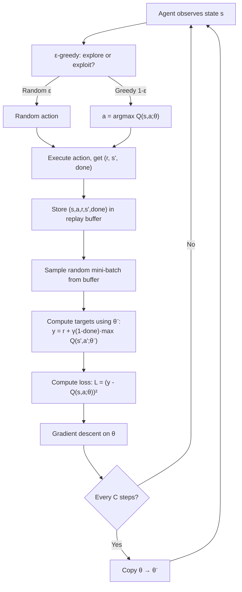

# DQN From Scratch — Interview Deep Dive

> **What this file covers**
> - 🎯 The three innovations that make DQN work: neural network + experience replay + target network
> - 🧮 Full DQN algorithm with loss function, gradient computation, and hyperparameter math
> - ⚠️ Failure modes: divergence without replay, instability without target network, reward scaling issues
> - 📊 Complexity analysis: memory, compute, and sample efficiency
> - 💡 DQN vs tabular Q-learning: what changes and what stays the same
> - 🏭 Hyperparameter selection, training diagnostics, and production deployment

## Brief Restatement

DQN (Deep Q-Network) is Q-learning with three additions that make it stable with a neural network. The neural network replaces the Q-table, enabling generalization to unseen states. Experience replay stores transitions in a buffer and samples random mini-batches, breaking the correlation between consecutive training samples. A target network provides a frozen copy of the Q-network for computing TD targets, preventing the positive feedback loop where updating the network changes the target it is chasing. Together, these three innovations turned an unstable combination into the first algorithm to learn control policies from raw pixels at human-competitive level.

---

## 🧮 Full Mathematical Treatment

### The DQN Loss Function

For a mini-batch of N transitions {(sᵢ, aᵢ, rᵢ, s'ᵢ, doneᵢ)} sampled from the replay buffer:

    L(θ) = (1/N) Σᵢ [ yᵢ - Q(sᵢ, aᵢ; θ) ]²

Where the TD target uses the target network parameters θ⁻:

    yᵢ = rᵢ + γ · (1 - doneᵢ) · max_{a'} Q(s'ᵢ, a'; θ⁻)

Where:
- θ = online network parameters (updated every step)
- θ⁻ = target network parameters (frozen, copied from θ every C steps)
- γ = discount factor (typically 0.99)
- doneᵢ = 1 if s'ᵢ is terminal, 0 otherwise

The (1 - done) term ensures that terminal states have target = r only, with no future value.

### The Semi-Gradient Update

The gradient of the loss with respect to θ:

    ∇_θ L = -(2/N) Σᵢ [ yᵢ - Q(sᵢ, aᵢ; θ) ] · ∇_θ Q(sᵢ, aᵢ; θ)

This is a semi-gradient because we do not differentiate through yᵢ (the target is treated as a constant with respect to θ). The target depends on θ⁻, not θ, which further separates the prediction from the target.

### The Complete DQN Algorithm

    Initialize replay buffer D with capacity N
    Initialize Q-network with random weights θ
    Initialize target network with weights θ⁻ = θ

    For each episode:
        Observe initial state s
        For each step:
            With probability ε: select random action a
            Otherwise: select a = argmax_a Q(s, a; θ)

            Execute action a, observe reward r, next state s', done
            Store transition (s, a, r, s', done) in D

            Sample random mini-batch of transitions from D
            Compute targets: yᵢ = rᵢ + γ(1-doneᵢ) max_{a'} Q(s'ᵢ, a'; θ⁻)
            Compute loss: L = (1/N) Σ (yᵢ - Q(sᵢ, aᵢ; θ))²
            Update θ by gradient descent on L

            Every C steps: θ⁻ ← θ

            s ← s'

### Epsilon-Greedy Exploration Schedule

DQN uses a linearly annealed ε-greedy policy:

    ε(t) = max(ε_end, ε_start - (ε_start - ε_end) · t / T)

Where:
- ε_start = 1.0 (fully random at the beginning)
- ε_end = 0.01 or 0.1 (mostly greedy at the end)
- T = number of steps over which to anneal (typically 1M for Atari)

During evaluation, ε = 0.05 (a small amount of randomness to avoid deterministic loops).

### Worked Example

CartPole environment: state = [cart_pos, cart_vel, pole_angle, pole_vel], actions = {left, right}.

Network: 4 → 64 → 64 → 2 (ReLU activations, no activation on output).

Step 1: State s = [0.02, 0.1, -0.03, -0.2]. Forward pass gives Q(s, left; θ) = 1.5, Q(s, right; θ) = 1.8. With ε = 0.1, probability 0.9 we pick right (higher Q), probability 0.1 we pick random.

Step 2: We pick right. Environment returns r = 1.0, s' = [0.04, 0.15, -0.05, -0.25], done = False. Store (s, left, 1.0, s', False) in replay buffer.

Step 3: Sample mini-batch of 32 transitions from buffer. For one transition in the batch:

    Prediction: Q(s, right; θ) = 1.8
    Next state Q-values (target net): Q(s', left; θ⁻) = 1.2, Q(s', right; θ⁻) = 1.6
    Target: y = 1.0 + 0.99 × max(1.2, 1.6) = 1.0 + 0.99 × 1.6 = 2.584
    TD error: δ = 2.584 - 1.8 = 0.784
    Contribution to loss: 0.784² = 0.615

Step 4: Average loss over all 32 transitions, compute gradient, update θ with Adam optimizer.

Step 5: Every C = 1000 steps, copy θ → θ⁻.

---

## 🗺️ Concept Flow

---

## ⚠️ Failure Modes and Edge Cases

### 1. Training Without Experience Replay

Without replay, the network trains on consecutive transitions. Because consecutive states are nearly identical (the cart moved 0.01 to the right), the mini-batch has almost no diversity. The network overfits to the current region of state space and forgets everything else. Performance oscillates wildly instead of improving.

**Mnih et al. (2015) ablation:** removing experience replay caused DQN to fail on the majority of Atari games. On Breakout, mean score dropped from 401 to under 10.

### 2. Training Without Target Network

Without a target network, the target y = r + γ max Q(s'; θ) changes every time θ is updated. The agent is chasing a moving target. Small overestimations in Q(s') inflate the target, which inflates Q(s), which inflates Q(s') further. This positive feedback loop causes Q-values to grow without bound.

**Mnih et al. (2015) ablation:** removing the target network caused severe instability on most Atari games. Training curves showed diverging Q-values and oscillating performance.

### 3. Reward Scaling Sensitivity

DQN clips all rewards to [-1, +1] in Atari. This is necessary because different games have vastly different reward scales (Pong: ±1 per point, Space Invaders: 5–200 per alien). Without clipping, the loss magnitude varies by orders of magnitude across games, making a single learning rate inappropriate.

**The cost of clipping:** the agent cannot distinguish between a reward of +10 and +1000 — both become +1. This loses information about the relative importance of different rewards. PopArt normalization (Hessel et al., 2019) is a better solution that adaptively normalizes rewards while preserving their relative magnitudes.

### 4. Replay Buffer Size Mismatch

**Too small** (e.g., 1,000 transitions): the buffer does not contain enough diversity. Recent experiences dominate, and the decorrelation benefit of replay is lost. The agent effectively trains on correlated data despite having a buffer.

**Too large** (e.g., 10M transitions with slow policy improvement): the buffer is filled with experiences from very old, suboptimal policies. The agent trains on data that is no longer representative of useful behavior. The policy learned from this stale data may be poor.

**Right size:** typically 100K–1M transitions. Large enough for diversity, small enough that most experiences come from reasonably recent policies.

### 5. Target Network Update Frequency

**Too frequent** (C = 1): equivalent to no target network. Targets change every step, defeating the purpose.

**Too infrequent** (C = 100,000): the target network becomes very stale. The online network may have learned significantly better Q-values, but the target still uses old, inaccurate estimates. This slows learning because the targets are systematically wrong.

**Standard choice:** C = 1,000–10,000 steps for hard updates. Alternatively, use soft (Polyak) updates: θ⁻ ← τθ + (1-τ)θ⁻ with τ = 0.005 at every step. Soft updates avoid the discontinuity of hard copies.

---

## 📊 Complexity Analysis

| Metric | Tabular Q-Learning | DQN |
|--------|-------------------|-----|
| **Memory (Q-function)** | O(\|S\| × \|A\|) | O(\|θ\|) — fixed, independent of \|S\| |
| **Memory (replay buffer)** | N/A | O(N × state_size) |
| **Per-step compute** | O(1) lookup + O(\|A\|) argmax | O(\|θ\|) forward pass + O(\|θ\|) backward pass |
| **Sample efficiency** | Each experience used once | Each experience used ~8 times (replay) |
| **Generalization** | None | Yes — similar states get similar Q-values |

**Concrete numbers for Atari DQN:**
- Network parameters: ~1.7M (CNN architecture)
- Replay buffer: 1M transitions × 84×84×4 bytes = ~28 GB (with frame compression: ~7 GB)
- Training: 50M frames, ~200M gradient steps
- Wall time: ~7 days on a single GPU (2015 hardware), ~1 day on modern hardware
- GPU memory: ~4 GB for network + mini-batch

**Concrete numbers for CartPole DQN:**
- Network parameters: ~4,600 (2-layer FC)
- Replay buffer: 10K transitions × 4 floats = ~160 KB
- Training: ~50K steps
- Wall time: ~2 minutes on CPU

---

## 💡 Design Trade-offs

| Design Choice | DQN's Choice | Alternative | Trade-off |
|--------------|--------------|-------------|-----------|
| **Q-function** | Neural network | Linear FA, decision tree | Expressiveness vs stability |
| **Replay** | Uniform random sampling | Prioritized replay, no replay | Diversity vs relevance of samples |
| **Target update** | Hard copy every C steps | Soft (Polyak) update every step | Stability vs freshness of targets |
| **Exploration** | ε-greedy with linear decay | Boltzmann, UCB, noisy networks | Simplicity vs sample efficiency |
| **Loss function** | MSE (or Huber) | Quantile loss, categorical loss | Simplicity vs distributional richness |
| **Reward handling** | Clip to [-1, +1] | PopArt normalization, no clipping | Generality vs information preservation |

### Hard vs Soft Target Updates

| | Hard Update | Soft Update (Polyak) |
|---|---|---|
| **Formula** | θ⁻ ← θ every C steps | θ⁻ ← τθ + (1-τ)θ⁻ every step |
| **Typical values** | C = 1,000–10,000 | τ = 0.001–0.01 |
| **Stability** | Very stable between copies; jump at copy | Smooth, no discontinuities |
| **Staleness** | Target can be very stale | Target is always recent |
| **Used in** | DQN (Mnih, 2015) | SAC, TD3, DDPG |

### When DQN Fails

| Scenario | Why DQN Struggles | Better Alternative |
|----------|------------------|-------------------|
| Continuous actions | argmax over infinite action space | DDPG, SAC, TD3 |
| Very sparse rewards | Random exploration rarely finds reward | Curiosity-driven exploration, HER |
| Long-horizon credit assignment | γ^100 ≈ 0.37 — discounting kills far-future signal | n-step returns, Monte Carlo |
| Multi-agent environments | Non-stationary from other agents | MADDPG, QMIX |
| Real-time constraint | Forward pass too slow for real-time | Model-based RL, distillation |

---

## 🏭 Production and Scaling Considerations

### Hyperparameter Selection Guide

| Hyperparameter | Typical Range | Effect of Too Small | Effect of Too Large |
|---------------|---------------|--------------------|--------------------|
| Learning rate α | 1e-4 to 1e-3 | Slow convergence | Oscillation, divergence |
| Discount γ | 0.95 to 0.999 | Myopic agent | Slow convergence, high variance |
| Buffer size N | 10K to 1M | Poor diversity | Stale data, high memory |
| Batch size | 32 to 256 | High variance gradients | Slow per-step, diminishing returns |
| Target update C | 1K to 10K | Unstable (like no target net) | Stale targets, slow learning |
| ε decay steps | 10K to 1M | Premature exploitation | Slow to exploit learned policy |
| ε final | 0.01 to 0.1 | Deterministic loops possible | Too much exploration in deployment |

### Training Diagnostics

**What to monitor:**
1. **Mean episode reward** — should increase over training. Smoothed over 100 episodes.
2. **Mean Q-value** — should increase initially, then plateau. If it grows without bound, the triad is causing divergence.
3. **TD error** — should decrease over training. If it stays high or increases, the network is not fitting.
4. **ε value** — should decrease on schedule. Verify the annealing is working.
5. **Buffer fill level** — training should not start until the buffer has enough diversity (typically 10K–50K transitions).

**Red flags:**
- Q-values exceed plausible returns (e.g., max possible return is 500 but Q-values reach 10,000)
- Loss increases over training instead of decreasing
- Episode reward collapses after a period of good performance (catastrophic forgetting)
- All Q-values for different actions are nearly identical (the network is not differentiating between actions)

### Frame Skipping and Stacking (Atari)

DQN uses two additional tricks for Atari that are often conflated:

**Frame skipping (action repeat):** the agent selects an action and that action is repeated for k = 4 consecutive frames. The agent only sees every 4th frame. This reduces the effective decision frequency and speeds up training by 4x.

**Frame stacking:** the agent's observation consists of the last 4 frames it saw (after skipping). This provides motion information — the agent can infer velocity and direction of objects.

These are independent: frame skipping reduces computation, frame stacking adds information.

---

## 🎯 Staff/Principal Interview Depth

### Q1: Walk me through the DQN algorithm. Why does each component exist, and what happens if you remove it?

---
**No Hire**
*Interviewee:* "DQN uses a neural network to learn Q-values and plays Atari games. It uses experience replay and a target network for stability."
*Interviewer:* Correct at the highest level but no mechanism. Cannot explain why replay helps or what the target network does.
*Criteria — Met:* knows the three components / *Missing:* why each exists, what breaks without each, mathematical detail

**Weak Hire**
*Interviewee:* "DQN has three innovations. The neural network replaces the Q-table for generalization. Experience replay stores transitions and samples randomly to break correlation. The target network provides stable targets by freezing a copy of the network. Without replay, the network overfits to recent experiences. Without the target network, the targets move too fast."
*Interviewer:* Good high-level understanding of all three components. Missing the mathematical detail of the loss function, the specific failure mechanism (positive feedback loop), and the ablation results.
*Criteria — Met:* why each component exists, what goes wrong without it / *Missing:* loss function, semi-gradient detail, ablation specifics, hyperparameter sensitivity

**Hire**
*Interviewee:* "The DQN algorithm addresses three problems that prevent naive Q-learning with a neural network from working.

Problem 1 — correlated data: consecutive RL transitions are nearly identical (the cart moved 0.01). Training on correlated data causes the network to overfit to the current region and forget others. Experience replay stores transitions in a buffer of size N (typically 1M) and samples random mini-batches of size 32. This decorrelates the data and approximates the i.i.d. assumption that SGD requires.

Problem 2 — moving targets: the TD target y = r + γ max Q(s'; θ) depends on the same θ being updated. Every gradient step changes both the prediction and the target. The target network θ⁻ is a frozen copy used only for computing targets. It is updated every C steps (typically 10K). Between updates, the target is fixed, so the network can make progress toward it.

Problem 3 — the combination of function approximation, bootstrapping, and off-policy learning (the deadly triad) can cause divergence. Replay and the target network together tame this enough for practical use.

The loss is L = (1/N) Σ (yᵢ - Q(sᵢ, aᵢ; θ))² where yᵢ = rᵢ + γ(1-doneᵢ) max Q(s'ᵢ; θ⁻). This is a semi-gradient update — we do not differentiate through the target.

Mnih et al. showed that removing either component degrades performance significantly. Without replay, Breakout score drops from 401 to under 10. Without the target network, training diverges on most games."
*Interviewer:* Thorough treatment with mechanisms, math, and empirical evidence. Strong hire territory if they added hyperparameter sensitivity or the Polyak averaging alternative.
*Criteria — Met:* three problems with mechanisms, loss function, semi-gradient, ablation results / *Missing:* Polyak averaging alternative, hyperparameter sensitivity analysis

**Strong Hire**
*Interviewee:* [All of Hire, plus:]

"Two additional details that matter in practice:

The ε-greedy schedule is critical. DQN anneals ε from 1.0 to 0.01 over the first 1M frames. Too fast and the agent exploits a suboptimal policy before exploring enough. Too slow and convergence is delayed. Modern alternatives like noisy networks (Fortunato et al., 2018) replace ε-greedy with learned exploration by adding noise to the network weights, which can be more sample-efficient because the exploration is state-dependent.

The target network update has two variants. DQN uses hard updates (copy all weights every C steps), which creates a discontinuity in the target every C steps. SAC and TD3 use soft (Polyak) updates: θ⁻ ← τθ + (1-τ)θ⁻ with τ ≈ 0.005. This eliminates the discontinuity and provides smoother training. The choice between hard and soft updates is mostly empirical — both work, but soft updates are more common in modern algorithms.

The replay buffer has its own trade-off: uniform sampling treats all transitions equally, but some are more informative than others. Prioritized replay (Schaul et al., 2016) samples transitions proportional to |TD error|^α, focusing learning on surprising transitions. This can speed up learning 2-5x but adds complexity: you need a sum-tree data structure for efficient sampling and importance sampling weights to correct the bias from non-uniform sampling."
*Interviewer:* Exceptional coverage. Connects each design choice to alternatives and their trade-offs. The mention of noisy networks, Polyak averaging with specific τ, and the implementation detail of sum-trees for prioritized replay shows deep practical understanding.
*Criteria — Met:* all mechanisms, math, ablations, alternatives, implementation details, trade-off analysis
---

### Q2: How does experience replay break the correlation in training data, and what are its limitations?

---
**No Hire**
*Interviewee:* "Replay stores experiences and samples them randomly, which helps with learning."
*Interviewer:* No explanation of what correlation means or why it matters. No mechanism.
*Criteria — Met:* knows replay exists / *Missing:* what correlation is, why it hurts, how random sampling helps, limitations

**Weak Hire**
*Interviewee:* "Consecutive RL experiences are correlated because the state changes slowly — step t and step t+1 are almost identical. Training on correlated data causes overfitting to recent experiences. Replay stores transitions and samples randomly, so the mini-batch contains diverse experiences from different times and parts of the state space."
*Interviewer:* Correct mechanism. Missing the i.i.d. connection, data reuse benefit, and limitations.
*Criteria — Met:* correlation explanation, why random sampling helps / *Missing:* i.i.d. assumption, data reuse, off-policy issue, buffer sizing

**Hire**
*Interviewee:* "SGD assumes training samples are independent and identically distributed (i.i.d.). In RL without replay, the training data is a single correlated trajectory — each state depends on the previous one. This violates the i.i.d. assumption in two ways: temporal correlation (consecutive states are similar) and non-stationarity (the data distribution shifts as the policy changes).

Replay addresses both. Random sampling from a large buffer means each mini-batch contains transitions from different episodes and time steps — approximately i.i.d. within the buffer. The buffer also enables data reuse: DQN replays each transition approximately 8 times on average (50M training steps / 6.25M buffer capacity), extracting more learning from each environment interaction.

Limitations: (1) the buffer contains off-policy data — transitions generated by old policies. As the policy improves, old transitions become less representative. This is why Q-learning (off-policy) is used, not SARSA (on-policy, which would be incorrect with replay data). (2) The buffer has finite size, so the oldest experiences are overwritten. If the agent needs to remember very old experiences (e.g., a rare event from early training), they may be lost. (3) For on-policy methods like PPO, standard replay is not applicable because the policy gradient requires on-policy data."
*Interviewer:* Thorough treatment of both benefits and limitations. Clear understanding of the off-policy requirement. Would push to Strong Hire with discussion of prioritized replay and importance sampling.
*Criteria — Met:* i.i.d. analysis, data reuse, off-policy limitation, on-policy incompatibility / *Missing:* prioritized replay, importance sampling, buffer data structure

**Strong Hire**
*Interviewee:* [All of Hire, plus:]

"Prioritized replay (Schaul et al., 2016) improves on uniform sampling by prioritizing transitions with high |TD error|. The probability of sampling transition i is P(i) = p_i^α / Σ p_j^α, where p_i = |δ_i| + ε and α controls the prioritization strength (α=0 is uniform, α=1 is full prioritization).

This introduces bias because the expected gradient is no longer an unbiased estimate of the true gradient. The correction uses importance sampling weights: wᵢ = (1/(N·P(i)))^β, normalized by max(wᵢ). β is annealed from a small value to 1.0 over training — initially we tolerate bias for faster learning, eventually we need an unbiased gradient for convergence.

Implementation-wise, prioritized replay requires a sum-tree data structure (a binary tree where each leaf stores a priority and internal nodes store sums) for O(log N) sampling instead of O(N). This adds ~30% overhead but provides 2-5x faster learning on Atari.

One subtle issue: new transitions enter the buffer with maximum priority so they are guaranteed to be sampled at least once. After their first training, their priority is updated to their actual |TD error|. Without this, a transition that enters with low TD error might never be sampled."
*Interviewer:* Complete treatment including the bias-correction mechanism, implementation data structure, and the maximum-priority initialization detail. Shows production-level understanding.
*Criteria — Met:* prioritized replay formula, importance sampling correction, data structure, initialization detail, quantitative speedup
---

### Q3: Why does the target network stabilize training, and how do you choose the update frequency?

---
**No Hire**
*Interviewee:* "The target network is a copy that you update less often. It makes things more stable."
*Interviewer:* No explanation of the mechanism. Cannot describe what instability looks like or why a frozen copy helps.
*Criteria — Met:* knows target network is a copy / *Missing:* mechanism, what instability looks like, how frozen copy helps, update frequency considerations

**Weak Hire**
*Interviewee:* "Without a target network, the TD target y = r + γ max Q(s'; θ) changes every time θ is updated. The agent chases a moving target. The target network θ⁻ is frozen for C steps, so the target stays fixed and the online network can converge toward it."
*Interviewer:* Correct mechanism. Missing the positive feedback loop detail, the hard vs soft update comparison, and the sensitivity analysis.
*Criteria — Met:* moving target problem, frozen copy solution / *Missing:* positive feedback loop, hard vs soft updates, update frequency analysis

**Hire**
*Interviewee:* "The instability has a specific mechanism: when Q(s; θ) is updated, the target for nearby states changes because they share parameters. If the update increases Q(s₁), and s₂ is nearby, Q(s₂) also increases. When s₂ appears in a target computation max Q(s₂; θ), the target is inflated. Training on this inflated target further increases Q, creating a positive feedback loop that can cause divergence.

The target network breaks this loop by using a separate set of weights θ⁻ that do not change during training steps. The target y = r + γ max Q(s'; θ⁻) is a fixed function of s' for C steps. The online network θ can make progress toward this fixed target. After C steps, θ⁻ is updated to the current θ, setting a new (better) target.

For the update frequency C: too small (C = 1) gives no benefit — it is equivalent to no target network. Too large makes the target stale — the target network produces inaccurate Q-values that slow learning. DQN uses C = 10,000. The optimal C depends on the learning rate and the rate of policy improvement. A rough heuristic: C should be large enough that the online network has meaningfully improved since the last update, but not so large that the target network's Q-values are dramatically wrong."
*Interviewer:* Strong explanation of the feedback mechanism and practical guidance on C. Would reach Strong Hire with the soft update analysis and connection to other algorithms.
*Criteria — Met:* feedback loop mechanism, practical guidance on C / *Missing:* soft updates, mathematical analysis of staleness, connection to other algorithms

**Strong Hire**
*Interviewee:* [All of Hire, plus:]

"The alternative to hard updates is soft (Polyak) averaging: θ⁻ ← τθ + (1-τ)θ⁻ at every step, with τ ∈ [0.001, 0.01]. This eliminates the discontinuity of hard copies — the target changes smoothly and continuously. The effective lag of the target network is approximately 1/τ steps (for τ = 0.005, the target reflects what the online network was approximately 200 steps ago).

The mathematical justification: with a fixed target y, minimizing (y - Q(s; θ))² is a standard supervised learning problem that converges. With a slowly moving target, convergence is still possible if the target moves slower than the learning — the online network can track the target. The target network ensures this by providing a target that changes at rate 1/C (hard) or τ (soft), while the online network changes at rate α (the learning rate).

The condition for stability is roughly: the target should change much slower than the prediction. For DQN: α = 1e-4, C = 10,000, so the target changes 1e-4 × 10,000 = 1 'unit' of change per target update cycle. The prediction changes continuously. As long as the prediction converges to the target between updates, the system is stable.

Modern algorithms overwhelmingly prefer soft updates: SAC uses τ = 0.005, TD3 uses τ = 0.005, DDPG uses τ = 0.001. Hard updates are mainly historical — they were in the original DQN paper because Polyak averaging had not yet been adopted in deep RL."
*Interviewer:* Outstanding analysis connecting the lag interpretation of τ, the convergence condition, and the historical evolution of the technique. Staff-level understanding of the underlying dynamics.
*Criteria — Met:* both update types, mathematical stability condition, lag interpretation, historical context, algorithm comparison
---

---

## Key Takeaways

🎯 1. DQN = Q-learning + neural network + experience replay + target network — removing any component causes failure
   2. The loss function is MSE between Q(s,a;θ) and the target r + γ(1-done)·max Q(s',a';θ⁻), treated as a semi-gradient (target detached)
🎯 3. Experience replay breaks temporal correlation and enables data reuse (~8x per transition), but introduces off-policy data
   4. The target network prevents the positive feedback loop: Q overestimation → inflated target → higher Q → higher target
⚠️ 5. Key failure modes: no replay → catastrophic forgetting; no target network → diverging Q-values; wrong buffer size → stale or correlated data
   6. Hard target update (every C steps) vs soft update (Polyak, every step with τ) — soft is smoother and preferred in modern algorithms
   7. DQN requires careful hyperparameter tuning: learning rate, buffer size, target update frequency, ε schedule all interact
🎯 8. DQN only works with discrete actions — continuous action spaces require DDPG, SAC, or TD3 (which extend the DQN ideas)
