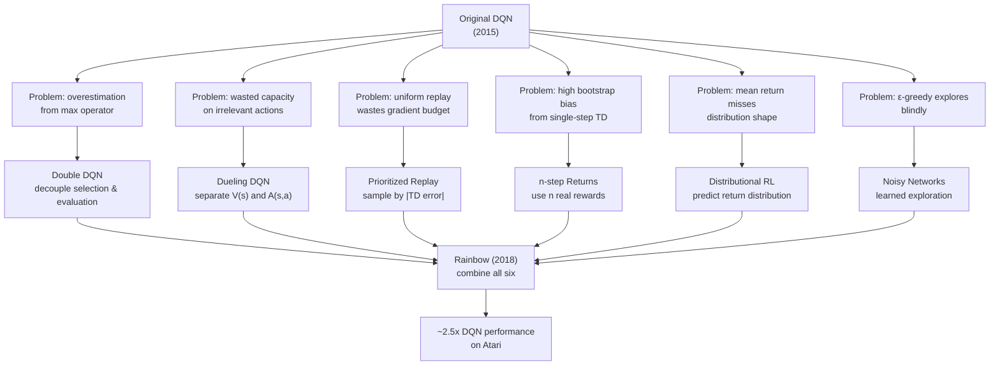

# DQN Improvements — Interview Deep Dive

> **What this file covers**
> - 🎯 Double DQN: why the max operator overestimates and how decoupling selection from evaluation fixes it
> - 🧮 Dueling DQN: V(s) + A(s,a) decomposition with the centering trick
> - ⚠️ Overestimation cascades, advantage collapse, and when improvements hurt
> - 📊 Rainbow: which of the six components matter most (ablation results)
> - 💡 Double vs Dueling vs Prioritized: when each improvement gives the biggest gain
> - 🏭 Combining improvements: interaction effects and production recommendations

## Brief Restatement

The original DQN had systematic flaws. It overestimated Q-values because the max operator selects the action with the luckiest noise. It wasted capacity learning state values in situations where the action choice did not matter. Its exploration was random and state-independent. Between 2015 and 2017, researchers identified these flaws and designed targeted fixes. Double DQN decouples action selection from evaluation, reducing overestimation. Dueling DQN separates Q into state value V(s) and advantage A(s,a), improving efficiency. Rainbow (2017) combined six improvements into one algorithm, achieving roughly 2.5x the performance of the original DQN on Atari.

---

## 🧮 Full Mathematical Treatment

### The Overestimation Problem

In standard DQN, the target is:

    y = r + γ · max_{a'} Q(s', a'; θ⁻)

The max operator selects the action with the highest Q-value estimate. When Q-values have estimation noise (which they always do — the neural network is an approximation), the max selects the action with the most positive noise, not necessarily the truly best action.

Formally, for random variables X₁, X₂, ..., Xₙ with means μ₁, μ₂, ..., μₙ and independent noise:

    E[max(X₁, ..., Xₙ)] ≥ max(μ₁, ..., μₙ)

The gap increases with the number of actions (more chances for lucky noise) and with the noise variance (larger noise = larger upward bias).

### Double DQN Fix

Van Hasselt et al. (2016) proposed using two different networks for two different jobs:

    Standard DQN target:  y = r + γ · Q(s', argmax_{a'} Q(s', a'; θ⁻); θ⁻)
                           ↑ same network selects AND evaluates

    Double DQN target:    y = r + γ · Q(s', argmax_{a'} Q(s', a'; θ); θ⁻)
                           ↑ online network selects, target network evaluates

The online network θ selects which action looks best: a* = argmax_{a'} Q(s', a'; θ). The target network θ⁻ evaluates that action: Q(s', a*; θ⁻). Because θ and θ⁻ have different weights (different noise), even if θ selects a suboptimal action due to noise, θ⁻'s evaluation of that action is not biased upward by the same noise.

**The code change is one line:**

    # Standard DQN
    target = reward + gamma * target_net(next_state).max(dim=1)[0]

    # Double DQN
    best_actions = online_net(next_state).argmax(dim=1)
    target = reward + gamma * target_net(next_state).gather(1, best_actions.unsqueeze(1)).squeeze()

### Why Double DQN Reduces Overestimation

Consider two actions with true values Q*(a₁) = 5.0, Q*(a₂) = 4.0. The online network estimates Q_θ(a₁) = 5.5, Q_θ(a₂) = 4.8 (both overestimated). The target network estimates Q_{θ⁻}(a₁) = 4.8, Q_{θ⁻}(a₂) = 4.3.

**Standard DQN:** target uses max Q_{θ⁻} = max(4.8, 4.3) = 4.8. If the target network happens to overestimate a₁, the target is 4.8 (biased up from 5.0).

**Double DQN:** online selects argmax Q_θ = a₁ (correct selection). Target evaluates Q_{θ⁻}(a₁) = 4.8. The target is 4.8, which is close to the true value 5.0 — the overestimation from the target network is not amplified by the max.

Now suppose online makes a wrong selection: Q_θ(a₁) = 4.2, Q_θ(a₂) = 4.8 → selects a₂. Target evaluates Q_{θ⁻}(a₂) = 4.3, close to the true Q*(a₂) = 4.0. The target is 4.3, which is only slightly overestimated. The key: even when the selection is wrong, the evaluation does not compound the error.

### Dueling DQN Architecture

Wang et al. (2016) decomposed Q(s, a) into two parts:

    Q(s, a) = V(s) + A(s, a)

Where:
- V(s) is the state value — how good is this state overall, regardless of action
- A(s, a) is the advantage — how much better is this action compared to the average action in this state

The network splits after the shared convolutional layers into two streams:
- One stream outputs a single scalar V(s)
- The other stream outputs |A| values, one per action: A(s, a₁), A(s, a₂), ...

They are combined:

    Q(s, a) = V(s) + A(s, a) - mean_a(A(s, a))

### The Centering Trick

Why subtract mean_a(A(s, a))? Without it, V(s) and A(s, a) are not identifiable. The network could put any constant into V and subtract it from all A values, and Q would be the same. This non-identifiability makes training unstable.

Subtracting the mean forces A to sum to zero across actions:

    Σ_a [A(s, a) - mean_a(A(s, a))] = 0

This ensures that V(s) represents the actual state value (the average Q across actions), and A(s, a) represents the deviation from that average.

An alternative is to subtract max_a(A(s, a)) instead of mean. This forces the best action to have A = 0, making V(s) = Q(s, a*). The mean version is slightly more stable in practice.

### Worked Example: Dueling DQN

State: agent is in a hallway with walls on both sides. 3 actions: left, right, forward.

The shared CNN features detect the hallway shape.

**Value stream:** V(s) = 3.0 (this is a decent state — not terminal, not dangerous)

**Advantage stream (raw):** A_raw(left) = -2.0, A_raw(right) = -1.5, A_raw(forward) = 1.5

**Mean:** mean(A_raw) = (-2.0 + -1.5 + 1.5) / 3 = -0.667

**Centered advantages:** A(left) = -2.0 - (-0.667) = -1.333
                          A(right) = -1.5 - (-0.667) = -0.833
                          A(forward) = 1.5 - (-0.667) = 2.167

**Q-values:** Q(left) = 3.0 + (-1.333) = 1.667
              Q(right) = 3.0 + (-0.833) = 2.167
              Q(forward) = 3.0 + 2.167 = 5.167

The value stream V(s) = 3.0 captures that the state is moderately good. The advantage stream captures that going forward is much better than going sideways. If the agent encounters a similar state but with different available actions, V(s) is already learned — only the advantages need adjustment.

### Rainbow: Six Improvements Combined

Hessel et al. (2018) combined six independent improvements:

| Component | What It Fixes | Reference |
|-----------|--------------|-----------|
| Double DQN | Overestimation from max operator | Van Hasselt et al., 2016 |
| Dueling architecture | Inefficient learning when action does not matter | Wang et al., 2016 |
| Prioritized replay | Uniform sampling wastes gradient on easy transitions | Schaul et al., 2016 |
| n-step returns | Single-step bootstrap has high bias | Sutton, 1988 |
| Distributional RL | Learning mean misses return variance | Bellemare et al., 2017 |
| Noisy networks | ε-greedy exploration is state-independent | Fortunato et al., 2018 |

**n-step returns:** instead of bootstrapping after 1 step (y = r + γ max Q), use n real rewards before bootstrapping:

    y = r_t + γr_{t+1} + γ²r_{t+2} + ... + γⁿ max_{a'} Q(s_{t+n}, a'; θ⁻)

This reduces the reliance on the (potentially inaccurate) Q-estimate. With n = 3, three real rewards anchor the target before bootstrapping.

**Distributional RL:** instead of predicting E[R] (the mean return), predict the full distribution of returns. The Q-value is represented as a distribution over a set of atoms z₁, ..., z_N, each with probability p_i. This captures risk-awareness and multimodal returns.

**Noisy networks:** replace ε-greedy with learned noise in the network weights. Each weight θ is replaced by μ + σ · ε, where μ and σ are learnable and ε is random noise. The exploration is state-dependent: the agent explores more in unfamiliar states (high σ) and exploits in familiar ones (low σ).

### Rainbow Ablation Results

Hessel et al. ablated each component from the full Rainbow agent:

| Removed Component | Performance Drop | Interpretation |
|-------------------|-----------------|----------------|
| Prioritized replay | Largest drop | Most important single component |
| n-step returns | Large drop | Bootstrap bias reduction is critical |
| Distributional RL | Large drop | Return distribution helps significantly |
| Double DQN | Moderate drop | Overestimation matters but is partially handled by distributional RL |
| Dueling | Small drop | Helpful but less critical |
| Noisy nets | Small drop | ε-greedy is a reasonable baseline |

The three most important components are prioritized replay, n-step returns, and distributional RL. Double DQN and Dueling provide smaller but consistent improvements.

---

## 🗺️ Concept Flow

---

## ⚠️ Failure Modes and Edge Cases

### 1. Overestimation Cascade

Even with Double DQN, overestimation can still occur if both networks agree on the wrong action. If θ and θ⁻ are correlated (they are — θ⁻ is a delayed copy of θ), they may share biases. Double DQN reduces overestimation but does not eliminate it.

**When it is worst:** early in training when Q-values are poorly calibrated. Both networks may agree on an overestimated action simply because neither has seen enough data to correct the bias.

**Diagnostic:** plot estimated Q-values against actual discounted returns from evaluation episodes. If Q-values consistently exceed actual returns, overestimation is still present.

### 2. Advantage Collapse in Dueling DQN

If the advantage stream outputs near-zero values for all actions, the network has collapsed to V(s) only. This happens when the gradient through the advantage stream vanishes — the network finds it easier to learn V(s) alone.

**When it happens:** tasks where one action dominates (e.g., 90% of the time, the best action is "do nothing"). The advantage stream learns that all advantages are near zero, and the gradient signal through the advantage stream becomes tiny.

**Diagnostic:** monitor the variance of advantage values across actions. If it drops near zero, the advantage stream is collapsed.

**Fix:** ensure the advantage stream has sufficient capacity (same width as the value stream). Some implementations use separate learning rates for the two streams.

### 3. n-step Return Distribution Mismatch

n-step returns use real rewards from n consecutive steps, then bootstrap. But these n steps were generated by an old policy (stored in the replay buffer). If the current policy would take different actions, the n-step return is a biased estimate.

**Severity:** increases with n and with how fast the policy changes. For n = 1 (standard DQN), the issue does not exist. For n = 3 (Rainbow default), the bias is usually tolerable. For n = 20, the bias can be severe.

**Mitigation:** importance sampling correction (multiply by the product of policy ratios for n steps), but this has high variance. In practice, n = 3–5 balances bias and variance.

### 4. Distributional RL Atom Count Sensitivity

The C51 algorithm represents the return distribution with 51 atoms evenly spaced between V_min and V_max. If V_min and V_max are set incorrectly:

- **Too narrow:** the true distribution extends beyond the atoms, and extreme returns are clipped. The agent underestimates rare, high-value outcomes.
- **Too wide:** the atoms are spread too thin, and the distribution is poorly resolved. The agent's predictions are imprecise.

**Standard values for Atari:** V_min = -10, V_max = 10 (after reward clipping to [-1, +1] and with γ = 0.99, the return is bounded by 1/(1-γ) = 100, but in practice returns rarely exceed 10).

### 5. Noisy Networks and Deterministic Environments

Noisy networks add learned noise to weights for exploration. In deterministic environments where the optimal policy is deterministic, the noise must eventually shrink to zero. The network can learn to set σ → 0 for all weights, effectively becoming deterministic. This works, but the convergence to zero noise can be slow, especially if the initial σ is large.

---

## 📊 Complexity Analysis

| Method | Extra Parameters | Extra Memory | Extra Compute | Improvement |
|--------|-----------------|--------------|---------------|-------------|
| Double DQN | 0 | 0 | ~0 (1 extra argmax) | Moderate |
| Dueling DQN | ~same total | ~0 | ~0 (different architecture, same FLOPs) | Small-Moderate |
| Prioritized replay | 0 | O(N) sum-tree | O(log N) per sample | Large |
| n-step returns | 0 | O(n) per transition | O(n) per target | Large |
| Distributional RL | ×51 output size | ×51 output memory | ×51 output compute | Large |
| Noisy networks | ×2 (μ + σ per weight) | ×2 | ×2 (sample noise) | Small |
| **Rainbow (all)** | **~3× DQN** | **~3× DQN** | **~3× DQN** | **~2.5× score** |

**DQN parameters:** ~1.7M → **Rainbow parameters:** ~5M

The overhead is roughly 3x in compute and memory. The return is roughly 2.5x in performance. This is a favorable trade-off for most applications.

---

## 💡 Design Trade-offs

### Which Improvements to Use

| Improvement | Implement When | Skip When |
|------------|----------------|-----------|
| Double DQN | Always — zero cost, consistent benefit | Never (no reason to skip) |
| Dueling DQN | Many actions or states where action does not matter | Few actions (2-3), every action matters |
| Prioritized replay | TD errors vary widely; sample efficiency matters | Compute-constrained; simple environments |
| n-step returns | Episodes are long; rewards are sparse | Very stochastic environments; short episodes |
| Distributional RL | Need risk-awareness; returns are multimodal | Simplicity is priority; compute-constrained |
| Noisy networks | ε-greedy performs poorly; need state-dependent exploration | ε-greedy works well; implementation simplicity |

### When Double DQN Does Not Help

Double DQN reduces overestimation. If the original DQN does not overestimate (which can happen in simple environments with few actions and low noise), Double DQN provides no benefit. In such cases, both methods perform identically because the online and target networks agree on the best action.

### Dueling vs Standard Architecture

| Scenario | Better Architecture | Why |
|----------|-------------------|-----|
| Many similar actions (10+ actions, most equivalent) | Dueling | V(s) captures the common value; advantages are small |
| Few distinct actions (2-3, each very different) | Standard | No advantage to separating V and A |
| State value varies a lot, action value varies little | Dueling | V stream learns the important variation |
| State value is constant, action value varies a lot | Standard | V stream adds nothing; advantages do all the work |

---

## 🏭 Production and Scaling Considerations

### Implementation Priority

For a production DQN system, implement improvements in this order:

1. **Double DQN** — one line of code, no cost, always helps
2. **Dueling DQN** — small architecture change, helps with many actions
3. **Prioritized replay** — significant implementation effort (sum-tree), significant benefit
4. **n-step returns** — moderate implementation effort, significant benefit
5. **Distributional RL / Noisy nets** — high implementation effort, moderate benefit

Most production systems use Double + Dueling + Prioritized (sometimes called D3QN) as a pragmatic middle ground between DQN and full Rainbow.

### n-step Return Implementation Detail

Storing n-step returns in a replay buffer requires care. Each transition must include the n-step discounted reward and the state n steps later:

    R_n = r_t + γr_{t+1} + ... + γ^{n-1}r_{t+n-1}
    s_{t+n} = state n steps later

If the episode ends before n steps, R_n includes only rewards up to termination and s_{t+n} is the terminal state.

This requires a small buffer (size n) to accumulate rewards before inserting the complete n-step transition into the main replay buffer.

### Distributional RL in Practice

C51 (Categorical DQN) uses 51 atoms. The output layer has 51 × |A| neurons instead of |A|. The loss is the cross-entropy between the projected Bellman distribution and the predicted distribution, not MSE.

QR-DQN (Quantile Regression DQN) is an alternative that learns quantiles of the return distribution instead of fixed atoms. It avoids the need to set V_min and V_max and is sometimes preferred in practice for its simplicity.

---

## 🎯 Staff/Principal Interview Depth

### Q1: Explain the overestimation bias in DQN and how Double DQN fixes it.

---
**No Hire**
*Interviewee:* "DQN overestimates Q-values because neural networks are noisy. Double DQN uses two networks to reduce this."
*Interviewer:* Identifies the problem but does not explain the mechanism. Does not know why the max operator specifically causes overestimation or how two networks help.
*Criteria — Met:* knows overestimation exists / *Missing:* max operator mechanism, E[max(X)] ≥ max(E[X]), decoupling selection from evaluation, code-level change

**Weak Hire**
*Interviewee:* "The max over noisy Q-values is biased upward because it selects the action with the most positive noise. Double DQN fixes this by using the online network to select the best action and the target network to evaluate it. Because they have different noise, the overestimation is reduced."
*Interviewer:* Correct mechanism. Missing the mathematical formalization, worked example, and understanding of when Double DQN does not help.
*Criteria — Met:* max bias mechanism, decoupling idea / *Missing:* mathematical inequality, worked example, limitations

**Hire**
*Interviewee:* "The overestimation comes from a mathematical property: E[max(X₁,...,Xₙ)] ≥ max(E[X₁],...,E[Xₙ]) whenever the Xᵢ have noise. The gap grows with the number of actions and the noise variance. In DQN, Q-values are noisy estimates, and the max selects the one with the luckiest noise. This overestimated value becomes the training target, which trains the network to predict even higher values — a positive feedback loop.

Double DQN decouples selection from evaluation. The online network θ selects the action: a* = argmax Q(s'; θ). The target network θ⁻ evaluates it: y = r + γ Q(s', a*; θ⁻). Because θ and θ⁻ have different weights, even if θ picks the wrong action (due to its noise), θ⁻'s evaluation is not inflated by the same noise.

The code change is minimal: replace `target_net(s').max(1)[0]` with `target_net(s').gather(1, online_net(s').argmax(1))`.

Van Hasselt et al. showed that Double DQN reduces measured overestimation by 50-80% on most Atari games and improves final scores on many games."
*Interviewer:* Thorough treatment with the mathematical inequality, the feedback loop, the code change, and empirical evidence. Would push to Strong Hire with the interaction with distributional RL and edge cases.
*Criteria — Met:* mathematical inequality, feedback loop, code change, empirical evidence / *Missing:* interaction with other improvements, edge cases, theoretical analysis

**Strong Hire**
*Interviewee:* [All of Hire, plus:]

"An interesting nuance: Double DQN still overestimates, just less. The overestimation is not zero because θ and θ⁻ are correlated — θ⁻ is a delayed copy of θ, so they share structural biases. The overestimation is approximately E[max] - max[E] ≈ σ²(n-1)/n for n actions with noise variance σ², where Double DQN reduces σ² by having two independent noise sources.

The interaction with distributional RL is notable: C51 (distributional RL) implicitly reduces overestimation because it learns the full distribution rather than just the mean. When Rainbow ablates Double DQN, the performance drop is moderate — suggesting that distributional RL partially substitutes for Double DQN's overestimation correction.

There is also a connection to underestimation: if Double DQN over-corrects, the agent can underestimate Q-values, leading to overly conservative behavior. TD3 deliberately uses underestimation (clipped double Q-learning — take the min of two critics) as a design choice, arguing that underestimation is safer than overestimation because overestimated states attract the policy while underestimated states are simply avoided. This is a deliberate bias toward safety."
*Interviewer:* Exceptional depth. The correlation analysis, the distributional RL interaction, and the connection to TD3's deliberate underestimation show architectural understanding across the field.
*Criteria — Met:* mathematical analysis, correlation issue, distributional RL interaction, TD3 connection, bias trade-off
---

### Q2: What is the Dueling DQN architecture and why is the centering trick necessary?

---
**No Hire**
*Interviewee:* "Dueling DQN has two heads: one for value and one for advantage. They are added together to get Q."
*Interviewer:* Knows the architecture exists but does not understand why separating V and A is useful or why centering is needed.
*Criteria — Met:* knows the two-stream structure / *Missing:* why separation helps, centering trick, identifiability problem, when Dueling is most useful

**Weak Hire**
*Interviewee:* "Dueling DQN separates Q(s,a) into V(s) + A(s,a). V captures how good the state is regardless of action. A captures how much better each action is. This is efficient because in many states the action does not matter — V captures the value without needing to learn advantages for every action. They subtract the mean of A to make it identifiable."
*Interviewer:* Correct high-level understanding. Missing the mathematical identifiability argument and when Dueling is most beneficial.
*Criteria — Met:* separation purpose, centering mentioned / *Missing:* identifiability math, centering alternatives, concrete scenarios

**Hire**
*Interviewee:* "Q(s,a) = V(s) + A(s,a) - mean_a(A(s,a)).

The centering trick solves an identifiability problem. Without it, you can add any constant c to V(s) and subtract c from all A(s,a) values — Q is unchanged but V and A are different. This non-identifiability means the network can drift: V absorbs advantages, A absorbs state value, and the gradient signal is noisy.

Subtracting mean_a(A) forces the advantages to sum to zero. This uniquely determines V(s) as the average Q across actions: V(s) = (1/|A|) Σ_a Q(s,a). Now V and A have a clear, stable interpretation.

The alternative centering method subtracts max_a(A) instead of mean_a(A). This forces the best action to have A = 0 and makes V(s) = max_a Q(s,a) = Q(s, a*). The mean version is preferred because it provides more stable gradients — the max is a non-smooth operation that can cause gradient jumps.

Dueling is most beneficial when many actions have similar values — the network can learn V(s) once and only needs to distinguish the advantages. In Atari Enduro (driving game), many states require no action (the car is safely in the lane), and V(s) captures most of the value."
*Interviewer:* Strong mathematical understanding of identifiability, both centering alternatives, and a concrete example.
*Criteria — Met:* identifiability math, both centering methods, gradient stability reasoning, concrete example / *Missing:* gradient flow analysis, architecture implementation detail

**Strong Hire**
*Interviewee:* [All of Hire, plus:]

"The gradient flow through the two streams is worth analyzing. The V stream receives gradient from every action's Q-value because V(s) contributes to all Q(s, a). The A stream receives gradient only from the specific action in the loss. This means V is updated more frequently than any individual advantage, which is desirable — V captures the common component that applies to all actions.

However, this asymmetry can cause the V stream to dominate. If the V stream learns a good V(s) quickly, the remaining advantages are small, and the gradient through the A stream becomes tiny. This is the advantage collapse failure mode. Monitoring the ratio Var(A) / Var(V) is a useful diagnostic — if it drops below 0.01, the A stream may be collapsed.

Implementation detail: the two streams split after the last shared layer (in DQN, after Conv3). The V stream has its own FC layer(s) outputting a scalar. The A stream has its own FC layer(s) outputting |A| values. They are combined in a custom aggregation layer. The total parameter count is similar to standard DQN because the shared layers dominate.

An architectural connection: Dueling DQN's separation of V and A is conceptually similar to the actor-critic separation in policy gradient methods. The critic estimates V(s) (or Q(s,a)), and the actor learns the policy (which action is best). The advantage A(s,a) = Q(s,a) - V(s) is exactly the advantage function used in GAE (Generalized Advantage Estimation) for policy gradient methods. Dueling DQN brings this concept into the value-based setting."
*Interviewer:* Outstanding analysis. The gradient flow asymmetry, the collapse diagnostic, the implementation detail, and the connection to actor-critic methods show deep architectural thinking.
*Criteria — Met:* gradient flow analysis, collapse diagnostic, implementation detail, actor-critic connection, comprehensive understanding
---

### Q3: If you could only use three of the six Rainbow components, which three would you choose and why?

---
**No Hire**
*Interviewee:* "I would use Double DQN, Dueling, and experience replay because they are the most well-known."
*Interviewer:* Selection based on familiarity, not analysis. Does not reference the ablation study or consider which problems are most important to solve.
*Criteria — Met:* none / *Missing:* ablation evidence, problem severity analysis, interaction effects

**Weak Hire**
*Interviewee:* "Based on the Rainbow paper's ablation, prioritized replay, n-step returns, and distributional RL had the largest individual impact when removed. So I would choose those three."
*Interviewer:* Correctly references the ablation results. Missing the reasoning for why these three are most impactful and whether they interact.
*Criteria — Met:* knows ablation results / *Missing:* reasoning for each, interaction effects, practical considerations

**Hire**
*Interviewee:* "I would choose prioritized replay, n-step returns, and distributional RL, based on the Rainbow ablation study which showed these three have the largest impact when removed.

Prioritized replay: focuses the gradient budget on surprising transitions (high |TD error|). Without it, the agent wastes many gradient steps on transitions it already predicts well. The 2-5x speedup is the single biggest gain.

n-step returns: reduces bootstrap bias by using n real rewards before relying on the (approximate) Q-estimate. This makes the targets more accurate, especially early in training when Q-values are poorly calibrated. The bias-variance trade-off is favorable for n = 3-5.

Distributional RL: learning the full return distribution provides richer gradient signal than learning just the mean. It also implicitly helps with overestimation (partially substituting for Double DQN) and captures risk-relevant information.

I would skip Double DQN (distributional RL partially covers it), Dueling (small gain), and Noisy nets (ε-greedy is a reasonable baseline).

However, I would add Double DQN anyway because it costs literally nothing — one line of code with zero overhead. So in practice, my three 'investments' would be prioritized replay, n-step returns, distributional RL, with Double DQN as a free bonus."
*Interviewer:* Strong selection with reasoning for each, plus the practical observation about Double DQN being free. Would push to Strong Hire with interaction analysis and deployment considerations.
*Criteria — Met:* ablation-informed selection, reasoning for each, practical observation / *Missing:* interaction effects, deployment complexity, alternative configurations

**Strong Hire**
*Interviewee:* [All of Hire, plus:]

"The interaction effects matter. The ablation removes one component at a time, but the components interact:

1. Prioritized replay + n-step returns: prioritized replay focuses on high TD-error transitions. n-step returns make TD errors more accurate (less bootstrap bias). Together, the priorities are more meaningful — they reflect actual surprise rather than bootstrap noise. This is a positive interaction.

2. Distributional RL + Double DQN: distributional RL reduces overestimation because the full distribution is more informative than the mean. This partially substitutes for Double DQN. Removing both would be worse than removing either alone — they have overlapping function.

3. n-step returns + distributional RL: the distributional Bellman operator with n-step returns is well-defined and avoids the 'distribution projection' issue that arises with 1-step categorical updates.

For deployment, there's a complexity gradient:
- D3QN (Double + Dueling + standard replay): minimal complexity, good improvement
- D3QN + prioritized replay: moderate complexity, significant improvement
- Full Rainbow: high complexity, best performance but harder to debug

If sample efficiency is critical (expensive simulator, real-world environment), go full Rainbow. If wall-clock time matters more than sample efficiency, D3QN may be better because the sum-tree and distributional output add compute overhead.

One more consideration: for continuous action spaces (the vast majority of robotics problems), none of the DQN improvements apply directly. SAC or TD3 are the right algorithms, and they incorporate analogous ideas (twin critics ≈ Double DQN, soft target updates ≈ target network) but with a fundamentally different architecture."
*Interviewer:* Exceptional analysis. The interaction effects, deployment complexity gradient, and the pivot to continuous action spaces show staff-level systems thinking and practical judgment.
*Criteria — Met:* interaction effects, complexity gradient, deployment considerations, continuous action space context, comprehensive judgment
---

---

## Key Takeaways

🎯 1. Double DQN decouples action selection (online net) from evaluation (target net), reducing overestimation. Code change: one line. Cost: zero.
   2. Dueling DQN decomposes Q(s,a) = V(s) + A(s,a) - mean(A). The centering trick (subtract mean) is needed for identifiability.
🎯 3. Rainbow combines six improvements for ~2.5x DQN performance. The three most impactful: prioritized replay, n-step returns, distributional RL.
   4. Overestimation cascades: max over noisy Q → inflated target → higher Q → higher target. Double DQN breaks the chain.
⚠️ 5. Advantage collapse: if the A stream outputs near-zero values, the Dueling architecture degenerates to V-only. Monitor Var(A)/Var(V).
   6. n-step returns reduce bootstrap bias but introduce off-policy bias. n = 3 is the standard compromise.
   7. For production: Double DQN (free) + Dueling (cheap) + Prioritized replay (significant effort, significant gain) is the pragmatic configuration.
🎯 8. DQN improvements only apply to discrete actions. Continuous action spaces require fundamentally different algorithms (SAC, TD3) that incorporate analogous ideas.
