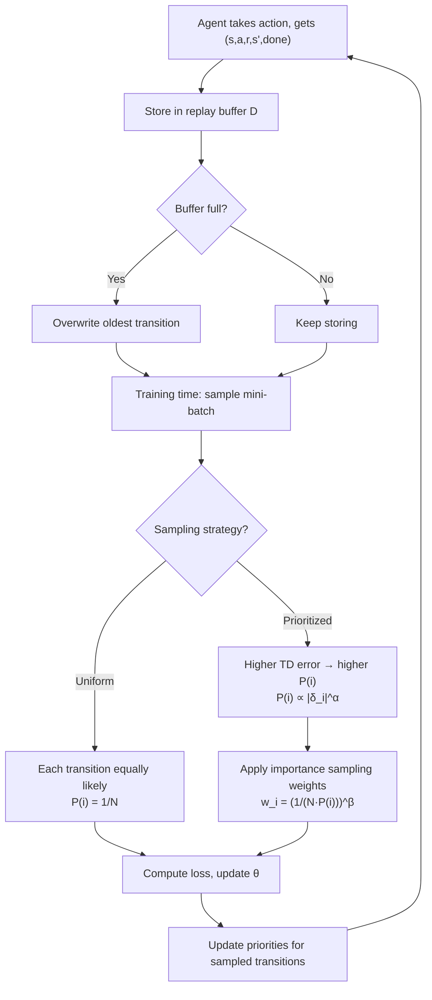

# Experience Replay — Interview Deep Dive

> **What this file covers**
> - 🎯 Why random sampling from a buffer transforms an unstable learning problem into a stable one
> - 🧮 Uniform replay math, prioritized replay with importance sampling correction
> - ⚠️ Off-policy staleness, buffer overflow, on-policy incompatibility
> - 📊 Memory costs, sampling complexity, and data reuse efficiency
> - 💡 Uniform vs prioritized replay vs hindsight experience replay
> - 🏭 Buffer implementation: circular buffer, sum-tree, compression strategies

## Brief Restatement

Experience replay stores the agent's transitions (s, a, r, s', done) in a fixed-size buffer and samples random mini-batches for training instead of using transitions in sequential order. This breaks the temporal correlation between consecutive experiences and enables data reuse — each transition can be sampled and learned from multiple times. These two properties transform an unstable training process into one where SGD's i.i.d. assumption is approximately satisfied.

---

## 🧮 Full Mathematical Treatment

### The Correlation Problem

In online RL without replay, the training data at time t is the single transition (s_t, a_t, r_t, s_{t+1}). Consecutive transitions are correlated because:

    s_{t+1} = f(s_t, a_t)    (deterministic dynamics)
    or
    s_{t+1} ~ P(·|s_t, a_t)  (stochastic dynamics)

Either way, s_t and s_{t+1} are highly dependent. For CartPole, if the cart is at position 1.0 at time t, it is at approximately 1.01 at time t+1. The gradient computed from (s_t, a_t) and the gradient from (s_{t+1}, a_{t+1}) point in nearly the same direction, causing the network to overfit to the current region and forget the rest.

SGD convergence theory requires:

    E[g_t | θ_t] = ∇L(θ_t)    (unbiased gradient)
    Cov(g_t, g_{t+1}) ≈ 0      (independent samples)

Sequential RL data violates the second condition.

### Uniform Experience Replay

The replay buffer D stores the most recent N transitions. At each training step, a mini-batch of size B is sampled uniformly at random:

    {(s_i, a_i, r_i, s'_i, done_i)} ~ Uniform(D),  i = 1, ..., B

The key property: if the buffer is large and contains transitions from many episodes and time steps, then two randomly sampled transitions are approximately independent. The mini-batch approximates an i.i.d. sample from the distribution of all visited state-action pairs.

### Data Reuse Factor

Each transition stays in the buffer until it is overwritten (after N new transitions). The expected number of times a transition is sampled before being overwritten:

    E[number of samples] = (training steps while in buffer) × (B / N)

For DQN on Atari: N = 1M, B = 32, training frequency = 1 step per frame, buffer lifetime = 1M frames:

    E[samples per transition] = 1M × (32 / 1M) = 32

But DQN trains every 4th frame:

    E[samples per transition] = 250K × (32 / 1M) = 8

Each transition is used approximately 8 times. This is 8x more sample-efficient than online learning (use-once-and-discard).

### Prioritized Experience Replay

Not all transitions are equally informative. A transition with a large TD error |δ| means the agent was surprised — its prediction was far from the target. Prioritized replay samples such transitions more often.

The priority of transition i is:

    p_i = (|δ_i| + ε)^α

Where:
- δ_i = r_i + γ max_{a'} Q(s'_i, a'; θ⁻) - Q(s_i, a_i; θ) is the TD error
- ε = 1e-6 is a small constant ensuring no transition has zero probability
- α ∈ [0, 1] controls the degree of prioritization (α = 0 → uniform, α = 1 → fully prioritized)

The sampling probability of transition i is:

    P(i) = p_i / Σ_j p_j

### Importance Sampling Correction

Prioritized sampling biases the gradient. Transitions with high |δ| are over-represented, so the expected gradient no longer equals the true gradient. To correct this:

    w_i = (1 / (N · P(i)))^β

Where β ∈ [0, 1] controls the correction strength. β is annealed from a small value (e.g., 0.4) to 1.0 over training. Early in training, some bias is acceptable (and even helpful — it speeds up learning). By the end, we need β = 1 for convergence.

The corrected loss:

    L = (1/B) Σ_i w_i · (y_i - Q(s_i, a_i; θ))²

In practice, weights are normalized by max(w_i) to prevent them from growing too large:

    w_i ← w_i / max_j(w_j)

### Worked Example: Prioritized Replay

Buffer contains 5 transitions with TD errors:

    |δ₁| = 0.1,  |δ₂| = 2.0,  |δ₃| = 0.5,  |δ₄| = 3.0,  |δ₅| = 0.05

With α = 1.0 and ε = 0.01:

    p₁ = (0.1 + 0.01)^1 = 0.11
    p₂ = (2.0 + 0.01)^1 = 2.01
    p₃ = (0.5 + 0.01)^1 = 0.51
    p₄ = (3.0 + 0.01)^1 = 3.01
    p₅ = (0.05 + 0.01)^1 = 0.06

    Total = 5.70

    P(1) = 0.11/5.70 = 0.019    ← rarely sampled
    P(2) = 2.01/5.70 = 0.353    ← often sampled
    P(3) = 0.51/5.70 = 0.089
    P(4) = 3.01/5.70 = 0.528    ← most often sampled
    P(5) = 0.06/5.70 = 0.011    ← rarely sampled

Transition 4 (the most surprising) is sampled 48x more often than transition 5. The agent focuses learning effort where it has the most to learn.

With uniform sampling, each would have P(i) = 0.2 — the agent would waste 80% of its gradient steps on transitions it already predicts well.

---

## 🗺️ Concept Flow

---

## ⚠️ Failure Modes and Edge Cases

### 1. Off-Policy Staleness

The buffer contains transitions generated by old policies. As the agent improves, its current policy π_k differs from the policies π₁, π₂, ..., π_{k-1} that generated the buffered data. The state distribution in the buffer does not match the distribution the current policy would visit.

**Why this matters:** the agent trains on transitions it would no longer encounter. If the agent learned to avoid a cliff early on, but the buffer still contains cliff-falling transitions from early random exploration, training on those transitions is wasted effort at best and misleading at worst.

**Mitigation:** use off-policy algorithms (Q-learning, not SARSA). Q-learning's update target max Q(s') is independent of the behavior policy, so old transitions remain valid for learning Q*. SARSA's target Q(s', a') depends on the action the policy would take, which has changed — making old SARSA transitions incorrect.

### 2. Buffer Overflow with Non-Uniform Importance

When the buffer is full and new transitions replace old ones, the oldest transitions are lost. If a rare but important event occurred early in training (e.g., discovering a rare reward), the transition is eventually overwritten and the agent may forget how to handle that situation.

**Mitigation:** use a large buffer to extend the lifetime of rare transitions. Alternatively, use reservoir sampling to maintain a representative subset. Some implementations keep a separate "important transitions" buffer that is never overwritten.

### 3. On-Policy Incompatibility

On-policy algorithms (REINFORCE, PPO, A2C) require data from the current policy. Using a replay buffer with on-policy methods introduces a distribution mismatch that invalidates the policy gradient estimator. PPO's clipped objective partially addresses this, but standard PPO does not use a replay buffer.

**Exception:** PPO can use a small buffer within a single epoch (typically 1–5 passes over the same batch of on-policy data), but this is not the same as DQN-style replay across episodes and policies.

### 4. Initial Random Data Dominance

Before the buffer has been filled and cycled, early entries are from a random policy (ε = 1.0). If training starts immediately, the network trains primarily on random-policy data, which may not represent useful behavior.

**Mitigation:** DQN waits until the buffer has 50,000 transitions before starting training (learning_starts parameter). This ensures the buffer has a minimum level of diversity before the first gradient step.

### 5. Prioritized Replay Bias

Without importance sampling correction (β = 0), prioritized replay biases the gradient toward high-error transitions. This can cause the network to overfit to unusual transitions (outliers, stochastic transitions with high variance) at the expense of common, moderate-error transitions.

**How it manifests:** the network accurately predicts Q-values for rare, high-error states but poorly predicts values for common states. Overall performance degrades because common states are encountered more often during actual play.

**Mitigation:** anneal β from 0.4 to 1.0 over training. By the end, importance weights fully correct the bias.

---

## 📊 Complexity Analysis

| Metric | No Replay (Online) | Uniform Replay | Prioritized Replay |
|--------|-------------------|----------------|-------------------|
| **Memory** | O(1) — one transition | O(N × state_size) | O(N × state_size) + sum-tree |
| **Insert** | N/A | O(1) — circular buffer | O(log N) — update sum-tree |
| **Sample** | O(1) — use current | O(1) — random index | O(log N) — tree traversal |
| **Update priority** | N/A | N/A | O(log N) per transition |
| **Data reuse** | 1x | ~8x (DQN default) | ~8x (same frequency, different distribution) |
| **Sample efficiency** | Low | Medium | High (2-5x over uniform) |

**Memory cost for Atari DQN buffer (N = 1M):**
- Naive: 1M × 84 × 84 × 4 bytes = 28.2 GB
- With frame compression: store only one frame per transition + reconstruct stack = ~7 GB
- With lazy frame stacking: store individual frames, stack on sampling = ~7 GB

**Memory cost for CartPole buffer (N = 10K):**
- 10K × 4 floats × 4 bytes = 160 KB (negligible)

### Sum-Tree Data Structure

Prioritized replay requires efficient weighted sampling. A sum-tree is a complete binary tree where:
- Leaves store individual priorities p_i
- Internal nodes store the sum of their children's priorities
- The root stores the total priority Σ p_i

**Sampling:** generate a random number v ~ Uniform(0, root_sum). Traverse the tree from root to leaf, going left if v < left_child_sum, otherwise subtracting left_child_sum and going right. This is O(log N).

**Update:** when priority p_i changes, update the leaf and propagate the difference up to the root. This is O(log N).

---

## 💡 Design Trade-offs

| | Uniform Replay | Prioritized Replay | Hindsight Experience Replay (HER) |
|---|---|---|---|
| **Sampling** | P(i) = 1/N | P(i) ∝ \|δ_i\|^α | Uniform + relabeled goals |
| **Bias** | None | Requires IS correction | None (goal relabeling is valid) |
| **Implementation** | Simple array + random index | Sum-tree + IS weights | Goal-conditioned buffer + relabeling |
| **Speedup** | Baseline | 2-5x on Atari | Essential for sparse-reward goal tasks |
| **Overhead** | None | ~30% compute | ~50% compute (extra forward passes for relabeling) |
| **When to use** | Default choice | When TD errors vary widely | Goal-conditioned tasks with sparse rewards |

### Buffer Size Trade-offs

| Buffer Size | Diversity | Freshness | Memory | Best For |
|-------------|-----------|-----------|--------|----------|
| 1K–10K | Low | Very fresh | < 1 MB | Small/fast environments |
| 50K–100K | Medium | Fresh | 10–100 MB | Medium problems |
| 500K–1M | High | Moderate | 1–10 GB | Atari, complex tasks |
| 5M–10M | Very high | Stale risk | 50–100 GB | Very long training runs |

### Replay Ratio (Updates per Environment Step)

| Ratio | Description | Effect |
|-------|-------------|--------|
| 0.25 | DQN default (1 update per 4 steps) | Low compute, moderate sample efficiency |
| 1.0 | One update per step | Standard for SAC, TD3 |
| 4–8 | Multiple updates per step | Higher sample efficiency, risk of overfitting to buffer |
| 16+ | Very high replay | Diminishing returns, overfitting, divergence risk |

---

## 🏭 Production and Scaling Considerations

### Frame Compression for Atari

Storing raw Atari frames (84×84×4 = 28K bytes per transition) for 1M transitions requires 28 GB. Three compression strategies:

1. **Lazy frame stacking:** store individual 84×84×1 frames. When sampling, reconstruct the stack of 4 by looking at consecutive buffer entries. Reduces memory by 4x (7 GB).

2. **uint8 storage:** store frames as uint8 (0–255) instead of float32. Reduces memory by 4x. Convert to float32 only when feeding to the network.

3. **Frame deduplication:** consecutive frames share 3 of 4 stacked frames. Store only the new frame and the indices needed to reconstruct the stack. Reduces memory further.

Combined: the buffer can fit in ~2–4 GB, making it practical on standard GPUs.

### Distributed Replay

In distributed training (Ape-X, R2D2), multiple actors collect experience in parallel and push to a centralized replay buffer. A single learner samples from this shared buffer.

Key design decisions:
- **Actor-to-learner ratio:** Ape-X uses 256 actors and 1 learner. More actors = faster buffer filling, but each actor's data is weighted equally regardless of quality.
- **Priority staleness:** by the time the learner samples a transition, the learner's weights have changed. The priority (based on old weights) may be stale. R2D2 periodically recomputes priorities using the learner's current weights.

### When to Skip Replay

Replay is not always beneficial:
- **On-policy methods (PPO, TRPO):** replay introduces off-policy bias that invalidates the policy gradient
- **Model-based methods:** if you have a learned model, you can generate synthetic experience on demand — no buffer needed
- **Very short episodes (< 10 steps):** the decorrelation benefit is minimal because each episode is already diverse

---

## 🎯 Staff/Principal Interview Depth

### Q1: Why does experience replay make DQN work, and what would happen without it?

---
**No Hire**
*Interviewee:* "Replay stores old experiences so the agent can learn from them again later."
*Interviewer:* Describes data reuse but misses the core purpose: breaking correlation. Does not explain what goes wrong without it.
*Criteria — Met:* data reuse concept / *Missing:* correlation problem, i.i.d. assumption, catastrophic forgetting, ablation evidence

**Weak Hire**
*Interviewee:* "Without replay, the agent trains on consecutive transitions which are correlated — one state leads to the next. The network overfits to whatever region the agent is currently exploring and forgets the rest. Replay fixes this by sampling random mini-batches from a buffer of past transitions."
*Interviewer:* Correct identification of the correlation problem and the solution. Missing the mathematical connection to SGD, data reuse analysis, and quantitative evidence.
*Criteria — Met:* correlation problem, random sampling solution / *Missing:* i.i.d. connection, data reuse factor, ablation results, off-policy implication

**Hire**
*Interviewee:* "Experience replay serves two purposes. First, it breaks temporal correlation. SGD assumes i.i.d. samples. Sequential RL transitions violate this — s_t and s_{t+1} are nearly identical. Random sampling from a large buffer produces mini-batches that are approximately independent, restoring the i.i.d. property. Second, it enables data reuse. Each transition is sampled multiple times (~8x for DQN), making the agent more sample-efficient than online learning where each experience is used once and discarded.

Without replay, two things happen: (1) the network catastrophically forgets — it overfits to the current region and loses predictions for states it visited earlier, because all states share the same parameters; (2) the gradient direction is biased by the current trajectory rather than representing the full distribution of relevant states.

Mnih et al. ablated replay: without it, DQN's performance on Breakout drops from ~400 to under 10. Most Atari games showed similar degradation."
*Interviewer:* Strong treatment of both purposes, the mechanism of catastrophic forgetting, and empirical evidence. Would push to Strong Hire with off-policy discussion and prioritized replay.
*Criteria — Met:* i.i.d. analysis, data reuse factor, catastrophic forgetting, ablation results / *Missing:* off-policy requirement, prioritized replay, buffer sizing

**Strong Hire**
*Interviewee:* [All of Hire, plus:]

"An important subtlety: replay makes the training data off-policy. The buffer contains transitions from previous policies, not the current one. This is why DQN uses Q-learning (off-policy) and not SARSA (on-policy). Q-learning's target max Q(s') is valid regardless of which policy generated the transition. SARSA's target Q(s', a') depends on the behavior policy, which has changed — so SARSA with replay gives incorrect updates.

This creates a tension: large buffers provide more diversity (good for breaking correlation) but contain more off-policy data (further from current policy distribution). The optimal buffer size balances diversity against freshness. Empirically, 100K–1M works for most DQN applications.

Prioritized replay (Schaul et al., 2016) adds another dimension: sample transitions proportional to |TD error|^α. This focuses learning on surprising transitions, providing 2–5x speedup. But it introduces bias (non-uniform sampling changes the expected gradient), corrected by importance sampling weights w_i = (1/(N·P(i)))^β with β annealed to 1.0. The implementation uses a sum-tree for O(log N) weighted sampling.

The replay ratio (gradient updates per environment step) also matters. DQN uses 0.25 (one update per 4 frames). Increasing this improves sample efficiency but risks overfitting to the buffer contents. SAC uses a ratio of 1.0; recent work on replay ratio scheduling (D'Oro et al., 2022) shows benefits from starting high and decreasing."
*Interviewer:* Exceptional depth. Covers the off-policy requirement, buffer size trade-off, prioritized replay with implementation details, and the replay ratio dimension. The mention of replay ratio scheduling shows awareness of recent research.
*Criteria — Met:* off-policy analysis, buffer trade-off, prioritized replay with IS correction, replay ratio, recent research awareness
---

### Q2: Compare uniform replay with prioritized replay. When would you choose each?

---
**No Hire**
*Interviewee:* "Prioritized replay is better because it focuses on important experiences."
*Interviewer:* No understanding of the trade-offs. Does not mention bias, implementation complexity, or when uniform is sufficient.
*Criteria — Met:* none / *Missing:* bias issue, implementation complexity, when uniform is sufficient, IS correction

**Weak Hire**
*Interviewee:* "Prioritized replay samples transitions with high TD error more often, so the agent learns faster from surprising experiences. The downside is that it requires importance sampling correction because non-uniform sampling biases the gradient. Uniform replay is simpler and has no bias."
*Interviewer:* Correct basic trade-off. Missing the mathematical details of IS correction, implementation complexity, and quantitative comparison.
*Criteria — Met:* basic trade-off, bias mentioned / *Missing:* IS formula, sum-tree, quantitative speedup, when to choose each

**Hire**
*Interviewee:* "Uniform replay: P(i) = 1/N. Simple, unbiased, O(1) sampling. Good baseline.

Prioritized replay: P(i) = p_i^α / Σ p_j^α where p_i = |δ_i| + ε. Samples high-error transitions more often. Requires IS correction w_i = (1/(N·P(i)))^β to remove the bias from non-uniform sampling. β is annealed from 0.4 to 1.0.

Quantitatively, prioritized replay achieves roughly 2-5x speedup on Atari benchmarks. The overhead is ~30% more compute per step (sum-tree sampling + priority updates).

I would choose uniform replay as the default when the problem is simple or when implementation simplicity matters. I would use prioritized replay when: (1) the environment has widely varying TD errors (some transitions are very surprising, others are routine), (2) sample efficiency is critical (expensive environments), (3) the infrastructure can support the O(log N) sampling overhead."
*Interviewer:* Good quantitative comparison with clear decision criteria. Would push to Strong Hire with discussion of failure cases of prioritized replay and connection to other sampling strategies.
*Criteria — Met:* both formulas, IS correction, quantitative comparison, decision criteria / *Missing:* failure cases, connection to HER, priority staleness

**Strong Hire**
*Interviewee:* [All of Hire, plus:]

"Prioritized replay can fail in specific situations. In stochastic environments, some transitions have inherently high TD error due to environmental stochasticity, not because the agent has something to learn. These transitions get sampled repeatedly, consuming gradient budget without improving the policy. The ε term in p_i = |δ_i| + ε prevents this from being extreme, but it does not eliminate the problem.

Another issue: priority staleness. After a transition is sampled and trained on, its TD error is updated. But other transitions' priorities become stale — they were computed with old network weights. As the network improves, the stored priorities may no longer reflect which transitions are actually surprising. Some implementations periodically recompute all priorities, but this is O(N) and expensive.

Beyond uniform and prioritized, there is Hindsight Experience Replay (HER) for goal-conditioned tasks. HER addresses the sparse-reward problem: if the agent fails to reach a goal, the failed trajectory is relabeled with a different goal that was actually achieved. This turns a failure into a success, providing dense learning signal. HER is orthogonal to prioritization — you can combine both. It is essential for robotic manipulation tasks where reaching the exact goal is rare during random exploration."
*Interviewer:* Excellent analysis of failure cases (stochastic environments, priority staleness) and connection to HER. The understanding that HER is orthogonal to prioritization shows architectural thinking.
*Criteria — Met:* failure cases, priority staleness, HER connection, combined strategies, practical considerations
---

### Q3: How does the replay buffer size affect learning, and how would you tune it for a new problem?

---
**No Hire**
*Interviewee:* "Use a large buffer. Bigger is better."
*Interviewer:* Shows no understanding of the trade-off between diversity and freshness. No practical guidance.
*Criteria — Met:* none / *Missing:* diversity vs freshness trade-off, memory constraints, practical tuning strategy

**Weak Hire**
*Interviewee:* "A larger buffer provides more diverse data for sampling, which helps break correlation. But a very large buffer uses a lot of memory. For Atari, DQN uses 1M transitions. For smaller problems, 10K–100K is usually enough."
*Interviewer:* Identifies diversity benefit and memory cost. Missing the freshness trade-off and systematic tuning approach.
*Criteria — Met:* diversity benefit, memory awareness, example sizes / *Missing:* freshness trade-off, off-policy issue, tuning methodology

**Hire**
*Interviewee:* "Buffer size involves a three-way trade-off:

1. Diversity: larger buffer → more states represented → better decorrelation → more stable gradients. Minimum viable size depends on the state space coverage needed.

2. Freshness: larger buffer → transitions generated by older (worse) policies → less relevant to the current policy. In extreme cases, the buffer is dominated by random-policy data.

3. Memory: Atari at 1M transitions × 28K bytes = 28 GB naive, ~7 GB compressed. Must fit in available RAM/VRAM.

Tuning strategy for a new problem:
- Start with a buffer 10–100x larger than the episode length. If episodes are 200 steps, try 20K–200K.
- Monitor the proportion of the buffer that was generated by the current (recent) policy. If less than 10% of the buffer is 'fresh,' the buffer may be too large.
- If training shows catastrophic forgetting (good performance collapses suddenly), increase buffer size.
- If training is very slow to learn, decrease buffer size to reduce off-policy staleness.

For CartPole (episode ~200 steps): 10K–50K is sufficient.
For Atari (training ~50M frames): 500K–1M is standard.
For continuous control (SAC/TD3): 100K–1M is typical."
*Interviewer:* Thorough trade-off analysis with a practical tuning strategy. Clear understanding of the diversity-freshness tension.
*Criteria — Met:* three-way trade-off, tuning strategy, problem-specific recommendations / *Missing:* replay ratio interaction, mathematical analysis of staleness

**Strong Hire**
*Interviewee:* [All of Hire, plus:]

"The buffer size interacts with the replay ratio (gradient steps per environment step). A larger buffer with a low replay ratio (DQN: 0.25) means each transition is sampled ~8 times before being overwritten. A smaller buffer with a high replay ratio (SAC: 1.0) means each transition is sampled more times, extracting more learning per experience but with higher risk of overfitting to the buffer contents.

The mathematical relationship: expected replays per transition = (replay ratio × buffer lifetime) / buffer size × batch size. For DQN: (0.25 × 1M × 32) / 1M = 8. For SAC with 100K buffer: (1.0 × 100K × 256) / 100K = 256 — each transition is sampled 256 times on average. SAC can tolerate this because it uses entropy regularization, which prevents overfitting to any single transition.

A useful diagnostic: track the Q-value for a fixed set of test states over training. If Q-values keep increasing without the corresponding episode reward increasing, the agent is overfitting to the buffer (the buffer is too small or the replay ratio is too high). If Q-values are flat while the policy should be improving, the buffer may be too stale (too large).

In distributed settings (Ape-X), the buffer can be much larger (tens of millions) because multiple actors fill it quickly, keeping the freshness ratio high. The learner samples from the buffer at a high replay ratio, achieving both diversity and freshness."
*Interviewer:* Outstanding analysis connecting buffer size to replay ratio, with exact math for expected replays. The diagnostic approach and distributed extension show production-level thinking.
*Criteria — Met:* replay ratio interaction, mathematical analysis, diagnostic approach, distributed setting, SAC comparison
---

---

## Key Takeaways

🎯 1. Experience replay breaks temporal correlation by sampling random mini-batches from a buffer, approximating the i.i.d. assumption SGD requires
   2. Data reuse: each DQN transition is sampled ~8 times, making it 8x more sample-efficient than online learning
🎯 3. Replay makes training off-policy — only off-policy algorithms (Q-learning, SAC) can correctly use replay data
   4. Prioritized replay samples transitions proportional to |TD error|^α, providing 2-5x speedup at the cost of ~30% overhead and requiring IS correction
⚠️ 5. Buffer too small → poor diversity, catastrophic forgetting. Buffer too large → stale off-policy data, slow adaptation
   6. Implementation: uniform replay uses O(1) random sampling; prioritized replay uses a sum-tree for O(log N) weighted sampling
   7. The replay ratio (gradient steps per environment step) interacts with buffer size: more replay per step means each transition is used more times
🎯 8. Without experience replay, DQN fails on most tasks — Mnih et al. showed Breakout score drops from ~400 to under 10
